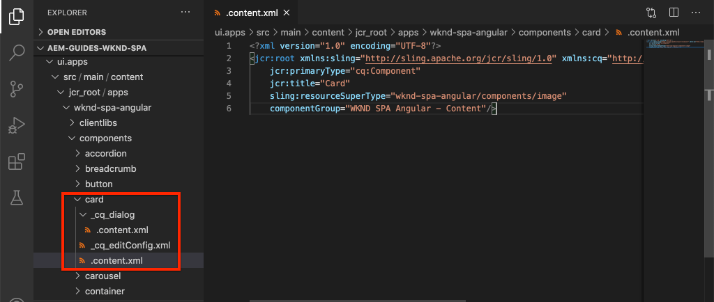
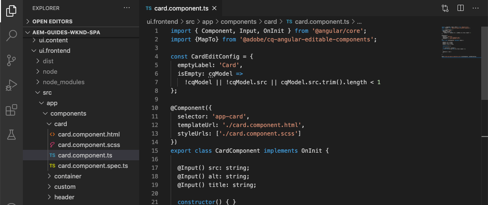
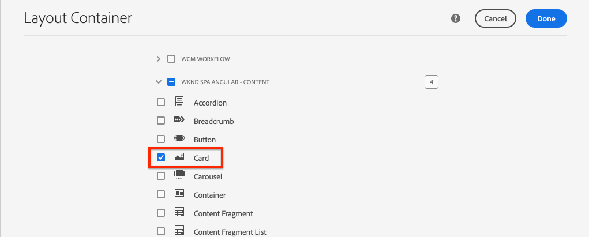
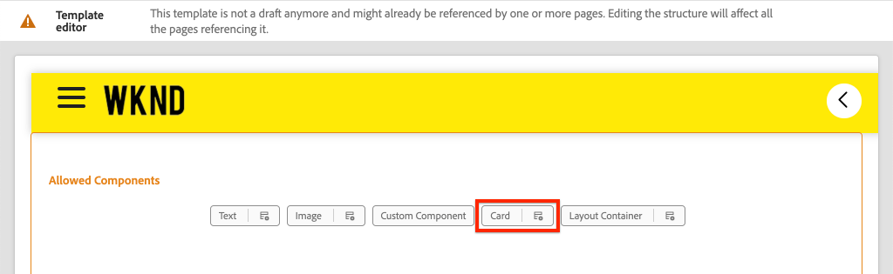
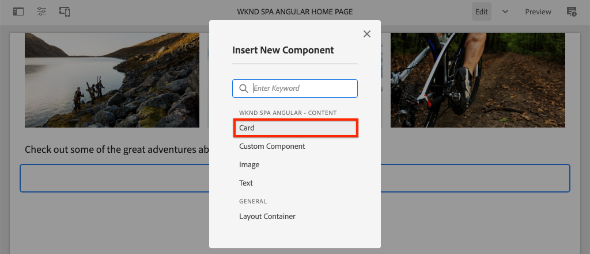
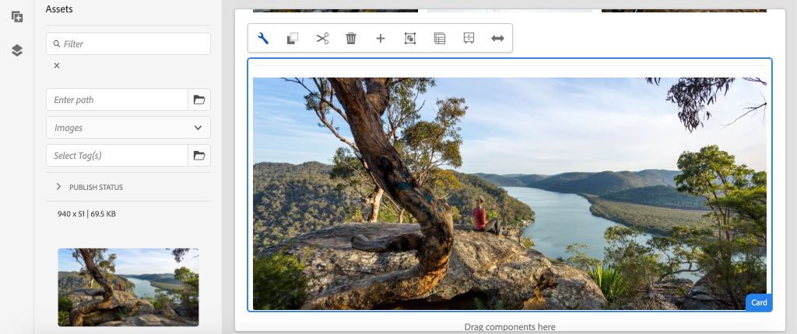
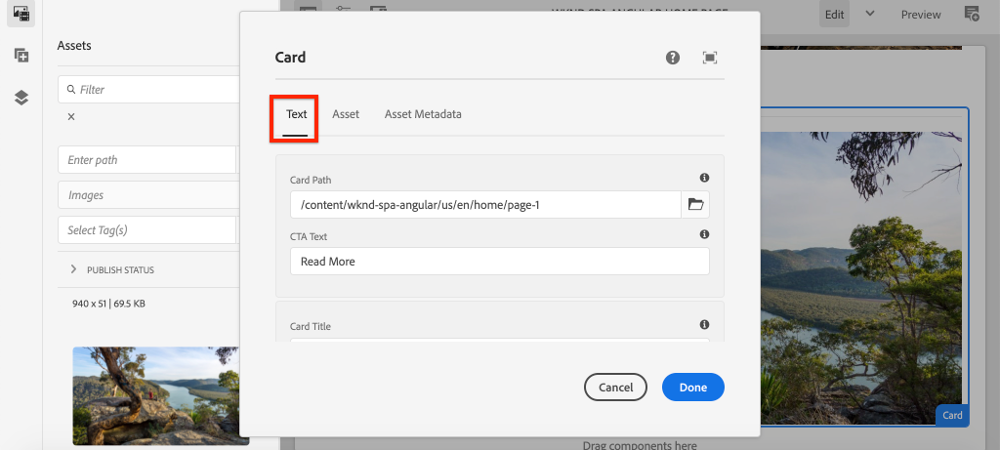
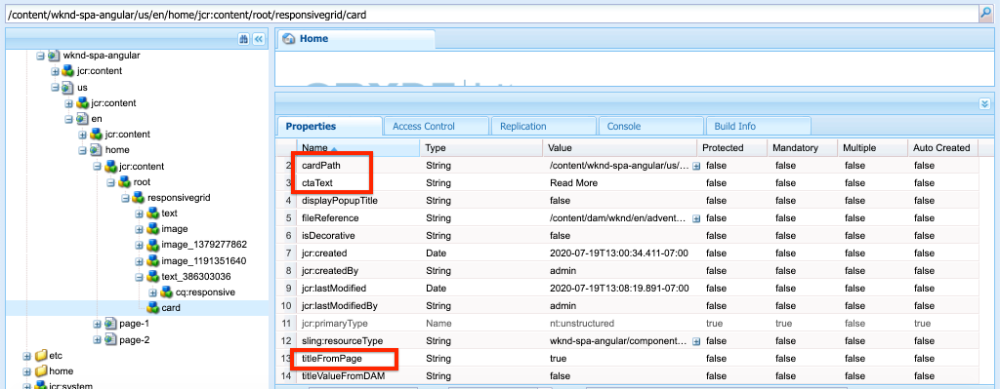
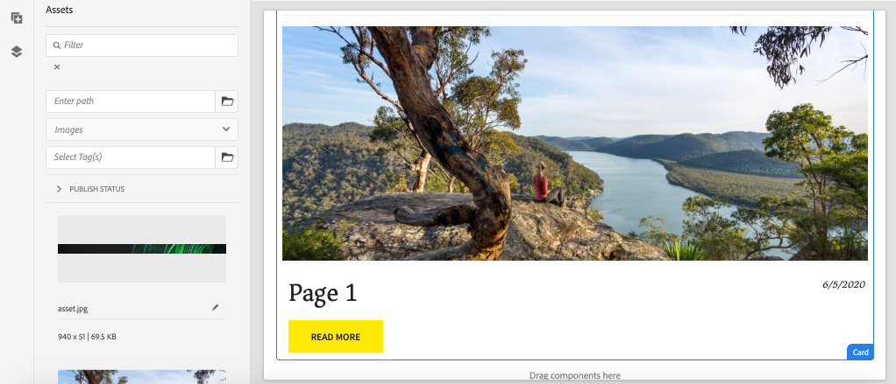

# 擴充核心元件 {#extend-component}

{{spa-editor-deprecation}}

瞭解如何擴充要與AEM SPA Editor搭配使用的現有核心元件。 瞭解如何擴充現有元件是一項強大的技術，可自訂和擴充AEM SPA Editor實作的功能。

## 目標

1. 使用其他屬性和內容擴充現有的核心元件。
2. 瞭解使用`sling:resourceSuperType`的元件繼承基本知識。
3. 瞭解如何為Sling模型使用[委派模式](https://github.com/adobe/aem-core-wcm-components/wiki/Delegation-Pattern-for-Sling-Models)以重複使用現有邏輯和功能。

## 您將要建置的內容

在本章中，已建立新的`Card`元件。 `Card`元件會擴充[影像核心元件](https://experienceleague.adobe.com/docs/experience-manager-core-components/using/components/image.html)，新增其他內容欄位，例如「標題」和「Call to action」按鈕，以針對SPA內的其他內容執行Teaser角色。


>[!NOTE]
>
> 在真實世界的實作中，視專案需求而定，可能更適合使用[Teaser元件](https://experienceleague.adobe.com/docs/experience-manager-core-components/using/components/teaser.html)，而不是擴充[影像核心元件](https://experienceleague.adobe.com/docs/experience-manager-core-components/using/components/image.html)以產生`Card`元件。 建議您儘可能直接使用[核心元件](https://experienceleague.adobe.com/docs/experience-manager-core-components/using/introduction.html)。

## 先決條件

檢閱設定[本機開發環境](overview.md#local-dev-environment)所需的工具與指示。

### 取得程式碼

1. 透過Git下載本教學課程的起點：

   ```shell
   $ git clone git@github.com:adobe/aem-guides-wknd-spa.git
   $ cd aem-guides-wknd-spa
   $ git checkout Angular/extend-component-start
   ```

2. 使用Maven將程式碼庫部署到本機AEM執行個體：

   ```shell
   $ mvn clean install -PautoInstallSinglePackage
   ```

   如果使用[AEM 6.x](overview.md#compatibility)，請新增`classic`設定檔：

   ```shell
   $ mvn clean install -PautoInstallSinglePackage -Pclassic
   ```

3. 安裝傳統[WKND參考站台](https://github.com/adobe/aem-guides-wknd/releases/tag/aem-guides-wknd-2.1.0)的完成套件。 由[WKND參考網站](https://github.com/adobe/aem-guides-wknd/releases/latest)提供的影像會在WKND SPA上重複使用。 可以使用[AEM的封裝管理員](http://localhost:4502/crx/packmgr/index.jsp)來安裝封裝。

   

您隨時可以在 [GitHub](https://github.com/adobe/aem-guides-wknd-spa/tree/Angular/extend-component-solution) 上檢視完成的程式碼，或透過切換到分支 `Angular/extend-component-solution` 在本機查看程式碼。

## 檢查初始卡片實施

章節起始程式碼已提供初始卡片元件。 檢查卡片實作的起點。

1. 在您選擇的IDE中，開啟`ui.apps`模組。
2. 瀏覽至`ui.apps/src/main/content/jcr_root/apps/wknd-spa-angular/components/card`並檢視`.content.xml`檔案。

   

   ```xml
   <?xml version="1.0" encoding="UTF-8"?>
   <jcr:root xmlns:sling="http://sling.apache.org/jcr/sling/1.0" xmlns:cq="http://www.day.com/jcr/cq/1.0" xmlns:jcr="http://www.jcp.org/jcr/1.0"
       jcr:primaryType="cq:Component"
       jcr:title="Card"
       sling:resourceSuperType="wknd-spa-angular/components/image"
       componentGroup="WKND SPA Angular - Content"/>
   ```

   屬性`sling:resourceSuperType`指向`wknd-spa-angular/components/image`，表示`Card`元件繼承了WKND SPA影像元件的功能。

3. 檢查檔案`ui.apps/src/main/content/jcr_root/apps/wknd-spa-angular/components/image/.content.xml`：

   ```xml
   <?xml version="1.0" encoding="UTF-8"?>
   <jcr:root xmlns:sling="http://sling.apache.org/jcr/sling/1.0" xmlns:cq="http://www.day.com/jcr/cq/1.0" xmlns:jcr="http://www.jcp.org/jcr/1.0"
       jcr:primaryType="cq:Component"
       jcr:title="Image"
       sling:resourceSuperType="core/wcm/components/image/v2/image"
       componentGroup="WKND SPA Angular - Content"/>
   ```

   請注意，`sling:resourceSuperType`指向`core/wcm/components/image/v2/image`。 這表示WKND SPA影像元件繼承了核心元件影像的功能。

   也稱為[Proxy模式](https://experienceleague.adobe.com/docs/experience-manager-core-components/using/developing/guidelines.html#proxy-component-pattern) Sling資源繼承是一種強大的設計模式，可讓子元件繼承功能並在需要時擴充/覆寫行為。 Sling繼承支援多個層級的繼承，所以新`Card`元件最終會繼承核心元件影像的功能。

   許多開發團隊都會努力做到自我（請勿重複這點）。 Sling繼承可讓AEM實現此目標。

4. 在`card`資料夾下，開啟檔案`_cq_dialog/.content.xml`。

   此檔案是`Card`元件的元件對話方塊定義。 如果使用Sling繼承，則可以使用[Sling資源合併器](https://experienceleague.adobe.com/docs/experience-manager-65/developing/platform/sling-resource-merger.html)的功能來覆寫或擴充對話方塊的部分。 在此範例中，對話方塊中已新增索引標籤，以從作者擷取其他資料並填入卡片元件。

   `sling:orderBefore`之類的屬性可讓開發人員選擇插入新標籤或表單欄位的位置。 在此情況下，`Text`索引標籤會插入`asset`索引標籤之前。 若要充分利用Sling Resource Merger，請務必瞭解[影像元件對話方塊](https://github.com/adobe/aem-core-wcm-components/blob/master/content/src/content/jcr_root/apps/core/wcm/components/image/v2/image/_cq_dialog/.content.xml)的原始對話方塊節點結構。

5. 在`card`資料夾下，開啟檔案`_cq_editConfig.xml`。 此檔案會指定AEM編寫UI中的拖放行為。 擴充影像元件時，資源型別必須符合元件本身。 檢閱`<parameters>`節點：

   ```xml
   <parameters
       jcr:primaryType="nt:unstructured"
       sling:resourceType="wknd-spa-angular/components/card"
       imageCrop=""
       imageMap=""
       imageRotate=""/>
   ```

   大部分元件不需要`cq:editConfig`，影像和影像元件的子系下階是例外。

6. 在IDE切換至`ui.frontend`模組，瀏覽至`ui.frontend/src/app/components/card`：

   

7. 檢查檔案 `card.component.ts`。

   元件已經使用標準`MapTo`函式截斷，以對應至AEM `Card`元件。

   ```js
   MapTo('wknd-spa-angular/components/card')(CardComponent, CardEditConfig);
   ```

   檢閱類別中`src`、`alt`和`title`的三個`@Input`引數。 這些是AEM元件中對應至Angular元件的預期JSON值。

8. 開啟檔案`card.component.html`：

   ```html
   <div class="card"  *ngIf="hasContent">
       <app-image class="card__image" [src]="src" [alt]="alt" [title]="title"></app-image>
   </div>
   ```

   在此範例中，我們選擇從`card.component.ts`傳遞`@Input`引數，以重複使用現有的Angular影像元件`app-image`。 在稍後的教學課程中，會新增並顯示其他屬性。

## 更新範本原則

使用此初始`Card`實作，檢閱AEM SPA編輯器中的功能。 若要檢視初始`Card`元件，需要更新範本原則。

1. 將入門程式碼部署到AEM的本機執行個體（如果尚未部署）：

   ```shell
   $ cd aem-guides-wknd-spa
   $ mvn clean install -PautoInstallSinglePackage
   ```

2. 導覽至[http://localhost:4502/editor.html/conf/wknd-spa-angular/settings/wcm/templates/spa-page-template/structure.html](http://localhost:4502/editor.html/conf/wknd-spa-angular/settings/wcm/templates/spa-page-template/structure.html)的SPA頁面範本。
3. 更新配置容器的原則以將新的`Card`元件新增為允許的元件：

   

   儲存原則的變更，並將`Card`元件視為允許的元件：

   

## 作者初始卡片元件

接下來，使用AEM SPA編輯器編寫`Card`元件。

1. 導覽至[http://localhost:4502/editor.html/content/wknd-spa-angular/us/en/home.html](http://localhost:4502/editor.html/content/wknd-spa-angular/us/en/home.html)。
2. 在`Edit`模式中，將`Card`元件新增至`Layout Container`：

   

3. 將影像從資產尋找器拖放至`Card`元件上：

   

4. 開啟`Card`元件對話方塊並注意已新增&#x200B;**文字**&#x200B;索引標籤。
5. 在&#x200B;**文字**&#x200B;索引標籤上輸入下列值：

   

   **卡片路徑** — 在SPA首頁下方選擇頁面。

   **CTA文字** - 「瞭解詳情」

   **卡片標題** — 留空

   **從連結的頁面取得標題** — 勾選核取方塊以表示True。

6. 更新&#x200B;**資產中繼資料**&#x200B;索引標籤以新增&#x200B;**替代文字**&#x200B;和&#x200B;**標題**&#x200B;的值。

   更新對話方塊後，目前沒有其他變更顯示。 若要將新欄位公開給Angular元件，我們需要更新`Card`元件的Sling模型。

7. 開啟新索引標籤並導覽至[CRXDE-Lite](http://localhost:4502/crx/de/index.jsp#/content/wknd-spa-angular/us/en/home/jcr%3Acontent/root/responsivegrid/card)。 檢查`/content/wknd-spa-angular/us/en/home/jcr:content/root/responsivegrid`下的內容節點以尋找`Card`元件內容。

   

   Observe that properties `cardPath`, `ctaText`, `titleFromPage` are persisted by the dialog.

## Update Card Sling Model

To ultimately expose the values from the component dialog to the Angular component, we need to update the Sling Model that populates the JSON for the `Card` component. We also have the opportunity to implement two pieces of business logic:

* If `titleFromPage` to **true**, return the title of the page specified by `cardPath` otherwise return the value of `cardTitle` textfield.
* Return the last modified date of the page specified by `cardPath`.

Return to the IDE of your choice and open the `core` module.

1. 在`core/src/main/java/com/adobe/aem/guides/wknd/spa/angular/core/models/Card.java`開啟檔案`Card.java`。

   Observe that the `Card` interface currently extends `com.adobe.cq.wcm.core.components.models.Image` and therefore inherits the methods of the `Image` interface. The `Image` interface already extends the `ComponentExporter` interface which allows the Sling Model to be exported as JSON and mapped by the SPA editor. Therefore we do not need to explicitly extend `ComponentExporter` interface like we did in the [Custom Component chapter](custom-component.md).

2. Add the following methods to the interface:

   ```java
   @ProviderType
   public interface Card extends Image {
   
       /***
       * The URL to populate the CTA button as part of the card.
       * The link should be based on the cardPath property that points to a page.
       * @return String URL
       */
       public String getCtaLinkURL();
   
       /***
       * The text to display on the CTA button of the card.
       * @return String CTA text
       */
       public String getCtaText();
   
   
   
       /***
       * The date to be displayed as part of the card.
       * This is based on the last modified date of the page specified by the cardPath
       * @return
       */
       public Calendar getCardLastModified();
   
   
       /**
       * Return the title of the page specified by cardPath if `titleFromPage` is set to true.
       * Otherwise return the value of `cardTitle`
       * @return
       */
       public String getCardTitle();
   }
   ```

   These methods are exposed via the JSON model API and passed to the Angular component.

3. 開啟 `CardImpl.java`。 This is the implementation of `Card.java` interface. This implementation has been partially stubbed out to accelerate the tutorial.  Notice the use of the `@Model` and `@Exporter` annotations to ensure that the Sling Model is able to be serialized as JSON via the Sling Model Exporter.

   `CardImpl.java` also uses the [Delegation pattern for Sling Models](https://github.com/adobe/aem-core-wcm-components/wiki/Delegation-Pattern-for-Sling-Models) to avoid rewriting the logic from the Image Core Component.

4. Observe the following lines:

   ```java
   @Self
   @Via(type = ResourceSuperType.class)
   private Image image;
   ```

   The above annotation instantiates an Image object named `image` based on the `sling:resourceSuperType` inheritance of the `Card` component.

   ```java
   @Override
   public String getSrc() {
       return null != image ? image.getSrc() : null;
   }
   ```

   It is then possible to simply use the `image` object to implement methods defined by the `Image` interface, without having to write the logic ourselves. This technique is used for `getSrc()`, `getAlt()`, and `getTitle()`.

5. Next, implement the `initModel()` method to initiate a private variable `cardPage` based on the value of `cardPath`

   ```java
   @PostConstruct
   public void initModel() {
       if(StringUtils.isNotBlank(cardPath) && pageManager != null) {
           cardPage = pageManager.getPage(this.cardPath);
       }
   }
   ```

   The `@PostConstruct initModel()` is called when the Sling Model is initialized, therefore it is a good opportunity to initialize objects that may be used by other methods in the model. The `pageManager` is one of several [Java™ backed global objects](https://experienceleague.adobe.com/docs/experience-manager-htl/content/global-objects.html) made available to Sling Models via the `@ScriptVariable` annotation. [getPage](https://developer.adobe.com/experience-manager/reference-materials/cloud-service/javadoc/com/day/cq/wcm/api/PageManager.html)方法接受路徑並傳回AEM [Page](https://developer.adobe.com/experience-manager/reference-materials/cloud-service/javadoc/com/day/cq/wcm/api/Page.html)物件，如果路徑未指向有效頁面，則傳回null。

   這會初始化`cardPage`變數，其他新方法會使用此變數來傳回基礎連結頁面的相關資料。

6. 檢閱已對映至作者對話方塊所儲存JCR屬性的全域變數。 `@ValueMapValue`註解是用來自動執行對應。

   ```java
   @ValueMapValue
   private String cardPath;
   
   @ValueMapValue
   private String ctaText;
   
   @ValueMapValue
   private boolean titleFromPage;
   
   @ValueMapValue
   private String cardTitle;
   ```

   這些變數可用來實作`Card.java`介面的其他方法。

7. 實作`Card.java`介面中定義的其他方法：

   ```java
   @Override
   public String getCtaLinkURL() {
       if(cardPage != null) {
           return cardPage.getPath() + ".html";
       }
       return null;
   }
   
   @Override
   public String getCtaText() {
       return ctaText;
   }
   
   @Override
   public Calendar getCardLastModified() {
      if(cardPage != null) {
          return cardPage.getLastModified();
      }
      return null;
   }
   
   @Override
   public String getCardTitle() {
       if(titleFromPage) {
           return cardPage != null ? cardPage.getTitle() : null;
       }
       return cardTitle;
   }
   ```

   >[!NOTE]
   >
   > 您可以在[&#128279;](https://github.com/adobe/aem-guides-wknd-spa/blob/Angular/extend-component-solution/core/src/main/java/com/adobe/aem/guides/wknd/spa/angular/core/models/impl/CardImpl.java)檢視完成的CardImpl.java。

8. 開啟終端機視窗，並使用`core`目錄中的Maven `autoInstallBundle`設定檔僅部署`core`模組的更新。

   ```shell
   $ cd core/
   $ mvn clean install -PautoInstallBundle
   ```

   如果使用[AEM 6.x](overview.md#compatibility)，請新增`classic`設定檔。

9. 檢視JSON模型回應： [http://localhost:4502/content/wknd-spa-angular/us/en.model.json](http://localhost:4502/content/wknd-spa-angular/us/en.model.json)，並搜尋`wknd-spa-angular/components/card`：

   ```json
   "card": {
       "ctaText": "Read More",
       "cardTitle": "Page 1",
       "title": "Woman chillaxing with river views in Australian bushland",
       "src": "/content/wknd-spa-angular/us/en/home/_jcr_content/root/responsivegrid/card.coreimg.jpeg/1595190732886/adobestock-216674449.jpeg",
       "alt": "Female sitting on a large rock relaxing in afternoon dappled light the Australian bushland with views over the river",
       "cardLastModified": 1591360492414,
       "ctaLinkURL": "/content/wknd-spa-angular/us/en/home/page-1.html",
       ":type": "wknd-spa-angular/components/card"
   }
   ```

   請注意，更新`CardImpl` Sling模型中的方法後，JSON模型已更新為其他索引鍵/值組。

## 更新Angular元件

現在JSON模型已填入`ctaLinkURL`、`ctaText`、`cardTitle`和`cardLastModified`的新屬性，我們可以更新Angular元件以顯示這些屬性。

1. 返回IDE並開啟`ui.frontend`模組。 您可以選擇從新的終端機視窗啟動webpack開發伺服器，即時檢視變更：

   ```shell
   $ cd ui.frontend
   $ npm install
   $ npm start
   ```

2. 在`ui.frontend/src/app/components/card/card.component.ts`開啟`card.component.ts`。 新增其他`@Input`註解以擷取新模型：

   ```diff
   export class CardComponent implements OnInit {
   
        @Input() src: string;
        @Input() alt: string;
        @Input() title: string;
   +    @Input() cardTitle: string;
   +    @Input() cardLastModified: number;
   +    @Input() ctaLinkURL: string;
   +    @Input() ctaText: string;
   ```

3. 新增檢查Call to action是否準備就緒的方法，以及根據`cardLastModified`輸入傳回日期/時間字串的方法：

   ```js
   export class CardComponent implements OnInit {
       ...
       get hasCTA(): boolean {
           return this.ctaLinkURL && this.ctaLinkURL.trim().length > 0 && this.ctaText && this.ctaText.trim().length > 0;
       }
   
       get lastModifiedDate(): string {
           const lastModifiedDate = this.cardLastModified ? new Date(this.cardLastModified) : null;
   
           if (lastModifiedDate) {
           return lastModifiedDate.toLocaleDateString();
           }
           return null;
       }
       ...
   }
   ```

4. 開啟`card.component.html`並新增下列標籤以顯示標題、call to action和上次修改日期：

   ```html
   <div class="card"  *ngIf="hasContent">
       <app-image class="card__image" [src]="src" [alt]="alt" [title]="title"></app-image>
       <div class="card__content">
           <h2 class="card__title">
               {{cardTitle}}
               <span class="card__lastmod" *ngIf="lastModifiedDate">{{lastModifiedDate}}</span>
           </h2>
           <div class="card__action-container" *ngIf="hasCTA">
               <a [routerLink]="ctaLinkURL" class="card__action-link" [title]="ctaText">
                   {{ctaText}}
               </a>
           </div>
       </div>
   </div>
   ```

   已在`card.component.scss`新增Sass規則，以設定標題、call to action和上次修改日期的樣式。

   >[!NOTE]
   >
   > 您可以在此檢視已完成的[Angular卡元件程式碼](https://github.com/adobe/aem-guides-wknd-spa/tree/Angular/extend-component-solution/ui.frontend/src/app/components/card)。

5. 使用Maven從專案的根將完整變更部署到AEM：

   ```shell
   $ cd aem-guides-wknd-spa
   $ mvn clean install -PautoInstallSinglePackage
   ```

6. 導覽至[http://localhost:4502/editor.html/content/wknd-spa-angular/us/en/home.html](http://localhost:4502/editor.html/content/wknd-spa-angular/us/en/home.html)檢視更新的元件：

   

7. 您應該能夠重新編寫現有內容以建立類似下列的頁面：

   

## 恭喜！ {#congratulations}

Congratulations, you learned how to extend an AEM component and how Sling Models and dialogs work with the JSON model.

您隨時可以在 [GitHub](https://github.com/adobe/aem-guides-wknd-spa/tree/Angular/extend-component-solution) 上檢視完成的程式碼，或透過切換到分支 `Angular/extend-component-solution` 在本機查看程式碼。
