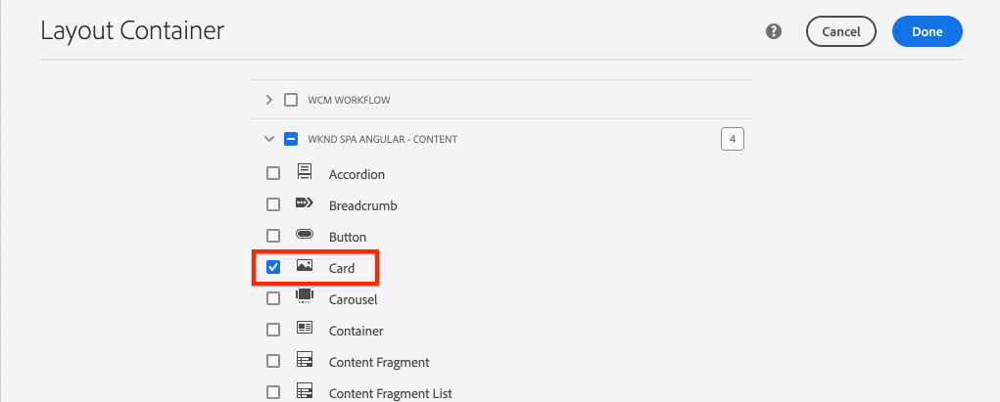

# 擴展核心元件 {#extend-component}

瞭解如何擴展要與編輯器一起使用的現有核AEM心組SPA件。 瞭解如何擴展現有元件是定制和擴展編輯器實現功能的AEM強SPA大技術。

## 目標

1. 使用附加屬性和內容擴展現有核心元件。
2. 使用 `sling:resourceSuperType`。
3. 瞭解如何使用 [委託模式](https://github.com/adobe/aem-core-wcm-components/wiki/Delegation-Pattern-for-Sling-Models) 用於重新使用現有邏輯和功能。

## 您將構建的

在本章中， `Card` 元件。 的 `Card` 元件擴展 [影像核心元件](https://experienceleague.adobe.com/docs/experience-manager-core-components/using/components/image.html) 添加「標題」和「呼叫操作」按鈕等附加內容欄位，以對中的其他內容執行預告角SPA色。


>[!NOTE]
>
> 在實際實施中，僅使用 [預告元件](https://experienceleague.adobe.com/docs/experience-manager-core-components/using/components/teaser.html) 比 [影像核心元件](https://experienceleague.adobe.com/docs/experience-manager-core-components/using/components/image.html) 做 `Card` 元件，具體取決於項目要求。 始終建議使用 [核心元件](https://experienceleague.adobe.com/docs/experience-manager-core-components/using/introduction.html) 直接確認。

## 必備條件

查看所需的工具和設定 [地方開發環境](overview.md#local-dev-environment)。

### 獲取代碼

1. 通過Git下載本教程的起點：

   ```shell
   $ git clone git@github.com:adobe/aem-guides-wknd-spa.git
   $ cd aem-guides-wknd-spa
   $ git checkout Angular/extend-component-start
   ```

2. 使用Maven將代碼庫部署到AEM本地實例：

   ```shell
   $ mvn clean install -PautoInstallSinglePackage
   ```

   如果使用 [AEM 6.x](overview.md#compatibility) 添加 `classic` 配置檔案：

   ```shell
   $ mvn clean install -PautoInstallSinglePackage -Pclassic
   ```

3. 為傳統 [WKND參考站點](https://github.com/adobe/aem-guides-wknd/releases/tag/aem-guides-wknd-2.1.0)。 提供的影像 [WKND參考站點](https://github.com/adobe/aem-guides-wknd/releases/latest) 在WKND上重SPA用。 可以使用 [包管AEM理器](http://localhost:4502/crx/packmgr/index.jsp)。

   

您始終可以在 [GitHub](https://github.com/adobe/aem-guides-wknd-spa/tree/Angular/extend-component-solution) 或通過切換到分支本地檢出代碼 `Angular/extend-component-solution`。

## Inspect初始卡實施

章起始代碼提供了初始卡元件。 Inspect是卡實施的起點。

1. 在您選擇的IDE中，開啟 `ui.apps` 中。
2. 導航到 `ui.apps/src/main/content/jcr_root/apps/wknd-spa-angular/components/card` 查看 `.content.xml` 的子菜單。

   

   ```xml
   <?xml version="1.0" encoding="UTF-8"?>
   <jcr:root xmlns:sling="http://sling.apache.org/jcr/sling/1.0" xmlns:cq="http://www.day.com/jcr/cq/1.0" xmlns:jcr="http://www.jcp.org/jcr/1.0"
       jcr:primaryType="cq:Component"
       jcr:title="Card"
       sling:resourceSuperType="wknd-spa-angular/components/image"
       componentGroup="WKND SPA Angular - Content"/>
   ```

   屬性 `sling:resourceSuperType` 指向 `wknd-spa-angular/components/image` 表明 `Card` 元件繼承WKND映像元件SPA的功能。

3. Inspect檔案 `ui.apps/src/main/content/jcr_root/apps/wknd-spa-angular/components/image/.content.xml`:

   ```xml
   <?xml version="1.0" encoding="UTF-8"?>
   <jcr:root xmlns:sling="http://sling.apache.org/jcr/sling/1.0" xmlns:cq="http://www.day.com/jcr/cq/1.0" xmlns:jcr="http://www.jcp.org/jcr/1.0"
       jcr:primaryType="cq:Component"
       jcr:title="Image"
       sling:resourceSuperType="core/wcm/components/image/v2/image"
       componentGroup="WKND SPA Angular - Content"/>
   ```

   請注意 `sling:resourceSuperType` 指向 `core/wcm/components/image/v2/image`。 這表示WKND映像SPA元件繼承了核心元件映像的功能。

   也稱為 [代理模式](https://experienceleague.adobe.com/docs/experience-manager-core-components/using/developing/guidelines.html#proxy-component-pattern) Sling資源繼承是一種功能強大的設計模式，它允許子元件在需要時繼承功能和擴展/覆蓋行為。 Sling繼承支援多級繼承，因此最終新繼承 `Card` 元件繼承核心元件映像的功能。

   許多開發團隊都努力成為DRY。（不要重複自己）。 Sling繼承使這成為可能AEM。

4. 在 `card` 資料夾，開啟檔案 `_cq_dialog/.content.xml`。

   此檔案是 `Card` 元件。 如果使用Sling繼承，則可能使用 [Sling資源合併](https://experienceleague.adobe.com/docs/experience-manager-65/developing/platform/sling-resource-merger.html) 以覆蓋或延伸對話框的部分。 在此示例中，新頁籤已添加到對話框中，以從作者捕獲其他資料來填充卡元件。

   類似屬性 `sling:orderBefore` 允許開發人員選擇插入新頁籤或表單域的位置。 在這個例子中， `Text` 的子菜單。 `asset` 頁籤。 為了充分利用Sling資源合併，必須瞭解原始的對話節點結構。 [「影像元件」對話框](https://github.com/adobe/aem-core-wcm-components/blob/master/content/src/content/jcr_root/apps/core/wcm/components/image/v2/image/_cq_dialog/.content.xml)。

5. 在 `card` 資料夾，開啟檔案 `_cq_editConfig.xml`。 此檔案指定創作UI中的拖放AEM行為。 在擴展映像元件時，資源類型與元件本身匹配是非常重要的。 查看 `<parameters>` 節點：

   ```xml
   <parameters
       jcr:primaryType="nt:unstructured"
       sling:resourceType="wknd-spa-angular/components/card"
       imageCrop=""
       imageMap=""
       imageRotate=""/>
   ```

   大多數元件不需要 `cq:editConfig`、「影像」元件的「影像」和「子代」是例外。

6. 在IDE交換機中， `ui.frontend` 模組，導航 `ui.frontend/src/app/components/card`:

   

7. Inspect檔案 `card.component.ts`。

   元件已被抽出以映射到AEM `Card` 使用標準的元件 `MapTo` 的子菜單。

   ```js
   MapTo('wknd-spa-angular/components/card')(CardComponent, CardEditConfig);
   ```

   查看三個 `@Input` 類中的參數 `src`。 `alt`, `title`。 這些值應為映射到AEMAngular元件的元件中的JSON值。

8. 開啟檔案 `card.component.html`:

   ```html
   <div class="card"  *ngIf="hasContent">
       <app-image class="card__image" [src]="src" [alt]="alt" [title]="title"></app-image>
   </div>
   ```

   在此示例中，我們選擇重新使用現有Angular映像元件 `app-image` 通過 `@Input` 參數 `card.component.ts`。 在本教程的後面部分，將添加並顯示其他屬性。

## 更新模板策略

使用此初始 `Card` 實現在編輯器中查看AEM功SPA能。 查看初始 `Card` 元件需要更新到模板策略。

1. 將啟動程式碼部署到AEM的本地實例(如果尚未：

   ```shell
   $ cd aem-guides-wknd-spa
   $ mvn clean install -PautoInstallSinglePackage
   ```

2. 導航到SPA頁面模板 [http://localhost:4502/editor.html/conf/wknd-spa-angular/settings/wcm/templates/spa-page-template/structure.html](http://localhost:4502/editor.html/conf/wknd-spa-angular/settings/wcm/templates/spa-page-template/structure.html)。
3. 更新佈局容器的策略以添加新 `Card` 元件：

   

   保存對策略的更改，並觀察 `Card` 元件：

   

## 建立初始卡元件

接下來，編寫 `Card` 元件，使AEM用編SPA輯器。

1. 導航到 [http://localhost:4502/editor.html/content/wknd-spa-angular/us/en/home.html](http://localhost:4502/editor.html/content/wknd-spa-angular/us/en/home.html)。
2. 在 `Edit` 模式，添加 `Card` 元件 `Layout Container`:

   

3. 將影像從Asset Finder拖放到 `Card` 元件：

   

4. 開啟 `Card` 元件對話框，並注意 **文本** 頁籤。
5. 在 **文本** 頁籤：

   

   **卡路徑**  — 在首頁下面選SPA擇頁。

   **CTA文本** - 「閱讀更多」

   **卡片標題**  — 留空

   **從連結頁面獲取標題**  — 選中複選框以指示true。

6. 更新 **資產元資料** 頁籤，為 **備選文本** 和 **標題**。

   更新對話框後，當前未顯示其他更改。 要將新欄位顯示給Angular元件，我們需要更新 `Card` 元件。

7. 開啟新標籤並導航到 [CRXDE-Lite](http://localhost:4502/crx/de/index.jsp#/content/wknd-spa-angular/us/en/home/jcr%3Acontent/root/responsivegrid/card)。 Inspect下面的內容節點 `/content/wknd-spa-angular/us/en/home/jcr:content/root/responsivegrid` 來查找 `Card` 元件內容。

   

   觀察屬性 `cardPath`。 `ctaText`。 `titleFromPage` 對話框保留。

## 更新卡吊具型號

要最終將元件對話框中的值暴露給Angular元件，我們需要更新填充JSON的Sling模型 `Card` 元件。 我們還有機會實施兩個業務邏輯：

* 如果 `titleFromPage` 至 **真**，返回由指定的頁面標題 `cardPath` 否則返回 `cardTitle` 文本欄位。
* 返回指定頁面的上次修改日期 `cardPath`。

返回到您選擇的IDE並開啟 `core` 中。

1. 開啟檔案 `Card.java` 在 `core/src/main/java/com/adobe/aem/guides/wknd/spa/angular/core/models/Card.java`。

   觀察 `Card` 當前擴展的介面 `com.adobe.cq.wcm.core.components.models.Image` 因此繼承了 `Image` 。 的 `Image` 介面已擴展 `ComponentExporter` 介面，允許Sling Model導出為JSON並由編輯器SPA映射。 因此我們不需要顯式地 `ComponentExporter` 就像我們在 [「自定義元件」一章](custom-component.md)。

2. 將以下方法添加到介面：

   ```java
   @ProviderType
   public interface Card extends Image {
   
       /***
       * The URL to populate the CTA button as part of the card.
       * The link should be based on the cardPath property that points to a page.
       * @return String URL
       */
       public String getCtaLinkURL();
   
       /***
       * The text to display on the CTA button of the card.
       * @return String CTA text
       */
       public String getCtaText();
   
   
   
       /***
       * The date to be displayed as part of the card.
       * This is based on the last modified date of the page specified by the cardPath
       * @return
       */
       public Calendar getCardLastModified();
   
   
       /**
       * Return the title of the page specified by cardPath if `titleFromPage` is set to true.
       * Otherwise return the value of `cardTitle`
       * @return
       */
       public String getCardTitle();
   }
   ```

   這些方法通過JSON模型API公開，並傳遞給Angular元件。

3. 開啟 `CardImpl.java`. 這是 `Card.java` 。 本實現已部分完成，以加速本教程。  注意 `@Model` 和 `@Exporter` 注釋，以確保Sling Model能夠通過Sling Model導出器序列化為JSON。

   `CardImpl.java` 也使用 [吊具模型委託模式](https://github.com/adobe/aem-core-wcm-components/wiki/Delegation-Pattern-for-Sling-Models) 避免從影像核心元件中重寫邏輯。

4. 觀察以下行：

   ```java
   @Self
   @Via(type = ResourceSuperType.class)
   private Image image;
   ```

   上述注釋實例化名為 `image` 基於 `sling:resourceSuperType` 繼承 `Card` 元件。

   ```java
   @Override
   public String getSrc() {
       return null != image ? image.getSrc() : null;
   }
   ```

   這樣，就可以簡單地使用 `image` 實現由定義的方法的對象 `Image` 介面，而無需自己編寫邏輯。 此技術用於 `getSrc()`。 `getAlt()`, `getTitle()`。

5. 接下來，實施 `initModel()` 啟動私有變數的方法 `cardPage` 基於 `cardPath`

   ```java
   @PostConstruct
   public void initModel() {
       if(StringUtils.isNotBlank(cardPath) && pageManager != null) {
           cardPage = pageManager.getPage(this.cardPath);
       }
   }
   ```

   的 `@PostConstruct initModel()` 當初始化Sling模型時調用，因此，初始化模型中其他方法可能使用的對象是很好的機會。 的 `pageManager` 是幾個 [Java™支援的全局對象](https://experienceleague.adobe.com/docs/experience-manager-htl/content/global-objects.html) 通過 `@ScriptVariable` 注釋。 的 [getPage](https://developer.adobe.com/experience-manager/reference-materials/cloud-service/javadoc/com/day/cq/wcm/api/PageManager.html) 方法在路徑中取值並返AEM回 [頁面](https://developer.adobe.com/experience-manager/reference-materials/cloud-service/javadoc/com/day/cq/wcm/api/Page.html) 如果路徑未指向有效頁，則為object或null。

   這初始化 `cardPage` 變數，用於返回有關基礎連結頁的資料的其他新方法使用。

6. 查看已映射到保存作者對話框的JCR屬性的全局變數。 的 `@ValueMapValue` 注釋用於自動執行映射。

   ```java
   @ValueMapValue
   private String cardPath;
   
   @ValueMapValue
   private String ctaText;
   
   @ValueMapValue
   private boolean titleFromPage;
   
   @ValueMapValue
   private String cardTitle;
   ```

   這些變數用於實現 `Card.java` 。

7. 實施中定義的其他方法 `Card.java` 介面：

   ```java
   @Override
   public String getCtaLinkURL() {
       if(cardPage != null) {
           return cardPage.getPath() + ".html";
       }
       return null;
   }
   
   @Override
   public String getCtaText() {
       return ctaText;
   }
   
   @Override
   public Calendar getCardLastModified() {
      if(cardPage != null) {
          return cardPage.getLastModified();
      }
      return null;
   }
   
   @Override
   public String getCardTitle() {
       if(titleFromPage) {
           return cardPage != null ? cardPage.getTitle() : null;
       }
       return cardTitle;
   }
   ```

   >[!NOTE]
   >
   > 您可以查看 [在此處完成CardImpl.java](https://github.com/adobe/aem-guides-wknd-spa/blob/Angular/extend-component-solution/core/src/main/java/com/adobe/aem/guides/wknd/spa/angular/core/models/impl/CardImpl.java)。

8. 開啟終端窗口，並只部署到 `core` 模組使用Maven `autoInstallBundle` 從 `core` 的子菜單。

   ```shell
   $ cd core/
   $ mvn clean install -PautoInstallBundle
   ```

   如果使用 [AEM 6.x](overview.md#compatibility) 添加 `classic` 檔案。

9. 查看JSON模型響應： [http://localhost:4502/content/wknd-spa-angular/us/en.model.json](http://localhost:4502/content/wknd-spa-angular/us/en.model.json) 搜索 `wknd-spa-angular/components/card`:

   ```json
   "card": {
       "ctaText": "Read More",
       "cardTitle": "Page 1",
       "title": "Woman chillaxing with river views in Australian bushland",
       "src": "/content/wknd-spa-angular/us/en/home/_jcr_content/root/responsivegrid/card.coreimg.jpeg/1595190732886/adobestock-216674449.jpeg",
       "alt": "Female sitting on a large rock relaxing in afternoon dappled light the Australian bushland with views over the river",
       "cardLastModified": 1591360492414,
       "ctaLinkURL": "/content/wknd-spa-angular/us/en/home/page-1.html",
       ":type": "wknd-spa-angular/components/card"
   }
   ```

   請注意，在更新中的方法後，JSON模型將使用附加的鍵/值對進行更新 `CardImpl` 吊帶模型。

## 更新Angular元件

現在，JSON模型已填充新屬性 `ctaLinkURL`。 `ctaText`。 `cardTitle`, `cardLastModified` 我們可以更新Angular元件以顯示這些元件。

1. 返回到IDE並開啟 `ui.frontend` 中。 （可選）從新終端窗口啟動webpack dev伺服器，以即時查看更改：

   ```shell
   $ cd ui.frontend
   $ npm install
   $ npm start
   ```

2. 開啟 `card.component.ts` 在 `ui.frontend/src/app/components/card/card.component.ts`。 添加附加 `@Input` 要捕獲新模型的注釋：

   ```diff
   export class CardComponent implements OnInit {
   
        @Input() src: string;
        @Input() alt: string;
        @Input() title: string;
   +    @Input() cardTitle: string;
   +    @Input() cardLastModified: number;
   +    @Input() ctaLinkURL: string;
   +    @Input() ctaText: string;
   ```

3. 添加方法，用於檢查「操作調用」是否就緒，並根據 `cardLastModified` 輸入：

   ```js
   export class CardComponent implements OnInit {
       ...
       get hasCTA(): boolean {
           return this.ctaLinkURL && this.ctaLinkURL.trim().length > 0 && this.ctaText && this.ctaText.trim().length > 0;
       }
   
       get lastModifiedDate(): string {
           const lastModifiedDate = this.cardLastModified ? new Date(this.cardLastModified) : null;
   
           if (lastModifiedDate) {
           return lastModifiedDate.toLocaleDateString();
           }
           return null;
       }
       ...
   }
   ```

4. 開啟 `card.component.html` 並添加以下標注以顯示標題、操作要求和上次修改日期：

   ```html
   <div class="card"  *ngIf="hasContent">
       <app-image class="card__image" [src]="src" [alt]="alt" [title]="title"></app-image>
       <div class="card__content">
           <h2 class="card__title">
               {{cardTitle}}
               <span class="card__lastmod" *ngIf="lastModifiedDate">{{lastModifiedDate}}</span>
           </h2>
           <div class="card__action-container" *ngIf="hasCTA">
               <a [routerLink]="ctaLinkURL" class="card__action-link" [title]="ctaText">
                   {{ctaText}}
               </a>
           </div>
       </div>
   </div>
   ```

   已在添加Sass規則 `card.component.scss` 設定標題樣式、操作呼叫和上次修改日期。

   >[!NOTE]
   >
   > 您可以查看已完成的 [Angular卡元件代碼](https://github.com/adobe/aem-guides-wknd-spa/tree/Angular/extend-component-solution/ui.frontend/src/app/components/card)。

5. 使用Maven將項AEM目根目錄的完整更改部署為：

   ```shell
   $ cd aem-guides-wknd-spa
   $ mvn clean install -PautoInstallSinglePackage
   ```

6. 導航到 [http://localhost:4502/editor.html/content/wknd-spa-angular/us/en/home.html](http://localhost:4502/editor.html/content/wknd-spa-angular/us/en/home.html) 要查看更新的元件：

   

7. 您應該能夠重新創作現有內容，以建立類似以下內容的頁面：

   

## 恭喜！ {#congratulations}

恭喜，您學習了如何擴展組AEM件，以及Sling模型和對話如何與JSON模型配合工作。

您始終可以在 [GitHub](https://github.com/adobe/aem-guides-wknd-spa/tree/Angular/extend-component-solution) 或通過切換到分支本地檢出代碼 `Angular/extend-component-solution`。
