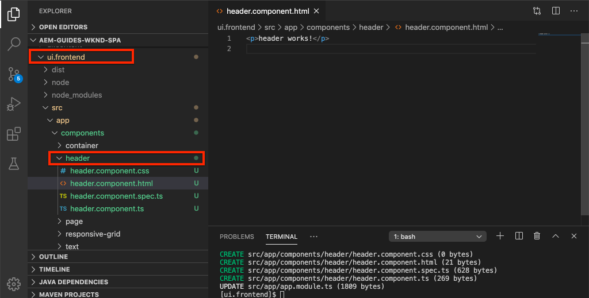
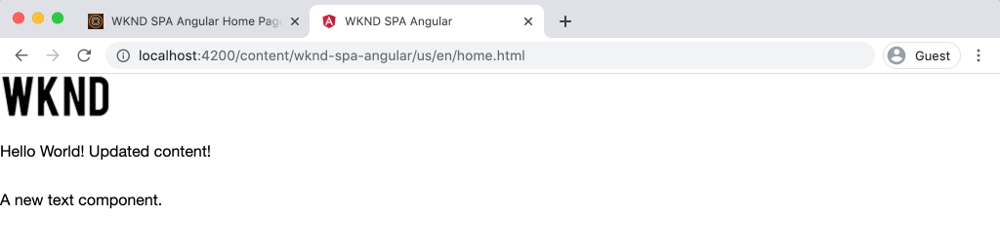

# 整合SPA {#integrate-spa}

瞭解以Angular撰寫的單頁應用程式(SPA)原始碼如何與Adobe Experience Manager (AEM)專案整合。 瞭解如何使用現代前端工具（如Webpack開發伺服器），以針對SPA JSON模型API快速開發AEM。

## 目標

1. 瞭解SPA專案如何與AEM和使用者端程式庫整合。
2. 瞭解如何使用本機開發伺服器來進行專屬的前端開發。
3. 探索如何使用 **proxy** 和靜態 **模擬** 用於針對AEM JSON模型API開發的檔案

## 您將建置的內容

本章將新增 `Header` 元件至SPA。 建置此靜態檔案的過程中 `Header` 元件使用了數種AEM SPA開發方法。


*SPA已擴充以新增靜態 `Header` 元件*

## 先決條件

檢閱設定所需的工具和指示 [本機開發環境](overview.md#local-dev-environment).

### 取得程式碼

1. 透過Git下載本教學課程的起點：

   ```shell
   $ git clone git@github.com:adobe/aem-guides-wknd-spa.git
   $ cd aem-guides-wknd-spa
   $ git checkout Angular/integrate-spa-start
   ```

2. 使用Maven將程式碼庫部署到本機AEM執行個體：

   ```shell
   $ mvn clean install -PautoInstallSinglePackage
   ```

   若使用 [AEM 6.x](overview.md#compatibility) 新增 `classic` 設定檔：

   ```shell
   $ mvn clean install -PautoInstallSinglePackage -Pclassic
   ```

您一律可以於檢視完成的程式碼 [GitHub](https://github.com/adobe/aem-guides-wknd-spa/tree/Angular/integrate-spa-solution) 或切換至分支以在本機取出程式碼 `Angular/integrate-spa-solution`.

## 整合方法 {#integration-approach}

在AEM專案中建立了兩個模組： `ui.apps` 和 `ui.frontend`.

此 `ui.frontend` 模組是 [webpack](https://webpack.js.org/) 包含所有SPA原始程式碼的專案。 大部分的SPA開發和測試都是在webpack專案中完成的。 觸發生產組建時，會使用webpack建置及編譯SPA。 編譯的成品（CSS和JavaScript）會複製到 `ui.apps` 然後部署至AEM執行階段的模組。


*SPA整合的高層級說明。*

有關前端建置的其他資訊可以是 [可在此處找到](https://experienceleague.adobe.com/docs/experience-manager-core-components/using/developing/archetype/uifrontend-angular.html).

## Inspect與SPA整合 {#inspect-spa-integration}

接下來，檢查 `ui.frontend` 此模組將說明自動產生的SPA [AEM專案原型](https://experienceleague.adobe.com/docs/experience-manager-core-components/using/developing/archetype/uifrontend-angular.html).

1. 在您選擇的IDE中，開啟WKND SPA的AEM專案。 本教學課程將使用 [Visual Studio Code IDE](https://experienceleague.adobe.com/docs/experience-manager-learn/cloud-service/local-development-environment-set-up/development-tools.html#microsoft-visual-studio-code).

   

2. 展開並檢查 `ui.frontend` 資料夾。 開啟檔案 `ui.frontend/package.json`

3. 在 `dependencies` 您應該會看到數個與 `@angular`：

   ```json
   "@angular/animations": "~9.1.11",
   "@angular/common": "~9.1.11",
   "@angular/compiler": "~9.1.11",
   "@angular/core": "~9.1.11",
   "@angular/forms": "~9.1.10",
   "@angular/platform-browser": "~9.1.10",
   "@angular/platform-browser-dynamic": "~9.1.10",
   "@angular/router": "~9.1.10",
   ```

   此 `ui.frontend` 模組是 [angular應用程式](https://angular.io) 使用產生的 [angularCLI工具](https://angular.io/cli) 包括路由。

4. 也有三個前置詞為的相依性 `@adobe`：

   ```json
   "@adobe/cq-angular-editable-components": "^2.0.2",
   "@adobe/cq-spa-component-mapping": "^1.0.3",
   "@adobe/cq-spa-page-model-manager": "^1.1.3",
   ```

   上述模組構成 [AEM SPA編輯器JS SDK](https://experienceleague.adobe.com/docs/experience-manager-65/developing/headless/spas/spa-blueprint.html) 並提供功能，以便將SPA元件對應至AEM元件。

5. 在 `package.json` 檔案多個 `scripts` 已定義：

   ```json
   "scripts": {
       "start": "ng serve --open --proxy-config ./proxy.conf.json",
       "build": "ng lint && ng build && clientlib",
       "build:production": "ng lint && ng build --prod && clientlib",
       "test": "ng test",
       "sync": "aemsync -d -w ../ui.apps/src/main/content"
   }
   ```

   這些指令碼以通用的 [angularCLI命令](https://angular.io/cli/build) 但已進行微幅修改，以搭配較大的AEM專案使用。

   `start`  — 使用本機Web伺服器在本機執行Angular應用程式。 它已更新，以代理本機AEM執行個體的內容。

   `build`  — 編譯Angular應用程式以進行生產發佈。 新增 `&& clientlib` 負責將編譯的SPA複製到 `ui.apps` 模組作為建置期間的使用者端程式庫。 npm模組 [aem-clientlib-generator](https://github.com/wcm-io-frontend/aem-clientlib-generator) 用於促成此過程。

   關於可用指令碼的更多詳細資訊可找到 [此處](https://experienceleague.adobe.com/docs/experience-manager-core-components/using/developing/archetype/uifrontend-angular.html).

6. Inspect檔案 `ui.frontend/clientlib.config.js`. 此設定檔的使用者為 [aem-clientlib-generator](https://github.com/wcm-io-frontend/aem-clientlib-generator#clientlibconfigjs) 以決定如何產生使用者端資源庫。

7. Inspect檔案 `ui.frontend/pom.xml`. 此檔案會轉換 `ui.frontend` 資料夾放入 [Maven模組](https://maven.apache.org/guides/mini/guide-multiple-modules.html). 此 `pom.xml` 檔案已更新為使用 [frontend-maven-plugin](https://github.com/eirslett/frontend-maven-plugin) 至 **測試** 和 **版本編號** 在Maven建置期間的SPA。

8. Inspect檔案 `app.component.ts` 在 `ui.frontend/src/app/app.component.ts`：

   ```js
   import { Constants } from '@adobe/cq-angular-editable-components';
   import { ModelManager } from '@adobe/cq-spa-page-model-manager';
   import { Component } from '@angular/core';
   
   @Component({
   selector: '#spa-root', // tslint:disable-line
   styleUrls: ['./app.component.css'],
   templateUrl: './app.component.html'
   })
   export class AppComponent {
       ...
   
       constructor() {
           ModelManager.initialize().then(this.updateData);
       }
   
       private updateData = pageModel => {
           this.path = pageModel[Constants.PATH_PROP];
           this.items = pageModel[Constants.ITEMS_PROP];
           this.itemsOrder = pageModel[Constants.ITEMS_ORDER_PROP];
       }
   }
   ```

   `app.component.js` 是SPA的進入點。 `ModelManager` 是由AEM SPA編輯器JS SDK提供。 它負責呼叫並插入 `pageModel` （JSON內容）放入應用程式中。

## 新增標頭元件 {#header-component}

接下來，將新元件新增至SPA，並將變更部署至本機AEM執行個體，以檢視整合。

1. 開啟新的終端機視窗並導覽至 `ui.frontend` 資料夾：

   ```shell
   $ cd aem-guides-wknd-spa/ui.frontend
   ```

2. 安裝 [ANGULARCLI](https://angular.io/cli#installing-angular-cli) 全域這是用於產生AngularAngular元件，以及透過 **ng** 命令。

   ```shell
   $ npm install -g @angular/cli
   ```

   >[!CAUTION]
   >
   > 的版本 **@angular/cli** 此專案使用的是 **9.1.7**. 建議讓AngularCLI版本保持同步。

3. 建立新的 `Header` 執行AngularCLI來建立元件 `ng generate component` 命令來自於 `ui.frontend` 資料夾。

   ```shell
   $ ng generate component components/header
   
   CREATE src/app/components/header/header.component.css (0 bytes)
   CREATE src/app/components/header/header.component.html (21 bytes)
   CREATE src/app/components/header/header.component.spec.ts (628 bytes)
   CREATE src/app/components/header/header.component.ts (269 bytes)
   UPDATE src/app/app.module.ts (1809 bytes)
   ```

   這將為新Angular標頭元件建立一個骨架，位於 `ui.frontend/src/app/components/header`.

4. 開啟 `aem-guides-wknd-spa` 在您選擇的IDE中專案。 導覽至 `ui.frontend/src/app/components/header` 檔案夾。

   

5. 開啟檔案 `header.component.html` 並將內容取代為下列內容：

   ```html
   <!--/* header.component.html */-->
   <header className="header">
       <div className="header-container">
           <h1>WKND</h1>
       </div>
   </header>
   ```

   請注意，這會顯示靜態內容，因此此Angular元件不需要對預設產生的內容進行任何調整 `header.component.ts`.

6. 開啟檔案 **app.component.html** 在  `ui.frontend/src/app/app.component.html`. 新增 `app-header`：

   ```html
   <app-header></app-header>
   <router-outlet></router-outlet>
   ```

   這將包括 `header` 所有頁面內容上方的元件。

7. 開啟新終端機，並導覽至 `ui.frontend` 資料夾並執行 `npm run build` 命令：

   ```shell
   $ cd ui.frontend
   $ npm run build
   
   Linting "angular-app"...
   All files pass linting.
   Generating ES5 bundles for differential loading...
   ES5 bundle generation complete.
   ```

8. 導覽至 `ui.apps` 檔案夾。下 `ui.apps/src/main/content/jcr_root/apps/wknd-spa-angular/clientlibs/clientlib-angular` 您應該會看到編譯的SPA檔案是從`ui.frontend/build` 資料夾。

   

9. 返回終端機並導覽至 `ui.apps` 資料夾。 執行下列Maven命令：

   ```shell
   $ cd ../ui.apps
   $ mvn clean install -PautoInstallPackage
   ...
   [INFO] ------------------------------------------------------------------------
   [INFO] BUILD SUCCESS
   [INFO] ------------------------------------------------------------------------
   [INFO] Total time:  9.629 s
   [INFO] Finished at: 2020-05-04T17:48:07-07:00
   [INFO] ------------------------------------------------------------------------
   ```

   這將部署 `ui.apps` 封裝到AEM的本機執行個體。

10. 開啟瀏覽器標籤並導覽至 [http://localhost:4502/editor.html/content/wknd-spa-angular/us/en/home.html](http://localhost:4502/editor.html/content/wknd-spa-angular/us/en/home.html). 您現在應該會看到 `Header` 在SPA中顯示的元件。

   

   步驟 **7-9** 從專案的根觸發Maven組建時，會自動執行 `mvn clean install -PautoInstallSinglePackage`)。 您現在應該瞭解SPA與AEM使用者端程式庫之間整合的基本概念。 請注意，您仍然可以編輯和新增 `Text` 但AEM中的元件卻是 `Header` 元件不可編輯。

## Webpack Dev Server - JSON API的Proxy {#proxy-json}

如先前練習所示，執行組建並將使用者端程式庫同步至AEM的本機執行個體需要幾分鐘的時間。 這對於最終測試來說是可接受的，但對於大多數SPA開發而言並不理想。

A [webpack開發伺服器](https://webpack.js.org/configuration/dev-server/) 可用來快速開發SPA。 SPA是由AEM產生的JSON模型驅動。 在本練習中，來自執行中AEM例項的JSON內容為 **已代理** 至由設定的開發伺服器 [angular專案](https://angular.io/guide/build).

1. 返回IDE並開啟檔案 **proxy.conf.json** 在 `ui.frontend/proxy.conf.json`.

   ```json
   [
       {
           "context": [
                       "/content/**/*.(jpg|jpeg|png|model.json)",
                       "/etc.clientlibs/**/*"
                   ],
           "target": "http://localhost:4502",
           "auth": "admin:admin",
           "logLevel": "debug"
       }
   ]
   ```

   此 [angular應用程式](https://angular.io/guide/build#proxying-to-a-backend-server) 提供簡單的Proxy API要求機制。 中指定的模式 `context` 是透過進行代理的 `localhost:4502`，本機AEM快速入門。

2. 開啟檔案 **index.html** 在 `ui.frontend/src/index.html`. 這是開發伺服器使用的根HTML檔案。

   請注意，有一個專案 `base href="/"`. 此 [基底標籤](https://angular.io/guide/deployment#the-base-tag) 應用程式必須解決相對URL的問題。

   ```html
   <base href="/">
   ```

3. 開啟終端機視窗並導覽至 `ui.frontend` 資料夾。 執行命令 `npm start`：

   ```shell
   $ cd ui.frontend
   $ npm start
   
   > wknd-spa-angular@0.1.0 start /Users/dgordon/Documents/code/aem-guides-wknd-spa/ui.frontend
   > ng serve --open --proxy-config ./proxy.conf.json
   
   10% building 3/3 modules 0 active[HPM] Proxy created: [ '/content/**/*.(jpg|jpeg|png|model.json)', '/etc.clientlibs/**/*' ]  ->  http://localhost:4502
   [HPM] Subscribed to http-proxy events:  [ 'error', 'close' ]
   ℹ ｢wds｣: Project is running at http://localhost:4200/webpack-dev-server/
   ℹ ｢wds｣: webpack output is served from /
   ℹ ｢wds｣: 404s will fallback to //index.html
   ```

4. 開啟新的瀏覽器索引標籤（如果尚未開啟）並導覽至 [http://localhost:4200/content/wknd-spa-angular/us/en/home.html](http://localhost:4200/content/wknd-spa-angular/us/en/home.html).

   

   您應該會看到與AEM相同的內容，但未啟用任何撰寫功能。

5. 返回IDE並建立名為的新資料夾 `img` 在 `ui.frontend/src/assets`.
6. 下載下列WKND標誌並新增至 `img` 資料夾：

   

7. 開啟 **header.component.html** 在 `ui.frontend/src/app/components/header/header.component.html` 並加入標誌：

   ```html
   <header class="header">
       <div class="header-container">
           <div class="logo">
               
           </div>
       </div>
   </header>
   ```

   將變更儲存至 **header.component.html**.

8. 返回瀏覽器。 您應該會立即看到應用程式的變更反映出來。

   

   您可以繼續更新中的內容 **AEM** 並看到它們反映在 **webpack開發伺服器**，因為我們正在代理內容。 請注意，內容變更只會顯示在 **webpack開發伺服器**.

9. 停止本機Web伺服器，使用 `ctrl+c` 在終端機中。

## Webpack Dev Server - Mock JSON API {#mock-json}

快速開發的另一種方法是使用靜態JSON檔案充當JSON模型。 透過「嘲弄」 JSON，我們移除對本機AEM例項的相依性。 它也能讓前端開發人員更新JSON模型，以測試功能並推動JSON API的變更，之後再由後端開發人員實作。

模擬JSON的初始設定會 **需要本機AEM執行個體**.

1. 在瀏覽器中導覽至 [http://localhost:4502/content/wknd-spa-angular/us/en.model.json](http://localhost:4502/content/wknd-spa-angular/us/en.model.json).

   這是由AEM匯出並驅動應用程式的JSON。 複製JSON輸出。

2. 返回IDE導覽至 `ui.frontend/src` 並新增名為的新資料夾 **嘲弄** 和 **json** 比對下列檔案夾結構：

   ```plain
   |-- ui.frontend
       |-- src
           |-- mocks
               |-- json
   ```

3. 建立名為的新檔案 **en.model.json** 下 `ui.frontend/public/mocks/json`. 貼上來自的JSON輸出 **步驟1** 此處。

   

4. 建立新檔案 **proxy.mock.conf.json** 下 `ui.frontend`. 將下列專案填入檔案中：

   ```json
   [
       {
       "context": [
           "/content/**/*.model.json"
       ],
       "pathRewrite": { "^/content/wknd-spa-angular/us" : "/mocks/json"} ,
       "target": "http://localhost:4200",
       "logLevel": "debug"
       }
   ]
   ```

   此Proxy設定將重寫開頭為的請求 `/content/wknd-spa-angular/us` 替換為 `/mocks/json` 和會提供對應的靜態JSON檔案，例如：

   ```plain
   /content/wknd-spa-angular/us/en.model.json -> /mocks/json/en.model.json
   ```

5. 開啟檔案 **angular.json**. 新增 **開發** 已更新的設定 **資產** 陣列以參照 **嘲弄** 資料夾已建立。

   ```json
    "dev": {
             "assets": [
               "src/mocks",
               "src/assets",
               "src/favicon.ico",
               "src/logo192.png",
               "src/logo512.png",
               "src/manifest.json"
             ]
       },
   ```

   

   建立專用的 **開發** 設定可確保 **嘲弄** 資料夾僅在開發期間使用，絕不會部署到生產組建中的AEM。

6. 在 **angular.json** 檔案，下次更新 **browserTarget** 設定以使用新的 **開發** 設定：

   ```diff
     ...
     "serve": {
         "builder": "@angular-devkit/build-angular:dev-server",
         "options": {
   +       "browserTarget": "angular-app:build:dev"
   -       "browserTarget": "angular-app:build"
         },
     ...
   ```

   

7. 開啟檔案 `ui.frontend/package.json` 並新增 **開始：模擬** 指令以參照 **proxy.mock.conf.json** 檔案。

   ```diff
       "scripts": {
           "start": "ng serve --open --proxy-config ./proxy.conf.json",
   +       "start:mock": "ng serve --open --proxy-config ./proxy.mock.conf.json",
           "build": "ng lint && ng build && clientlib",
           "build:production": "ng lint && ng build --prod && clientlib",
           "test": "ng test",
           "sync": "aemsync -d -w ../ui.apps/src/main/content"
       }
   ```

   新增指令可讓您在Proxy設定之間輕鬆切換。

8. 如果目前正在執行，請停止 **webpack開發伺服器**. 開始 **webpack開發伺服器** 使用 **開始：模擬** 指令碼：

   ```shell
   $ npm run start:mock
   
   > wknd-spa-angular@0.1.0 start:mock /Users/dgordon/Documents/code/aem-guides-wknd-spa/ui.frontend
   > ng serve --open --proxy-config ./proxy.mock.conf.json
   ```

   瀏覽至 [http://localhost:4200/content/wknd-spa-angular/us/en/home.html](http://localhost:4200/content/wknd-spa-angular/us/en/home.html) 您應該會看到相同的SPA，但內容現在正從提取 **模擬** JSON檔案。

9. 小幅變更 **en.model.json** 先前建立的檔案。 更新後的內容應立即反映在 **webpack開發伺服器**.

   

   能夠操控JSON模型並檢視對即時SPA的影響有助於開發人員瞭解JSON模型API。 此外，前端和後端開發均可並行進行。

## 使用Sass新增樣式

接著，將一些更新的樣式新增至專案。 此專案將新增 [Sas](https://sass-lang.com/) 支援變數等實用功能。

1. 開啟終端機視窗並停止 **webpack開發伺服器** 若已啟動。 從內部 `ui.frontend` 資料夾輸入以下命令以更新要處理的Angular應用程式 **.scss** 檔案。

   ```shell
   $ cd ui.frontend
   $ ng config schematics.@schematics/angular:component.styleext scss
   ```

   這將更新 `angular.json` 底端有新專案的檔案：

   ```json
   "schematics": {
       "@schematics/angular:component": {
       "styleext": "scss"
       }
   }
   ```

2. 安裝 `normalize-scss` 若要跨瀏覽器標準化樣式：

   ```shell
   $ npm install normalize-scss --save
   ```

3. 返回IDE及其下方 `ui.frontend/src` 建立名為的新資料夾 `styles`.
4. 在下方建立新檔案 `ui.frontend/src/styles` 已命名 `_variables.scss` 並填入下列變數：

   ```scss
   //_variables.scss
   
   //== Colors
   //
   //## Gray and brand colors for use across theme.
   
   $black:                  #202020;
   $gray:                   #696969;
   $gray-light:             #EBEBEB;
   $gray-lighter:           #F7F7F7;
   $white:                  #FFFFFF;
   $yellow:                 #FFEA00;
   $blue:                   #0045FF;
   
   
   //== Typography
   //
   //## Font, line-height, and color for body text, headings, and more.
   
   $font-family-sans-serif:  "Helvetica Neue", Helvetica, Arial, sans-serif;
   $font-family-serif:       Georgia, "Times New Roman", Times, serif;
   $font-family-base:        $font-family-sans-serif;
   $font-size-base:          18px;
   
   $line-height-base:        1.5;
   $line-height-computed:    floor(($font-size-base * $line-height-base));
   
   // Functional Colors
   $brand-primary:             $yellow;
   $body-bg:                   $white;
   $text-color:                $black;
   $text-color-inverse:        $gray-light;
   $link-color:                $blue;
   
   //Layout
   $max-width: 1024px;
   $header-height: 75px;
   
   // Spacing
   $gutter-padding: 12px;
   ```

5. 重新命名檔案的副檔名 **styles.css** 在 `ui.frontend/src/styles.css` 至 **styles.scss**. 以下列專案取代內容：

   ```scss
   /* styles.scss * /
   
   /* Normalize */
   @import '~normalize-scss/sass/normalize';
   
   @import './styles/variables';
   
   body {
       background-color: $body-bg;
       font-family: $font-family-base;
       margin: 0;
       padding: 0;
       font-size: $font-size-base;
       text-align: left;
       color: $text-color;
       line-height: $line-height-base;
   }
   
   body.page {
       max-width: $max-width;
       margin: 0 auto;
       padding: $gutter-padding;
       padding-top: $header-height;
   }
   ```

6. 更新 **angular.json** 並將所有參照重新命名為 **style.css** 替換為 **styles.scss**. 應該有3個參考。

   ```diff
     "styles": [
   -    "src/styles.css"
   +    "src/styles.scss"
      ],
   ```

## 更新標題樣式

接著，將一些品牌專屬樣式新增至 **頁首** 元件使用Sass。

1. 開始 **webpack開發伺服器** 若要即時檢視樣式更新：

   ```shell
   $ npm run start:mock
   ```

2. 在 `ui.frontend/src/app/components/header` 重新命名 **header.component.css** 至 **header.component.scss**. 將下列專案填入檔案中：

   ```scss
   @import "~src/styles/variables";
   
   .header {
       width: 100%;
       position: fixed;
       top: 0;
       left:0;
       z-index: 99;
       background-color: $brand-primary;
       box-shadow: 0px 0px 10px 0px rgba(0, 0, 0, 0.24);
   }
   
   .header-container {
       display: flex;
       max-width: $max-width;
       margin: 0 auto;
       padding-left: $gutter-padding;
       padding-right: $gutter-padding;
   }
   
   .logo {
       z-index: 100;
       display: flex;
       padding-top: $gutter-padding;
       padding-bottom: $gutter-padding;
   }
   
   .logo-img {
       width: 100px;
   }
   ```

3. 更新 **header.component.ts** 以參照 **header.component.scss**：

   ```diff
   ...
     @Component({
       selector: 'app-header',
       templateUrl: './header.component.html',
   -   styleUrls: ['./header.component.css']
   +   styleUrls: ['./header.component.scss']
     })
   ...
   ```

4. 返回瀏覽器，然後 **webpack開發伺服器**：

   

   您現在應該會看到已新增至 **頁首** 元件。

## 將SPA更新部署至AEM

對所做的變更 **頁首** 目前僅可透過 **webpack開發伺服器**. 將更新的SPA部署到AEM以檢視變更。

1. 停止 **webpack開發伺服器**.
2. 導覽至專案的根目錄 `/aem-guides-wknd-spa` 並使用Maven將專案部署到AEM：

   ```shell
   $ cd ..
   $ mvn clean install -PautoInstallSinglePackage
   ```

3. 瀏覽至 [http://localhost:4502/editor.html/content/wknd-spa-angular/us/en/home.html](http://localhost:4502/editor.html/content/wknd-spa-angular/us/en/home.html). 您應該會看到已更新的 **頁首** 套用標誌與樣式後：

   

   現在AEM已更新SPA，製作作業可以繼續進行。

## 恭喜！ {#congratulations}

恭喜，您已更新SPA並探索與AEM整合！ 您現在瞭解兩種方法可使用，針對AEM JSON模型API開發SPA **webpack開發伺服器**.

您一律可以於檢視完成的程式碼 [GitHub](https://github.com/adobe/aem-guides-wknd-spa/tree/Angular/integrate-spa-solution) 或切換至分支以在本機取出程式碼 `Angular/integrate-spa-solution`.

### 後續步驟 {#next-steps}

[將SPA元件對應至AEM元件](map-components.md)  — 瞭解如何使用AEM SPA Editor JS SDK將Angular元件對應至Adobe Experience Manager (AEM)元件。 元件對應可讓作者在SPA SPA編輯器中對AEM元件進行動態更新，類似於傳統的AEM編寫。
