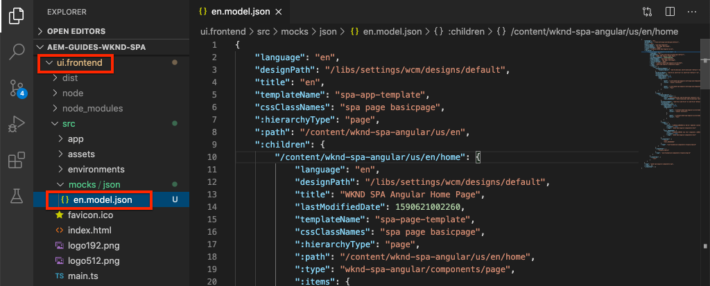

# 集SPA成 {#integrate-spa}

瞭解Angular中寫入的單頁應用程式(SPA)的原始碼如何與Adobe Experience Manager()項AEM目整合。 學習使用現代前端工具（如webpack dev伺服器）快速開發SPAJSON模AEM型API。

## 目標

1. 瞭解項SPA目如何與客AEM戶端庫整合。
2. 瞭解如何使用本地開發伺服器進行專用前端開發。
3. 探索使用 **代理** 靜態 **嘲弄** 用於針對AEMJSON模型API開發的檔案

## 您將構建的

本章將添加一個簡單 `Header` 元件SPA。 在構建此靜態 `Header` 採用多種AEM開SPA發方法。


*擴展SPA以添加靜態 `Header` 元件*

## 必備條件

查看所需的工具和設定 [地方開發環境](overview.md#local-dev-environment)。

### 獲取代碼

1. 通過Git下載本教程的起點：

   ```shell
   $ git clone git@github.com:adobe/aem-guides-wknd-spa.git
   $ cd aem-guides-wknd-spa
   $ git checkout Angular/integrate-spa-start
   ```

2. 使用Maven將代碼庫部署到AEM本地實例：

   ```shell
   $ mvn clean install -PautoInstallSinglePackage
   ```

   如果使用 [AEM 6.x](overview.md#compatibility) 添加 `classic` 配置檔案：

   ```shell
   $ mvn clean install -PautoInstallSinglePackage -Pclassic
   ```

您始終可以在 [GitHub](https://github.com/adobe/aem-guides-wknd-spa/tree/Angular/integrate-spa-solution) 或通過切換到分支本地檢出代碼 `Angular/integrate-spa-solution`。

## 整合方法 {#integration-approach}

作為項目的一部分，建立了兩AEM個模組： `ui.apps` 和 `ui.frontend`。

的 `ui.frontend` 模組是 [網路包](https://webpack.js.org/) 包含所有原始碼的SPA項目。 大部分開SPA發和測試都在webpack項目中完成。 觸發生產生成時，使用SPAwebpack生成並編譯。 編譯的對象（CSS和Javascript）將複製到 `ui.apps` 模組，然後部署到運AEM行時。


*整合的高級描SPA述。*

有關前端構建的其他資訊可以 [此處](https://experienceleague.adobe.com/docs/experience-manager-core-components/using/developing/archetype/uifrontend-angular.html)。

## Inspect整SPA合 {#inspect-spa-integration}

接下來，檢查 `ui.frontend` 模組，SPA以瞭解 [項AEM目原型](https://experienceleague.adobe.com/docs/experience-manager-core-components/using/developing/archetype/uifrontend-angular.html)。

1. 在您選擇的IDE中，開啟AEMWKND的項目SPA。 本教程將使用 [Visual Studio代碼IDE](https://experienceleague.adobe.com/docs/experience-manager-learn/cloud-service/local-development-environment-set-up/development-tools.html#microsoft-visual-studio-code)。

   

2. 展開並檢查 `ui.frontend` 的子菜單。 開啟檔案 `ui.frontend/package.json`

3. 在 `dependencies` 你應該看到幾個 `@angular`:

   ```json
   "@angular/animations": "~9.1.11",
   "@angular/common": "~9.1.11",
   "@angular/compiler": "~9.1.11",
   "@angular/core": "~9.1.11",
   "@angular/forms": "~9.1.10",
   "@angular/platform-browser": "~9.1.10",
   "@angular/platform-browser-dynamic": "~9.1.10",
   "@angular/router": "~9.1.10",
   ```

   的 `ui.frontend` 模組是 [Angular應用程式](https://angular.io) 使用 [AngularCLI工具](https://angular.io/cli) 包括路由。

4. 還有三個以前置詞的依賴關係 `@adobe`:

   ```json
   "@adobe/cq-angular-editable-components": "^2.0.2",
   "@adobe/cq-spa-component-mapping": "^1.0.3",
   "@adobe/cq-spa-page-model-manager": "^1.1.3",
   ```

   以上模組構成 [AEM編SPA輯器JS SDK](https://experienceleague.adobe.com/docs/experience-manager-65/developing/headless/spas/spa-blueprint.html) 並提供功能，使「元件」(Components)可以映射SPA到「組AEM件」(Components)。

5. 在 `package.json` 檔案 `scripts` 定義：

   ```json
   "scripts": {
       "start": "ng serve --open --proxy-config ./proxy.conf.json",
       "build": "ng lint && ng build && clientlib",
       "build:production": "ng lint && ng build --prod && clientlib",
       "test": "ng test",
       "sync": "aemsync -d -w ../ui.apps/src/main/content"
   }
   ```

   這些指令碼基於常用 [AngularCLI命令](https://angular.io/cli/build) 但是稍作修改，以配合更大的項AEM目。

   `start`  — 使用本地Web伺服器本地運行Angular應用。 已更新它以代理本地實例的AEM內容。

   `build`  — 編譯Angular應用以進行生產分發。 增加 `&& clientlib` 負責將編譯SPA到 `ui.apps` 模組，作為生成期間的客戶端庫。 npm模組 [aem-clientlib生成器](https://github.com/wcm-io-frontend/aem-clientlib-generator) 用來促進這一過程。

   可找到有關可用指令碼的詳細資訊 [這裡](https://experienceleague.adobe.com/docs/experience-manager-core-components/using/developing/archetype/uifrontend-angular.html)。

6. Inspect檔案 `ui.frontend/clientlib.config.js`。 此配置檔案由 [aem-clientlib生成器](https://github.com/wcm-io-frontend/aem-clientlib-generator#clientlibconfigjs) 確定如何生成客戶端庫。

7. Inspect檔案 `ui.frontend/pom.xml`。 此檔案轉換 `ui.frontend` 資料夾 [馬文模](https://maven.apache.org/guides/mini/guide-multiple-modules.html)。 的 `pom.xml` 已更新檔案以使用 [前面的插件](https://github.com/eirslett/frontend-maven-plugin) 至 **test** 和 **構建** 在馬SPA文建造時。

8. Inspect檔案 `app.component.ts` 在 `ui.frontend/src/app/app.component.ts`:

   ```js
   import { Constants } from '@adobe/cq-angular-editable-components';
   import { ModelManager } from '@adobe/cq-spa-page-model-manager';
   import { Component } from '@angular/core';
   
   @Component({
   selector: '#spa-root', // tslint:disable-line
   styleUrls: ['./app.component.css'],
   templateUrl: './app.component.html'
   })
   export class AppComponent {
       ...
   
       constructor() {
           ModelManager.initialize().then(this.updateData);
       }
   
       private updateData = pageModel => {
           this.path = pageModel[Constants.PATH_PROP];
           this.items = pageModel[Constants.ITEMS_PROP];
           this.itemsOrder = pageModel[Constants.ITEMS_ORDER_PROP];
       }
   }
   ```

   `app.component.js` 是入口SPA。 `ModelManager` 由編輯AEM器SPAJS SDK提供。 它負責呼叫和注入 `pageModel` （JSON內容）。

## 添加標題元件 {#header-component}

接下來，向中添加新組SPA件，並將更改部署到本AEM地實例以查看整合。

1. 開啟新的終端窗口並導航到 `ui.frontend` 資料夾：

   ```shell
   $ cd aem-guides-wknd-spa/ui.frontend
   ```

2. 安裝 [AngularCLI](https://angular.io/cli#installing-angular-cli) 全局Angular元件用於生成Angular元件，以及通過 **黃** 的子菜單。

   ```shell
   $ npm install -g @angular/cli
   ```

   >[!CAUTION]
   >
   > 版本 **@angular/cli** 由此項目使用 **9.1.7**。 建議保持AngularCLI版本同步。

3. 新建 `Header` 通過運行AngularCLI `ng generate component` 命令 `ui.frontend` 的子菜單。

   ```shell
   $ ng generate component components/header
   
   CREATE src/app/components/header/header.component.css (0 bytes)
   CREATE src/app/components/header/header.component.html (21 bytes)
   CREATE src/app/components/header/header.component.spec.ts (628 bytes)
   CREATE src/app/components/header/header.component.ts (269 bytes)
   UPDATE src/app/app.module.ts (1809 bytes)
   ```

   這將為位於的新Angular標題元件建立骨架 `ui.frontend/src/app/components/header`。

4. 開啟 `aem-guides-wknd-spa` 在您選擇的IDE中執行項目。 導航到 `ui.frontend/src/app/components/header` 的子菜單。

   

5. 開啟檔案 `header.component.html` 用下列內容替換：

   ```html
   <!--/* header.component.html */-->
   <header className="header">
       <div className="header-container">
           <h1>WKND</h1>
       </div>
   </header>
   ```

   請注意，這將顯示靜態內容，因此此Angular元件不需要對預設生成的內容進行任何調整 `header.component.ts`。

6. 開啟檔案 **app.component.html** 在  `ui.frontend/src/app/app.component.html`。 添加 `app-header`:

   ```html
   <app-header></app-header>
   <router-outlet></router-outlet>
   ```

   這包括 `header` 元件。

7. 開啟新終端並導航到 `ui.frontend` 資料夾並運行 `npm run build` 命令：

   ```shell
   $ cd ui.frontend
   $ npm run build
   
   Linting "angular-app"...
   All files pass linting.
   Generating ES5 bundles for differential loading...
   ES5 bundle generation complete.
   ```

8. 導航到 `ui.apps` 的子菜單。 在下面 `ui.apps/src/main/content/jcr_root/apps/wknd-spa-angular/clientlibs/clientlib-angular` 您應看到已編SPA譯的檔案已從`ui.frontend/build` 的子菜單。

   

9. 返回到終端並導航到 `ui.apps` 的子菜單。 執行以下Maven命令：

   ```shell
   $ cd ../ui.apps
   $ mvn clean install -PautoInstallPackage
   ...
   [INFO] ------------------------------------------------------------------------
   [INFO] BUILD SUCCESS
   [INFO] ------------------------------------------------------------------------
   [INFO] Total time:  9.629 s
   [INFO] Finished at: 2020-05-04T17:48:07-07:00
   [INFO] ------------------------------------------------------------------------
   ```

   這將部署 `ui.apps` 包到的本地運行實例AEM。

10. 開啟瀏覽器頁籤並導航到 [http://localhost:4502/editor.html/content/wknd-spa-angular/us/en/home.html](http://localhost:4502/editor.html/content/wknd-spa-angular/us/en/home.html)。 您現在應看到 `Header` 顯示的組SPA件。

   

   步驟 **7-9** 在從項目的根觸發Maven生成時自動執行(即 `mvn clean install -PautoInstallSinglePackage`)。 您現在應該瞭解與客戶端庫之間集SPA成AEM的基本知識。 請注意，您仍然可以編輯和添加 `Text` 但AEM是 `Header` 元件不可編輯。

## Webpack開發伺服器 — 代理JSON API {#proxy-json}

如前幾個練習所示，執行生成並將客戶端庫同步到本地實例需要幾AEM分鐘的時間。 這對於最終測試是可以接受的，但對於大多數開發來說並不SPA理想。

A [WebPack Dev伺服器](https://webpack.js.org/configuration/dev-server/) 可用於快速開發SPA。 由生SPA成的JSON模型驅動AEM。 在本練習中，運行實例的JSON內AEM容是 **代理** 到由 [Angular項目](https://angular.io/guide/build)。

1. 返回到IDE並開啟檔案 **proxy.conf.json** 在 `ui.frontend/proxy.conf.json`。

   ```json
   [
       {
           "context": [
                       "/content/**/*.(jpg|jpeg|png|model.json)",
                       "/etc.clientlibs/**/*"
                   ],
           "target": "http://localhost:4502",
           "auth": "admin:admin",
           "logLevel": "debug"
       }
   ]
   ```

   的 [Angular應用](https://angular.io/guide/build#proxying-to-a-backend-server) 提供了一種簡單的代理API請求的機制。 指定的模式 `context` 都被代理 `localhost:4502`，本地快速啟AEM動。

2. 開啟檔案 **索引.html** 在 `ui.frontend/src/index.html`。 這是開發伺服器使用的根HTML檔案。

   請注意， `base href="/"`。 的 [基本標籤](https://angular.io/guide/deployment#the-base-tag) 對於應用解析相對URL至關重要。

   ```html
   <base href="/">
   ```

3. 開啟終端窗口並導航到 `ui.frontend` 的子菜單。 運行命令 `npm start`:

   ```shell
   $ cd ui.frontend
   $ npm start
   
   > wknd-spa-angular@0.1.0 start /Users/dgordon/Documents/code/aem-guides-wknd-spa/ui.frontend
   > ng serve --open --proxy-config ./proxy.conf.json
   
   10% building 3/3 modules 0 active[HPM] Proxy created: [ '/content/**/*.(jpg|jpeg|png|model.json)', '/etc.clientlibs/**/*' ]  ->  http://localhost:4502
   [HPM] Subscribed to http-proxy events:  [ 'error', 'close' ]
   ℹ ｢wds｣: Project is running at http://localhost:4200/webpack-dev-server/
   ℹ ｢wds｣: webpack output is served from /
   ℹ ｢wds｣: 404s will fallback to //index.html
   ```

4. 開啟新瀏覽器頁籤（如果尚未開啟）並導航到 [http://localhost:4200/content/wknd-spa-angular/us/en/home.html](http://localhost:4200/content/wknd-spa-angular/us/en/home.html)。

   

   您應該看到與中相同的內AEM容，但未啟用任何創作功能。

5. 返回到IDE並建立名為 `img` 在 `ui.frontend/src/assets`。
6. 下載並將以下WKND徽標添加到 `img` 資料夾：

   

7. 開啟 **header.component.html** 在 `ui.frontend/src/app/components/header/header.component.html` 並包括：

   ```html
   <header class="header">
       <div class="header-container">
           <div class="logo">
               
           </div>
       </div>
   </header>
   ```

   將更改保存到 **header.component.html**。

8. 返回到瀏覽器。 您應立即看到對應用所做的更改。

   

   您可以繼續在 **AEM** 看到它們反映在 **WebPack Dev伺服器**，因為我們正在代理內容。 請注意，內容更改僅在 **WebPack Dev伺服器**。

9. 停止本地Web伺服器 `ctrl+c` 在終端。

## Webpack開發伺服器 — 模擬JSON API {#mock-json}

另一種快速開發的方法是使用靜態JSON檔案作為JSON模型。 通過「嘲弄」JSON，我們刪除了對本地實例的依AEM賴性。 它還允許前端開發人員更新JSON模型，以便test功能並驅動對JSON API的更改，這些更改隨後將由後端開發人員實施。

模擬JSON的初始設定 **需要本地實AEM例**。

1. 在瀏覽器中導航到 [http://localhost:4502/content/wknd-spa-angular/us/en.model.json](http://localhost:4502/content/wknd-spa-angular/us/en.model.json)。

   這是驅動應用程AEM序的JSON導出。 複製JSON輸出。

2. 返回到IDE，導航到 `ui.frontend/src` 添加新資料夾 **吊** 和 **jon** 匹配以下資料夾結構：

   ```plain
   |-- ui.frontend
       |-- src
           |-- mocks
               |-- json
   ```

3. 建立名為 **en.model.json** 下 `ui.frontend/public/mocks/json`。 貼上JSON輸出 **步驟1** 給。

   

4. 建立新檔案 **proxy.mock.conf.json** 下 `ui.frontend`。 使用以下內容填充檔案：

   ```json
   [
       {
       "context": [
           "/content/**/*.model.json"
       ],
       "pathRewrite": { "^/content/wknd-spa-angular/us" : "/mocks/json"} ,
       "target": "http://localhost:4200",
       "logLevel": "debug"
       }
   ]
   ```

   此代理配置將重寫以開始的請求 `/content/wknd-spa-angular/us` 與 `/mocks/json` 並提供相應的靜態JSON檔案，例如：

   ```plain
   /content/wknd-spa-angular/us/en.model.json -> /mocks/json/en.model.json
   ```

5. 開啟檔案 **angular.json**。 添加新 **開發** 配置已更新 **資產** 引用的陣列 **吊** 資料夾。

   ```json
    "dev": {
             "assets": [
               "src/mocks",
               "src/assets",
               "src/favicon.ico",
               "src/logo192.png",
               "src/logo512.png",
               "src/manifest.json"
             ]
       },
   ```

   

   建立專用 **開發** 配置確保 **吊** 資料夾僅在開發過程中使用，且從不在生AEM產生成中部署到。

6. 在 **angular.json** 檔案，下次更新 **瀏覽器目標** 使用新配置 **開發** 配置：

   ```diff
     ...
     "serve": {
         "builder": "@angular-devkit/build-angular:dev-server",
         "options": {
   +       "browserTarget": "angular-app:build:dev"
   -       "browserTarget": "angular-app:build"
         },
     ...
   ```

   

7. 開啟檔案 `ui.frontend/package.json` 並添加新 **開始：模擬** 命令以引用 **proxy.mock.conf.json** 的子菜單。

   ```diff
       "scripts": {
           "start": "ng serve --open --proxy-config ./proxy.conf.json",
   +       "start:mock": "ng serve --open --proxy-config ./proxy.mock.conf.json",
           "build": "ng lint && ng build && clientlib",
           "build:production": "ng lint && ng build --prod && clientlib",
           "test": "ng test",
           "sync": "aemsync -d -w ../ui.apps/src/main/content"
       }
   ```

   添加新命令可輕鬆在代理配置之間切換。

8. 如果當前正在運行，請停止 **WebPack Dev伺服器**。 啟動 **WebPack Dev伺服器** 使用 **開始：模擬** 指令碼：

   ```shell
   $ npm run start:mock
   
   > wknd-spa-angular@0.1.0 start:mock /Users/dgordon/Documents/code/aem-guides-wknd-spa/ui.frontend
   > ng serve --open --proxy-config ./proxy.mock.conf.json
   ```

   導航到 [http://localhost:4200/content/wknd-spa-angular/us/en/home.html](http://localhost:4200/content/wknd-spa-angular/us/en/home.html) 你應該看到同SPA樣的，但內容正在從 **嘲弄** JSON檔案。

9. 對 **en.model.json** 檔案。 更新的內容應立即反映在 **WebPack Dev伺服器**。

   

   能夠操作JSON模型並查看即時效果可SPA以幫助開發人員瞭解JSON模型API。 它還允許前端和後端開發並行進行。

## 添加帶粗體的樣式

接下來，將向項目添加一些更新的樣式。 此項目將添加 [薩斯](https://sass-lang.com/) 支援一些有用的功能，如變數。

1. 開啟終端窗口並停止 **WebPack Dev伺服器** 的子菜單。 從內部 `ui.frontend` 資料夾輸入以下命令以更新要處理的Angular應用 **.scs** 的子菜單。

   ```shell
   $ cd ui.frontend
   $ ng config schematics.@schematics/angular:component.styleext scss
   ```

   這將更新 `angular.json` 檔案底部有一個新條目：

   ```json
   "schematics": {
       "@schematics/angular:component": {
       "styleext": "scss"
       }
   }
   ```

2. 安裝 `normalize-scss` 要使各瀏覽器的樣式規範化，請執行以下操作：

   ```shell
   $ npm install normalize-scss --save
   ```

3. 返回到IDE及其下面 `ui.frontend/src` 建立名為 `styles`。
4. 在下面建立新檔案 `ui.frontend/src/styles` 命名 `_variables.scss` 並填充以下變數：

   ```scss
   //_variables.scss
   
   //== Colors
   //
   //## Gray and brand colors for use across theme.
   
   $black:                  #202020;
   $gray:                   #696969;
   $gray-light:             #EBEBEB;
   $gray-lighter:           #F7F7F7;
   $white:                  #FFFFFF;
   $yellow:                 #FFEA00;
   $blue:                   #0045FF;
   
   
   //== Typography
   //
   //## Font, line-height, and color for body text, headings, and more.
   
   $font-family-sans-serif:  "Helvetica Neue", Helvetica, Arial, sans-serif;
   $font-family-serif:       Georgia, "Times New Roman", Times, serif;
   $font-family-base:        $font-family-sans-serif;
   $font-size-base:          18px;
   
   $line-height-base:        1.5;
   $line-height-computed:    floor(($font-size-base * $line-height-base));
   
   // Functional Colors
   $brand-primary:             $yellow;
   $body-bg:                   $white;
   $text-color:                $black;
   $text-color-inverse:        $gray-light;
   $link-color:                $blue;
   
   //Layout
   $max-width: 1024px;
   $header-height: 75px;
   
   // Spacing
   $gutter-padding: 12px;
   ```

5. 重新命名檔案的副檔名 **樣式.css** 在 `ui.frontend/src/styles.css` 至 **樣式.scs**。 將內容替換為：

   ```scss
   /* styles.scss * /
   
   /* Normalize */
   @import '~normalize-scss/sass/normalize';
   
   @import './styles/variables';
   
   body {
       background-color: $body-bg;
       font-family: $font-family-base;
       margin: 0;
       padding: 0;
       font-size: $font-size-base;
       text-align: left;
       color: $text-color;
       line-height: $line-height-base;
   }
   
   body.page {
       max-width: $max-width;
       margin: 0 auto;
       padding: $gutter-padding;
       padding-top: $header-height;
   }
   ```

6. 更新 **angular.json** 並重新命名所有引用 **樣式.css** 與 **樣式.scs**。 應該有3個參考。

   ```diff
     "styles": [
   -    "src/styles.css"
   +    "src/styles.scss"
      ],
   ```

## 更新標題樣式

接下來，將一些特定於品牌的樣式添加到 **標題** 元件。

1. 啟動 **WebPack Dev伺服器** 要即時查看樣式更新：

   ```shell
   $ npm run start:mock
   ```

2. 下 `ui.frontend/src/app/components/header` 更名 **header.component.css** 至 **header.component.scss**。 使用以下內容填充檔案：

   ```scss
   @import "~src/styles/variables";
   
   .header {
       width: 100%;
       position: fixed;
       top: 0;
       left:0;
       z-index: 99;
       background-color: $brand-primary;
       box-shadow: 0px 0px 10px 0px rgba(0, 0, 0, 0.24);
   }
   
   .header-container {
       display: flex;
       max-width: $max-width;
       margin: 0 auto;
       padding-left: $gutter-padding;
       padding-right: $gutter-padding;
   }
   
   .logo {
       z-index: 100;
       display: flex;
       padding-top: $gutter-padding;
       padding-bottom: $gutter-padding;
   }
   
   .logo-img {
       width: 100px;
   }
   ```

3. 更新 **header.component.ts** 引用 **header.component.scss**:

   ```diff
   ...
     @Component({
       selector: 'app-header',
       templateUrl: './header.component.html',
   -   styleUrls: ['./header.component.css']
   +   styleUrls: ['./header.component.scss']
     })
   ...
   ```

4. 返回瀏覽器和 **WebPack Dev伺服器**:

   

   現在，您應看到添加到 **標題** 元件。

## 將更SPA新部署到AEM

對 **標題** 當前僅通過 **WebPack Dev伺服器**。 部署更新SPA的AEM以查看更改。

1. 停止 **WebPack Dev伺服器**。
2. 導航到項目的根 `/aem-guides-wknd-spa` 並將項目部署AEM到Maven:

   ```shell
   $ cd ..
   $ mvn clean install -PautoInstallSinglePackage
   ```

3. 導航到 [http://localhost:4502/editor.html/content/wknd-spa-angular/us/en/home.html](http://localhost:4502/editor.html/content/wknd-spa-angular/us/en/home.html)。 您應看到更新的 **標題** 應用了徽標和樣式：

   

   現在已更新SPA，創AEM作可以繼續。

## 恭喜！ {#congratulations}

祝賀您，您已更新SPA並探索與的整合AEM! 您現在知道使用JSON模型SPAAPI開AEM發的兩種方法 **WebPack Dev伺服器**。

您始終可以在 [GitHub](https://github.com/adobe/aem-guides-wknd-spa/tree/Angular/integrate-spa-solution) 或通過切換到分支本地檢出代碼 `Angular/integrate-spa-solution`。

### 後續步驟 {#next-steps}

[將組SPA件映射到組AEM件](map-components.md)  — 瞭解如何使用編輯器JS SDK將Angular組AEM件映射AEM到SPAAdobe Experience Manager()元件。 元件映射使作者能夠對編輯器中SPA的元件進行AEM動態SPA更新，與傳統創AEM作類似。
