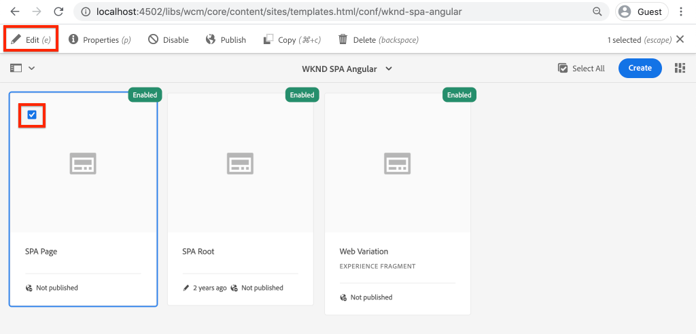

# 將SPA元件對應至AEM元件 {#map-components}

瞭解如何使用Angular SPA Editor JS SDK將AEM元件對應到Adobe Experience Manager (AEM)元件。 元件對應可讓使用者在AEM SPA Editor中對SPA元件進行動態更新，類似於傳統的AEM編寫。

本章更深入地探討AEM JSON模型API，以及如何將AEM元件公開的JSON內容作為prop自動插入到Angular元件中。

## 目標

1. 瞭解如何將AEM元件對應至SPA元件。
2. 瞭解&#x200B;**Container**&#x200B;元件與&#x200B;**Content**&#x200B;元件之間的差異。
3. 建立對應至現有Angular元件的新AEM元件。

## 您將建置的內容

本章將檢查提供的`Text` SPA元件如何對應至AEM `Text`元件。 已建立新的`Image` SPA元件，可以在SPA中使用並在AEM中撰寫。 **配置容器**&#x200B;和&#x200B;**範本編輯器**&#x200B;原則的現成功能也會用來建立外觀稍有變化的檢視。


## 先決條件

檢閱設定[本機開發環境](overview.md#local-dev-environment)所需的工具和指示。

### 取得程式碼

1. 透過Git下載本教學課程的起點：

   ```shell
   $ git clone git@github.com:adobe/aem-guides-wknd-spa.git
   $ cd aem-guides-wknd-spa
   $ git checkout Angular/map-components-start
   ```

2. 使用Maven將程式碼庫部署到本機AEM執行個體：

   ```shell
   $ mvn clean install -PautoInstallSinglePackage
   ```

   如果使用[AEM 6.x](overview.md#compatibility)，請新增`classic`設定檔：

   ```shell
   $ mvn clean install -PautoInstallSinglePackage -Pclassic
   ```

您一律可以在[GitHub](https://github.com/adobe/aem-guides-wknd-spa/tree/Angular/map-components-solution)上檢視完成的程式碼，或切換至分支`Angular/map-components-solution`在本機取出程式碼。

## 對應方法

基本概念是對應SPA元件至AEM元件。 AEM元件，執行伺服器端，將內容匯出為JSON模型API的一部分。 SPA會使用JSON內容，在瀏覽器中執行使用者端。 SPA元件和AEM元件之間會建立1:1對應。


*將AEM元件對應至Angular元件的高階概觀*

## 檢查文字元件

[AEM專案原型](https://github.com/adobe/aem-project-archetype)提供對應至AEM [文字元件](https://experienceleague.adobe.com/docs/experience-manager-core-components/using/components/text.html?lang=zh-Hant)的`Text`元件。 這是&#x200B;**content**&#x200B;元件的範例，其會轉譯來自AEM的&#x200B;*content*。

讓我們瞭解元件的運作方式。

### 檢查JSON模型

1. 在深入瞭解SPA程式碼之前，請務必瞭解AEM提供的JSON模型。 導覽至[核心元件庫](https://www.aemcomponents.dev/content/core-components-examples/library/core-content/text.html)，並檢視文字元件的頁面。 核心元件庫提供所有AEM核心元件的範例。
2. 選取其中一個範例的&#x200B;**JSON**&#x200B;標籤：

   

   您應該會看到三個屬性： `text`、`richText`和`:type`。

   `:type`是保留屬性，其中列出AEM元件的`sling:resourceType` （或路徑）。 `:type`的值是用來將AEM元件對應到SPA元件的值。

   `text`和`richText`是公開給SPA元件的其他屬性。

### 檢查文字元件

1. 開啟新的終端機，並導覽至專案內的`ui.frontend`資料夾。 執行`npm install`，然後執行`npm start`以啟動&#x200B;**webpack開發伺服器**：

   ```shell
   $ cd ui.frontend
   $ npm run start:mock
   ```

   `ui.frontend`模組目前設定為使用[模擬JSON模型](./integrate-spa.md#mock-json)。

2. 您應該會看到新的瀏覽器視窗開啟到[http://localhost:4200/content/wknd-spa-angular/us/en/home.html](http://localhost:4200/content/wknd-spa-angular/us/en/home.html)

   含有模擬內容的

3. 在您選擇的IDE中，開啟WKND SPA的AEM專案。 展開`ui.frontend`模組並開啟`ui.frontend/src/app/components/text/text.component.ts`下的檔案&#x200B;**text.component.ts**：

   

4. 第一個要檢查的區域是位於~第35行的`class TextComponent`：

   ```js
   export class TextComponent {
       @Input() richText: boolean;
       @Input() text: string;
       @Input() itemName: string;
   
       @HostBinding('innerHtml') get content() {
           return this.richText
           ? this.sanitizer.bypassSecurityTrustHtml(this.text)
           : this.text;
       }
       @HostBinding('attr.data-rte-editelement') editAttribute = true;
   
       constructor(private sanitizer: DomSanitizer) {}
   }
   ```

   [@Input()](https://angular.io/api/core/Input)裝飾器可用來宣告欄位，這些欄位的值是透過先前已檢閱的對應JSON物件設定的。

   `@HostBinding('innerHtml') get content()`是從`this.text`的值公開所編寫文字內容的方法。 如果內容為RTF文字（由`this.richText`標幟決定），則會略過Angular的內建安全性。 Angular的[DomSanitizer](https://angular.io/api/platform-browser/DomSanitizer)用來「清除」原始HTML並防止跨網站指令碼漏洞。 方法已使用[@HostBinding](https://angular.io/api/core/HostBinding)裝飾程式繫結至`innerHtml`屬性。

5. 接著在~第24行檢查`TextEditConfig`：

   ```js
   const TextEditConfig = {
       emptyLabel: 'Text',
       isEmpty: cqModel =>
           !cqModel || !cqModel.text || cqModel.text.trim().length < 1
   };
   ```

   上述程式碼負責決定何時在AEM製作環境中呈現預留位置。 如果`isEmpty`方法傳回&#x200B;**true**，則會轉譯預留位置。

6. 最後檢視位於~行53的`MapTo`呼叫：

   ```js
   MapTo('wknd-spa-angular/components/text')(TextComponent, TextEditConfig );
   ```

   **MapTo**&#x200B;由AEM SPA Editor JS SDK (`@adobe/cq-angular-editable-components`)提供。 路徑`wknd-spa-angular/components/text`代表AEM元件的`sling:resourceType`。 此路徑與先前觀察到的JSON模型公開的`:type`相符。 **MapTo**&#x200B;會剖析JSON模型回應，並將正確的值傳遞至SPA元件的`@Input()`變數。

   您可以在`ui.apps/src/main/content/jcr_root/apps/wknd-spa-angular/components/text`找到AEM `Text`元件定義。

7. 修改`ui.frontend/src/mocks/json/en.model.json`的&#x200B;**en.model.json**&#x200B;檔案以進行實驗。

   在~第62行，更新前`Text`個值以使用&#x200B;**`H1`**&#x200B;和&#x200B;**`u`**&#x200B;標籤：

   ```json
       "text": {
           "text": "<h1><u>Hello World!</u></h1>",
           "richText": true,
           ":type": "wknd-spa-angular/components/text"
       }
   ```

   返回瀏覽器以檢視&#x200B;**webpack開發伺服器**&#x200B;所提供的效果：

   

   請嘗試在&#x200B;**true** / **false**&#x200B;之間切換`richText`屬性，以檢視執行中的轉譯器邏輯。

8. 在`ui.frontend/src/app/components/text/text.component.html`檢查&#x200B;**text.component.html**。

   此檔案是空的，因為元件的整個內容是由`innerHTML`屬性所設定。

9. 在`ui.frontend/src/app/app.module.ts`檢查&#x200B;**app.module.ts**。

   ```js
   @NgModule({
   imports: [
       BrowserModule,
       SpaAngularEditableComponentsModule,
       AppRoutingModule
   ],
   providers: [ModelManagerService, { provide: APP_BASE_HREF, useValue: '/' }],
   declarations: [AppComponent, TextComponent, PageComponent, HeaderComponent],
   entryComponents: [TextComponent, PageComponent],
   bootstrap: [AppComponent]
   })
   export class AppModule {}
   ```

   未明確包含&#x200B;**TextComponent**，而是透過AEM SPA Editor JS SDK提供的&#x200B;**AEMResponsiveGridComponent**&#x200B;動態包含。 因此，必須列在&#x200B;**app.module.ts**&#39; [entryComponents](https://angular.io/guide/entry-components)陣列中。

## 建立影像元件

接下來，建立對應至AEM [影像元件](https://experienceleague.adobe.com/docs/experience-manager-core-components/using/components/image.html?lang=zh-Hant)的`Image`Angular元件。 `Image`元件是&#x200B;**content**&#x200B;元件的另一個範例。

### 檢查JSON

在跳入SPA程式碼之前，請檢查AEM提供的JSON模型。

1. 導覽至核心元件庫[&#128279;](https://www.aemcomponents.dev/content/core-components-examples/library/core-content/image.html)中的影像範例。

   

   `src`、`alt`和`title`的屬性是用來填入SPA `Image`元件。

   >[!NOTE]
   >
   > 有其他公開的影像屬性(`lazyEnabled`， `widths`)可讓開發人員建立最適化且延遲載入的元件。 此教學課程中建置的元件非常簡單，**不會**&#x200B;使用這些進階屬性。

2. 返回您的IDE並在`ui.frontend/src/mocks/json/en.model.json`開啟`en.model.json`。 由於這是我們專案的全新元件，因此需要「模擬」影像JSON。

   在~第70行，為`image`模型新增JSON專案（別忘了第二個`text_386303036`之後的尾端逗號`,`）並更新`:itemsOrder`陣列。

   ```json
   ...
   ":items": {
               ...
               "text_386303036": {
                   "text": "<p>A new text component.</p>\r\n",
                   "richText": true,
                   ":type": "wknd-spa-angular/components/text"
                   },
               "image": {
                   "alt": "Rock Climber in New Zealand",
                   "title": "Rock Climber in New Zealand",
                   "src": "/mocks/images/adobestock-140634652.jpeg",
                   ":type": "wknd-spa-angular/components/image"
               }
           },
           ":itemsOrder": [
               "text",
               "text_386303036",
               "image"
           ],
   ```

   專案在`/mock-content/adobestock-140634652.jpeg`包含搭配&#x200B;**webpack開發伺服器**&#x200B;使用的範例影像。

   您可以在[&#128279;](https://github.com/adobe/aem-guides-wknd-spa/blob/Angular/map-components-solution/ui.frontend/src/mocks/json/en.model.json)檢視完整的en.model.json。

3. 新增元件要顯示的庫存像片。

   在`ui.frontend/src/mocks`下建立名為&#x200B;**影像**&#x200B;的新資料夾。 下載[adobestock-140634652.jpeg](assets/map-components/adobestock-140634652.jpeg)並將其放入新建立的&#x200B;**影像**&#x200B;資料夾。 您可視需要使用自己的影像。

### 實作影像元件

1. 如果啟動，請停止&#x200B;**webpack dev server**。
2. 從`ui.frontend`資料夾中執行Angular CLI `ng generate component`命令，以建立新的影像元件：

   ```shell
   $ ng generate component components/image
   ```

3. 在IDE中，開啟位於`ui.frontend/src/app/components/image/image.component.ts`的&#x200B;**image.component.ts**，並依照以下方式更新：

   ```js
   import {Component, Input, OnInit} from '@angular/core';
   import {MapTo} from '@adobe/cq-angular-editable-components';
   
   const ImageEditConfig = {
   emptyLabel: 'Image',
   isEmpty: cqModel =>
       !cqModel || !cqModel.src || cqModel.src.trim().length < 1
   };
   
   @Component({
   selector: 'app-image',
   templateUrl: './image.component.html',
   styleUrls: ['./image.component.scss']
   })
   export class ImageComponent implements OnInit {
   
   @Input() src: string;
   @Input() alt: string;
   @Input() title: string;
   
   constructor() { }
   
   get hasImage() {
       return this.src && this.src.trim().length > 0;
   }
   
   ngOnInit() { }
   }
   
   MapTo('wknd-spa-angular/components/image')(ImageComponent, ImageEditConfig);
   ```

   `ImageEditConfig`是用來根據是否已填入`src`屬性，決定是否在AEM中轉譯作者預留位置的設定。

   `src`、`alt`和`title`中的`@Input()`為從JSON API對應的屬性。

   `hasImage()`是將決定是否應呈現影像的方法。

   `MapTo`將SPA元件對應至位於`ui.apps/src/main/content/jcr_root/apps/wknd-spa-angular/components/image`的AEM元件。

4. 開啟&#x200B;**image.component.html**&#x200B;並依照以下方式更新：

   ```html
   <ng-container *ngIf="hasImage">
       
   </ng-container>
   ```

   如果`hasImage`傳回&#x200B;**true**，這會轉譯``元素。

5. 開啟&#x200B;**image.component.scss**&#x200B;並依照以下方式更新：

   ```scss
   :host-context {
       display: block;
   }
   
   .image {
       margin: 1rem 0;
       width: 100%;
       border: 0;
   }
   ```

   >[!NOTE]
   >
   > `:host-context`規則是&#x200B;**關鍵**，AEM SPA編輯器預留位置才能正常運作。 所有打算在AEM頁面編輯器中編寫的SPA元件至少都需要此規則。

6. 開啟`app.module.ts`並將`ImageComponent`新增至`entryComponents`陣列：

   ```js
   entryComponents: [TextComponent, PageComponent, ImageComponent],
   ```

   與`TextComponent`一樣，`ImageComponent`也是動態載入，必須包含在`entryComponents`陣列中。

7. 啟動&#x200B;**webpack開發伺服器**&#x200B;以檢視`ImageComponent`轉譯器。

   ```shell
   $ npm run start:mock
   ```

   

   *影像已新增至SPA*

   >[!NOTE]
   >
   > **附加挑戰**：實作新方法以將`title`的值顯示為影像下方的標題。

## 在AEM中更新原則

`ImageComponent`元件僅顯示在&#x200B;**webpack開發伺服器**&#x200B;中。 接下來，將更新的SPA部署至AEM並更新範本原則。

1. 停止&#x200B;**webpack開發伺服器**，並從專案的&#x200B;**根**&#x200B;使用您的Maven技能將變更部署到AEM：

   ```shell
   $ cd aem-guides-wknd-spa
   $ mvn clean install -PautoInstallSinglePackage
   ```

2. 從AEM開始畫面導覽至&#x200B;**[!UICONTROL 工具]** > **[!UICONTROL 範本]** > **[WKND SPA Angular](http://localhost:4502/libs/wcm/core/content/sites/templates.html/conf/wknd-spa-angular)**。

   選取並編輯&#x200B;**SPA頁面**：

   

3. 選取&#x200B;**配置容器**，然後按一下它的&#x200B;**原則**&#x200B;圖示以編輯原則：

   

4. 在&#x200B;**允許的元件** > **WKND SPA Angular - Content** >檢查&#x200B;**影像**&#x200B;元件：

   已選取

   在&#x200B;**預設元件** > **新增對應**&#x200B;下並選擇&#x200B;**影像 — WKND SPA Angular - Content**&#x200B;元件：

   

   輸入`image/*`的&#x200B;**mime型別**。

   按一下&#x200B;**完成**&#x200B;以儲存原則更新。

5. 在&#x200B;**配置容器**&#x200B;中，按一下&#x200B;**文字**&#x200B;元件的&#x200B;**原則**&#x200B;圖示：

   

   建立名稱為&#x200B;**WKND SPA文字**&#x200B;的新原則。 在&#x200B;**外掛程式** > **格式** >核取所有方塊以啟用其他格式選項：

   

   在&#x200B;**外掛程式** > **段落樣式** >下方，勾選方塊以&#x200B;**啟用段落樣式**：

   

   按一下&#x200B;**完成**&#x200B;以儲存原則更新。

6. 瀏覽至&#x200B;**首頁** [http://localhost:4502/editor.html/content/wknd-spa-angular/us/en/home.html](http://localhost:4502/editor.html/content/wknd-spa-angular/us/en/home.html)。

   您也應該能夠編輯`Text`元件，並在&#x200B;**全熒幕**&#x200B;模式中新增其他段落樣式。

   

7. 您也應該能夠從&#x200B;**資產尋找器**&#x200B;拖放影像：

   

8. 透過[AEM Assets](http://localhost:4502/assets.html/content/dam)新增您自己的影像，或安裝標準[WKND參考網站](https://github.com/adobe/aem-guides-wknd/releases/latest)完成的程式碼基底。 [WKND參考網站](https://github.com/adobe/aem-guides-wknd/releases/latest)包含可在WKND SPA上重複使用的許多影像。 可以使用[AEM的封裝管理員](http://localhost:4502/crx/packmgr/index.jsp)來安裝封裝。

   

## 檢查配置容器

AEM SPA Editor SDK會自動支援&#x200B;**配置容器**。 名稱所指示的&#x200B;**配置容器**&#x200B;是&#x200B;**容器**&#x200B;元件。 容器元件是接受JSON結構的元件，這些結構代表&#x200B;*其他*&#x200B;個元件並動態具現化它們。

讓我們進一步檢查配置容器。

1. 在IDE中，在`ui.frontend/src/app/components/responsive-grid`開啟&#x200B;**responsive-grid.component.ts**：

   ```js
   import { AEMResponsiveGridComponent,MapTo } from '@adobe/cq-angular-editable-components';
   
   MapTo('wcm/foundation/components/responsivegrid')(AEMResponsiveGridComponent);
   ```

   `AEMResponsiveGridComponent`已實作為AEM SPA Editor SDK的一部分，並透過`import-components`包含在專案中。

2. 在瀏覽器中導覽至[http://localhost:4502/content/wknd-spa-angular/us/en.model.json](http://localhost:4502/content/wknd-spa-angular/us/en.model.json)

   

   **配置容器**&#x200B;元件有`wcm/foundation/components/responsivegrid`的`sling:resourceType`，而且可由SPA編輯器使用`:type`屬性來辨識，就像`Text`和`Image`元件一樣。

   SPA編輯器也提供相同的功能，可以使用[配置模式](https://experienceleague.adobe.com/docs/experience-manager-65/authoring/siteandpage/responsive-layout.html?lang=zh-Hant#defining-layouts-layout-mode)來重新調整元件大小。

3. 返回[http://localhost:4502/editor.html/content/wknd-spa-angular/us/en/home.html](http://localhost:4502/editor.html/content/wknd-spa-angular/us/en/home.html)。 新增其他&#x200B;**影像**&#x200B;元件，然後嘗試使用&#x200B;**配置**&#x200B;選項重新調整其大小：

   

4. 重新開啟JSON模型[http://localhost:4502/content/wknd-spa-angular/us/en.model.json](http://localhost:4502/content/wknd-spa-angular/us/en.model.json)，並觀察作為JSON一部分的`columnClassNames`：

   

   類別名稱`aem-GridColumn--default--4`表示元件應以12欄格線為4欄寬。 如需[回應式格線的詳細資訊，請參閱此處](https://adobe-marketing-cloud.github.io/aem-responsivegrid/)。

5. 返回IDE，在`ui.apps`模組中有一個在`ui.apps/src/main/content/jcr_root/apps/wknd-spa-angular/clientlibs/clientlib-grid`定義的使用者端程式庫。 開啟檔案`less/grid.less`。

   此檔案決定&#x200B;**配置容器**&#x200B;使用的中斷點（`default`、`tablet`和`phone`）。 此檔案旨在根據專案規格自訂。 目前中斷點設定為`1200px`和`650px`。

6. 您應該能夠使用`Text`元件的回應式功能和更新的RTF原則來編寫如下的檢視：

   

## 恭喜！ {#congratulations}

恭喜，您已瞭解如何將SPA元件對應至AEM元件，並且已實作新的`Image`元件。 您也有機會探索&#x200B;**配置容器**&#x200B;的回應式功能。

您一律可以在[GitHub](https://github.com/adobe/aem-guides-wknd-spa/tree/Angular/map-components-solution)上檢視完成的程式碼，或切換至分支`Angular/map-components-solution`在本機取出程式碼。

### 後續步驟 {#next-steps}

[導覽及路由](navigation-routing.md) — 瞭解如何使用SPA Editor SDK對應至AEM頁面，以支援SPA中的多個檢視。 動態導覽是使用Angular路由器實作，並新增至現有的Header元件。

## 額外優點 — 將設定保留到原始檔控制 {#bonus}

在許多情況下，尤其是在AEM專案剛開始時，將設定（例如範本和相關內容原則）保留到原始檔控制中很有價值。 這可確保所有開發人員都針對相同的內容和設定集，且可確保環境之間有額外的一致性。 一旦專案達到一定的成熟度，管理範本的實務就可以交給特殊的超級使用者群組。

後續幾個步驟將使用Visual Studio Code IDE和[VSCode AEM Sync](https://marketplace.visualstudio.com/items?itemName=yamato-ltd.vscode-aem-sync)進行，但可能會使用任何工具和您已設定為從AEM的本機執行個體&#x200B;**提取**&#x200B;或&#x200B;**匯入**&#x200B;內容的IDE來執行。

1. 在Visual Studio Code IDE中，確定您已透過Marketplace擴充功能安裝&#x200B;**VSCode AEM Sync**：

   

2. 展開專案總管中的&#x200B;**ui.content**&#x200B;模組，並導覽至`/conf/wknd-spa-angular/settings/wcm/templates`。

3. **在`templates`資料夾上按一下滑鼠右鍵**&#x200B;並選取&#x200B;**從AEM伺服器匯入**：

   

4. 重複步驟以匯入內容，但選取位於`/conf/wknd-spa-angular/settings/wcm/policies`的&#x200B;**原則**&#x200B;資料夾。

5. 檢查位於`ui.content/src/main/content/META-INF/vault/filter.xml`的`filter.xml`檔案。

   ```xml
   <!--ui.content filter.xml-->
   <?xml version="1.0" encoding="UTF-8"?>
    <workspaceFilter version="1.0">
        <filter root="/conf/wknd-spa-angular" mode="merge"/>
        <filter root="/content/wknd-spa-angular" mode="merge"/>
        <filter root="/content/dam/wknd-spa-angular" mode="merge"/>
        <filter root="/content/experience-fragments/wknd-spa-angular" mode="merge"/>
    </workspaceFilter>
   ```

   `filter.xml`檔案負責識別隨套件安裝的節點路徑。 請注意每個篩選器上的`mode="merge"`，這表示現有內容將不會被修改，只會新增內容。 由於內容作者可能正在更新這些路徑，因此程式碼部署&#x200B;**不會**&#x200B;覆寫內容非常重要。 請參閱[FileVault檔案](https://jackrabbit.apache.org/filevault/filter.html)，以取得使用篩選元素的詳細資訊。

   比較`ui.content/src/main/content/META-INF/vault/filter.xml`與`ui.apps/src/main/content/META-INF/vault/filter.xml`，瞭解每個模組所管理的不同節點。
