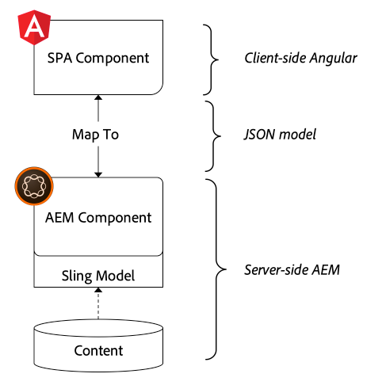

# 將組SPA件映射到組AEM件 {#map-components}

瞭解如何使用編輯器JS SDK將Angular組AEM件映射AEM到SPAAdobe Experience Manager()元件。 元件映射使用戶能夠對編輯器SPA中的元件進行AEM動SPA態更新，與傳AEM統創作類似。

本章將更深入地介紹AEMJSON模型API，以及如何將元件公開的JSON內容自AEM動作為道具注入Angular元件。

## 目標

1. 瞭解如何將元件AEM映射到SPA元件。
2. 瞭解 **容器** 元件和 **內容** 元件。
3. 建立映射到現有元件的新AngularAEM元件。

## 您將構建的

本章將檢查如何提供 `Text` 組SPA件映射到AEM `Text`元件。 新 `Image` 建立SPA的元件可在中SPA使用和創作AEM。 開箱即用功能 **佈局容器** 和 **模板編輯器** 策略還將用於建立外觀更多樣的視圖。


## 必備條件

查看所需的工具和設定 [地方開發環境](overview.md#local-dev-environment)。

### 獲取代碼

1. 通過Git下載本教程的起點：

   ```shell
   $ git clone git@github.com:adobe/aem-guides-wknd-spa.git
   $ cd aem-guides-wknd-spa
   $ git checkout Angular/map-components-start
   ```

2. 使用Maven將代碼庫部署到AEM本地實例：

   ```shell
   $ mvn clean install -PautoInstallSinglePackage
   ```

   如果使用 [AEM 6.x](overview.md#compatibility) 添加 `classic` 配置檔案：

   ```shell
   $ mvn clean install -PautoInstallSinglePackage -Pclassic
   ```

您始終可以在 [GitHub](https://github.com/adobe/aem-guides-wknd-spa/tree/Angular/map-components-solution) 或通過切換到分支本地檢出代碼 `Angular/map-components-solution`。

## 映射方法

基本概念是將元件映SPA射到組AEM件。 組AEM件、運行伺服器端、導出作為JSON模型API一部分的內容。 JSON內容由瀏覽器中運SPA行的客戶端使用。 將建立元件和元SPA件之間AEM的1:1映射。



*將元件映射到AngularAEM元件的高級概述*

## Inspect文本元件

的 [項AEM目原型](https://github.com/adobe/aem-project-archetype) 提供 `Text` 映射到的組AEM件 [文本元件](https://experienceleague.adobe.com/docs/experience-manager-core-components/using/components/text.html)。 這是 **內容** 元件，在它呈現 *內容* 的上AEM界。

讓我們看看元件是如何工作的。

### InspectJSON模型

1. 在跳入代SPA碼之前，瞭解提供的JSON模AEM型非常重要。 導航到 [核心元件庫](https://www.aemcomponents.dev/content/core-components-examples/library/core-content/text.html) 並查看文本元件的頁面。 「核心元件庫」提供了所有核心組AEM件的示例。
2. 選擇 **JSON** 頁籤

   

   您應看到以下三個屬性： `text`。 `richText`, `:type`。

   `:type` 是一個保留屬性，它列出 `sling:resourceType` (或路AEM徑)。 值 `:type` 是用於將元件映射AEM到元件SPA的。

   `text` 和 `richText` 是暴露於元件的附SPA加屬性。

### Inspect文本元件

1. 開啟新終端並導航到 `ui.frontend` 資料夾。 運行 `npm install` 然後 `npm start` 開始 **WebPack Dev伺服器**:

   ```shell
   $ cd ui.frontend
   $ npm run start:mock
   ```

   的 `ui.frontend` 模組當前已設定為使用 [模型JSON模型](./integrate-spa.md#mock-json)。

2. 您應看到開啟的新瀏覽器窗口 [http://localhost:4200/content/wknd-spa-angular/us/en/home.html](http://localhost:4200/content/wknd-spa-angular/us/en/home.html)

   

3. 在您選擇的IDE中，開啟AEMWKND的項目SPA。 展開 `ui.frontend` 模組並開啟檔案 **text.component.ts** 在 `ui.frontend/src/app/components/text/text.component.ts`:

   

4. 第一個要檢查的區域是 `class TextComponent` 在~35號線：

   ```js
   export class TextComponent {
       @Input() richText: boolean;
       @Input() text: string;
       @Input() itemName: string;
   
       @HostBinding('innerHtml') get content() {
           return this.richText
           ? this.sanitizer.bypassSecurityTrustHtml(this.text)
           : this.text;
       }
       @HostBinding('attr.data-rte-editelement') editAttribute = true;
   
       constructor(private sanitizer: DomSanitizer) {}
   }
   ```

   [@Input()](https://angular.io/api/core/Input) decorator用於聲明通過映射的JSON對象（先前已審閱）設定值的欄位。

   `@HostBinding('innerHtml') get content()` 是一種將創作的文本內容從 `this.text`。 如果內容是富文本(由 `this.richText` 標誌)Angular的內置安全性被繞過。 Angular [多姆消毒器](https://angular.io/api/platform-browser/DomSanitizer) 用於「清除」原始HTML並防止跨站點指令碼漏洞。 方法綁定到 `innerHtml` 屬性 [@HostBinding](https://angular.io/api/core/HostBinding) 裝潢師。

5. 下一步檢查 `TextEditConfig` 在~24號線：

   ```js
   const TextEditConfig = {
       emptyLabel: 'Text',
       isEmpty: cqModel =>
           !cqModel || !cqModel.text || cqModel.text.trim().length < 1
   };
   ```

   上述代碼負責確定何時在作者環境中呈AEM現佔位符。 如果 `isEmpty` 方法返回 **真** 然後呈現佔位符。

6. 最後，請看 `MapTo` 電話：

   ```js
   MapTo('wknd-spa-angular/components/text')(TextComponent, TextEditConfig );
   ```

   **映射到** 由編輯AEM器SPAJS SDK提供(`@adobe/cq-angular-editable-components`)。 路徑 `wknd-spa-angular/components/text` 表示 `sling:resourceType` 的上AEM界。 此路徑與 `:type` 由先前觀察到的JSON模型暴露。 **映射到** 解析JSON模型響應，並將正確的值傳遞給 `@Input()` 元件的變SPA量。

   您可以AEM找到 `Text` 元件定義 `ui.apps/src/main/content/jcr_root/apps/wknd-spa-angular/components/text`。

7. 通過修改 **en.model.json** 檔案 `ui.frontend/src/mocks/json/en.model.json`。

   在第62行更新第一個 `Text` 值 **`H1`** 和 **`u`** 標籤：

   ```json
       "text": {
           "text": "<h1><u>Hello World!</u></h1>",
           "richText": true,
           ":type": "wknd-spa-angular/components/text"
       }
   ```

   返回瀏覽器查看 **WebPack Dev伺服器**:

   

   嘗試切換 `richText` 屬性 **真** / **假** 查看操作中的呈現邏輯。

8. Inspect **text.component.html** 在 `ui.frontend/src/app/components/text/text.component.html`。

   此檔案為空，因為元件的整個內容由 `innerHTML` 屬性。

9. Inspect **app.module.ts** 在 `ui.frontend/src/app/app.module.ts`。

   ```js
   @NgModule({
   imports: [
       BrowserModule,
       SpaAngularEditableComponentsModule,
       AppRoutingModule
   ],
   providers: [ModelManagerService, { provide: APP_BASE_HREF, useValue: '/' }],
   declarations: [AppComponent, TextComponent, PageComponent, HeaderComponent],
   entryComponents: [TextComponent, PageComponent],
   bootstrap: [AppComponent]
   })
   export class AppModule {}
   ```

   的 **文本元件** 未明確包括，而是動態通過 **AEMResponsiveGridComponent** 由編AEM輯器SPAJS SDK提供。 因此，必須在 **app.module.ts**&quot; [entryComponents（條目元件）](https://angular.io/guide/entry-components) 陣列。

## 建立影像元件

接下來，建立 `Image` Angular元件，映射到 [影像元件](https://experienceleague.adobe.com/docs/experience-manager-core-components/using/components/image.html)。 的 `Image` 元件是另一個示例 **內容** 元件。

### InspectJSON

跳入代SPA碼前，檢查由提供的JSON模AEM型。

1. 導航到 [核心元件庫中的影像示例](https://www.aemcomponents.dev/content/core-components-examples/library/core-content/image.html)。

   

   屬性 `src`。 `alt`, `title` 用於填充 `Image` 元件。

   >[!NOTE]
   >
   > 還有其他映像屬性已公開(`lazyEnabled`。 `widths`)，允許開發人員建立自適應和延遲載入元件。 本教程中構建的元件非常簡單， **不** 使用這些高級屬性。

2. 返回到IDE並開啟 `en.model.json` 在 `ui.frontend/src/mocks/json/en.model.json`。 由於這是我們項目的一個新元件，因此我們需要「模擬」映像JSON。

   在第70行為 `image` 模型(不要忘記尾隨逗號 `,` 在 `text_386303036`)並更新 `:itemsOrder` 陣列。

   ```json
   ...
   ":items": {
               ...
               "text_386303036": {
                   "text": "<p>A new text component.</p>\r\n",
                   "richText": true,
                   ":type": "wknd-spa-angular/components/text"
                   },
               "image": {
                   "alt": "Rock Climber in New Zealand",
                   "title": "Rock Climber in New Zealand",
                   "src": "/mocks/images/adobestock-140634652.jpeg",
                   ":type": "wknd-spa-angular/components/image"
               }
           },
           ":itemsOrder": [
               "text",
               "text_386303036",
               "image"
           ],
   ```

   該項目包括位於 `/mock-content/adobestock-140634652.jpeg` 與 **WebPack Dev伺服器**。

   您可以查看完整 [此處為en.model.json](https://github.com/adobe/aem-guides-wknd-spa/blob/Angular/map-components-solution/ui.frontend/src/mocks/json/en.model.json)。

3. 添加要由元件顯示的庫照片。

   建立名為 **影像** 下 `ui.frontend/src/mocks`。 下載 [adobestock-140634652.jpeg](assets/map-components/adobestock-140634652.jpeg) 並放在新建立的 **影像** 的子菜單。 如果需要，可自由使用您自己的影像。

### 實現映像元件

1. 停止 **WebPack Dev伺服器** 的子菜單。
2. 通過運行AngularCLI建立新映像元件 `ng generate component` 命令 `ui.frontend` 資料夾：

   ```shell
   $ ng generate component components/image
   ```

3. 在IDE中，開啟 **image.component.ts** 在 `ui.frontend/src/app/components/image/image.component.ts` 及更新如下：

   ```js
   import {Component, Input, OnInit} from '@angular/core';
   import {MapTo} from '@adobe/cq-angular-editable-components';
   
   const ImageEditConfig = {
   emptyLabel: 'Image',
   isEmpty: cqModel =>
       !cqModel || !cqModel.src || cqModel.src.trim().length < 1
   };
   
   @Component({
   selector: 'app-image',
   templateUrl: './image.component.html',
   styleUrls: ['./image.component.scss']
   })
   export class ImageComponent implements OnInit {
   
   @Input() src: string;
   @Input() alt: string;
   @Input() title: string;
   
   constructor() { }
   
   get hasImage() {
       return this.src && this.src.trim().length > 0;
   }
   
   ngOnInit() { }
   }
   
   MapTo('wknd-spa-angular/components/image')(ImageComponent, ImageEditConfig);
   ```

   `ImageEditConfig` 是配置，用於根據是否在中呈現作者佔AEM位符 `src` 屬性已填充。

   `@Input()` 共 `src`。 `alt`, `title` 是從JSON API映射的屬性。

   `hasImage()` 是確定是否應渲染影像的方法。

   `MapTo` 將組SPA件映射AEM到位於 `ui.apps/src/main/content/jcr_root/apps/wknd-spa-angular/components/image`。

4. 開啟 **image.component.html** 並更新如下：

   ```html
   <ng-container *ngIf="hasImage">
       
   </ng-container>
   ```

   這將使 `` 元素 `hasImage` 返回 **真**。

5. 開啟 **image.component.scss** 並更新如下：

   ```scss
   :host-context {
       display: block;
   }
   
   .image {
       margin: 1rem 0;
       width: 100%;
       border: 0;
   }
   ```

   >[!NOTE]
   >
   > 的 `:host-context` 規則 **關鍵** 使編AEM輯器SPA佔位符正常工作。 要SPA在頁面編輯器中創作的AEM所有元件至少需要此規則。

6. 開啟 `app.module.ts` 並添加 `ImageComponent` 到 `entryComponents` 陣列：

   ```js
   entryComponents: [TextComponent, PageComponent, ImageComponent],
   ```

   比如 `TextComponent`，也請參見Wiki頁。 `ImageComponent` 是動態載入的，並且必須包含在 `entryComponents` 陣列。

7. 啟動 **WebPack Dev伺服器** 查看 `ImageComponent` 呈現。

   ```shell
   $ npm run start:mock
   ```

   

   *已添加到*

   >[!NOTE]
   >
   > **獎金挑戰**:實現一種顯示值的新方法 `title` 標題頁。

## 更新策略AEM

的 `ImageComponent` 元件僅在 **WebPack Dev伺服器**。 接下來，將更新SPA的部AEM署到模板策略。

1. 停止 **WebPack Dev伺服器** 和 **根** 在項目中，使用Maven技AEM能部署更改：

   ```shell
   $ cd aem-guides-wknd-spa
   $ mvn clean install -PautoInstallSinglePackage
   ```

2. 從「開始AEM」螢幕導航到 **[!UICONTROL 工具]** > **[!UICONTROL 模板]** > **[WKNDSPAAngular](http://localhost:4502/libs/wcm/core/content/sites/templates.html/conf/wknd-spa-angular)**。

   選擇並編輯 **頁SPA面**:

   

3. 選擇 **佈局容器** 點擊 **政策** 表徵圖：

   

4. 下 **允許的元件** > **WKND SPAAngular — 內容** >檢查 **影像** 元件：

   

   下 **預設元件** > **添加映射** 選擇 **影像 — WKND SPAAngular — 內容** 元件：

   

   輸入 **mime類型** 共 `image/*`。

   按一下 **完成** 保存策略更新。

5. 在 **佈局容器** 按一下 **政策** 表徵圖 **文本** 元件：

   

   建立名為 **WKND文SPA本**。 下 **插件** > **格式** >選中所有框以啟用其他格式設定選項：

   

   下 **插件** > **段落樣式** >選中該框 **啟用段落樣式**:

   

   按一下 **完成** 的子菜單。

6. 導航到 **首頁** [http://localhost:4502/editor.html/content/wknd-spa-angular/us/en/home.html](http://localhost:4502/editor.html/content/wknd-spa-angular/us/en/home.html)。

   您還應能夠編輯 `Text` 元件和添加附加段落樣式 **全屏** 的子菜單。

   

7. 您還應能夠從 **資產查找器**:

   

8. 通過 [AEM Assets](http://localhost:4502/assets.html/content/dam) 或為標準 [WKND參考站點](https://github.com/adobe/aem-guides-wknd/releases/latest)。 的 [WKND參考站點](https://github.com/adobe/aem-guides-wknd/releases/latest) 包括許多可在WKND上重新使用的圖SPA像。 可以使用 [包管AEM理器](http://localhost:4502/crx/packmgr/index.jsp)。

   

## Inspect佈局容器

支援 **佈局容器** 由編輯器AEM SDK自SPA動提供。 的 **佈局容器**，如名稱所示，為 **容器** 元件。 容器元件是接受JSON結構的元件，表示 *其他* 並動態實例化它們。

讓我們進一步檢查佈局容器。

1. 在IDE開啟中 **響應網格.component.ts** 在 `ui.frontend/src/app/components/responsive-grid`:

   ```js
   import { AEMResponsiveGridComponent,MapTo } from '@adobe/cq-angular-editable-components';
   
   MapTo('wcm/foundation/components/responsivegrid')(AEMResponsiveGridComponent);
   ```

   的 `AEMResponsiveGridComponent` 作為編輯器AEM SDKSPA的一部分實現，並通過 `import-components`。

2. 在瀏覽器中導航到 [http://localhost:4502/content/wknd-spa-angular/us/en.model.json](http://localhost:4502/content/wknd-spa-angular/us/en.model.json)

   

   的 **佈局容器** 元件 `sling:resourceType` 共 `wcm/foundation/components/responsivegrid` 由編輯器SPA使用 `:type` 財產，就像 `Text` 和 `Image` 元件。

   使用 [佈局模式](https://experienceleague.adobe.com/docs/experience-manager-65/authoring/siteandpage/responsive-layout.html#defining-layouts-layout-mode) 可SPA用。

3. 返回到 [http://localhost:4502/editor.html/content/wknd-spa-angular/us/en/home.html](http://localhost:4502/editor.html/content/wknd-spa-angular/us/en/home.html)。 添加其他 **影像** 並嘗試使用 **佈局** 選項：

   

4. 重新開啟JSON模型 [http://localhost:4502/content/wknd-spa-angular/us/en.model.json](http://localhost:4502/content/wknd-spa-angular/us/en.model.json) 觀察 `columnClassNames` 作為JSON的一部分：

   

   類名 `aem-GridColumn--default--4` 指示元件應基於12列網格為4列寬。 有關 [可在此找到響應網格](https://adobe-marketing-cloud.github.io/aem-responsivegrid/)。

5. 返回到IDE和 `ui.apps` 模組在 `ui.apps/src/main/content/jcr_root/apps/wknd-spa-angular/clientlibs/clientlib-grid`。 開啟檔案 `less/grid.less`。

   此檔案確定斷點(`default`。 `tablet`, `phone`) **佈局容器**。 此檔案旨在根據項目規範進行自定義。 當前斷點設定為 `1200px` 和 `650px`。

6. 您應該能夠使用 `Text` 建立視圖的元件，如下所示：

   

## 恭喜！ {#congratulations}

祝賀您，您學習了如何將組SPA件映射AEM到元件，並實施了 `Image` 元件。 您還有機會瞭解 **佈局容器**。

您始終可以在 [GitHub](https://github.com/adobe/aem-guides-wknd-spa/tree/Angular/map-components-solution) 或通過切換到分支本地檢出代碼 `Angular/map-components-solution`。

### 後續步驟 {#next-steps}

[導航和路由](navigation-routing.md)  — 瞭解使用Editor SDK映射SPA到頁面可以支AEM持中的多SPA個視圖。 動態導航是使用Angular路由器實現的，並添加到現有報頭元件中。

## 附加 — 將配置保留到原始碼管理 {#bonus}

在許多情況下，特別是在項AEM目開始時，將配置（如模板和相關內容策略）保留到原始碼管理非常有價值。 這可確保所有開發人員都針對同一組內容和配置工作，並可確保環境之間的更多一致性。 一旦項目達到一定的成熟度，模板管理的做法就可以轉給特定的用戶群。

接下來的幾個步驟將使用Visual Studio代碼IDE和 [VSCode同AEM步](https://marketplace.visualstudio.com/items?itemName=yamato-ltd.vscode-aem-sync) 但可能正在使用您配置為 **拉** 或 **導入** 本地實例中的內容AEM。

1. 在Visual Studio代碼IDE中，確保 **VSCode同AEM步** 通過Marketplace擴展安裝：

   

2. 展開 **ui.content** 模組，並導航到 `/conf/wknd-spa-angular/settings/wcm/templates`。

3. **按一下右鍵** 這樣 `templates` 資料夾和 **從伺服器導AEM入**:

   

4. 重複導入內容的步驟，但選擇 **策略** 位於 `/conf/wknd-spa-angular/settings/wcm/policies`。

5. Inspect `filter.xml` 位於 `ui.content/src/main/content/META-INF/vault/filter.xml`。

   ```xml
   <!--ui.content filter.xml-->
   <?xml version="1.0" encoding="UTF-8"?>
    <workspaceFilter version="1.0">
        <filter root="/conf/wknd-spa-angular" mode="merge"/>
        <filter root="/content/wknd-spa-angular" mode="merge"/>
        <filter root="/content/dam/wknd-spa-angular" mode="merge"/>
        <filter root="/content/experience-fragments/wknd-spa-angular" mode="merge"/>
    </workspaceFilter>
   ```

   的 `filter.xml` 檔案負責標識隨軟體包一起安裝的節點的路徑。 注意 `mode="merge"` 在每個篩選器上，指示不會修改現有內容，只添加新內容。 由於內容作者可能正在更新這些路徑，因此代碼部署必須執行 **不** 覆蓋內容。 查看 [FileVault文檔](https://jackrabbit.apache.org/filevault/filter.html) 的子菜單。

   比較 `ui.content/src/main/content/META-INF/vault/filter.xml` 和 `ui.apps/src/main/content/META-INF/vault/filter.xml` 瞭解各模組管理的不同節點。
