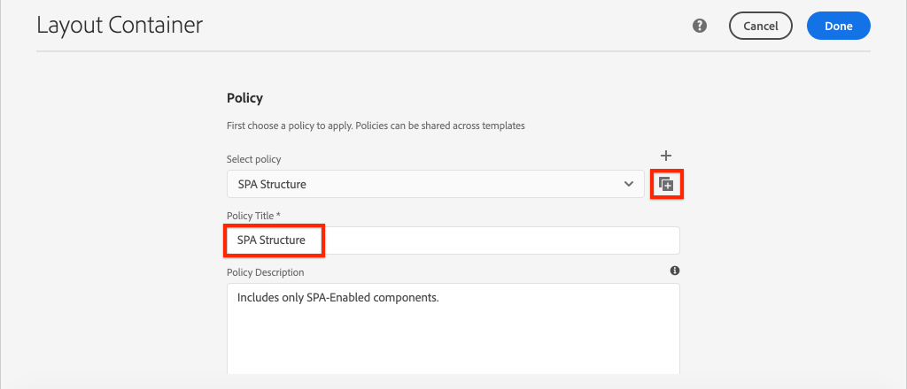
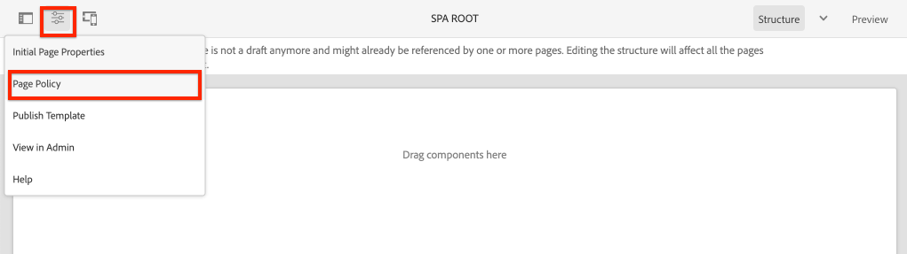

# 添加導航和路由 {#navigation-routing}

了解如何使用AEM頁面和SPA Editor SDK支援SPA中的多個檢視。 動態導覽是使用Angular路由實作，並新增至現有的Header元件。

## 目標

1. 了解使用SPA編輯器時可用的SPA模型路由選項。
2. 了解如何使用 [Angular路由](https://angular.io/guide/router) 來導覽SPA的不同檢視。
3. 實作由AEM頁面階層驅動的動態導覽。

## 您將建置的

本章將導航菜單添加到現有 `Header` 元件。 導覽功能表由AEM頁面階層驅動，且使用 [導覽核心元件](https://experienceleague.adobe.com/docs/experience-manager-core-components/using/components/navigation.html).


## 必備條件

檢閱設定 [本地開發環境](overview.md#local-dev-environment).

### 取得程式碼

1. 透過Git下載本教學課程的起始點：

   ```shell
   $ git clone git@github.com:adobe/aem-guides-wknd-spa.git
   $ cd aem-guides-wknd-spa
   $ git checkout Angular/navigation-routing-start
   ```

2. 使用Maven將程式碼基底部署至本機AEM例項：

   ```shell
   $ mvn clean install -PautoInstallSinglePackage
   ```

   若使用 [AEM 6.x](overview.md#compatibility) 新增 `classic` 設定檔：

   ```shell
   $ mvn clean install -PautoInstallSinglePackage -Pclassic
   ```

3. 安裝傳統 [WKND參考網站](https://github.com/adobe/aem-guides-wknd/releases/latest). 提供的影像 [WKND參考網站](https://github.com/adobe/aem-guides-wknd/releases/latest) 在WKND SPA上重複使用。 可使用 [AEM Package Manager](http://localhost:4502/crx/packmgr/index.jsp).

   

您一律可以在上檢視完成的程式碼 [GitHub](https://github.com/adobe/aem-guides-wknd-spa/tree/Angular/navigation-routing-solution) 或切換到分支，本地檢出代碼 `Angular/navigation-routing-solution`.

## Inspect HeaderComponent更新 {#inspect-header}

在前幾章中， `HeaderComponent` 元件已新增為包含在 `app.component.html`. 在本章中， `HeaderComponent` 元件會從應用程式中移除，並透過 [範本編輯器](https://experienceleague.adobe.com/docs/experience-manager-learn/sites/page-authoring/template-editor-feature-video-use.html). 這可讓使用者設定 `HeaderComponent` 從AEM。

>[!NOTE]
>
> 已對程式碼基底進行數次CSS和JavaScript更新，以啟動本章節。 專注於核心概念，而非 **all** 將討論代碼更改。 您可以檢視完整變更 [此處](https://github.com/adobe/aem-guides-wknd-spa/compare/Angular/map-components-solution...Angular/navigation-routing-start).

1. 在您選擇的IDE中，開啟本章的SPA入門項目。
2. 在 `ui.frontend` 模組檢查檔案 `header.component.ts` at: `ui.frontend/src/app/components/header/header.component.ts`.

   已進行多項更新，包括新增 `HeaderEditConfig` 和 `MapTo` 若要啟用元件對應至AEM元件 `wknd-spa-angular/components/header`.

   ```js
   /* header.component.ts */
   ...
   const HeaderEditConfig = {
       ...
   };
   
   @Component({
   selector: 'app-header',
   templateUrl: './header.component.html',
   styleUrls: ['./header.component.scss']
   })
   export class HeaderComponent implements OnInit {
   @Input() items: object[];
       ...
   }
   ...
   MapTo('wknd-spa-angular/components/header')(withRouter(Header), HeaderEditConfig);
   ```

   請注意 `@Input()` 注釋 `items`. `items` 將包含從AEM傳入的導覽物件陣列。

3. 在 `ui.apps` 模組檢查AEM的元件定義 `Header` 元件： `ui.apps/src/main/content/jcr_root/apps/wknd-spa-angular/components/header/.content.xml`:

   ```xml
   <?xml version="1.0" encoding="UTF-8"?>
   <jcr:root xmlns:sling="http://sling.apache.org/jcr/sling/1.0" xmlns:cq="http://www.day.com/jcr/cq/1.0"
       xmlns:jcr="http://www.jcp.org/jcr/1.0"
       jcr:primaryType="cq:Component"
       jcr:title="Header"
       sling:resourceSuperType="wknd-spa-angular/components/navigation"
       componentGroup="WKND SPA Angular - Structure"/>
   ```

   AEM `Header` 元件將繼承 [導覽核心元件](https://experienceleague.adobe.com/docs/experience-manager-core-components/using/components/navigation.html) 透過 `sling:resourceSuperType` 屬性。

## 將HeaderComponent新增至SPA範本 {#add-header-template}

1. 開啟瀏覽器並登入AEM, [http://localhost:4502/](http://localhost:4502/). 應已部署起始代碼庫。
2. 導覽至 **[!UICONTROL SPA頁面範本]**: [http://localhost:4502/editor.html/conf/wknd-spa-angular/settings/wcm/templates/spa-page-template/structure.html](http://localhost:4502/editor.html/conf/wknd-spa-angular/settings/wcm/templates/spa-page-template/structure.html).
3. 選取最外側 **[!UICONTROL 根佈局容器]** 按一下 **[!UICONTROL 原則]** 表徵圖。 小心 **not** ，選擇 **[!UICONTROL 版面容器]** 取消鎖定以製作。

   

4. 複製當前策略並建立名為的新策略 **[!UICONTROL SPA結構]**:

   

   在 **[!UICONTROL 允許的元件]** > **[!UICONTROL 一般]** >選取 **[!UICONTROL 版面容器]** 元件。

   在 **[!UICONTROL 允許的元件]** > **[!UICONTROL WKND SPAANGULAR — 結構]** >選取 **[!UICONTROL 標題]** 元件：

   

   在 **[!UICONTROL 允許的元件]** > **[!UICONTROL WKND SPAANGULAR — 內容]** >選取 **[!UICONTROL 影像]** 和 **[!UICONTROL 文字]** 元件。 您應選取總計4個元件。

   按一下 **[!UICONTROL 完成]** 以儲存變更。

5. **重新整理** 頁面。 新增 **[!UICONTROL 標題]** 元件上方 **[!UICONTROL 版面容器]**:

   

6. 選取 **[!UICONTROL 標題]** 元件並按一下 **原則** 表徵圖可編輯策略。

   

7. 使用 **[!UICONTROL 策略標題]** of **&quot;WKND SPA Header&quot;**.

   在 **[!UICONTROL 屬性]**:

   * 設定 **[!UICONTROL 導覽根目錄]** to `/content/wknd-spa-angular/us/en`.
   * 設定 **[!UICONTROL 排除根層級]** to **1**.
   * 取消選中 **[!UICONTROL 收集所有子頁]**.
   * 設定 **[!UICONTROL 導覽結構深度]** to **3**.

   

   這會收集下方深處的導覽2層 `/content/wknd-spa-angular/us/en`.

8. 儲存變更後，應會看到填入 `Header` 作為範本的一部分：

   

## 建立子頁面

接下來，在AEM中建立其他頁面，作為SPA中的不同檢視。 我們也會檢查AEM提供的JSON模型的階層結構。

1. 導覽至 **網站** 主控台： [http://localhost:4502/sites.html/content/wknd-spa-angular/us/en/home](http://localhost:4502/sites.html/content/wknd-spa-angular/us/en/home). 選取 **WKND SPAAngular首頁** 按一下 **[!UICONTROL 建立]** > **[!UICONTROL 頁面]**:

   

2. 在 **[!UICONTROL 範本]** 選取 **[!UICONTROL SPA頁面]**. 在 **[!UICONTROL 屬性]** 輸入 **&quot;第1頁&quot;** 針對 **[!UICONTROL 標題]** 和 **&quot;page-1&quot;** 作為名稱。

   

   按一下 **[!UICONTROL 建立]** 在對話方塊快顯視窗中，按一下 **[!UICONTROL 開啟]** 以在AEM SPA編輯器中開啟頁面。

3. 新增 **[!UICONTROL 文字]** 元件至主 **[!UICONTROL 版面容器]**. 編輯元件並輸入文本： **&quot;第1頁&quot;** 使用RTE和 **H1** 元素（您必須進入全螢幕模式才能變更段落元素）

   

   您可以隨意新增其他內容，例如影像。

4. 返回AEM Sites主控台，並重複上述步驟，建立名為 **&quot;第2頁&quot;** 作為 **第1頁**. 將內容新增至 **第2頁** 以便容易識別。
5. 最後建立第三個頁面， **&quot;第3頁&quot;** 但作為 **子項** of **第2頁**. 完成網站階層後，應如下所示：

   

6. 在新索引標籤中，開啟AEM提供的JSON模型API: [http://localhost:4502/content/wknd-spa-angular/us/en.model.json](http://localhost:4502/content/wknd-spa-angular/us/en.model.json). 首次載入SPA時，會要求此JSON內容。 外部結構如下所示：

   ```json
   {
   "language": "en",
   "title": "en",
   "templateName": "spa-app-template",
   "designPath": "/libs/settings/wcm/designs/default",
   "cssClassNames": "spa page basicpage",
   ":type": "wknd-spa-angular/components/spa",
   ":items": {},
   ":itemsOrder": [],
   ":hierarchyType": "page",
   ":path": "/content/wknd-spa-angular/us/en",
   ":children": {
       "/content/wknd-spa-angular/us/en/home": {},
       "/content/wknd-spa-angular/us/en/home/page-1": {},
       "/content/wknd-spa-angular/us/en/home/page-2": {},
       "/content/wknd-spa-angular/us/en/home/page-2/page-3": {}
       }
   }
   ```

   在 `:children` 您應該會看到已建立每個頁面的項目。 所有頁面的內容都位於此初始JSON要求中。 一旦實施導覽路由，便會快速載入SPA的後續檢視，因為內容已可在用戶端使用。

   載入不明智 **全部** 的SPA內容，因為這會減緩初始頁面載入速度。 接下來，讓我們查看頁面階層深度的收集方式。

7. 導覽至 **SPA根** 範本： [http://localhost:4502/editor.html/conf/wknd-spa-angular/settings/wcm/templates/spa-app-template/structure.html](http://localhost:4502/editor.html/conf/wknd-spa-angular/settings/wcm/templates/spa-app-template/structure.html).

   按一下 **[!UICONTROL 頁面屬性功能表]** > **[!UICONTROL 頁面原則]**:

   

8. 此 **SPA根** 範本有額外的 **[!UICONTROL 階層結構]** 標籤來控制收集的JSON內容。 此 **[!UICONTROL 結構深度]** 決定網站階層中收集下方子頁面的深度 **根**. 您也可以使用 **[!UICONTROL 結構模式]** 欄位，根據規則運算式篩選其他頁面。

   更新 **[!UICONTROL 結構深度]** to **&quot;2&quot;**:

   

   按一下 **[!UICONTROL 完成]** 以保存對策略的更改。

9. 重新開啟JSON模型 [http://localhost:4502/content/wknd-spa-angular/us/en.model.json](http://localhost:4502/content/wknd-spa-angular/us/en.model.json).

   ```json
   {
   "language": "en",
   "title": "en",
   "templateName": "spa-app-template",
   "designPath": "/libs/settings/wcm/designs/default",
   "cssClassNames": "spa page basicpage",
   ":type": "wknd-spa-angular/components/spa",
   ":items": {},
   ":itemsOrder": [],
   ":hierarchyType": "page",
   ":path": "/content/wknd-spa-angular/us/en",
   ":children": {
       "/content/wknd-spa-angular/us/en/home": {},
       "/content/wknd-spa-angular/us/en/home/page-1": {},
       "/content/wknd-spa-angular/us/en/home/page-2": {}
       }
   }
   ```

   請注意， **第3頁** 路徑已移除： `/content/wknd-spa-angular/us/en/home/page-2/page-3` 從初始JSON模型。

   稍後，我們將觀察AEM SPA Editor SDK如何動態載入其他內容。

## 實作導覽

接下來，使用新的 `NavigationComponent`. 我們可以直接在 `header.component.html` 但更好的做法是避免出現大的元件。 請改為實作 `NavigationComponent` 可能會在以後重新使用。

1. 檢閱AEM公開的JSON `Header` 元件於 [http://localhost:4502/content/wknd-spa-angular/us/en.model.json](http://localhost:4502/content/wknd-spa-angular/us/en.model.json):

   ```json
   ...
   "header": {
       "items": [
       {
       "level": 0,
       "active": true,
       "path": "/content/wknd-spa-angular/us/en/home",
       "description": null,
       "url": "/content/wknd-spa-angular/us/en/home.html",
       "lastModified": 1589062597083,
       "title": "WKND SPA Angular Home Page",
       "children": [
               {
               "children": [],
               "level": 1,
               "active": false,
               "path": "/content/wknd-spa-angular/us/en/home/page-1",
               "description": null,
               "url": "/content/wknd-spa-angular/us/en/home/page-1.html",
               "lastModified": 1589429385100,
               "title": "Page 1"
               },
               {
               "level": 1,
               "active": true,
               "path": "/content/wknd-spa-angular/us/en/home/page-2",
               "description": null,
               "url": "/content/wknd-spa-angular/us/en/home/page-2.html",
               "lastModified": 1589429603507,
               "title": "Page 2",
               "children": [
                   {
                   "children": [],
                   "level": 2,
                   "active": false,
                   "path": "/content/wknd-spa-angular/us/en/home/page-2/page-3",
                   "description": null,
                   "url": "/content/wknd-spa-angular/us/en/home/page-2/page-3.html",
                   "lastModified": 1589430413831,
                   "title": "Page 3"
                   }
               ],
               }
           ]
           }
       ],
   ":type": "wknd-spa-angular/components/header"
   ```

   AEM頁面的階層性質是以JSON為模型，可用來填入導覽功能表。 回想一下 `Header` 元件會繼承 [導覽核心元件](https://www.aemcomponents.dev/content/core-components-examples/library/core-structure/navigation.html) 而透過JSON公開的內容會自動對應至Angular `@Input` 註解。

2. 開啟新的終端機視窗，並導覽至 `ui.frontend` SPA專案的資料夾。 建立新 `NavigationComponent` 使用AngularCLI工具：

   ```shell
   $ cd ui.frontend
   $ ng generate component components/navigation
   CREATE src/app/components/navigation/navigation.component.scss (0 bytes)
   CREATE src/app/components/navigation/navigation.component.html (25 bytes)
   CREATE src/app/components/navigation/navigation.component.spec.ts (656 bytes)
   CREATE src/app/components/navigation/navigation.component.ts (286 bytes)
   UPDATE src/app/app.module.ts (2032 bytes)
   ```

3. 下一步建立一個名為 `NavigationLink` 在新建立的 `components/navigation` 目錄：

   ```shell
   $ cd src/app/components/navigation/
   $ ng generate class NavigationLink
   CREATE src/app/components/navigation/navigation-link.spec.ts (187 bytes)
   CREATE src/app/components/navigation/navigation-link.ts (32 bytes)
   ```

4. 返回您選擇的IDE，並在以下位置開啟檔案： `navigation-link.ts` at `/src/app/components/navigation/navigation-link.ts`.

   

5. 填入 `navigation-link.ts` 並搭配下列項目：

   ```js
   export class NavigationLink {
   
       title: string;
       path: string;
       url: string;
       level: number;
       children: NavigationLink[];
       active: boolean;
   
       constructor(data) {
           this.path = data.path;
           this.title = data.title;
           this.url = data.url;
           this.level = data.level;
           this.active = data.active;
           this.children = data.children.map( item => {
               return new NavigationLink(item);
           });
       }
   }
   ```

   這是代表個別導覽連結的簡單類別。 在類建構子中，我們期望 `data` 為從AEM傳入的JSON物件。 此類別用於 `NavigationComponent` 和 `HeaderComponent` 來輕鬆填入導覽結構。

   未執行任何資料轉換，此類別主要建立為強烈輸入JSON模型。 請注意 `this.children` 鍵入為 `NavigationLink[]` 而建構子遞歸地建立新 `NavigationLink` 對象 `children` 陣列。 回想一下 `Header` 為階層。

6. 開啟檔案 `navigation-link.spec.ts`. 這是 `NavigationLink` 類別。 請使用下列項目更新：

   ```js
   import { NavigationLink } from './navigation-link';
   
   describe('NavigationLink', () => {
       it('should create an instance', () => {
           const data = {
               children: [],
               level: 1,
               active: false,
               path: '/content/wknd-spa-angular/us/en/home/page-1',
               description: null,
               url: '/content/wknd-spa-angular/us/en/home/page-1.html',
               lastModified: 1589429385100,
               title: 'Page 1'
           };
           expect(new NavigationLink(data)).toBeTruthy();
       });
   });
   ```

   請注意 `const data` 會遵循先前檢查過單一連結的相同JSON模型。 這遠非強健的單元測試，但只應足以測試的建構子 `NavigationLink`.

7. 開啟檔案 `navigation.component.ts`. 請使用下列項目更新：

   ```js
   import { Component, OnInit, Input } from '@angular/core';
   import { NavigationLink } from './navigation-link';
   
   @Component({
   selector: 'app-navigation',
   templateUrl: './navigation.component.html',
   styleUrls: ['./navigation.component.scss']
   })
   export class NavigationComponent implements OnInit {
   
       @Input() items: object[];
   
       constructor() { }
   
       get navigationLinks(): NavigationLink[] {
   
           if (this.items && this.items.length > 0) {
               return this.items.map(item => {
                   return new NavigationLink(item);
               });
           }
   
           return null;
       }
   
       ngOnInit() {}
   
   }
   ```

   `NavigationComponent` 預期 `object[]` 已命名 `items` 即來自AEM的JSON模型。 此類會公開單一方法 `get navigationLinks()` 會傳回陣列 `NavigationLink` 對象。

8. 開啟檔案 `navigation.component.html` 並更新為下列項目：

   ```html
   <ul *ngIf="navigationLinks && navigationLinks.length > 0" class="navigation__group">
       <ng-container *ngTemplateOutlet="recursiveListTmpl; context:{ links: navigationLinks }"></ng-container>
   </ul>
   ```

   這會產生初始值 `<ul>` 並呼叫 `get navigationLinks()` 方法 `navigation.component.ts`. 安 `<ng-container>` 用於呼叫範本，命名為 `recursiveListTmpl` 然後傳遞 `navigationLinks` 作為 `links`.

   新增 `recursiveListTmpl` 下一個：

   ```html
   <ng-template #recursiveListTmpl let-links="links">
       <li *ngFor="let link of links" class="{{'navigation__item navigation__item--' + link.level}}">
           <a [routerLink]="link.url" class="navigation__item-link" [title]="link.title" [attr.aria-current]="link.active">
               {{link.title}}
           </a>
           <ul *ngIf="link.children && link.children.length > 0">
               <ng-container *ngTemplateOutlet="recursiveListTmpl; context:{ links: link.children }"></ng-container>
           </ul>
       </li>
   </ng-template>
   ```

   在此實作導覽連結的其餘轉譯。 請注意，變數 `link` 是類型 `NavigationLink` 和該類建立的所有方法/屬性都可用。 [`[routerLink]`](https://angular.io/api/router/RouterLink) 會使用而非正常 `href` 屬性。 這可讓我們連結至應用程式中的特定路由，而不需重新整理整頁。

   導航的遞歸部分也通過建立另一個來實現 `<ul>` 如果當前 `link` 非空白 `children` 陣列。

9. 更新 `navigation.component.spec.ts` 添加對 `RouterTestingModule`:

   ```diff
    ...
   + import { RouterTestingModule } from '@angular/router/testing';
    ...
    beforeEach(async(() => {
       TestBed.configureTestingModule({
   +   imports: [ RouterTestingModule ],
       declarations: [ NavigationComponent ]
       })
       .compileComponents();
    }));
    ...
   ```

   新增 `RouterTestingModule` 為必要項目，因為元件使用 `[routerLink]`.

10. 更新 `navigation.component.scss` 新增一些基本樣式至 `NavigationComponent`:

   ```scss
   @import "~src/styles/variables";
   
   $link-color: $black;
   $link-hover-color: $white;
   $link-background: $black;
   
   :host-context {
       display: block;
       width: 100%;
   }
   
   .navigation__item {
       list-style: none;
   }
   
   .navigation__item-link {
       color: $link-color;
       font-size: $font-size-large;
       text-transform: uppercase;
       padding: $gutter-padding;
       display: flex;
       border-bottom: 1px solid $gray;
   
       &:hover {
           background: $link-background;
           color: $link-hover-color;
       }
   
   }
   ```

## 更新標題元件

現在， `NavigationComponent` 已實施， `HeaderComponent` 必須更新才能參考。

1. 開啟終端機並導覽至 `ui.frontend` 檔案夾(在SPA專案中)。 啟動 **webpack開發伺服器**:

   ```shell
   $ npm start
   ```

2. 開啟瀏覽器標籤並導覽至 [http://localhost:4200/](http://localhost:4200/).

   此 **webpack開發伺服器** 應已設定為從AEM的本機例項代理JSON模型(`ui.frontend/proxy.conf.json`)。 這可讓我們針對教學課程先前在AEM中建立的內容直接編寫程式碼。

   

   此 `HeaderComponent` 目前已實作功能表切換功能。 接下來，新增導覽元件。

3. 返回您選擇的IDE，並開啟檔案 `header.component.ts` at `ui.frontend/src/app/components/header/header.component.ts`.
4. 更新 `setHomePage()` 方法來移除硬式編碼字串，並使用AEM元件傳入的動態prop:

   ```js
   /* header.component.ts */
   import { NavigationLink } from '../navigation/navigation-link';
   ...
    setHomePage() {
       if (this.hasNavigation) {
           const rootNavigationLink: NavigationLink = new NavigationLink(this.items[0]);
           this.isHome = rootNavigationLink.path === this.route.snapshot.data.path;
           this.homePageUrl = rootNavigationLink.url;
       }
   }
   ...
   ```

   的新例項 `NavigationLink` 根據 `items[0]`，從AEM傳入的導覽JSON模型的根目錄。 `this.route.snapshot.data.path` 返回當前Angular路徑的路徑。 此值用於確定當前路由是否為 **首頁**. `this.homePageUrl` 可用來填入 **標誌**.

5. 開啟 `header.component.html` 並將導覽的靜態預留位置取代為對新建立之 `NavigationComponent`:

   ```diff
       <div class="header-navigation">
           <div class="navigation">
   -            Navigation Placeholder
   +           <app-navigation [items]="items"></app-navigation>
           </div>
       </div>
   ```

   `[items]=items` 屬性傳遞 `@Input() items` 從 `HeaderComponent` 到 `NavigationComponent` 導覽器的建置位置。

6. 開啟 `header.component.spec.ts` 為 `NavigationComponent`:

   ```diff
       /* header.component.spect.ts */
   +   import { NavigationComponent } from '../navigation/navigation.component';
   
       describe('HeaderComponent', () => {
       let component: HeaderComponent;
       let fixture: ComponentFixture<HeaderComponent>;
   
       beforeEach(async(() => {
           TestBed.configureTestingModule({
           imports: [ RouterTestingModule ],
   +       declarations: [ HeaderComponent, NavigationComponent ]
           })
           .compileComponents();
       }));
   ```

   由於 `NavigationComponent` 現在會作為 `HeaderComponent` 它需要作為測試台的一部分進行聲明。

7. 儲存對任何開啟檔案的變更並返回 **webpack開發伺服器**: [http://localhost:4200/](http://localhost:4200/)

   

   按一下功能表切換，開啟導覽，您應該會看到填入的導覽連結。 您應該可以導覽至SPA的不同檢視。

## 了解SPA路由

現在導覽已實作完畢，請檢查AEM中的路由。

1. 在IDE中開啟檔案 `app-routing.module.ts` at `ui.frontend/src/app`.

   ```js
   /* app-routing.module.ts */
   import { AemPageDataResolver, AemPageRouteReuseStrategy } from '@adobe/cq-angular-editable-components';
   import { NgModule } from '@angular/core';
   import { RouteReuseStrategy, RouterModule, Routes, UrlMatchResult, UrlSegment } from '@angular/router';
   import { PageComponent } from './components/page/page.component';
   
   export function AemPageMatcher(url: UrlSegment[]): UrlMatchResult {
       if (url.length) {
           return {
               consumed: url,
               posParams: {
                   path: url[url.length - 1]
               }
           };
       }
   }
   
   const routes: Routes = [
       {
           matcher: AemPageMatcher,
           component: PageComponent,
           resolve: {
               path: AemPageDataResolver
           }
       }
   ];
   @NgModule({
       imports: [RouterModule.forRoot(routes)],
       exports: [RouterModule],
       providers: [
           AemPageDataResolver,
           {
           provide: RouteReuseStrategy,
           useClass: AemPageRouteReuseStrategy
           }
       ]
   })
   export class AppRoutingModule {}
   ```

   此 `routes: Routes = [];` array定義到Angular元件映射的路由或導航路徑。

   `AemPageMatcher` 是自定義Angular路由器 [Url符合](https://angular.io/api/router/UrlMatcher)，即會符合AEM中屬於此Angular應用程式一部分之「看起來」的任何項目。

   `PageComponent` 是Angular元件，在AEM中代表頁面，用於呈現相符的路由。 此 `PageComponent` 將在稍後的教學課程中檢閱。

   `AemPageDataResolver`，由AEM SPA Editor JS SDK提供，為自訂 [Angular路由器解析器](https://angular.io/api/router/Resolve) 用於將路由URL(AEM中的路徑，包括.html副檔名)轉換為AEM中的資源路徑（即頁面路徑減去副檔名）。

   例如， `AemPageDataResolver` 轉換路由的URL `content/wknd-spa-angular/us/en/home.html` 進入 `/content/wknd-spa-angular/us/en/home`. 這可用來根據JSON模型API中的路徑解析頁面內容。

   `AemPageRouteReuseStrategy`，由AEM SPA Editor JS SDK提供，為自訂 [RouteReuseStrategy](https://angular.io/api/router/RouteReuseStrategy) 防止了 `PageComponent` 跨路線。 否則，導覽至頁面「B」時，頁面「A」的內容可能會顯示。

2. 開啟檔案 `page.component.ts` at `ui.frontend/src/app/components/page/`.

   ```js
   ...
   export class PageComponent {
       items;
       itemsOrder;
       path;
   
       constructor(
           private route: ActivatedRoute,
           private modelManagerService: ModelManagerService
       ) {
           this.modelManagerService
           .getData({ path: this.route.snapshot.data.path })
           .then(data => {
               this.path = data[Constants.PATH_PROP];
               this.items = data[Constants.ITEMS_PROP];
               this.itemsOrder = data[Constants.ITEMS_ORDER_PROP];
           });
       }
   }
   ```

   此 `PageComponent` 需要，才能處理從AEM擷取的JSON，且會作為Angular元件來轉譯路由。

   `ActivatedRoute`，此元件由Angular路由器模組提供，其中包含的狀態指出應將哪個AEM頁面的JSON內容載入到此Angular頁面元件例項中。

   `ModelManagerService`，根據路由取得JSON資料，並將資料對應至類別變數 `path`, `items`, `itemsOrder`. 這些資訊會傳遞至 [AEMPageComponent](https://www.npmjs.com/package/@adobe/cq-angular-editable-components#aempagecomponent.md)

3. 開啟檔案 `page.component.html` at `ui.frontend/src/app/components/page/`

   ```html
   <aem-page 
       class="structure-page" 
       [attr.data-cq-page-path]="path" 
       [cqPath]="path" 
       [cqItems]="items" 
       [cqItemsOrder]="itemsOrder">
   </aem-page>
   ```

   `aem-page` 包括 [AEMPageComponent](https://www.npmjs.com/package/@adobe/cq-angular-editable-components#aempagecomponent.md). 變數 `path`, `items`，和 `itemsOrder` 會傳遞至 `AEMPageComponent`. 此 `AemPageComponent`，可透過SPA編輯器JavaScript SDK提供，接著會迭代運算這些資料，並根據如 [地圖元件教學課程](./map-components.md).

   此 `PageComponent` 只是代理 `AEMPageComponent` 就是 `AEMPageComponent` 這樣會執行大部分的費力工作，將JSON模型正確對應至Angular元件。

## Inspect AEM中的SPA路由

1. 開啟終端並停止 **webpack開發伺服器** 中。 導覽至專案的根目錄，並使用您的Maven技能將專案部署至AEM:

   ```shell
   $ cd aem-guides-wknd-spa
   $ mvn clean install -PautoInstallSinglePackage
   ```

   >[!CAUTION]
   >
   > angular專案已啟用一些非常嚴格的連結規則。 如果Maven組建失敗，請檢查錯誤並尋找 **在列出的檔案中找到Lint錯誤。**. 修正Linter發現的任何問題，並重新執行Maven命令。

2. 導覽至AEM中的SPA首頁： [http://localhost:4502/content/wknd-spa-angular/us/en/home.html](http://localhost:4502/content/wknd-spa-angular/us/en/home.html) 並開啟瀏覽器的開發人員工具。 以下螢幕擷取畫面是從Google Chrome瀏覽器擷取。

   重新整理頁面後，您應該會看到 `/content/wknd-spa-angular/us/en.model.json`，即SPA根。 請注意，根據先前在教學課程中對SPA根範本進行的階層深度設定，僅包含三個子頁面。 這不包括 **第3頁**.

   

3. 開啟開發人員工具後，導覽至 **第3頁**:

   

   請注意，系統已對下列項目提出新的XHR請求： `/content/wknd-spa-angular/us/en/home/page-2/page-3.model.json`

   

   AEM模型管理員了解 **第3頁** JSON內容無法使用，並自動觸發其他XHR要求。

4. 使用各種導覽連結繼續導覽SPA。 請注意，系統未提出其他XHR請求，且未發生完整頁面重新整理。 這可讓使用者快速取得SPA，並減少傳回AEM的不必要請求。

   

5. 直接導覽至： [http://localhost:4502/content/wknd-spa-angular/us/en/home/page-2.html](http://localhost:4502/content/wknd-spa-angular/us/en/home/page-2.html). 請注意，瀏覽器的返回按鈕可繼續運作。

## 恭喜！ {#congratulations}

恭喜您，您已了解如何使用SPA Editor SDK對應至AEM頁面，以支援SPA中的多個檢視。 動態導覽已使用Angular路由實作，並新增至 `Header` 元件。

您一律可以在上檢視完成的程式碼 [GitHub](https://github.com/adobe/aem-guides-wknd-spa/tree/Angular/navigation-routing-solution) 或切換到分支，本地檢出代碼 `Angular/navigation-routing-solution`.

### 後續步驟 {#next-steps}

[建立自訂元件](custom-component.md)  — 了解如何建立要與AEM SPA編輯器搭配使用的自訂元件。 了解如何開發製作對話方塊和Sling模型，以擴充JSON模型以填入自訂元件。
