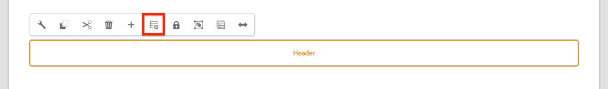

# 添加導航和路由 {#navigation-routing}

瞭解如何使用「頁面」SPA和「編輯器AEM SDK」支SPA持中的多個視圖。 使用Angular路由實現動態導航，並將其添加到現有的Header元件。

## 目標

1. 瞭解使SPA用編輯器時可用的模型路SPA由選項。
2. 學習使用 [Angular路由](https://angular.io/guide/router) 在不同視圖之間導SPA航。
3. 實現由頁面層次結構驅動的AEM動態導航。

## 您將構建的

本章將導航菜單添加到現有 `Header` 元件。 導航菜單由頁面層次AEM結構驅動，並使用 [導航核心元件](https://experienceleague.adobe.com/docs/experience-manager-core-components/using/components/navigation.html)。


## 必備條件

查看所需的工具和設定 [地方開發環境](overview.md#local-dev-environment)。

### 獲取代碼

1. 通過Git下載本教程的起點：

   ```shell
   $ git clone git@github.com:adobe/aem-guides-wknd-spa.git
   $ cd aem-guides-wknd-spa
   $ git checkout Angular/navigation-routing-start
   ```

2. 使用Maven將代碼庫部署到AEM本地實例：

   ```shell
   $ mvn clean install -PautoInstallSinglePackage
   ```

   如果使用 [AEM 6.x](overview.md#compatibility) 添加 `classic` 配置檔案：

   ```shell
   $ mvn clean install -PautoInstallSinglePackage -Pclassic
   ```

3. 為傳統 [WKND參考站點](https://github.com/adobe/aem-guides-wknd/releases/latest)。 提供的影像 [WKND參考站點](https://github.com/adobe/aem-guides-wknd/releases/latest) 在WKND上重新使SPA用。 可以使用 [包管AEM理器](http://localhost:4502/crx/packmgr/index.jsp)。

   

您始終可以在 [GitHub](https://github.com/adobe/aem-guides-wknd-spa/tree/Angular/navigation-routing-solution) 或通過切換到分支本地檢出代碼 `Angular/navigation-routing-solution`。

## InspectHeaderComponent更新 {#inspect-header}

在前幾章中， `HeaderComponent` 元件被添加為純Angular元件， `app.component.html`。 在本章中， `HeaderComponent` 元件從應用中刪除，並通過 [模板編輯器](https://experienceleague.adobe.com/docs/experience-manager-learn/sites/page-authoring/template-editor-feature-video-use.html)。 這允許用戶配置 `HeaderComponent` 從內AEM部。

>[!NOTE]
>
> 已對代碼庫進行了多次CSS和JavaScript更新以啟動本章。 關注核心概念，而不是 **全部** 討論了代碼更改。 您可以查看全部更改 [這裡](https://github.com/adobe/aem-guides-wknd-spa/compare/Angular/map-components-solution...Angular/navigation-routing-start)。

1. 在您選擇的IDE中，開啟本章SPA的啟動程式項目。
2. 在 `ui.frontend` 模組檢查檔案 `header.component.ts` 地址： `ui.frontend/src/app/components/header/header.component.ts`。

   已作了若干更新，包括增加了 `HeaderEditConfig` 和 `MapTo` 允許元件映射到組AEM件 `wknd-spa-angular/components/header`。

   ```js
   /* header.component.ts */
   ...
   const HeaderEditConfig = {
       ...
   };
   
   @Component({
   selector: 'app-header',
   templateUrl: './header.component.html',
   styleUrls: ['./header.component.scss']
   })
   export class HeaderComponent implements OnInit {
   @Input() items: object[];
       ...
   }
   ...
   MapTo('wknd-spa-angular/components/header')(withRouter(Header), HeaderEditConfig);
   ```

   注意 `@Input()` 注釋 `items`。 `items` 將包含傳入的導航對象數AEM組。

3. 在 `ui.apps` 模組檢查元件定義AEM `Header` 元件： `ui.apps/src/main/content/jcr_root/apps/wknd-spa-angular/components/header/.content.xml`:

   ```xml
   <?xml version="1.0" encoding="UTF-8"?>
   <jcr:root xmlns:sling="http://sling.apache.org/jcr/sling/1.0" xmlns:cq="http://www.day.com/jcr/cq/1.0"
       xmlns:jcr="http://www.jcp.org/jcr/1.0"
       jcr:primaryType="cq:Component"
       jcr:title="Header"
       sling:resourceSuperType="wknd-spa-angular/components/navigation"
       componentGroup="WKND SPA Angular - Structure"/>
   ```

   AEM `Header` 元件將繼承 [導航核心元件](https://experienceleague.adobe.com/docs/experience-manager-core-components/using/components/navigation.html) 通過 `sling:resourceSuperType` 屬性。

## 將HeaderComponent添加到模SPA板 {#add-header-template}

1. 開啟瀏覽器並登錄AEM, [http://localhost:4502/](http://localhost:4502/)。 應已部署啟動代碼庫。
2. 導航到 **[!UICONTROL 頁SPA面模板]**: [http://localhost:4502/editor.html/conf/wknd-spa-angular/settings/wcm/templates/spa-page-template/structure.html](http://localhost:4502/editor.html/conf/wknd-spa-angular/settings/wcm/templates/spa-page-template/structure.html)。
3. 選擇最外層 **[!UICONTROL 根佈局容器]** 點擊 **[!UICONTROL 策略]** 表徵圖 小心 **不** 的 **[!UICONTROL 佈局容器]** 未鎖定以創作。

   

4. 複製當前策略並建立名為 **[!UICONTROL 結SPA構]**:

   

   下 **[!UICONTROL 允許的元件]** > **[!UICONTROL 常規]** >選擇 **[!UICONTROL 佈局容器]** 元件。

   下 **[!UICONTROL 允許的元件]** > **[!UICONTROL WKNDSPAANGULAR — 結構]** >選擇 **[!UICONTROL 標題]** 元件：

   

   下 **[!UICONTROL 允許的元件]** > **[!UICONTROL WKND SPAANGULAR — 內容]** >選擇 **[!UICONTROL 影像]** 和 **[!UICONTROL 文本]** 元件。 您應選擇4個總元件。

   按一下「**[!UICONTROL 完成]**」以儲存變更。

5. **刷新** 頁。 添加 **[!UICONTROL 標題]** 未鎖定的元件上方 **[!UICONTROL 佈局容器]**:

   

6. 選擇 **[!UICONTROL 標題]** 元件，按一下 **策略** 表徵圖以編輯策略。

   

7. 使用 **[!UICONTROL 策略標題]** 共 **&quot;WKND頭SPA&quot;**。

   在 **[!UICONTROL 屬性]**:

   * 設定 **[!UICONTROL 導航根]** 至 `/content/wknd-spa-angular/us/en`。
   * 設定 **[!UICONTROL 排除根級別]** 至 **1**。
   * 取消選中 **[!UICONTROL 收集所有子頁]**。
   * 設定 **[!UICONTROL 導航結構深度]** 至 **3**。

   

   這將收集深處的導航2層 `/content/wknd-spa-angular/us/en`。

8. 保存更改後，您應看到已填充的 `Header` 作為模板的一部分：

   

## 建立子頁

接下來，在中創AEM建將作為中不同視圖的附SPA加頁。 我們還將檢查提供的JSON模型的層次結構AEM。

1. 導航到 **站點** 控制台： [http://localhost:4502/sites.html/content/wknd-spa-angular/us/en/home](http://localhost:4502/sites.html/content/wknd-spa-angular/us/en/home)。 選擇 **WKND SPAAngular首頁** 按一下 **[!UICONTROL 建立]** > **[!UICONTROL 頁面]**:

   

2. 下 **[!UICONTROL 模板]** 選擇 **[!UICONTROL 頁SPA面]**。 下 **[!UICONTROL 屬性]** 輸入 **&quot;第1頁&quot;** 為 **[!UICONTROL 標題]** 和 **&quot;第1頁&quot;** 的下界。

   

   按一下 **[!UICONTROL 建立]** 並在對話框彈出窗口中按一下 **[!UICONTROL 開啟]** 開啟AEM頁SPA面。

3. 添加新 **[!UICONTROL 文本]** 主元件 **[!UICONTROL 佈局容器]**。 編輯元件並輸入文本： **&quot;第1頁&quot;** 使用RTE和 **H1** 元素（必須進入全屏模式才能更改段落元素）

   

   可以隨意添加其他內容，如影像。

4. 返回到AEM Sites控制台並重複上述步驟，建立名為 **&quot;第2頁&quot;** 作為 **第1頁**。 將內容添加到 **第2頁** 這樣它就很容易被識別。
5. 最後建立第三頁， **&quot;第3頁&quot;** 但作為 **孩子** 共 **第2頁**。 完成後，站點層次結構應如下所示：

   

6. 在新頁籤中，開啟以下提供的JSON模型APIAEM: [http://localhost:4502/content/wknd-spa-angular/us/en.model.json](http://localhost:4502/content/wknd-spa-angular/us/en.model.json)。 首次載入時請求SPA此JSON內容。 外部結構如下所示：

   ```json
   {
   "language": "en",
   "title": "en",
   "templateName": "spa-app-template",
   "designPath": "/libs/settings/wcm/designs/default",
   "cssClassNames": "spa page basicpage",
   ":type": "wknd-spa-angular/components/spa",
   ":items": {},
   ":itemsOrder": [],
   ":hierarchyType": "page",
   ":path": "/content/wknd-spa-angular/us/en",
   ":children": {
       "/content/wknd-spa-angular/us/en/home": {},
       "/content/wknd-spa-angular/us/en/home/page-1": {},
       "/content/wknd-spa-angular/us/en/home/page-2": {},
       "/content/wknd-spa-angular/us/en/home/page-2/page-3": {}
       }
   }
   ```

   下 `:children` 您應看到建立的每個頁面的條目。 所有頁的內容都在此初始JSON請求中。 一旦實現了導航路由，則快速加SPA載該內容的後續視圖，因為該內容已經可用於客戶端。

   裝載不明智 **全部** 初始JSON請SPA求中的內容，因為這會降低初始頁載入速度。 接下來，讓我們看看如何收集頁面的分層深度。

7. 導航到 **根SPA** 模板： [http://localhost:4502/editor.html/conf/wknd-spa-angular/settings/wcm/templates/spa-app-template/structure.html](http://localhost:4502/editor.html/conf/wknd-spa-angular/settings/wcm/templates/spa-app-template/structure.html)。

   按一下 **[!UICONTROL 頁面屬性菜單]** > **[!UICONTROL 頁面策略]**:

   

8. 的 **根SPA** 模板有額外的 **[!UICONTROL 層次結構]** 頁籤，以控制收集的JSON內容。 的 **[!UICONTROL 結構深度]** 確定在站點層次結構中收集子頁的深度 **根**。 您還可以使用 **[!UICONTROL 結構模式]** 欄位，用於根據規則運算式篩選其他頁。

   更新 **[!UICONTROL 結構深度]** 至 **&quot;2&quot;**:

   

   按一下 **[!UICONTROL 完成]** 的子菜單。

9. 重新開啟JSON模型 [http://localhost:4502/content/wknd-spa-angular/us/en.model.json](http://localhost:4502/content/wknd-spa-angular/us/en.model.json)。

   ```json
   {
   "language": "en",
   "title": "en",
   "templateName": "spa-app-template",
   "designPath": "/libs/settings/wcm/designs/default",
   "cssClassNames": "spa page basicpage",
   ":type": "wknd-spa-angular/components/spa",
   ":items": {},
   ":itemsOrder": [],
   ":hierarchyType": "page",
   ":path": "/content/wknd-spa-angular/us/en",
   ":children": {
       "/content/wknd-spa-angular/us/en/home": {},
       "/content/wknd-spa-angular/us/en/home/page-1": {},
       "/content/wknd-spa-angular/us/en/home/page-2": {}
       }
   }
   ```

   請注意 **第3頁** 路徑已刪除： `/content/wknd-spa-angular/us/en/home/page-2/page-3` 從初始JSON模型。

   稍後，我們將觀AEM察Editor SPA SDK如何動態載入其他內容。

## 實施導航

接下來，使用新的 `NavigationComponent`。 我們可以直接將代碼添加到 `header.component.html` 但更好的做法是避免大型部件。 相反，實施 `NavigationComponent` 可能在以後被重新使用。

1. 查看由 `Header` 元件 [http://localhost:4502/content/wknd-spa-angular/us/en.model.json](http://localhost:4502/content/wknd-spa-angular/us/en.model.json):

   ```json
   ...
   "header": {
       "items": [
       {
       "level": 0,
       "active": true,
       "path": "/content/wknd-spa-angular/us/en/home",
       "description": null,
       "url": "/content/wknd-spa-angular/us/en/home.html",
       "lastModified": 1589062597083,
       "title": "WKND SPA Angular Home Page",
       "children": [
               {
               "children": [],
               "level": 1,
               "active": false,
               "path": "/content/wknd-spa-angular/us/en/home/page-1",
               "description": null,
               "url": "/content/wknd-spa-angular/us/en/home/page-1.html",
               "lastModified": 1589429385100,
               "title": "Page 1"
               },
               {
               "level": 1,
               "active": true,
               "path": "/content/wknd-spa-angular/us/en/home/page-2",
               "description": null,
               "url": "/content/wknd-spa-angular/us/en/home/page-2.html",
               "lastModified": 1589429603507,
               "title": "Page 2",
               "children": [
                   {
                   "children": [],
                   "level": 2,
                   "active": false,
                   "path": "/content/wknd-spa-angular/us/en/home/page-2/page-3",
                   "description": null,
                   "url": "/content/wknd-spa-angular/us/en/home/page-2/page-3.html",
                   "lastModified": 1589430413831,
                   "title": "Page 3"
                   }
               ],
               }
           ]
           }
       ],
   ":type": "wknd-spa-angular/components/header"
   ```

   頁面的分層性AEM質在JSON中建模，可用於填充導航菜單。 記住 `Header` 元件繼承了 [導航核心元件](https://www.aemcomponents.dev/content/core-components-examples/library/core-structure/navigation.html) 而通過JSON公開的內容將自動映射到Angular `@Input` 注釋。

2. 開啟新的終端窗口並導航到 `ui.frontend` 資料夾SPA。 新建 `NavigationComponent` 使用AngularCLI工具：

   ```shell
   $ cd ui.frontend
   $ ng generate component components/navigation
   CREATE src/app/components/navigation/navigation.component.scss (0 bytes)
   CREATE src/app/components/navigation/navigation.component.html (25 bytes)
   CREATE src/app/components/navigation/navigation.component.spec.ts (656 bytes)
   CREATE src/app/components/navigation/navigation.component.ts (286 bytes)
   UPDATE src/app/app.module.ts (2032 bytes)
   ```

3. 然後建立名為 `NavigationLink` 使用AngularCLI `components/navigation` 目錄：

   ```shell
   $ cd src/app/components/navigation/
   $ ng generate class NavigationLink
   CREATE src/app/components/navigation/navigation-link.spec.ts (187 bytes)
   CREATE src/app/components/navigation/navigation-link.ts (32 bytes)
   ```

4. 返回到您選擇的IDE，並在 `navigation-link.ts` 在 `/src/app/components/navigation/navigation-link.ts`。

   

5. 填充 `navigation-link.ts` 下面列出：

   ```js
   export class NavigationLink {
   
       title: string;
       path: string;
       url: string;
       level: number;
       children: NavigationLink[];
       active: boolean;
   
       constructor(data) {
           this.path = data.path;
           this.title = data.title;
           this.url = data.url;
           this.level = data.level;
           this.active = data.active;
           this.children = data.children.map( item => {
               return new NavigationLink(item);
           });
       }
   }
   ```

   這是一個簡單的類，用於表示單個導航連結。 在類建構子中，我們期望 `data` 為傳入的JSON對象AEM。 此類用於 `NavigationComponent` 和 `HeaderComponent` 來輕鬆填充導航結構。

   未執行資料轉換，此類主要建立為強類型JSON模型。 注意 `this.children` 鍵入為 `NavigationLink[]` 建構子遞歸地建立新 `NavigationLink` 對象 `children` 陣列。 重新調用JSON模型 `Header` 是分層結構。

6. 開啟檔案 `navigation-link.spec.ts`。 這是test檔案 `NavigationLink` 類。 使用以下命令更新它：

   ```js
   import { NavigationLink } from './navigation-link';
   
   describe('NavigationLink', () => {
       it('should create an instance', () => {
           const data = {
               children: [],
               level: 1,
               active: false,
               path: '/content/wknd-spa-angular/us/en/home/page-1',
               description: null,
               url: '/content/wknd-spa-angular/us/en/home/page-1.html',
               lastModified: 1589429385100,
               title: 'Page 1'
           };
           expect(new NavigationLink(data)).toBeTruthy();
       });
   });
   ```

   注意 `const data` 遵循先前為單個連結檢查的相同JSON模型。 這遠非強健的單位test，但應該足以test的建構子 `NavigationLink`。

7. 開啟檔案 `navigation.component.ts`。 使用以下命令更新它：

   ```js
   import { Component, OnInit, Input } from '@angular/core';
   import { NavigationLink } from './navigation-link';
   
   @Component({
   selector: 'app-navigation',
   templateUrl: './navigation.component.html',
   styleUrls: ['./navigation.component.scss']
   })
   export class NavigationComponent implements OnInit {
   
       @Input() items: object[];
   
       constructor() { }
   
       get navigationLinks(): NavigationLink[] {
   
           if (this.items && this.items.length > 0) {
               return this.items.map(item => {
                   return new NavigationLink(item);
               });
           }
   
           return null;
       }
   
       ngOnInit() {}
   
   }
   ```

   `NavigationComponent` 預計 `object[]` 命名 `items` 即JSON模AEM型。 此類顯示單個方法 `get navigationLinks()` 返回 `NavigationLink` 對象。

8. 開啟檔案 `navigation.component.html` 並更新為：

   ```html
   <ul *ngIf="navigationLinks && navigationLinks.length > 0" class="navigation__group">
       <ng-container *ngTemplateOutlet="recursiveListTmpl; context:{ links: navigationLinks }"></ng-container>
   </ul>
   ```

   這將生成初始 `<ul>` 然後 `get navigationLinks()` 方法 `navigation.component.ts`。 安 `<ng-container>` 用於調用名為 `recursiveListTmpl` 然後傳過去 `navigationLinks` 作為名為 `links`。

   添加 `recursiveListTmpl` 下一個：

   ```html
   <ng-template #recursiveListTmpl let-links="links">
       <li *ngFor="let link of links" class="{{'navigation__item navigation__item--' + link.level}}">
           <a [routerLink]="link.url" class="navigation__item-link" [title]="link.title" [attr.aria-current]="link.active">
               {{link.title}}
           </a>
           <ul *ngIf="link.children && link.children.length > 0">
               <ng-container *ngTemplateOutlet="recursiveListTmpl; context:{ links: link.children }"></ng-container>
           </ul>
       </li>
   </ng-template>
   ```

   這裡實現了導航連結的其餘渲染。 請注意，變數 `link` 類型 `NavigationLink` 並且該類建立的所有方法/屬性都可用。 [`[routerLink]`](https://angular.io/api/router/RouterLink) 使用，而不是正常 `href` 屬性。 這允許我們連結到應用中的特定路由，而無需進行全頁刷新。

   導航的遞歸部分也通過建立另一個來實現 `<ul>` 當前 `link` 具有非空 `children` 陣列。

9. 更新 `navigation.component.spec.ts` 添加支援 `RouterTestingModule`:

   ```diff
    ...
   + import { RouterTestingModule } from '@angular/router/testing';
    ...
    beforeEach(async(() => {
       TestBed.configureTestingModule({
   +   imports: [ RouterTestingModule ],
       declarations: [ NavigationComponent ]
       })
       .compileComponents();
    }));
    ...
   ```

   添加 `RouterTestingModule` 是必需的，因為元件使用 `[routerLink]`。

10. 更新 `navigation.component.scss` 添加一些基本樣式 `NavigationComponent`:

   ```scss
   @import "~src/styles/variables";
   
   $link-color: $black;
   $link-hover-color: $white;
   $link-background: $black;
   
   :host-context {
       display: block;
       width: 100%;
   }
   
   .navigation__item {
       list-style: none;
   }
   
   .navigation__item-link {
       color: $link-color;
       font-size: $font-size-large;
       text-transform: uppercase;
       padding: $gutter-padding;
       display: flex;
       border-bottom: 1px solid $gray;
   
       &:hover {
           background: $link-background;
           color: $link-hover-color;
       }
   
   }
   ```

## 更新標題元件

現在 `NavigationComponent` 已實施， `HeaderComponent` 必須更新以引用它。

1. 開啟終端並導航至 `ui.frontend` 檔案SPA夾。 啟動 **WebPack Dev伺服器**:

   ```shell
   $ npm start
   ```

2. 開啟瀏覽器頁籤並導航到 [http://localhost:4200/](http://localhost:4200/)。

   的 **WebPack Dev伺服器** 應配置為從的本地實例代理JSON模AEM型(`ui.frontend/proxy.conf.json`)。 這將允許我們直接針對本教程前面部分建立AEM的內容進行代碼。

   

   的 `HeaderComponent` 當前已實現菜單切換功能。 接下來，添加導航元件。

3. 返回到您選擇的IDE，然後開啟檔案 `header.component.ts` 在 `ui.frontend/src/app/components/header/header.component.ts`。
4. 更新 `setHomePage()` 用於刪除硬編碼字串並使用元件傳入的動態道AEM理的方法：

   ```js
   /* header.component.ts */
   import { NavigationLink } from '../navigation/navigation-link';
   ...
    setHomePage() {
       if (this.hasNavigation) {
           const rootNavigationLink: NavigationLink = new NavigationLink(this.items[0]);
           this.isHome = rootNavigationLink.path === this.route.snapshot.data.path;
           this.homePageUrl = rootNavigationLink.url;
       }
   }
   ...
   ```

   新實例 `NavigationLink` 基於 `items[0]`，從傳入的導航JSON模型的根AEM。 `this.route.snapshot.data.path` 返回當前Angular路由的路徑。 此值用於確定當前路由是否為 **首頁**。 `this.homePageUrl` 用於填充 **標誌**。

5. 開啟 `header.component.html` 並將導航的靜態佔位符替換為對新建立的 `NavigationComponent`:

   ```diff
       <div class="header-navigation">
           <div class="navigation">
   -            Navigation Placeholder
   +           <app-navigation [items]="items"></app-navigation>
           </div>
       </div>
   ```

   `[items]=items` 屬性傳遞 `@Input() items` 從 `HeaderComponent` 到 `NavigationComponent` 在那裡建造導航系統。

6. 開啟 `header.component.spec.ts` 並為 `NavigationComponent`:

   ```diff
       /* header.component.spect.ts */
   +   import { NavigationComponent } from '../navigation/navigation.component';
   
       describe('HeaderComponent', () => {
       let component: HeaderComponent;
       let fixture: ComponentFixture<HeaderComponent>;
   
       beforeEach(async(() => {
           TestBed.configureTestingModule({
           imports: [ RouterTestingModule ],
   +       declarations: [ HeaderComponent, NavigationComponent ]
           })
           .compileComponents();
       }));
   ```

   自 `NavigationComponent` 現在用作 `HeaderComponent` 它需要被宣佈為test床的一部分。

7. 保存對任何開啟的檔案所做的更改並返回到 **WebPack Dev伺服器**: [http://localhost:4200/](http://localhost:4200/)

   

   按一下菜單切換開啟導航，您應看到已填充的導航連結。 您應該能夠導航到不同的視圖SPA。

## 瞭解路SPA由

現在已實現導航，請檢查中的路AEM由。

1. 在IDE中開啟檔案 `app-routing.module.ts` 在 `ui.frontend/src/app`。

   ```js
   /* app-routing.module.ts */
   import { AemPageDataResolver, AemPageRouteReuseStrategy } from '@adobe/cq-angular-editable-components';
   import { NgModule } from '@angular/core';
   import { RouteReuseStrategy, RouterModule, Routes, UrlMatchResult, UrlSegment } from '@angular/router';
   import { PageComponent } from './components/page/page.component';
   
   export function AemPageMatcher(url: UrlSegment[]): UrlMatchResult {
       if (url.length) {
           return {
               consumed: url,
               posParams: {
                   path: url[url.length - 1]
               }
           };
       }
   }
   
   const routes: Routes = [
       {
           matcher: AemPageMatcher,
           component: PageComponent,
           resolve: {
               path: AemPageDataResolver
           }
       }
   ];
   @NgModule({
       imports: [RouterModule.forRoot(routes)],
       exports: [RouterModule],
       providers: [
           AemPageDataResolver,
           {
           provide: RouteReuseStrategy,
           useClass: AemPageRouteReuseStrategy
           }
       ]
   })
   export class AppRoutingModule {}
   ```

   的 `routes: Routes = [];` array定義到Angular元件映射的路由或導航路徑。

   `AemPageMatcher` 是自定義Angular路由器 [URL匹配器](https://angular.io/api/router/UrlMatcher)，它與屬於此Angular應用程式的一AEM個頁面中的任何「外觀」匹配。

   `PageComponent` 是Angular元件，它表示中的頁AEM面，用於呈現匹配的路由。 的 `PageComponent` 將在本教程的後面部分進行審閱。

   `AemPageDataResolver`，由編AEM輯SPA器JS SDK提供，是自定義 [Angular路由器解析程式](https://angular.io/api/router/Resolve) 用於將路由URL(包括AEM.html副檔名的路徑)轉換為中的資源路徑(即頁面路徑AEM減去副檔名後的路徑)。

   例如， `AemPageDataResolver` 轉換路由的URL `content/wknd-spa-angular/us/en/home.html` 進入一條 `/content/wknd-spa-angular/us/en/home`。 這用於根據JSON模型API中的路徑解析頁的內容。

   `AemPageRouteReuseStrategy`，由編AEM輯SPA器JS SDK提供，是自定義 [路由重用策略](https://angular.io/api/router/RouteReuseStrategy) 防止了 `PageComponent` 路由。 否則，在導航到「B」頁時，頁面「A」中的內容可能會顯示。

2. 開啟檔案 `page.component.ts` 在 `ui.frontend/src/app/components/page/`。

   ```js
   ...
   export class PageComponent {
       items;
       itemsOrder;
       path;
   
       constructor(
           private route: ActivatedRoute,
           private modelManagerService: ModelManagerService
       ) {
           this.modelManagerService
           .getData({ path: this.route.snapshot.data.path })
           .then(data => {
               this.path = data[Constants.PATH_PROP];
               this.items = data[Constants.ITEMS_PROP];
               this.itemsOrder = data[Constants.ITEMS_ORDER_PROP];
           });
       }
   }
   ```

   的 `PageComponent` 處理從中檢索到的JSONAEM，並用作呈現路由的Angular元件。

   `ActivatedRoute`，由Angular路由器模組提供，包含指示應將AEM哪個頁的JSON內容載入到此Angular頁元件實例的狀態。

   `ModelManagerService`，根據路由獲取JSON資料並將資料映射到類變數 `path`。 `items`。 `itemsOrder`。 然後，這些檔案將傳送到 [AEMPageComponent](https://www.npmjs.com/package/@adobe/cq-angular-editable-components#aempagecomponent.md)

3. 開啟檔案 `page.component.html` 在 `ui.frontend/src/app/components/page/`

   ```html
   <aem-page 
       class="structure-page" 
       [attr.data-cq-page-path]="path" 
       [cqPath]="path" 
       [cqItems]="items" 
       [cqItemsOrder]="itemsOrder">
   </aem-page>
   ```

   `aem-page` 包括 [AEMPageComponent](https://www.npmjs.com/package/@adobe/cq-angular-editable-components#aempagecomponent.md)。 變數 `path`。 `items`, `itemsOrder` 被傳到 `AEMPageComponent`。 的 `AemPageComponent`，通過編SPA輯器提供的JavaScript SDK將對此資料進行迭代，並根據JSON資料動態實例化Angular元件，如 [映射元件教程](./map-components.md)。

   的 `PageComponent` 只是一個代理人 `AEMPageComponent` 而是 `AEMPageComponent` 這將執行大部分繁重的操作，以正確將JSON模型映射到Angular元件。

## InspectSPA路AEM線

1. 開啟終端並停止 **WebPack Dev伺服器** 的子菜單。 導航到項目的根，然後部署項目以使用AEMMaven技能：

   ```shell
   $ cd aem-guides-wknd-spa
   $ mvn clean install -PautoInstallSinglePackage
   ```

   >[!CAUTION]
   >
   > angular項目啟用了一些非常嚴格的連結規則。 如果Maven生成失敗，請檢查錯誤並查找 **在列出的檔案中發現閃爍錯誤。**。修復連結器發現的所有問題，並重新運行Maven命令。

2. 導航至SPA首頁AEM: [http://localhost:4502/content/wknd-spa-angular/us/en/home.html](http://localhost:4502/content/wknd-spa-angular/us/en/home.html) 並開啟瀏覽器的開發人員工具。 下面的螢幕截圖是從GoogleChrome瀏覽器捕獲的。

   刷新頁面，您應看到XHR請求 `/content/wknd-spa-angular/us/en.model.json`，即根SPA。 請注意，根據本教程前面所做的「根」模板的層次深度配置，SPA只包括三個子頁。 這不包括 **第3頁**。

   

3. 開啟開發人員工具後，導航到 **第3頁**:

   

   請注意，新的XHR請求是： `/content/wknd-spa-angular/us/en/home/page-2/page-3.model.json`

   

   模AEM型經理明白 **第3頁** JSON內容不可用，並自動觸發附加XHR請求。

4. 繼續使SPA用各種導航連結導航。 請注意沒有發出其他XHR請求，並且沒有發生完整頁刷新。 這樣，最SPA終用戶就可以快速訪問，並將不必要的請AEM求減少。

   

5. 通過直接導航到： [http://localhost:4502/content/wknd-spa-angular/us/en/home/page-2.html](http://localhost:4502/content/wknd-spa-angular/us/en/home/page-2.html)。 請注意瀏覽器的後退按鈕繼續工作。

## 恭喜！ {#congratulations}

祝賀您，您已經瞭解了通過SPAEditor SDK映射到頁面可以支AEM持中的多SPA個視圖。 已使用Angular路由實現動態導航，並添加到 `Header` 元件。

您始終可以在 [GitHub](https://github.com/adobe/aem-guides-wknd-spa/tree/Angular/navigation-routing-solution) 或通過切換到分支本地檢出代碼 `Angular/navigation-routing-solution`。

### 後續步驟 {#next-steps}

[建立自定義元件](custom-component.md)  — 瞭解如何建立要與編輯器一起使用的自AEM定義SPA元件。 瞭解如何開發作者對話框和Sling模型以擴展JSON模型以填充自定義元件。
