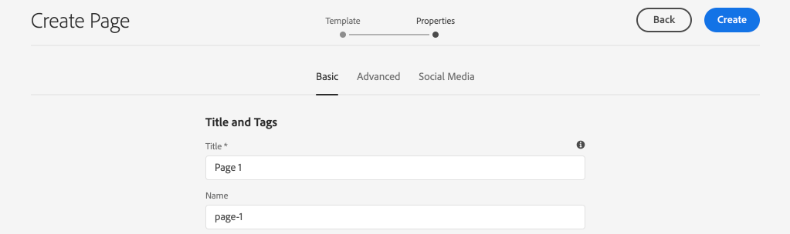

# 新增導覽和路由 {#navigation-routing}

{{spa-editor-deprecation}}

瞭解如何使用AEM頁面和SPA Editor SDK支援SPA中的多個檢視。 動態導覽是使用Angular路由實作，並新增到現有的頁首元件。

## 目標

1. 瞭解使用SPA編輯器時可用的SPA模型路由選項。
2. 瞭解如何使用[Angular路由](https://angular.io/guide/router)在SPA的不同檢視之間導覽。
3. 實作由AEM頁面階層驅動的動態導覽。

## 您將建置的內容

本章將導覽功能表新增至現有的`Header`元件。 導覽功能表是由AEM頁面階層所驅動，並使用[導覽核心元件](https://experienceleague.adobe.com/docs/experience-manager-core-components/using/components/navigation.html)提供的JSON模型。


## 先決條件

檢閱設定[本機開發環境](overview.md#local-dev-environment)所需的工具和指示。

### 取得程式碼

1. 透過Git下載本教學課程的起點：

   ```shell
   $ git clone git@github.com:adobe/aem-guides-wknd-spa.git
   $ cd aem-guides-wknd-spa
   $ git checkout Angular/navigation-routing-start
   ```

2. 使用Maven將程式碼庫部署到本機AEM執行個體：

   ```shell
   $ mvn clean install -PautoInstallSinglePackage
   ```

   如果使用[AEM 6.x](overview.md#compatibility)，請新增`classic`設定檔：

   ```shell
   $ mvn clean install -PautoInstallSinglePackage -Pclassic
   ```

3. 安裝傳統[WKND參考站台](https://github.com/adobe/aem-guides-wknd/releases/latest)的完成套件。 由[WKND參考網站](https://github.com/adobe/aem-guides-wknd/releases/latest)提供的影像會在WKND SPA上重複使用。 可以使用[AEM的封裝管理員](http://localhost:4502/crx/packmgr/index.jsp)來安裝封裝。

   

您一律可以在[GitHub](https://github.com/adobe/aem-guides-wknd-spa/tree/Angular/navigation-routing-solution)上檢視完成的程式碼，或切換至分支`Angular/navigation-routing-solution`在本機取出程式碼。

## 檢查HeaderComponent更新 {#inspect-header}

在先前的章節中，`HeaderComponent`元件已新增為透過`app.component.html`包含的純Angular元件。 在本章中，`HeaderComponent`元件已從應用程式移除，並透過[範本編輯器](https://experienceleague.adobe.com/docs/experience-manager-learn/sites/page-authoring/template-editor-feature-video-use.html)新增。 這可讓使用者從AEM中設定`HeaderComponent`的導覽功能表。

>[!NOTE]
>
> 程式碼庫已進行數個CSS和JavaScript更新，以便開始本章的編寫。 為了專注於核心概念，不會討論&#x200B;**所有**&#x200B;的程式碼變更。 您可以在[這裡](https://github.com/adobe/aem-guides-wknd-spa/compare/Angular/map-components-solution...Angular/navigation-routing-start)檢視完整變更。

1. 在您選擇的IDE中，開啟本章的SPA入門專案。
2. 在`ui.frontend`模組下方，於`ui.frontend/src/app/components/header/header.component.ts`檢查檔案`header.component.ts`。

   已進行數個更新，包括新增`HeaderEditConfig`及`MapTo`，以便讓元件對應至AEM元件`wknd-spa-angular/components/header`。

   ```js
   /* header.component.ts */
   ...
   const HeaderEditConfig = {
       ...
   };
   
   @Component({
   selector: 'app-header',
   templateUrl: './header.component.html',
   styleUrls: ['./header.component.scss']
   })
   export class HeaderComponent implements OnInit {
   @Input() items: object[];
       ...
   }
   ...
   MapTo('wknd-spa-angular/components/header')(withRouter(Header), HeaderEditConfig);
   ```

   記下`items`的`@Input()`註解。 `items`將包含從AEM傳入的導覽物件陣列。

3. 在`ui.apps`模組中檢查AEM `Header`元件的元件定義： `ui.apps/src/main/content/jcr_root/apps/wknd-spa-angular/components/header/.content.xml`：

   ```xml
   <?xml version="1.0" encoding="UTF-8"?>
   <jcr:root xmlns:sling="http://sling.apache.org/jcr/sling/1.0" xmlns:cq="http://www.day.com/jcr/cq/1.0"
       xmlns:jcr="http://www.jcp.org/jcr/1.0"
       jcr:primaryType="cq:Component"
       jcr:title="Header"
       sling:resourceSuperType="wknd-spa-angular/components/navigation"
       componentGroup="WKND SPA Angular - Structure"/>
   ```

   AEM `Header`元件將透過`sling:resourceSuperType`屬性繼承[導覽核心元件](https://experienceleague.adobe.com/docs/experience-manager-core-components/using/components/navigation.html)的所有功能。

## 將HeaderComponent新增至SPA範本 {#add-header-template}

1. 開啟瀏覽器並登入AEM，[http://localhost:4502/](http://localhost:4502/)。 起始程式碼基底應該已經部署。
2. 導覽至&#x200B;**[!UICONTROL SPA頁面範本]**： [http://localhost:4502/editor.html/conf/wknd-spa-angular/settings/wcm/templates/spa-page-template/structure.html](http://localhost:4502/editor.html/conf/wknd-spa-angular/settings/wcm/templates/spa-page-template/structure.html)。
3. 選取最外層的&#x200B;**[!UICONTROL 根配置容器]**，然後按一下它的&#x200B;**[!UICONTROL 原則]**&#x200B;圖示。 請注意，**not**&#x200B;選取&#x200B;**[!UICONTROL 配置容器]**&#x200B;已解除製作鎖定。

   

4. 複製目前的原則並建立名為&#x200B;**[!UICONTROL SPA結構]**&#x200B;的新原則：

   

   在&#x200B;**[!UICONTROL 允許的元件]** > **[!UICONTROL 一般]** >下，選取&#x200B;**[!UICONTROL 配置容器]**&#x200B;元件。

   在&#x200B;**[!UICONTROL 允許的元件]** > **[!UICONTROL WKND SPA ANGULAR — 結構]** >選取&#x200B;**[!UICONTROL 標題]**&#x200B;元件下：

   

   在&#x200B;**[!UICONTROL 允許的元件]** > **[!UICONTROL WKND SPA ANGULAR - Content]** >選取&#x200B;**[!UICONTROL 影像]**&#x200B;和&#x200B;**[!UICONTROL 文字]**&#x200B;元件。 您總共應選取4個元件。

   按一下「**[!UICONTROL 完成]**」以儲存變更。

5. **重新整理**&#x200B;頁面。 在解除鎖定的&#x200B;**[!UICONTROL 配置容器]**&#x200B;上方新增&#x200B;**[!UICONTROL Header]**&#x200B;元件：

   

6. 選取&#x200B;**[!UICONTROL Header]**&#x200B;元件，然後按一下其&#x200B;**原則**&#x200B;圖示以編輯原則。

   

7. 使用&#x200B;**&quot;WKND SPA標頭&quot;**&#x200B;的&#x200B;**[!UICONTROL 原則標題]**&#x200B;建立新原則。

   在&#x200B;**[!UICONTROL 屬性]**&#x200B;下：

   * 將&#x200B;**[!UICONTROL 導覽根目錄]**&#x200B;設定為`/content/wknd-spa-angular/us/en`。
   * 將&#x200B;**[!UICONTROL 排除根層級]**&#x200B;設定為&#x200B;**1**。
   * 取消勾選&#x200B;**[!UICONTROL 收集所有子頁面]**。
   * 將&#x200B;**[!UICONTROL 導覽結構深度]**&#x200B;設定為&#x200B;**3**。

   

   這會收集位於`/content/wknd-spa-angular/us/en`下方的導覽2層級。

8. 儲存變更後，您應該會看到填入的`Header`成為範本的一部分：

   

## 建立子頁面

接下來，在AEM中建立其他頁面，這些頁面將用作SPA中的不同檢視。 我們也會檢查AEM所提供JSON模型的階層結構。

1. 導覽至&#x200B;**網站**&#x200B;主控台： [http://localhost:4502/sites.html/content/wknd-spa-angular/us/en/home](http://localhost:4502/sites.html/content/wknd-spa-angular/us/en/home)。 選取&#x200B;**WKND SPA Angular首頁**，然後按一下&#x200B;**[!UICONTROL 建立]** > **[!UICONTROL 頁面]**：

   

2. 在&#x200B;**[!UICONTROL 範本]**&#x200B;下，選取&#x200B;**[!UICONTROL SPA頁面]**。 在「**[!UICONTROL 屬性]**」下，輸入&#x200B;**[!UICONTROL Title]**&#x200B;的&#x200B;**&quot;Page 1&quot;**&#x200B;和&#x200B;**&quot;page-1&quot;**&#x200B;作為名稱。

   

   按一下「**[!UICONTROL 建立]**」，然後在對話方塊快顯視窗中按一下「**[!UICONTROL 開啟]**」，在AEM SPA編輯器中開啟頁面。

3. 將新的&#x200B;**[!UICONTROL Text]**&#x200B;元件新增至主要&#x200B;**[!UICONTROL 配置容器]**。 編輯元件並輸入文字： **「Page 1」** （使用RTE和&#x200B;**H1**&#x200B;元素） （您必須進入全熒幕模式才能變更段落元素）

   

   您可以隨意新增其他內容，例如影像。

4. 返回AEM Sites主控台並重複上述步驟，建立名為&#x200B;**「第2頁」**&#x200B;的第二個頁面作為&#x200B;**第1**&#x200B;頁的同層級。 將內容新增至&#x200B;**第2**&#x200B;頁，以便輕鬆識別。
5. 最後建立第三個頁面，**「第3頁」**，但做為&#x200B;**第2**&#x200B;頁的&#x200B;**子項**。 完成後，網站階層應如下所示：

   

6. 在新標籤中，開啟AEM提供的JSON模型API： [http://localhost:4502/content/wknd-spa-angular/us/en.model.json](http://localhost:4502/content/wknd-spa-angular/us/en.model.json)。 SPA首次載入時會請求此JSON內容。 外部結構如下所示：

   ```json
   {
   "language": "en",
   "title": "en",
   "templateName": "spa-app-template",
   "designPath": "/libs/settings/wcm/designs/default",
   "cssClassNames": "spa page basicpage",
   ":type": "wknd-spa-angular/components/spa",
   ":items": {},
   ":itemsOrder": [],
   ":hierarchyType": "page",
   ":path": "/content/wknd-spa-angular/us/en",
   ":children": {
       "/content/wknd-spa-angular/us/en/home": {},
       "/content/wknd-spa-angular/us/en/home/page-1": {},
       "/content/wknd-spa-angular/us/en/home/page-2": {},
       "/content/wknd-spa-angular/us/en/home/page-2/page-3": {}
       }
   }
   ```

   在`:children`底下，您應該會看到每個已建立頁面的專案。 所有頁面的內容都在此初始JSON請求中。 一旦導覽路由實作後，SPA的後續檢視就會快速載入，因為內容在使用者端已可供使用。

   在初始JSON要求中載入SPA的&#x200B;**所有**&#x200B;內容是不明智的，因為這會減慢初始頁面載入的速度。 接下來，讓我們看看如何收集頁面的階層式深度。

7. 導覽至&#x200B;**SPA Root**&#x200B;範本，位於： [http://localhost:4502/editor.html/conf/wknd-spa-angular/settings/wcm/templates/spa-app-template/structure.html](http://localhost:4502/editor.html/conf/wknd-spa-angular/settings/wcm/templates/spa-app-template/structure.html)。

   按一下&#x200B;**[!UICONTROL 頁面屬性功能表]** > **[!UICONTROL 頁面原則]**：

   

8. **SPA Root**&#x200B;範本有一個額外的&#x200B;**[!UICONTROL 階層結構]**&#x200B;標籤，可控制所收集的JSON內容。 **[!UICONTROL 結構深度]**&#x200B;決定網站階層中要多深才能收集&#x200B;**root**&#x200B;下的子頁面。 您也可以使用&#x200B;**[!UICONTROL 結構模式]**&#x200B;欄位，根據規則運算式篩選出其他頁面。

   將&#x200B;**[!UICONTROL 結構深度]**&#x200B;更新為&#x200B;**&quot;2&quot;**：

   

   按一下&#x200B;**[!UICONTROL 完成]**&#x200B;儲存原則的變更。

9. 重新開啟JSON模型[http://localhost:4502/content/wknd-spa-angular/us/en.model.json](http://localhost:4502/content/wknd-spa-angular/us/en.model.json)。

   ```json
   {
   "language": "en",
   "title": "en",
   "templateName": "spa-app-template",
   "designPath": "/libs/settings/wcm/designs/default",
   "cssClassNames": "spa page basicpage",
   ":type": "wknd-spa-angular/components/spa",
   ":items": {},
   ":itemsOrder": [],
   ":hierarchyType": "page",
   ":path": "/content/wknd-spa-angular/us/en",
   ":children": {
       "/content/wknd-spa-angular/us/en/home": {},
       "/content/wknd-spa-angular/us/en/home/page-1": {},
       "/content/wknd-spa-angular/us/en/home/page-2": {}
       }
   }
   ```

   請注意，**頁面3**&#x200B;路徑已從初始JSON模型中移除： `/content/wknd-spa-angular/us/en/home/page-2/page-3`。

   稍後，我們將觀察AEM SPA Editor SDK如何以動態方式載入其他內容。

## 實作導覽

接下來，使用新的`NavigationComponent`實作導覽功能表。 我們可以直接在`header.component.html`中新增程式碼，但更好的做法是避免大型元件。 請改為實作稍後可能重複使用的`NavigationComponent`。

1. 檢閱AEM `Header`元件在[http://localhost:4502/content/wknd-spa-angular/us/en.model.json](http://localhost:4502/content/wknd-spa-angular/us/en.model.json)公開的JSON：

   ```json
   ...
   "header": {
       "items": [
       {
       "level": 0,
       "active": true,
       "path": "/content/wknd-spa-angular/us/en/home",
       "description": null,
       "url": "/content/wknd-spa-angular/us/en/home.html",
       "lastModified": 1589062597083,
       "title": "WKND SPA Angular Home Page",
       "children": [
               {
               "children": [],
               "level": 1,
               "active": false,
               "path": "/content/wknd-spa-angular/us/en/home/page-1",
               "description": null,
               "url": "/content/wknd-spa-angular/us/en/home/page-1.html",
               "lastModified": 1589429385100,
               "title": "Page 1"
               },
               {
               "level": 1,
               "active": true,
               "path": "/content/wknd-spa-angular/us/en/home/page-2",
               "description": null,
               "url": "/content/wknd-spa-angular/us/en/home/page-2.html",
               "lastModified": 1589429603507,
               "title": "Page 2",
               "children": [
                   {
                   "children": [],
                   "level": 2,
                   "active": false,
                   "path": "/content/wknd-spa-angular/us/en/home/page-2/page-3",
                   "description": null,
                   "url": "/content/wknd-spa-angular/us/en/home/page-2/page-3.html",
                   "lastModified": 1589430413831,
                   "title": "Page 3"
                   }
               ],
               }
           ]
           }
       ],
   ":type": "wknd-spa-angular/components/header"
   ```

   AEM頁面的階層特性使用JSON建模，可用來填入導覽功能表。 請記得`Header`元件繼承了[導覽核心元件](https://www.aemcomponents.dev/content/core-components-examples/library/core-structure/navigation.html)的所有功能，而且透過JSON公開的內容會自動對應至Angular `@Input`註解。

2. 開啟新的終端機視窗，並導覽至SPA專案的`ui.frontend`資料夾。 使用Angular CLI工具建立新的`NavigationComponent`：

   ```shell
   $ cd ui.frontend
   $ ng generate component components/navigation
   CREATE src/app/components/navigation/navigation.component.scss (0 bytes)
   CREATE src/app/components/navigation/navigation.component.html (25 bytes)
   CREATE src/app/components/navigation/navigation.component.spec.ts (656 bytes)
   CREATE src/app/components/navigation/navigation.component.ts (286 bytes)
   UPDATE src/app/app.module.ts (2032 bytes)
   ```

3. 接下來，在新建立的`components/navigation`目錄中，使用Angular CLI建立名為`NavigationLink`的類別：

   ```shell
   $ cd src/app/components/navigation/
   $ ng generate class NavigationLink
   CREATE src/app/components/navigation/navigation-link.spec.ts (187 bytes)
   CREATE src/app/components/navigation/navigation-link.ts (32 bytes)
   ```

4. 返回您選擇的IDE並在`/src/app/components/navigation/navigation-link.ts`的`navigation-link.ts`開啟檔案。

   

5. 以下列專案填入`navigation-link.ts`：

   ```js
   export class NavigationLink {
   
       title: string;
       path: string;
       url: string;
       level: number;
       children: NavigationLink[];
       active: boolean;
   
       constructor(data) {
           this.path = data.path;
           this.title = data.title;
           this.url = data.url;
           this.level = data.level;
           this.active = data.active;
           this.children = data.children.map( item => {
               return new NavigationLink(item);
           });
       }
   }
   ```

   這是代表個別導覽連結的簡單類別。 在類別建構函式中，我們預期`data`是從AEM傳入的JSON物件。 此類別同時在`NavigationComponent`和`HeaderComponent`中使用，以輕鬆填入導覽結構。

   不會執行資料轉換，此類別主要是建立以強式輸入JSON模型。 請注意，`this.children`是型別為`NavigationLink[]`，而且建構函式會遞回建立`children`陣列中每個專案的新`NavigationLink`物件。 記住`Header`的JSON模型為階層式。

6. 開啟檔案`navigation-link.spec.ts`。 這是`NavigationLink`類別的測試檔案。 以下列專案更新它：

   ```js
   import { NavigationLink } from './navigation-link';
   
   describe('NavigationLink', () => {
       it('should create an instance', () => {
           const data = {
               children: [],
               level: 1,
               active: false,
               path: '/content/wknd-spa-angular/us/en/home/page-1',
               description: null,
               url: '/content/wknd-spa-angular/us/en/home/page-1.html',
               lastModified: 1589429385100,
               title: 'Page 1'
           };
           expect(new NavigationLink(data)).toBeTruthy();
       });
   });
   ```

   請注意，`const data`會依照先前針對單一連結所檢查的相同JSON模型。 這遠非強大的單位測試，但應該足以測試`NavigationLink`的建構函式。

7. 開啟檔案`navigation.component.ts`。 以下列專案更新它：

   ```js
   import { Component, OnInit, Input } from '@angular/core';
   import { NavigationLink } from './navigation-link';
   
   @Component({
   selector: 'app-navigation',
   templateUrl: './navigation.component.html',
   styleUrls: ['./navigation.component.scss']
   })
   export class NavigationComponent implements OnInit {
   
       @Input() items: object[];
   
       constructor() { }
   
       get navigationLinks(): NavigationLink[] {
   
           if (this.items && this.items.length > 0) {
               return this.items.map(item => {
                   return new NavigationLink(item);
               });
           }
   
           return null;
       }
   
       ngOnInit() {}
   
   }
   ```

   `NavigationComponent`需要一個名為`items`的`object[]`，它是AEM的JSON模型。 此類別公開單一方法`get navigationLinks()`，它傳回`NavigationLink`物件的陣列。

8. 開啟檔案`navigation.component.html`，並以下列專案更新它：

   ```html
   <ul *ngIf="navigationLinks && navigationLinks.length > 0" class="navigation__group">
       <ng-container *ngTemplateOutlet="recursiveListTmpl; context:{ links: navigationLinks }"></ng-container>
   </ul>
   ```

   這會產生初始`<ul>`，並從`navigation.component.ts`呼叫`get navigationLinks()`方法。 `<ng-container>`用來呼叫名為`recursiveListTmpl`的範本，並將`navigationLinks`傳遞為名為`links`的變數。

   接著新增`recursiveListTmpl`：

   ```html
   <ng-template #recursiveListTmpl let-links="links">
       <li *ngFor="let link of links" class="{{'navigation__item navigation__item--' + link.level}}">
           <a [routerLink]="link.url" class="navigation__item-link" [title]="link.title" [attr.aria-current]="link.active">
               {{link.title}}
           </a>
           <ul *ngIf="link.children && link.children.length > 0">
               <ng-container *ngTemplateOutlet="recursiveListTmpl; context:{ links: link.children }"></ng-container>
           </ul>
       </li>
   </ng-template>
   ```

   接著會實作導覽連結的其餘轉譯。 請注意，變數`link`的型別為`NavigationLink`，且此類別建立的所有方法/屬性都可供使用。 已使用[`[routerLink]`](https://angular.io/api/router/RouterLink)，而非一般的`href`屬性。 這可讓我們連結至應用程式中的特定路由，不需要重新整理整頁。

   如果目前的`link`具有非空白的`children`陣列，則導覽的遞回部分也會透過建立另一個`<ul>`來實作。

9. 更新`navigation.component.spec.ts`以新增`RouterTestingModule`的支援：

   ```diff
    ...
   + import { RouterTestingModule } from '@angular/router/testing';
    ...
    beforeEach(async(() => {
       TestBed.configureTestingModule({
   +   imports: [ RouterTestingModule ],
       declarations: [ NavigationComponent ]
       })
       .compileComponents();
    }));
    ...
   ```

   需要新增`RouterTestingModule`，因為元件使用`[routerLink]`。

10. 更新`navigation.component.scss`以新增一些基本樣式至`NavigationComponent`：

   ```scss
   @import "~src/styles/variables";
   
   $link-color: $black;
   $link-hover-color: $white;
   $link-background: $black;
   
   :host-context {
       display: block;
       width: 100%;
   }
   
   .navigation__item {
       list-style: none;
   }
   
   .navigation__item-link {
       color: $link-color;
       font-size: $font-size-large;
       text-transform: uppercase;
       padding: $gutter-padding;
       display: flex;
       border-bottom: 1px solid $gray;
   
       &:hover {
           background: $link-background;
           color: $link-hover-color;
       }
   
   }
   ```

## 更新標題元件

現在`NavigationComponent`已實作，必須更新`HeaderComponent`以參考它。

1. 開啟終端機，並導覽至SPA專案中的`ui.frontend`資料夾。 啟動&#x200B;**webpack開發伺服器**：

   ```shell
   $ npm start
   ```

2. 開啟瀏覽器索引標籤並導覽至[http://localhost:4200/](http://localhost:4200/)。

   **webpack開發伺服器**&#x200B;應該設定為從AEM (`ui.frontend/proxy.conf.json`)的本機執行個體代理JSON模型。 這可讓我們直接針對教學課程中先前在AEM中建立的內容進行編碼。

   

   `HeaderComponent`目前已經實作功能表切換功能。 接著，新增導覽元件。

3. 返回您選擇的IDE，並在`ui.frontend/src/app/components/header/header.component.ts`開啟檔案`header.component.ts`。
4. 更新`setHomePage()`方法以移除硬式編碼字串並使用AEM元件傳入的動態prop：

   ```js
   /* header.component.ts */
   import { NavigationLink } from '../navigation/navigation-link';
   ...
    setHomePage() {
       if (this.hasNavigation) {
           const rootNavigationLink: NavigationLink = new NavigationLink(this.items[0]);
           this.isHome = rootNavigationLink.path === this.route.snapshot.data.path;
           this.homePageUrl = rootNavigationLink.url;
       }
   }
   ...
   ```

   `NavigationLink`的新執行個體是根據`items[0]`建立的，這是從AEM傳入的導覽JSON模型的根目錄。 `this.route.snapshot.data.path`會傳回目前Angular路由的路徑。 此值用於判斷目前的路由是否為&#x200B;**首頁**。 `this.homePageUrl`是用來填入&#x200B;**標誌**&#x200B;上的錨點連結。

5. 開啟`header.component.html`並將導覽的靜態預留位置取代為新建立的`NavigationComponent`的參考：

   ```diff
       <div class="header-navigation">
           <div class="navigation">
   -            Navigation Placeholder
   +           <app-navigation [items]="items"></app-navigation>
           </div>
       </div>
   ```

   `[items]=items`屬性會將`@Input() items`從`HeaderComponent`傳遞至`NavigationComponent`，以建立導覽。

6. 開啟`header.component.spec.ts`並為`NavigationComponent`新增宣告：

   ```diff
       /* header.component.spect.ts */
   +   import { NavigationComponent } from '../navigation/navigation.component';
   
       describe('HeaderComponent', () => {
       let component: HeaderComponent;
       let fixture: ComponentFixture<HeaderComponent>;
   
       beforeEach(async(() => {
           TestBed.configureTestingModule({
           imports: [ RouterTestingModule ],
   +       declarations: [ HeaderComponent, NavigationComponent ]
           })
           .compileComponents();
       }));
   ```

   由於`NavigationComponent`現在已用作`HeaderComponent`的一部分，因此需要將其宣告為測試平台的一部分。

7. 儲存任何開啟檔案的變更並返回&#x200B;**webpack開發伺服器**： [http://localhost:4200/](http://localhost:4200/)

   

   按一下功能表切換即可開啟導覽，且您應會看到已填入的導覽連結。 您應該能夠導覽至SPA的不同檢視。

## 瞭解SPA路由

現在導覽已實施，請在AEM中檢查路由。

1. 在IDE中，在`ui.frontend/src/app`開啟檔案`app-routing.module.ts`。

   ```js
   /* app-routing.module.ts */
   import { AemPageDataResolver, AemPageRouteReuseStrategy } from '@adobe/cq-angular-editable-components';
   import { NgModule } from '@angular/core';
   import { RouteReuseStrategy, RouterModule, Routes, UrlMatchResult, UrlSegment } from '@angular/router';
   import { PageComponent } from './components/page/page.component';
   
   export function AemPageMatcher(url: UrlSegment[]): UrlMatchResult {
       if (url.length) {
           return {
               consumed: url,
               posParams: {
                   path: url[url.length - 1]
               }
           };
       }
   }
   
   const routes: Routes = [
       {
           matcher: AemPageMatcher,
           component: PageComponent,
           resolve: {
               path: AemPageDataResolver
           }
       }
   ];
   @NgModule({
       imports: [RouterModule.forRoot(routes)],
       exports: [RouterModule],
       providers: [
           AemPageDataResolver,
           {
           provide: RouteReuseStrategy,
           useClass: AemPageRouteReuseStrategy
           }
       ]
   })
   export class AppRoutingModule {}
   ```

   `routes: Routes = [];`陣列定義Angular元件對應的路由或導覽路徑。

   `AemPageMatcher`是自訂Angular路由器[UrlMatcher](https://angular.io/api/router/UrlMatcher)，符合此Angular應用程式中AEM任何「看起來」頁面的內容。

   `PageComponent`是Angular元件，代表AEM中的頁面，用來呈現相符的路由。 在稍後的教學課程中會檢閱`PageComponent`。

   `AemPageDataResolver`由AEM SPA Editor JS SDK提供，是自訂[Angular路由器解析器](https://angular.io/api/router/Resolve)，用來將路由URL (AEM中包含.html副檔名的路徑)轉換為AEM中的資源路徑（不含副檔名的頁面路徑）。

   例如，`AemPageDataResolver`會將路由的URL `content/wknd-spa-angular/us/en/home.html`轉換為`/content/wknd-spa-angular/us/en/home`的路徑。 用於根據JSON模型API中的路徑解析頁面內容。

   由AEM SPA Editor JS SDK提供的`AemPageRouteReuseStrategy`是自訂[RouteReuseStrategy](https://angular.io/api/router/RouteReuseStrategy)，可防止跨路由重複使用`PageComponent`。 否則，頁面「A」中的內容可能會在導覽至頁面「B」時顯示。

2. 在`ui.frontend/src/app/components/page/`開啟檔案`page.component.ts`。

   ```js
   ...
   export class PageComponent {
       items;
       itemsOrder;
       path;
   
       constructor(
           private route: ActivatedRoute,
           private modelManagerService: ModelManagerService
       ) {
           this.modelManagerService
           .getData({ path: this.route.snapshot.data.path })
           .then(data => {
               this.path = data[Constants.PATH_PROP];
               this.items = data[Constants.ITEMS_PROP];
               this.itemsOrder = data[Constants.ITEMS_ORDER_PROP];
           });
       }
   }
   ```

   `PageComponent`是處理從AEM擷取的JSON所必需，並當作Angular元件來轉譯路由。

   由Angular路由器模組提供的`ActivatedRoute`包含指出哪個AEM頁面的JSON內容應載入此Angular頁面元件執行個體的狀態。

   `ModelManagerService`，根據路由取得JSON資料，並將資料對應到類別變數`path`、`items`、`itemsOrder`。 然後這些資料將傳遞至[AEMPageComponent](https://www.npmjs.com/package/@adobe/cq-angular-editable-components#aempagecomponent.md)

3. 在`ui.frontend/src/app/components/page/`開啟檔案`page.component.html`

   ```html
   <aem-page 
       class="structure-page" 
       [attr.data-cq-page-path]="path" 
       [cqPath]="path" 
       [cqItems]="items" 
       [cqItemsOrder]="itemsOrder">
   </aem-page>
   ```

   `aem-page`包含[AEMPageComponent](https://www.npmjs.com/package/@adobe/cq-angular-editable-components#aempagecomponent.md)。 變數`path`、`items`和`itemsOrder`已傳遞至`AEMPageComponent`。 透過SPA Editor JavaScript SDK提供的`AemPageComponent`將接著反複處理此資料，並根據[Map Components教學課程](./map-components.md)中看到的JSON資料動態例項化Angular元件。

   `PageComponent`實際上只是`AEMPageComponent`的Proxy，而且是`AEMPageComponent`完成大部分繁重工作，以正確將JSON模型對應至Angular元件。

## 在AEM中檢查SPA路由

1. 開啟終端機，並停止&#x200B;**webpack開發伺服器** （如果啟動）。 導覽至專案的根目錄，並使用您的Maven技能將專案部署到AEM：

   ```shell
   $ cd aem-guides-wknd-spa
   $ mvn clean install -PautoInstallSinglePackage
   ```

   >[!CAUTION]
   >
   > Angular專案已啟用一些非常嚴格的Linting規則。 如果Maven組建失敗，請檢查錯誤，並尋找在列出的檔案中找到&#x200B;**個Lint錯誤。**。修正篩選器發現的任何問題，並重新執行Maven命令。

2. 導覽至AEM中的SPA首頁： [http://localhost:4502/content/wknd-spa-angular/us/en/home.html](http://localhost:4502/content/wknd-spa-angular/us/en/home.html)，然後開啟瀏覽器的開發人員工具。 熒幕擷取畫面如下：Google Chrome瀏覽器。

   重新整理頁面，您應該會看到`/content/wknd-spa-angular/us/en.model.json`的XHR要求（即SPA根目錄）。 請注意，根據教學課程中先前進行之SPA根範本的階層深度設定，僅包含三個子頁面。 這不包括&#x200B;**第3**&#x200B;頁。

   

3. 開啟開發人員工具後，瀏覽至&#x200B;**第3**&#x200B;頁：

   

   請注意，已向`/content/wknd-spa-angular/us/en/home/page-2/page-3.model.json`提出新的XHR要求

   

   AEM模型管理員瞭解&#x200B;**頁面3** JSON內容無法使用，並自動觸發其他XHR請求。

4. 繼續使用各種導覽連結導覽SPA。 請注意，不會提出其他XHR要求，也不會發生完整頁面重新整理。 這可讓一般使用者快速使用SPA，並減少傳回AEM的不必要請求。

   

5. 透過直接導覽至[http://localhost:4502/content/wknd-spa-angular/us/en/home/page-2.html](http://localhost:4502/content/wknd-spa-angular/us/en/home/page-2.html)來嘗試深層連結。 請注意，瀏覽器的返回按鈕仍會繼續運作。

## 恭喜！ {#congratulations}

恭喜，您已瞭解如何使用SPA Editor SDK將對應到AEM頁面，以支援SPA中的多個檢視。 已使用Angular路由實作動態導覽，並已新增至`Header`元件。

您一律可以在[GitHub](https://github.com/adobe/aem-guides-wknd-spa/tree/Angular/navigation-routing-solution)上檢視完成的程式碼，或切換至分支`Angular/navigation-routing-solution`在本機取出程式碼。

### 後續步驟 {#next-steps}

[建立自訂元件](custom-component.md) — 瞭解如何建立要與AEM SPA Editor搭配使用的自訂元件。 瞭解如何開發作者對話方塊和Sling模型，以擴充JSON模型來填入自訂元件。
