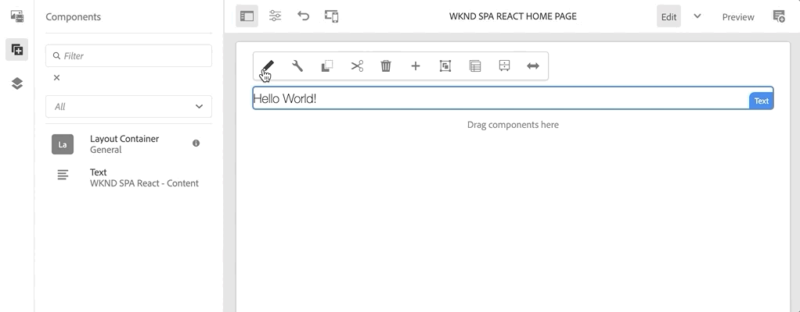

# 建立專案 {#spa-editor-project}

瞭解如何產生Adobe Experience Manager (AEM) Maven專案，並以此為基礎，整合React應用程式與AEM SPA Editor。

## 目標

1. 使用AEM專案原型產生啟用SPA編輯器的專案。
2. 將入門專案部署到AEM的本機執行個體。

## 您將建置的內容 {#what-build}

本章會根據[AEM專案原型](https://github.com/adobe/aem-project-archetype)產生新的AEM專案。 AEM專案是以React SPA的一個非常簡單的起點進行啟動。

**什麼是Maven專案？** - [Apache Maven](https://maven.apache.org/)是用於建置專案的軟體管理工具。 *所有Adobe Experience Manager*&#x200B;實作都使用Maven專案在AEM上建置、管理和部署自訂程式碼。

**什麼是Maven原型？** - [Maven原型](https://maven.apache.org/archetype/index.html)是用於產生新專案的範本或模式。 AEM專案原型可讓我們使用自訂名稱空間產生新專案，並包含遵循最佳實務的專案結構，大幅加快專案進度。

## 先決條件

檢閱設定[本機開發環境](overview.md#local-dev-environment)所需的工具和指示。 請確定以&#x200B;**作者**&#x200B;模式啟動的Adobe Experience Manager全新執行個體正在本機執行。

## 建立專案 {#create}

>[!NOTE]
>
>此教學課程使用原型的版本&#x200B;**35**。

1. 開啟命令列終端機，然後輸入以下Maven命令：

   ```shell
   mvn -B org.apache.maven.plugins:maven-archetype-plugin:3.2.1:generate \
    -D archetypeGroupId=com.adobe.aem \
    -D archetypeArtifactId=aem-project-archetype \
    -D archetypeVersion=35 \
    -D appTitle="WKND SPA React" \
    -D appId="wknd-spa-react" \
    -D artifactId="aem-guides-wknd-spa.react" \
    -D groupId="com.adobe.aem.guides.wkndspa.react" \
    -D frontendModule="react" \
    -D aemVersion="cloud"
   ```

   >[!NOTE]
   >
   > 如果目標為AEM 6.5.5+會將`aemVersion="cloud"`取代為`aemVersion="6.5.5"`。 如果目標為6.4.8+，請使用`aemVersion="6.4.8"`。

   注意`frontendModule=react`屬性。 這會告訴AEM專案原型使用要與AEM SPA編輯器搭配使用的啟動程式[React程式碼基底](https://experienceleague.adobe.com/docs/experience-manager-core-components/using/developing/archetype/uifrontend-react.html)來啟動專案。 屬性（如`appTitle`、`appId`、`artifactId`和`groupId`）可用來識別專案和用途。

   您可以在此處](https://github.com/adobe/aem-project-archetype#available-properties)找到設定專案[的可用屬性完整清單。

1. 下列資料夾和檔案結構是由本機檔案系統上的Maven原型所產生：

   ```plain
   |--- aem-guides-wknd-spa.react/
       |--- LICENSE
       |--- README.md
       |--- all/
       |--- archetype.properties
       |--- core/
       |--- dispatcher/
       |--- it.tests/
       |--- pom.xml
       |--- ui.apps/
       |--- ui.apps.structure/
       |--- ui.config/
       |--- ui.content/
       |--- ui.frontend/
       |--- ui.tests /
       |--- .gitignore
   ```

   每個資料夾代表一個單獨的Maven模組。 在本教學課程中，我們將主要使用`ui.frontend`模組，即React應用程式。 有關個別模組的更多詳細資訊，請參閱[AEM專案原型檔案](https://experienceleague.adobe.com/docs/experience-manager-core-components/using/developing/archetype/overview.html)。

## 部署和建置專案

接下來，使用Maven編譯、建置專案程式碼，並將其部署至AEM的本機執行個體。

1. 請確定AEM的執行個體正在連線埠&#x200B;**4502**&#x200B;上本機執行。
1. 從命令列導覽至`aem-guides-wknd-spa.react`專案目錄。

   ```shell
   $ cd aem-guides-wknd-spa.react
   ```

1. 執行以下命令，建置整個專案並將其部署至AEM：

   ```shell
   $ mvn clean install -PautoInstallSinglePackage
   ```

   建置需要約一分鐘的時間，結尾應會顯示下列訊息：

   ```shell
   ...
   [INFO] ------------------------------------------------------------------------
   [INFO] Reactor Summary for aem-guides-wknd-spa.react 1.0.0-SNAPSHOT:
   [INFO]
   [INFO] aem-guides-wknd-spa.react .......................... SUCCESS [  0.257 s]
   [INFO] WKND SPA React - Core .............................. SUCCESS [ 12.553 s]
   [INFO] WKND SPA React - UI Frontend ....................... SUCCESS [01:46 min]
   [INFO] WKND SPA React - Repository Structure Package ...... SUCCESS [  1.082 s]
   [INFO] WKND SPA React - UI apps ........................... SUCCESS [  8.237 s]
   [INFO] WKND SPA React - UI content ........................ SUCCESS [  5.633 s]
   [INFO] WKND SPA React - UI config ......................... SUCCESS [  0.234 s]
   [INFO] WKND SPA React - All ............................... SUCCESS [  0.643 s]
   [INFO] WKND SPA React - Integration Tests ................. SUCCESS [ 12.377 s]
   [INFO] WKND SPA React - Dispatcher ........................ SUCCESS [  0.066 s]
   [INFO] WKND SPA React - UI Tests .......................... SUCCESS [  0.074 s]
   [INFO] WKND SPA React - Project Analyser .................. SUCCESS [ 31.287 s]
   [INFO] ------------------------------------------------------------------------
   [INFO] BUILD SUCCESS
   [INFO] ------------------------------------------------------------------------
   ```

   Maven設定檔`autoInstallSinglePackage`會編譯專案的個別模組，並將單一套件部署至AEM執行個體。 依預設，此套件會部署至在本機執行於連線埠&#x200B;**4502**&#x200B;且認證為`admin:admin`的AEM執行個體。

1. 導覽至本機AEM執行個體上的&#x200B;**封裝管理員**： [http://localhost:4502/crx/packmgr/index.jsp](http://localhost:4502/crx/packmgr/index.jsp)。

1. 您應該會看到多個前置詞為`aem-guides-wknd-spa.react`的封裝。

   

   *AEM封裝管理員*

   專案所需的所有自訂程式碼都隨附在這些套件中，並安裝在AEM環境中。

## 作者內容

接下來，開啟原型產生的入門SPA並更新部分內容。

1. 導覽至&#x200B;**網站**&#x200B;主控台： [http://localhost:4502/sites.html/content](http://localhost:4502/sites.html/content)。

   WKND SPA包含基本網站結構，其中包含國家/地區、語言和首頁。 此階層是根據`language_country`和`isSingleCountryWebsite`的原型預設值。 產生專案時，可以更新[可用的屬性](https://github.com/adobe/aem-project-archetype#available-properties)來覆寫這些值。

2. 選取頁面，然後按一下功能表列中的&#x200B;**編輯**&#x200B;按鈕，開啟&#x200B;**us** > **en** > **WKND SPA React首頁**&#x200B;頁面：

   

3. **Text**&#x200B;元件已新增至頁面。 您可以像在AEM中編輯任何其他元件一樣編輯此元件。

   

4. 新增額外的&#x200B;**Text**&#x200B;元件至頁面。

   請注意，製作體驗類似於傳統AEM Sites頁面的製作體驗。 目前可用的元件數量有限。 在本教學課程中新增更多內容。

## 檢查單頁應用程式

接下來，確認這是使用瀏覽器開發人員工具的單頁應用程式。

1. 在&#x200B;**頁面編輯器**&#x200B;中，按一下&#x200B;**頁面資訊**&#x200B;按鈕> **以發佈的形式檢視**：

   

   這將開啟一個具有查詢引數`?wcmmode=disabled`的新索引標籤，這會有效地關閉AEM編輯器： [http://localhost:4502/content/wknd-spa-react/us/en/home.html?wcmmode=disabled](http://localhost:4502/content/wknd-spa-react/us/en/home.html?wcmmode=disabled)

2. 檢視頁面的來源，並注意找不到文字內容&#x200B;**[!DNL Hello World]**&#x200B;或任何其他內容。 相反地，您應該會看到類似以下的HTML：

   ```html
   ...
   <body>
       <noscript>You need to enable JavaScript to run this app.</noscript>
       <div id="spa-root"></div>
       <script type="text/javascript" src="/etc.clientlibs/wknd-spa-react/clientlibs/clientlib-react.lc-xxxx-lc.min.js"></script>
   </body>
   ...
   ```

   `clientlib-react.min.js`是載入到頁面上的React SPA，負責轉譯內容。

   但是，*內容來自何處？*

3. 返回標籤： [http://localhost:4502/content/wknd-spa-react/us/en/home.html?wcmmode=disabled](http://localhost:4502/content/wknd-spa-react/us/en/home.html?wcmmode=disabled)
4. 開啟瀏覽器的開發人員工具，並在重新整理期間檢查頁面的網路流量。 檢視&#x200B;**XHR**&#x200B;要求：

   

   應該有對[http://localhost:4502/content/wknd-spa-react/us/en.model.json](http://localhost:4502/content/wknd-spa-react/us/en.model.json)的請求。 這包含所有將驅動SPA的內容（以JSON格式化）。

5. 在新標籤中開啟[http://localhost:4502/content/wknd-spa-react/us/en.model.json](http://localhost:4502/content/wknd-spa-react/us/en.model.json)

   請求`en.model.json`代表將驅動應用程式的內容模型。 請檢查JSON輸出，您應該能夠找到代表&#x200B;**[!UICONTROL Text]**&#x200B;元件的程式碼片段。

   ```json
   ...
   ":items": {
       "text": {
           "text": "<p>Hello World! Updated content!</p>\r\n",
           "richText": true,
           ":type": "wknd-spa-react/components/text"
       },
       "text_98796435": {
           "text": "<p>A new text component.</p>\r\n",
           "richText": true,
           ":type": "wknd-spa-react/components/text"
       },
   }
   ...
   ```

   在下一章中，我們將檢查此JSON內容如何從AEM元件對應至SPA元件，以構成AEM SPA Editor體驗的基礎。

   >[!NOTE]
   >
   > 安裝瀏覽器擴充功能以自動格式化JSON輸出可能會有幫助。

## 恭喜！ {#congratulations}

恭喜，您剛才已建立您的第一個AEM SPA Editor專案！

SPA相當簡單。 在接下來的幾個章節中，將新增更多功能。

### 後續步驟 {#next-steps}

[整合SPA](integrate-spa.md) — 瞭解SPA原始程式碼如何與AEM專案整合，並瞭解可用於快速開發SPA的工具。
