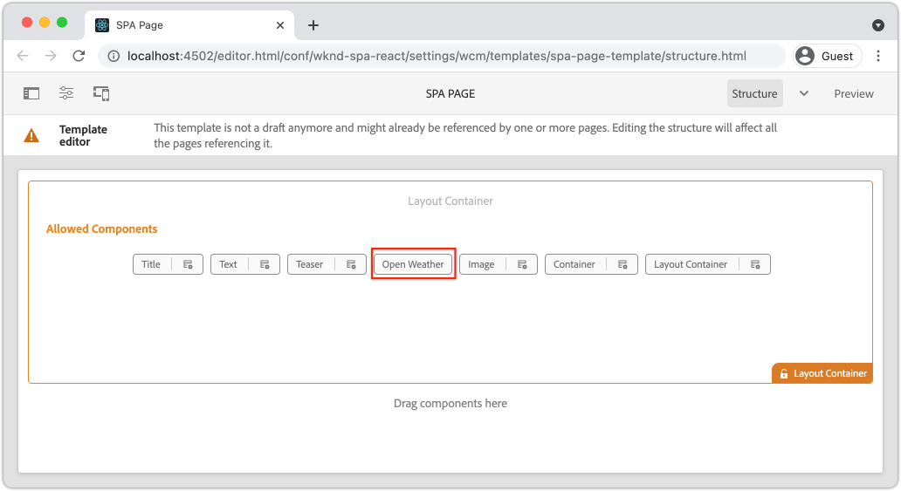

# 建立自訂WeatherComponent {#custom-component}

了解如何建立要與AEM SPA編輯器搭配使用的自訂天氣元件。 了解如何開發製作對話方塊和Sling模型，以擴充JSON模型以填入自訂元件。 此 [開啟天氣API](https://openweathermap.org) 和 [反應開放天氣元件](https://www.npmjs.com/package/react-open-weather) 中所有規則的URL區段。

## 目標

1. 了解Sling模型在操控AEM提供的JSON模型API中的角色。
2. 了解如何建立新的AEM元件對話方塊。
3. 了解如何建立 **自訂** AEM元件與SPA編輯器架構相容。

## 您將建置的

已建立簡單的天氣元件。 內容作者可將此元件新增至SPA。 使用AEM對話方塊，作者可設定天氣的顯示位置。  此元件的實作說明建立與AEM SPA Editor架構相容的全新AEM元件所需執行的步驟。


## 必備條件

檢閱設定 [本地開發環境](overview.md#local-dev-environment). 本章是 [導航和路由](navigation-routing.md) 不過，您只需要部署至本機AEM例項的SPA啟用AEM專案，便能順利完成。

### 開啟天氣API金鑰

來自的API金鑰 [開放天氣](https://openweathermap.org/) 需要搭配本教學課程使用。 [註冊是免費的](https://home.openweathermap.org/users/sign_up) 的API呼叫數。

## 定義AEM元件

AEM元件定義為節點和屬性。 在專案中，這些節點和屬性在 `ui.apps` 模組。 接下來，在 `ui.apps` 模組。

>[!NOTE]
>
> 快速重新整理 [AEM元件的基本概念可能會很實用](https://experienceleague.adobe.com/docs/experience-manager-learn/getting-started-wknd-tutorial-develop/project-archetype/component-basics.html).

1. 在所選IDE中，開啟 `ui.apps` 檔案夾。
2. 導覽至 `ui.apps/src/main/content/jcr_root/apps/wknd-spa-react/components` 並建立名為 `open-weather`.
3. 建立名為 `.content.xml` 在下面 `open-weather` 檔案夾。 填入 `open-weather/.content.xml` 並搭配下列項目：

   ```xml
   <?xml version="1.0" encoding="UTF-8"?>
   <jcr:root xmlns:sling="http://sling.apache.org/jcr/sling/1.0" xmlns:cq="http://www.day.com/jcr/cq/1.0" xmlns:jcr="http://www.jcp.org/jcr/1.0"
       jcr:primaryType="cq:Component"
       jcr:title="Open Weather"
       componentGroup="WKND SPA React - Content"/>
   ```

   

   `jcr:primaryType="cq:Component"`  — 標識此節點是AEM元件。

   `jcr:title` 是顯示給內容作者的值，而 `componentGroup` 決定製作UI中元件的分組。

4. 在 `custom-component` 資料夾，建立另一個名為 `_cq_dialog`.
5. 在 `_cq_dialog` 資料夾建立名為的新檔案 `.content.xml` 並填入下列項目：

   ```xml
   <?xml version="1.0" encoding="UTF-8"?>
   <jcr:root xmlns:sling="http://sling.apache.org/jcr/sling/1.0" xmlns:granite="http://www.adobe.com/jcr/granite/1.0" xmlns:cq="http://www.day.com/jcr/cq/1.0" xmlns:jcr="http://www.jcp.org/jcr/1.0" xmlns:nt="http://www.jcp.org/jcr/nt/1.0"
       jcr:primaryType="nt:unstructured"
       jcr:title="Open Weather"
       sling:resourceType="cq/gui/components/authoring/dialog">
       <content
           jcr:primaryType="nt:unstructured"
           sling:resourceType="granite/ui/components/coral/foundation/container">
           <items jcr:primaryType="nt:unstructured">
               <tabs
                   jcr:primaryType="nt:unstructured"
                   sling:resourceType="granite/ui/components/coral/foundation/tabs"
                   maximized="{Boolean}true">
                   <items jcr:primaryType="nt:unstructured">
                       <properties
                           jcr:primaryType="nt:unstructured"
                           jcr:title="Properties"
                           sling:resourceType="granite/ui/components/coral/foundation/container"
                           margin="{Boolean}true">
                           <items jcr:primaryType="nt:unstructured">
                               <columns
                                   jcr:primaryType="nt:unstructured"
                                   sling:resourceType="granite/ui/components/coral/foundation/fixedcolumns"
                                   margin="{Boolean}true">
                                   <items jcr:primaryType="nt:unstructured">
                                       <column
                                           jcr:primaryType="nt:unstructured"
                                           sling:resourceType="granite/ui/components/coral/foundation/container">
                                           <items jcr:primaryType="nt:unstructured">
                                               <label
                                                   jcr:primaryType="nt:unstructured"
                                                   sling:resourceType="granite/ui/components/coral/foundation/form/textfield"
                                                   fieldDescription="The label to display for the component"
                                                   fieldLabel="Label"
                                                   name="./label"/>
                                               <lat
                                                   jcr:primaryType="nt:unstructured"
                                                   sling:resourceType="granite/ui/components/coral/foundation/form/numberfield"
                                                   fieldDescription="The latitude of the location."
                                                   fieldLabel="Latitude"
                                                   step="any"
                                                   name="./lat" />
                                               <lon
                                                   jcr:primaryType="nt:unstructured"
                                                   sling:resourceType="granite/ui/components/coral/foundation/form/numberfield"
                                                   fieldDescription="The longitude of the location."
                                                   fieldLabel="Longitude"
                                                   step="any"
                                                   name="./lon"/>
                                           </items>
                                       </column>
                                   </items>
                               </columns>
                           </items>
                       </properties>
                   </items>
               </tabs>
           </items>
       </content>
   </jcr:root>
   ```

   

   上述XML檔案會為 `Weather Component`. 檔案的關鍵部分是內部 `<label>`, `<lat>` 和 `<lon>` 節點。 此對話方塊包含兩個 `numberfield`s和a `textfield` 讓使用者設定要顯示的天氣。

   系統會在旁邊建立Sling模型，以公開 `label`,`lat` 和 `long` 屬性。

   >[!NOTE]
   >
   > 您可以檢視更多 [檢視核心元件定義以進行對話的範例](https://github.com/adobe/aem-core-wcm-components/tree/master/content/src/content/jcr_root/apps/core/wcm/components). 您也可以檢視其他表單欄位，例如 `select`, `textarea`, `pathfield`，可在下方使用 `/libs/granite/ui/components/coral/foundation/form` in [CRXDE-Lite](http://localhost:4502/crx/de/index.jsp#/libs/granite/ui/components/coral/foundation/form).

   若使用傳統AEM元件， [HTL](https://experienceleague.adobe.com/docs/experience-manager-htl/using/overview.html?lang=zh-Hant) 指令碼通常為必要項。 由於SPA會轉譯元件，因此不需要HTL指令碼。

## 建立Sling模型

Sling模型是註解導向的Java &quot;POJO&#39;s&quot;（純舊Java物件），可方便將資料從JCR對應至Java變數。 [Sling模型](https://experienceleague.adobe.com/docs/experience-manager-learn/getting-started-wknd-tutorial-develop/project-archetype/component-basics.html?lang=en#sling-models) 通常可封裝AEM元件的複雜伺服器端業務邏輯。

在SPA編輯器的內容中，Sling模型會透過JSON模型，透過使用 [Sling模型導出器](https://experienceleague.adobe.com/docs/experience-manager-learn/foundation/development/develop-sling-model-exporter.html).

1. 在所選IDE中，開啟 `core` 模組於 `aem-guides-wknd-spa.react/core`.
1. 建立名為的檔案 `OpenWeatherModel.java` at `core/src/main/java/com/adobe/aem/guides/wkndspa/react/core/models`.
1. 填入 `OpenWeatherModel.java` 並搭配下列項目：

   ```java
   package com.adobe.aem.guides.wkndspa.react.core.models;
   
   import com.adobe.cq.export.json.ComponentExporter;
   
   // Sling Models intended to be used with SPA Editor must extend ComponentExporter interface
   public interface OpenWeatherModel extends ComponentExporter {
   
       public String getLabel();
   
       public double getLat();
   
       public double getLon();
   
   }
   ```

   這是元件的Java介面。 為了讓我們的Sling模型與SPA Editor架構相容，必須擴充 `ComponentExporter` 類別。

1. 建立名為 `impl` 在 `core/src/main/java/com/adobe/aem/guides/wkndspa/react/core/models`.
1. 建立名為 `OpenWeatherModelImpl.java` 在 `impl` 並填入下列項目：

   ```java
   package com.adobe.aem.guides.wkndspa.react.core.models.impl;
   
   import org.apache.sling.models.annotations.*;
   import org.apache.sling.models.annotations.injectorspecific.ValueMapValue;
   import com.adobe.cq.export.json.ComponentExporter;
   import com.adobe.cq.export.json.ExporterConstants;
   import org.apache.commons.lang3.StringUtils;
   import org.apache.sling.api.SlingHttpServletRequest;
   import com.adobe.aem.guides.wkndspa.react.core.models.OpenWeatherModel;
   
   // Sling Model annotation
   @Model(
       adaptables = SlingHttpServletRequest.class, 
       adapters = { OpenWeatherModel.class, ComponentExporter.class }, 
       resourceType = OpenWeatherModelImpl.RESOURCE_TYPE, 
       defaultInjectionStrategy = DefaultInjectionStrategy.OPTIONAL
       )
   @Exporter( //Exporter annotation that serializes the modoel as JSON
       name = ExporterConstants.SLING_MODEL_EXPORTER_NAME, 
       extensions = ExporterConstants.SLING_MODEL_EXTENSION
       )
   public class OpenWeatherModelImpl implements OpenWeatherModel {
   
       @ValueMapValue
       private String label; //maps variable to jcr property named "label" persisted by Dialog
   
       @ValueMapValue
       private double lat; //maps variable to jcr property named "lat"
   
       @ValueMapValue
       private double lon; //maps variable to jcr property named "lon"
   
       // points to AEM component definition in ui.apps
       static final String RESOURCE_TYPE = "wknd-spa-react/components/open-weather";
   
       // public getter method to expose value of private variable `label`
       // adds additional logic to default the label to "(Default)" if not set.
       @Override
       public String getLabel() {
           return StringUtils.isNotBlank(label) ? label : "(Default)";
       }
   
       // public getter method to expose value of private variable `lat`
       @Override
       public double getLat() {
           return lat;
       }
   
       // public getter method to expose value of private variable `lon`
       @Override
       public double getLon() {
           return lon;
       }
   
       // method required by `ComponentExporter` interface
       // exposes a JSON property named `:type` with a value of `wknd-spa-react/components/open-weather`
       // required to map the JSON export to the SPA component props via the `MapTo`
       @Override
       public String getExportedType() {
           return OpenWeatherModelImpl.RESOURCE_TYPE;
       }
   } 
   ```

   靜態變數 `RESOURCE_TYPE` 必須指向 `ui.apps` 的下界。 此 `getExportedType()` 可透過將JSON屬性對應至SPA元件 `MapTo`. `@ValueMapValue` 是一個注釋，用於讀取對話框保存的jcr屬性。

## 更新SPA

接下來，更新React程式碼以包含 [反應開放天氣元件](https://www.npmjs.com/package/react-open-weather) 並將其對應至先前步驟中建立的AEM元件。

1. 將React Open Weather元件安裝為 **npm** 相依性：

   ```shell
   $ cd aem-guides-wknd-spa.react/ui.frontend
   $ npm i react-open-weather
   ```

1. 建立名為 `OpenWeather` at `ui.frontend/src/components/OpenWeather`.
1. 新增名為的檔案 `OpenWeather.js` 並填入下列項目：

   ```js
   import React from 'react';
   import {MapTo} from '@adobe/aem-react-editable-components';
   import ReactWeather, { useOpenWeather } from 'react-open-weather';
   
   // Open weather API Key
   // For simplicity it is hard coded in the file, ideally this is extracted in to an environment variable
   const API_KEY = 'YOUR_API_KEY';
   
   // Logic to render placeholder or component
   const OpenWeatherEditConfig = {
   
       emptyLabel: 'Weather',
       isEmpty: function(props) {
           return !props || !props.lat || !props.lon || !props.label;
       }
   };
   
   // Wrapper function that includes react-open-weather component
   function ReactWeatherWrapper(props) {
       const { data, isLoading, errorMessage } = useOpenWeather({
           key: API_KEY,
           lat: props.lat, // passed in from AEM JSON
           lon: props.lon, // passed in from AEM JSON
           lang: 'en',
           unit: 'imperial', // values are (metric, standard, imperial)
       });
   
       return (
           <div className="cmp-open-weather">
               <ReactWeather
                   isLoading={isLoading}
                   errorMessage={errorMessage}
                   data={data}
                   lang="en"
                   locationLabel={props.label} // passed in from AEM JSON
                   unitsLabels={{ temperature: 'F', windSpeed: 'mph' }}
                   showForecast={false}
                 />
           </div>
       );
   }
   
   export default function OpenWeather(props) {
   
           // render nothing if component not configured
           if(OpenWeatherEditConfig.isEmpty(props)) {
               return null;
           }
   
           // render ReactWeather component if component configured
           // pass props to ReactWeatherWrapper. These props include the mapped properties from AEM JSON
           return ReactWeatherWrapper(props);
   
   }
   
   // Map OpenWeather to AEM component
   MapTo('wknd-spa-react/components/open-weather')(OpenWeather, OpenWeatherEditConfig);
   ```

1. 更新 `import-components.js` at `ui.frontend/src/components/import-components.js` 包括 `OpenWeather` 元件：

   ```diff
     // import-component.js
     import './Container/Container';
     import './ExperienceFragment/ExperienceFragment';
   + import './OpenWeather/OpenWeather';
   ```

1. 使用您的Maven技能，從專案目錄的根目錄，將所有更新部署至本機AEM環境：

   ```shell
   $ cd aem-guides-wknd-spa.react
   $ mvn clean install -PautoInstallSinglePackage
   ```

## 更新模板策略

接著，導覽至AEM以驗證更新並允許 `OpenWeather` 要新增至SPA的元件。

1. 導覽至 [http://localhost:4502/system/console/status-slingmodels](http://localhost:4502/system/console/status-slingmodels).

   ```plain
   com.adobe.aem.guides.wkndspa.react.core.models.impl.OpenWeatherModelImpl - wknd-spa-react/components/open-weather
   
   com.adobe.aem.guides.wkndspa.react.core.models.impl.OpenWeatherModelImpl exports 'wknd-spa-react/components/open-weather' with selector 'model' and extension '[Ljava.lang.String;@2fd80fc5' with exporter 'jackson'
   ```

   您應會看到以上兩行，指出 `OpenWeatherModelImpl` 與 `wknd-spa-react/components/open-weather` 元件，並透過Sling模型匯出工具註冊。

1. 導覽至SPA頁面範本，網址為 [http://localhost:4502/editor.html/conf/wknd-spa-react/settings/wcm/templates/spa-page-template/structure.html](http://localhost:4502/editor.html/conf/wknd-spa-react/settings/wcm/templates/spa-page-template/structure.html).
1. 更新「配置容器」的策略以添加新 `Open Weather` 作為允許的元件：

   

   儲存對原則的變更，並觀察 `Open Weather` 作為允許的元件：

   

## 製作開放天氣元件

接下來，編寫 `Open Weather` 元件(使用AEM SPA編輯器)。

1. 導覽至 [http://localhost:4502/editor.html/content/wknd-spa-react/us/en/home.html](http://localhost:4502/editor.html/content/wknd-spa-react/us/en/home.html).
1. 在 `Edit` 模式，添加 `Open Weather` 到 `Layout Container`:

   

1. 開啟元件的對話方塊，然後輸入 **標籤**, **緯度**，和 **經度**. 例如 **聖迭戈**, **32.7157**，和 **-117.1611**. 西半球和南半球的數字以開放天氣API表示為負數

   

   這是在章節前面根據XML檔案建立的對話框。

1. 儲存變更。請注意 **聖迭戈** 現在會顯示：

   

1. 導覽至 [http://localhost:4502/content/wknd-spa-react/us/en.model.json](http://localhost:4502/content/wknd-spa-react/us/en.model.json). 搜尋 `wknd-spa-react/components/open-weather`:

   ```json
   "open_weather": {
       "label": "San Diego",
       "lat": 32.7157,
       "lon": -117.1611,
       ":type": "wknd-spa-react/components/open-weather"
   }
   ```

   JSON值會由Sling模型輸出。 這些JSON值會以prop的形式傳入React元件。

## 恭喜！ {#congratulations}

恭喜您，您已學會如何建立要與SPA編輯器搭配使用的自訂AEM元件。 您也了解對話方塊、JCR屬性和Sling模型如何互動以輸出JSON模型。

### 後續步驟 {#next-steps}

[擴充核心元件](extend-component.md)  — 了解如何擴充現有的AEM核心元件以與AEM SPA編輯器搭配使用。 了解如何將屬性和內容新增至現有元件，是擴充AEM SPA Editor實作功能的強大技術。
