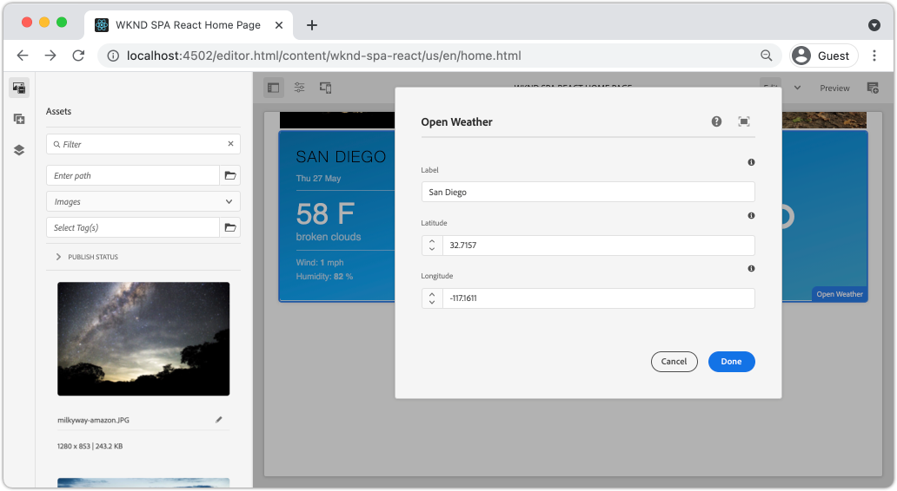

# 建立自定義WeatherComponent {#custom-component}

瞭解如何建立要與編輯器一起使用的自定義天氣AEM組SPA件。 瞭解如何開發作者對話框和Sling模型以擴展JSON模型以填充自定義元件。 的 [開啟天氣API](https://openweathermap.org) 和 [響應開放天氣元件](https://www.npmjs.com/package/react-open-weather) 的子菜單。

## 目標

1. 瞭解Sling模型在操作由提供的JSON模型API中的角AEM色。
2. 瞭解如何建立新元AEM件對話框。
3. 學習建立 **自定義** 與AEM編輯器框架兼SPA容的元件。

## 您將構建的

還建造了簡單的天氣部件。 此元件可由內容作者添SPA加到。 使用AEM對話框，作者可以設定要顯示天氣的位置。  此元件的實現說明了建立與編輯器框架兼AEM容的Net新組AEM件SPA所需的步驟。



## 必備條件

查看所需的工具和設定 [地方開發環境](overview.md#local-dev-environment)。 本章是 [導航和路由](navigation-routing.md) 但是，本章要遵循所有需要的，都是SPA已啟AEM用的項目部署到本AEM地實例。

### 開啟天氣API密鑰

來自的API密鑰 [開放天氣](https://openweathermap.org/) 需要與本教程一起學習。 [註冊免費](https://home.openweathermap.org/users/sign_up) API調用的數量有限。

## 定義元AEM件

元件AEM定義為節點和屬性。 在項目中，這些節點和屬性在中以XML檔案的形式表示 `ui.apps` 中。 接下來，在AEM中建立元件 `ui.apps` 中。

>[!NOTE]
>
> 快速複習 [元件AEM的基礎](https://experienceleague.adobe.com/docs/experience-manager-learn/getting-started-wknd-tutorial-develop/project-archetype/component-basics.html)。

1. 在您選擇的IDE中，開啟 `ui.apps` 的子菜單。
2. 導航到 `ui.apps/src/main/content/jcr_root/apps/wknd-spa-react/components` 建立名為 `open-weather`。
3. 建立名為 `.content.xml` 在下面 `open-weather` 的子菜單。 填充 `open-weather/.content.xml` 下面列出：

   ```xml
   <?xml version="1.0" encoding="UTF-8"?>
   <jcr:root xmlns:sling="http://sling.apache.org/jcr/sling/1.0" xmlns:cq="http://www.day.com/jcr/cq/1.0" xmlns:jcr="http://www.jcp.org/jcr/1.0"
       jcr:primaryType="cq:Component"
       jcr:title="Open Weather"
       componentGroup="WKND SPA React - Content"/>
   ```

   

   `jcr:primaryType="cq:Component"`  — 標識此節點是組AEM件。

   `jcr:title` 是顯示給「內容作者」的值， `componentGroup` 確定創作UI中元件的分組。

4. 在 `custom-component` 資料夾，建立另一個名為 `_cq_dialog`。
5. 在 `_cq_dialog` 資料夾建立名為 `.content.xml` 並用以下方式填充：

   ```xml
   <?xml version="1.0" encoding="UTF-8"?>
   <jcr:root xmlns:sling="http://sling.apache.org/jcr/sling/1.0" xmlns:granite="http://www.adobe.com/jcr/granite/1.0" xmlns:cq="http://www.day.com/jcr/cq/1.0" xmlns:jcr="http://www.jcp.org/jcr/1.0" xmlns:nt="http://www.jcp.org/jcr/nt/1.0"
       jcr:primaryType="nt:unstructured"
       jcr:title="Open Weather"
       sling:resourceType="cq/gui/components/authoring/dialog">
       <content
           jcr:primaryType="nt:unstructured"
           sling:resourceType="granite/ui/components/coral/foundation/container">
           <items jcr:primaryType="nt:unstructured">
               <tabs
                   jcr:primaryType="nt:unstructured"
                   sling:resourceType="granite/ui/components/coral/foundation/tabs"
                   maximized="{Boolean}true">
                   <items jcr:primaryType="nt:unstructured">
                       <properties
                           jcr:primaryType="nt:unstructured"
                           jcr:title="Properties"
                           sling:resourceType="granite/ui/components/coral/foundation/container"
                           margin="{Boolean}true">
                           <items jcr:primaryType="nt:unstructured">
                               <columns
                                   jcr:primaryType="nt:unstructured"
                                   sling:resourceType="granite/ui/components/coral/foundation/fixedcolumns"
                                   margin="{Boolean}true">
                                   <items jcr:primaryType="nt:unstructured">
                                       <column
                                           jcr:primaryType="nt:unstructured"
                                           sling:resourceType="granite/ui/components/coral/foundation/container">
                                           <items jcr:primaryType="nt:unstructured">
                                               <label
                                                   jcr:primaryType="nt:unstructured"
                                                   sling:resourceType="granite/ui/components/coral/foundation/form/textfield"
                                                   fieldDescription="The label to display for the component"
                                                   fieldLabel="Label"
                                                   name="./label"/>
                                               <lat
                                                   jcr:primaryType="nt:unstructured"
                                                   sling:resourceType="granite/ui/components/coral/foundation/form/numberfield"
                                                   fieldDescription="The latitude of the location."
                                                   fieldLabel="Latitude"
                                                   step="any"
                                                   name="./lat" />
                                               <lon
                                                   jcr:primaryType="nt:unstructured"
                                                   sling:resourceType="granite/ui/components/coral/foundation/form/numberfield"
                                                   fieldDescription="The longitude of the location."
                                                   fieldLabel="Longitude"
                                                   step="any"
                                                   name="./lon"/>
                                           </items>
                                       </column>
                                   </items>
                               </columns>
                           </items>
                       </properties>
                   </items>
               </tabs>
           </items>
       </content>
   </jcr:root>
   ```

   

   以上XML檔案為 `Weather Component`。 檔案的關鍵部分是內部 `<label>`。 `<lat>` 和 `<lon>` 節點。 此對話框包含兩個 `numberfield`s和 `textfield` 允許用戶配置要顯示的天氣。

   將在下面建立「吊帶模型」以顯示 `label`。`lat` 和 `long` 屬性。

   >[!NOTE]
   >
   > 您可以查看更多 [通過查看核心元件定義的對話框示例](https://github.com/adobe/aem-core-wcm-components/tree/master/content/src/content/jcr_root/apps/core/wcm/components)。 您還可以查看其他表單域，如 `select`。 `textarea`。 `pathfield`在 `/libs/granite/ui/components/coral/foundation/form` 在 [CRXDE-Lite](http://localhost:4502/crx/de/index.jsp#/libs/granite/ui/components/coral/foundation/form)。

   使用傳統AEM元件， [HTL](https://experienceleague.adobe.com/docs/experience-manager-htl/using/overview.html?lang=zh-Hant) 通常需要指令碼。 由於SPA將呈現元件，因此不需要HTL指令碼。

## 建立吊具模型

Sling模型是注釋驅動的Java &quot;POJO&#39;s&quot;(Plain Old Java Objects)，可方便將資料從JCR映射到Java變數。 [吊具模型](https://experienceleague.adobe.com/docs/experience-manager-learn/getting-started-wknd-tutorial-develop/project-archetype/component-basics.html?lang=en#sling-models) 通常用於封裝元件的複雜伺服器端業務AEM邏輯。

在編輯器的上SPA下文中，Sling Models通過使用的 [Sling模型導出器](https://experienceleague.adobe.com/docs/experience-manager-learn/foundation/development/develop-sling-model-exporter.html)。

1. 在您選擇的IDE中，開啟 `core` 模組 `aem-guides-wknd-spa.react/core`。
1. 建立名為的檔案 `OpenWeatherModel.java` 在 `core/src/main/java/com/adobe/aem/guides/wkndspa/react/core/models`。
1. 填充 `OpenWeatherModel.java` 下面列出：

   ```java
   package com.adobe.aem.guides.wkndspa.react.core.models;
   
   import com.adobe.cq.export.json.ComponentExporter;
   
   // Sling Models intended to be used with SPA Editor must extend ComponentExporter interface
   public interface OpenWeatherModel extends ComponentExporter {
       public String getLabel();
       public double getLat();
       public double getLon();
   }
   ```

   這是我們元件的Java介面。 為了使我們的Sling模型與編輯器框架兼SPA容，它必須擴展 `ComponentExporter` 類。

1. 建立名為 `impl` 下 `core/src/main/java/com/adobe/aem/guides/wkndspa/react/core/models`。
1. 建立名為 `OpenWeatherModelImpl.java` 下 `impl` 並填充以下內容：

   ```java
   package com.adobe.aem.guides.wkndspa.react.core.models.impl;
   
   import org.apache.sling.models.annotations.*;
   import org.apache.sling.models.annotations.injectorspecific.ValueMapValue;
   import com.adobe.cq.export.json.ComponentExporter;
   import com.adobe.cq.export.json.ExporterConstants;
   import org.apache.commons.lang3.StringUtils;
   import org.apache.sling.api.SlingHttpServletRequest;
   import com.adobe.aem.guides.wkndspa.react.core.models.OpenWeatherModel;
   
   // Sling Model annotation
   @Model(
       adaptables = SlingHttpServletRequest.class, 
       adapters = { OpenWeatherModel.class, ComponentExporter.class }, 
       resourceType = OpenWeatherModelImpl.RESOURCE_TYPE, 
       defaultInjectionStrategy = DefaultInjectionStrategy.OPTIONAL
   )
   @Exporter( //Exporter annotation that serializes the modoel as JSON
       name = ExporterConstants.SLING_MODEL_EXPORTER_NAME, 
       extensions = ExporterConstants.SLING_MODEL_EXTENSION
   )
   public class OpenWeatherModelImpl implements OpenWeatherModel {
   
       @ValueMapValue
       private String label; //maps variable to jcr property named "label" persisted by Dialog
   
       @ValueMapValue
       private double lat; //maps variable to jcr property named "lat"
   
       @ValueMapValue
       private double lon; //maps variable to jcr property named "lon"
   
       // points to AEM component definition in ui.apps
       static final String RESOURCE_TYPE = "wknd-spa-react/components/open-weather";
   
       // public getter method to expose value of private variable `label`
       // adds additional logic to default the label to "(Default)" if not set.
       @Override
       public String getLabel() {
           return StringUtils.isNotBlank(label) ? label : "(Default)";
       }
   
       // public getter method to expose value of private variable `lat`
       @Override
       public double getLat() {
           return lat;
       }
   
       // public getter method to expose value of private variable `lon`
       @Override
       public double getLon() {
           return lon;
       }
   
       // method required by `ComponentExporter` interface
       // exposes a JSON property named `:type` with a value of `wknd-spa-react/components/open-weather`
       // required to map the JSON export to the SPA component props via the `MapTo`
       @Override
       public String getExportedType() {
           return OpenWeatherModelImpl.RESOURCE_TYPE;
       }
   } 
   ```

   靜態變數 `RESOURCE_TYPE` 必須指向中的路徑 `ui.apps` 的子菜單。 的 `getExportedType()` 用於將JSON屬性映射到SPA元件 `MapTo`。 `@ValueMapValue` 是讀取對話框保存的jcr屬性的注釋。

## 更新SPA

接下來，更新React代碼以包括 [響應開放天氣元件](https://www.npmjs.com/package/react-open-weather) 將其映射到在前AEM面步驟中建立的元件。

1. 將React Open Weather元件安裝為 **npm** 依賴關係：

   ```shell
   $ cd aem-guides-wknd-spa.react/ui.frontend
   $ npm i react-open-weather
   ```

1. 建立名為 `OpenWeather` 在 `ui.frontend/src/components/OpenWeather`。
1. 添加名為 `OpenWeather.js` 並用以下方式填充：

   ```js
   import React from 'react';
   import {MapTo} from '@adobe/aem-react-editable-components';
   import ReactWeather, { useOpenWeather } from 'react-open-weather';
   
   // Open weather API Key
   // For simplicity it is hard coded in the file, ideally this is extracted in to an environment variable
   const API_KEY = 'YOUR_API_KEY';
   
   // Logic to render placeholder or component
   const OpenWeatherEditConfig = {
   
       emptyLabel: 'Weather',
       isEmpty: function(props) {
           return !props || !props.lat || !props.lon || !props.label;
       }
   };
   
   // Wrapper function that includes react-open-weather component
   function ReactWeatherWrapper(props) {
       const { data, isLoading, errorMessage } = useOpenWeather({
           key: API_KEY,
           lat: props.lat, // passed in from AEM JSON
           lon: props.lon, // passed in from AEM JSON
           lang: 'en',
           unit: 'imperial', // values are (metric, standard, imperial)
       });
   
       return (
           <div className="cmp-open-weather">
               <ReactWeather
                   isLoading={isLoading}
                   errorMessage={errorMessage}
                   data={data}
                   lang="en"
                   locationLabel={props.label} // passed in from AEM JSON
                   unitsLabels={{ temperature: 'F', windSpeed: 'mph' }}
                   showForecast={false}
                 />
           </div>
       );
   }
   
   export default function OpenWeather(props) {
   
           // render nothing if component not configured
           if (OpenWeatherEditConfig.isEmpty(props)) {
               return null;
           }
   
           // render ReactWeather component if component configured
           // pass props to ReactWeatherWrapper. These props include the mapped properties from AEM JSON
           return ReactWeatherWrapper(props);
   
   }
   
   // Map OpenWeather to AEM component
   MapTo('wknd-spa-react/components/open-weather')(OpenWeather, OpenWeatherEditConfig);
   ```

1. 更新 `import-components.js` 在 `ui.frontend/src/components/import-components.js` 包含 `OpenWeather` 元件：

   ```diff
     // import-component.js
     import './Container/Container';
     import './ExperienceFragment/ExperienceFragment';
   + import './OpenWeather/OpenWeather';
   ```

1. 使用Maven技能將所有更新從AEM項目目錄的根目錄部署到本地環境：

   ```shell
   $ cd aem-guides-wknd-spa.react
   $ mvn clean install -PautoInstallSinglePackage
   ```

## 更新模板策略

接下來，導航AEM至驗證更新並允許 `OpenWeather` 要添加到的組SPA件。

1. 通過導航到 [http://localhost:4502/system/console/status-slingmodels](http://localhost:4502/system/console/status-slingmodels)。

   ```plain
   com.adobe.aem.guides.wkndspa.react.core.models.impl.OpenWeatherModelImpl - wknd-spa-react/components/open-weather
   
   com.adobe.aem.guides.wkndspa.react.core.models.impl.OpenWeatherModelImpl exports 'wknd-spa-react/components/open-weather' with selector 'model' and extension '[Ljava.lang.String;@2fd80fc5' with exporter 'jackson'
   ```

   您應看到上面兩行，這些行表示 `OpenWeatherModelImpl` 與 `wknd-spa-react/components/open-weather` 元件，並通過Sling模型導出器註冊。

1. 導航到SPA頁面模板 [http://localhost:4502/editor.html/conf/wknd-spa-react/settings/wcm/templates/spa-page-template/structure.html](http://localhost:4502/editor.html/conf/wknd-spa-react/settings/wcm/templates/spa-page-template/structure.html)。
1. 更新佈局容器的策略以添加新 `Open Weather` 作為允許的元件：

   

   保存對策略的更改，並觀察 `Open Weather` 作為允許的元件：

   

## 建立開放天氣元件

接下來，編寫 `Open Weather` 元件，使AEM用編SPA輯器。

1. 導航到 [http://localhost:4502/editor.html/content/wknd-spa-react/us/en/home.html](http://localhost:4502/editor.html/content/wknd-spa-react/us/en/home.html)。
1. 在 `Edit` 模式，添加 `Open Weather` 到 `Layout Container`:

   

1. 開啟元件的對話框並輸入 **標籤**。 **緯度**, **經度**。 例如 **聖地亞哥**。 **32.7157**, **-117.1611**。 使用開放天氣API將西半球和南半球的數字表示為負數

   

   這是基於本章前面的XML檔案建立的對話框。

1. 儲存變更。觀察天氣 **聖地亞哥** 現在顯示：

   

1. 導航至 [http://localhost:4502/content/wknd-spa-react/us/en.model.json](http://localhost:4502/content/wknd-spa-react/us/en.model.json)。 搜尋 `wknd-spa-react/components/open-weather`:

   ```json
   "open_weather": {
       "label": "San Diego",
       "lat": 32.7157,
       "lon": -117.1611,
       ":type": "wknd-spa-react/components/open-weather"
   }
   ```

   JSON值由Sling模型輸出。 這些JSON值作為道具傳遞到React元件中。

## 恭喜！ {#congratulations}

恭喜您，您學會了如何創AEM建與編輯器一起使用的自定SPA義元件。 您還瞭解了對話框、JCR屬性和Sling Models如何交互以輸出JSON模型。

### 後續步驟 {#next-steps}

[擴展核心元件](extend-component.md)  — 瞭解如何擴展現AEM有核心元件以與編AEM輯器一起使用SPA。 瞭解如何將屬性和內容添加到現有元件是擴展編輯器實現功能的AEM強SPA大技術。
