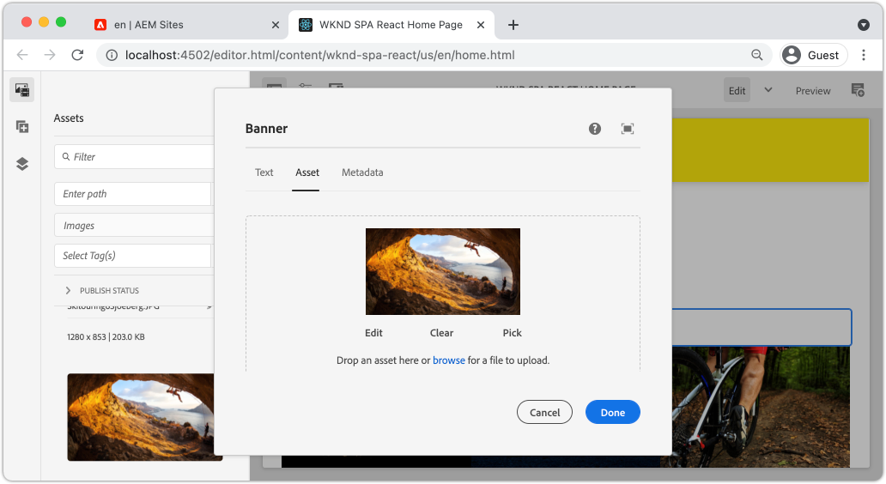

# 擴展核心元件 {#extend-component}

瞭解如何擴展要與編輯器一起使用的現有核AEM心組SPA件。 瞭解如何擴展現有元件是定制和擴展編輯器實現功能的AEM強SPA大技術。

## 目標

1. 使用附加屬性和內容擴展現有核心元件。
2. 使用 `sling:resourceSuperType`。
3. 瞭解如何利用 [委託模式](https://github.com/adobe/aem-core-wcm-components/wiki/Delegation-Pattern-for-Sling-Models) 用於Sling Models重新使用現有邏輯和功能。

## 您將構建的

本章說明了向標準中添加額外屬性所需的附加代碼 `Image` 元件以滿足新 `Banner` 元件。 的 `Banner` 元件包含與標準 `Image` 元件，但包含用戶填充的附加屬性 **標題文本**。


## 必備條件

查看所需的工具和設定 [地方開發環境](overview.md#local-dev-environment)。 在本教程中，假定用戶對編輯器功能有了AEM深入SPA瞭解。

## Sling資源超類型的繼承 {#sling-resource-super-type}

擴展現有元件集的屬性 `sling:resourceSuperType` 在元件定義上。  `sling:resourceSuperType`是 [屬性](https://sling.apache.org/documentation/the-sling-engine/resources.html#resource-properties) 可以在指向另AEM一元件的元件定義上設定。 這將顯式設定元件以繼承標識為 `sling:resourceSuperType`。

如果我們想擴展 `Image` 元件 `wknd-spa-react/components/image` 我們需要更新 `ui.apps` 中。

1. 在 `ui.apps` 模組 `banner` 在 `ui.apps/src/main/content/jcr_root/apps/wknd-spa-react/components/banner`。
1. 在下面 `banner` 建立元件定義(`.content.xml`)類似以下內容：

   ```xml
   <?xml version="1.0" encoding="UTF-8"?>
   <jcr:root xmlns:sling="http://sling.apache.org/jcr/sling/1.0" xmlns:cq="http://www.day.com/jcr/cq/1.0" xmlns:jcr="http://www.jcp.org/jcr/1.0"
       jcr:primaryType="cq:Component"
       jcr:title="Banner"
       sling:resourceSuperType="wknd-spa-react/components/image"
       componentGroup="WKND SPA React - Content"/>
   ```

   此集 `wknd-spa-react/components/banner` 繼承所有功能 `wknd-spa-react/components/image`。

## cq：編輯配置 {#cq-edit-config}

的 `_cq_editConfig.xml` 檔案指定創作UI中的拖放AEM行為。 在擴展映像元件時，資源類型與元件本身匹配是非常重要的。

1. 在 `ui.apps` 模組在下面建立另一個檔案 `banner` 命名 `_cq_editConfig.xml`。
1. 填充 `_cq_editConfig.xml` XML中的所有內容：

   ```xml
   <?xml version="1.0" encoding="UTF-8"?>
   <jcr:root xmlns:sling="http://sling.apache.org/jcr/sling/1.0" xmlns:cq="http://www.day.com/jcr/cq/1.0" xmlns:jcr="http://www.jcp.org/jcr/1.0" xmlns:nt="http://www.jcp.org/jcr/nt/1.0"
       jcr:primaryType="cq:EditConfig">
       <cq:dropTargets jcr:primaryType="nt:unstructured">
           <image
               jcr:primaryType="cq:DropTargetConfig"
               accept="[image/gif,image/jpeg,image/png,image/webp,image/tiff,image/svg\\+xml]"
               groups="[media]"
               propertyName="./fileReference">
               <parameters
                   jcr:primaryType="nt:unstructured"
                   sling:resourceType="wknd-spa-react/components/banner"
                   imageCrop=""
                   imageMap=""
                   imageRotate=""/>
           </image>
       </cq:dropTargets>
       <cq:inplaceEditing
           jcr:primaryType="cq:InplaceEditingConfig"
           active="{Boolean}true"
           editorType="image">
           <inplaceEditingConfig jcr:primaryType="nt:unstructured">
               <plugins jcr:primaryType="nt:unstructured">
                   <crop
                       jcr:primaryType="nt:unstructured"
                       supportedMimeTypes="[image/jpeg,image/png,image/webp,image/tiff]"
                       features="*">
                       <aspectRatios jcr:primaryType="nt:unstructured">
                           <wideLandscape
                               jcr:primaryType="nt:unstructured"
                               name="Wide Landscape"
                               ratio="0.6180"/>
                           <landscape
                               jcr:primaryType="nt:unstructured"
                               name="Landscape"
                               ratio="0.8284"/>
                           <square
                               jcr:primaryType="nt:unstructured"
                               name="Square"
                               ratio="1"/>
                           <portrait
                               jcr:primaryType="nt:unstructured"
                               name="Portrait"
                               ratio="1.6180"/>
                       </aspectRatios>
                   </crop>
                   <flip
                       jcr:primaryType="nt:unstructured"
                       supportedMimeTypes="[image/jpeg,image/png,image/webp,image/tiff]"
                       features="-"/>
                   <map
                       jcr:primaryType="nt:unstructured"
                       supportedMimeTypes="[image/jpeg,image/png,image/webp,image/tiff,image/svg+xml]"
                       features="*"/>
                   <rotate
                       jcr:primaryType="nt:unstructured"
                       supportedMimeTypes="[image/jpeg,image/png,image/webp,image/tiff]"
                       features="*"/>
                   <zoom
                       jcr:primaryType="nt:unstructured"
                       supportedMimeTypes="[image/jpeg,image/png,image/webp,image/tiff]"
                       features="*"/>
               </plugins>
               <ui jcr:primaryType="nt:unstructured">
                   <inline
                       jcr:primaryType="nt:unstructured"
                       toolbar="[crop#launch,rotate#right,history#undo,history#redo,fullscreen#fullscreen,control#close,control#finish]">
                       <replacementToolbars
                           jcr:primaryType="nt:unstructured"
                           crop="[crop#identifier,crop#unlaunch,crop#confirm]"/>
                   </inline>
                   <fullscreen jcr:primaryType="nt:unstructured">
                       <toolbar
                           jcr:primaryType="nt:unstructured"
                           left="[crop#launchwithratio,rotate#right,flip#horizontal,flip#vertical,zoom#reset100,zoom#popupslider]"
                           right="[history#undo,history#redo,fullscreen#fullscreenexit]"/>
                       <replacementToolbars jcr:primaryType="nt:unstructured">
                           <crop
                               jcr:primaryType="nt:unstructured"
                               left="[crop#identifier]"
                               right="[crop#unlaunch,crop#confirm]"/>
                           <map
                               jcr:primaryType="nt:unstructured"
                               left="[map#rectangle,map#circle,map#polygon]"
                               right="[map#unlaunch,map#confirm]"/>
                       </replacementToolbars>
                   </fullscreen>
               </ui>
           </inplaceEditingConfig>
       </cq:inplaceEditing>
   </jcr:root>
   ```

1. 檔案的唯一方面是 `<parameters>` 將resourceType設定為的節點 `wknd-spa-react/components/banner`。

   ```xml
   <parameters
       jcr:primaryType="nt:unstructured"
       sling:resourceType="wknd-spa-react/components/banner"
       imageCrop=""
       imageMap=""
       imageRotate=""/>
   ```

   大多數元件不需要 `_cq_editConfig`。 影像元件和子體是例外。

## 擴展對話框 {#extend-dialog}

我們的 `Banner` 元件需要對話框中的額外文本欄位來捕獲 `bannerText`。 由於我們使用Sling繼承，因此可以使用 [Sling資源合併](https://experienceleague.adobe.com/docs/experience-manager-65/developing/platform/sling-resource-merger.html) 以覆蓋或延伸對話框的部分。 在此示例中，已向對話框中添加新頁籤，以從作者捕獲其他資料以填充卡元件。

1. 在 `ui.apps` 模組，在 `banner` 資料夾，建立名為 `_cq_dialog`。
1. 在下面 `_cq_dialog` 建立對話框定義檔案 `.content.xml`。 用以下方法填充它：

   ```xml
   <?xml version="1.0" encoding="UTF-8"?>
   <jcr:root xmlns:sling="http://sling.apache.org/jcr/sling/1.0" xmlns:granite="http://www.adobe.com/jcr/granite/1.0" xmlns:cq="http://www.day.com/jcr/cq/1.0" xmlns:jcr="http://www.jcp.org/jcr/1.0" xmlns:nt="http://www.jcp.org/jcr/nt/1.0"
       jcr:primaryType="nt:unstructured"
       jcr:title="Banner"
       sling:resourceType="cq/gui/components/authoring/dialog">
       <content jcr:primaryType="nt:unstructured">
           <items jcr:primaryType="nt:unstructured">
               <tabs jcr:primaryType="nt:unstructured">
                   <items jcr:primaryType="nt:unstructured">
                       <text
                           jcr:primaryType="nt:unstructured"
                           jcr:title="Text"
                           sling:orderBefore="asset"
                           sling:resourceType="granite/ui/components/coral/foundation/container"
                           margin="{Boolean}true">
                           <items jcr:primaryType="nt:unstructured">
                               <columns
                                   jcr:primaryType="nt:unstructured"
                                   sling:resourceType="granite/ui/components/coral/foundation/fixedcolumns"
                                   margin="{Boolean}true">
                                   <items jcr:primaryType="nt:unstructured">
                                       <column
                                           jcr:primaryType="nt:unstructured"
                                           sling:resourceType="granite/ui/components/coral/foundation/container">
                                           <items jcr:primaryType="nt:unstructured">
                                               <textGroup
                                                   granite:hide="${cqDesign.titleHidden}"
                                                   jcr:primaryType="nt:unstructured"
                                                   sling:resourceType="granite/ui/components/coral/foundation/well">
                                                   <items jcr:primaryType="nt:unstructured">
                                                       <bannerText
                                                           jcr:primaryType="nt:unstructured"
                                                           sling:resourceType="granite/ui/components/coral/foundation/form/textfield"
                                                           fieldDescription="Text to display on top of the banner."
                                                           fieldLabel="Banner Text"
                                                           name="./bannerText"/>
                                                   </items>
                                               </textGroup>
                                           </items>
                                       </column>
                                   </items>
                               </columns>
                           </items>
                       </text>
                   </items>
               </tabs>
           </items>
       </content>
   </jcr:root>
   ```

   上述XML定義將建立一個名為 **文本** 下單 *先* 現有 **資產** 頁籤。 它將包含一個欄位 **標題文本**。

1. 該對話框將如下所示：

   

   請注意，我們不必為 **資產** 或 **元資料**。 這些是通過 `sling:resourceSuperType` 屬性。

   在預覽該對話框之前，我們需要實SPA現元件和 `MapTo` 的子菜單。

## 實現組SPA件 {#implement-spa-component}

為了將Banner元件與編輯器一SPA起使用，必SPA須建立新元件，該元件將映射到 `wknd-spa-react/components/banner`。 此操作在 `ui.frontend` 中。

1. 在 `ui.frontend` 模組為 `Banner` 在 `ui.frontend/src/components/Banner`。
1. 建立名為 `Banner.js` 在下面 `Banner` 的子菜單。 用以下方法填充它：

   ```js
   import React, {Component} from 'react';
   import {MapTo} from '@adobe/aem-react-editable-components';
   
   export const BannerEditConfig = {
       emptyLabel: 'Banner',
   
       isEmpty: function(props) {
           return !props || !props.src || props.src.trim().length < 1;
       }
   };
   
   export default class Banner extends Component {
   
       get content() {
           return ;
       }
   
       // display our custom bannerText property!
       get bannerText() {
           if(this.props.bannerText) {
               return <h4>{this.props.bannerText}</h4>;
           }
   
           return null;
       }
   
       render() {
           if (BannerEditConfig.isEmpty(this.props)) {
               return null;
           }
   
           return (
               <div className="Banner">
                   {this.bannerText}
                   <div className="BannerImage">{this.content}</div>
               </div>
           );
       }
   }
   
   MapTo('wknd-spa-react/components/banner')(Banner, BannerEditConfig);
   ```

   此組SPA件映射到該AEM元件 `wknd-spa-react/components/banner` 建立時間。

1. 更新 `import-components.js` 在 `ui.frontend/src/components/import-components.js` 包含新 `Banner` SPA元件：

   ```diff
     import './ExperienceFragment/ExperienceFragment';
     import './OpenWeather/OpenWeather';
   + import './Banner/Banner';
   ```

1. 此時，可以將項目部署到AEM並測試對話框。 使用Maven技能部署項目：

   ```shell
   $ cd aem-guides-wknd-spa.react
   $ mvn clean install -PautoInstallSinglePackage
   ```

1. 更新SPA模板的策略以添加 `Banner` 元件 **允許的元件**。

1. 導航到SPA頁面並添加 `Banner` 元件到其中SPA一頁：

   

   >[!NOTE]
   >
   > 該對話框將允許您為 **標題文本** 但此值未反映在組SPA件中。 要啟用，我們需要擴展元件的Sling模型。

## 添加Java介面 {#java-interface}

要最終將元件對話框中的值顯示到React元件，我們需要更新填充JSON的Sling模型 `Banner` 元件。 此操作在 `core` 包含項目所有Java代碼的模SPA塊。

首先，我們將為 `Banner` 延伸了 `Image` Java介面。

1. 在 `core` 模組建立名為 `BannerModel.java` 在 `core/src/main/java/com/adobe/aem/guides/wkndspa/react/core/models`。
1. 填充 `BannerModel.java` 下面列出：

   ```java
   package com.adobe.aem.guides.wkndspa.react.core.models;
   
   import com.adobe.cq.wcm.core.components.models.Image;
   import org.osgi.annotation.versioning.ProviderType;
   
   @ProviderType
   public interface BannerModel extends Image {
   
       public String getBannerText();
   
   }
   ```

   這將從核心元件繼承所有方法 `Image` 介面和添加一種新方法 `getBannerText()`。

## 實現吊具模型 {#sling-model}

接下來，實施 `BannerModel` 。

1. 在 `core` 模組建立名為 `BannerModelImpl.java` 在 `core/src/main/java/com/adobe/aem/guides/wkndspa/react/core/models/impl`。

1. 填充 `BannerModelImpl.java` 下面列出：

   ```java
   package com.adobe.aem.guides.wkndspa.react.core.models.impl;
   
   import com.adobe.aem.guides.wkndspa.react.core.models.BannerModel;
   import com.adobe.cq.export.json.ComponentExporter;
   import com.adobe.cq.export.json.ExporterConstants;
   import com.adobe.cq.wcm.core.components.models.Image;
   import org.apache.sling.models.annotations.*;
   import org.apache.sling.api.SlingHttpServletRequest;
   import org.apache.sling.models.annotations.Model;
   import org.apache.sling.models.annotations.injectorspecific.Self;
   import org.apache.sling.models.annotations.injectorspecific.ValueMapValue;
   import org.apache.sling.models.annotations.via.ResourceSuperType;
   
   @Model(
       adaptables = SlingHttpServletRequest.class, 
       adapters = { BannerModel.class,ComponentExporter.class}, 
       resourceType = BannerModelImpl.RESOURCE_TYPE, 
       defaultInjectionStrategy = DefaultInjectionStrategy.OPTIONAL
   )
   @Exporter(name = ExporterConstants.SLING_MODEL_EXPORTER_NAME, extensions = ExporterConstants.SLING_MODEL_EXTENSION)
   public class BannerModelImpl implements BannerModel {
   
       // points to the the component resource path in ui.apps
       static final String RESOURCE_TYPE = "wknd-spa-react/components/banner";
   
       @Self
       private SlingHttpServletRequest request;
   
       // With sling inheritance (sling:resourceSuperType) we can adapt the current resource to the Image class
       // this allows us to re-use all of the functionality of the Image class, without having to implement it ourself
       // see https://github.com/adobe/aem-core-wcm-components/wiki/Delegation-Pattern-for-Sling-Models
       @Self
       @Via(type = ResourceSuperType.class)
       private Image image;
   
       // map the property saved by the dialog to a variable named `bannerText`
       @ValueMapValue
       private String bannerText;
   
       // public getter to expose the value of `bannerText` via the Sling Model and JSON output
       @Override
       public String getBannerText() {
           return bannerText;
       }
   
       // Re-use the Image class for all other methods:
   
       @Override
       public String getSrc() {
           return null != image ? image.getSrc() : null;
       }
   
       @Override
       public String getAlt() {
           return null != image ? image.getAlt() : null;
       }
   
       @Override
       public String getTitle() {
           return null != image ? image.getTitle() : null;
       }
   
       // method required by `ComponentExporter` interface
       // exposes a JSON property named `:type` with a value of `wknd-spa-react/components/banner`
       // required to map the JSON export to the SPA component props via the `MapTo`
       @Override
       public String getExportedType() {
           return BannerModelImpl.RESOURCE_TYPE;
       }
   }
   ```

   注意 `@Model` 和 `@Exporter` 注釋，以確保Sling Model能夠通過Sling Model導出器序列化為JSON。

   `BannerModelImpl.java` 使用 [吊具模型委託模式](https://github.com/adobe/aem-core-wcm-components/wiki/Delegation-Pattern-for-Sling-Models) 避免從影像核心元件中重寫所有邏輯。

1. 複查以下行：

   ```java
   @Self
   @Via(type = ResourceSuperType.class)
   private Image image;
   ```

   上述注釋將實例化名為 `image` 基於 `sling:resourceSuperType` 繼承 `Banner` 元件。

   ```java
   @Override
   public String getSrc() {
       return null != image ? image.getSrc() : null;
   }
   ```

   這樣，就可以簡單地使用 `image` 實現由定義的方法的對象 `Image` 介面，而無需自己編寫邏輯。 此技術用於 `getSrc()`。 `getAlt()` 和 `getTitle()`。

1. 開啟終端窗口，並只部署到 `core` 模組使用Maven `autoInstallBundle` 從 `core` 的子菜單。

   ```shell
   $ cd core/
   $ mvn clean install -PautoInstallBundle
   ```

## 把它們放在一起 {#put-together}

1. 返回AEM並打SPA開具有 `Banner` 元件。
1. 更新 `Banner` 元件 **標題文本**:

   

1. 使用影像填充元件：

   

   保存對話框更新。

1. 現在，您應看到 **標題文本**:


1. 查看JSON模型響應： [http://localhost:4502/content/wknd-spa-react/us/en.model.json](http://localhost:4502/content/wknd-spa-react/us/en.model.json) 搜索 `wknd-spa-react/components/card`:

   ```json
   "banner": {
       "bannerText": "My Banner Text",
       "src": "/content/wknd-spa-react/us/en/home/_jcr_content/root/responsivegrid/banner.coreimg.jpeg/1622167884688/sport-climbing.jpeg",
       "alt": "alt banner rock climber",
       ":type": "wknd-spa-react/components/banner"
    },
   ```

   請注意，在實施Sling Model之後，JSON模型將使用附加的鍵/值對進行更新 `BannerModelImpl.java`。

## 恭喜！ {#congratulations}

恭喜您，您學習了如何使用AEM和Sling Models和對話框與JSON模型一起工作來擴展元件。
