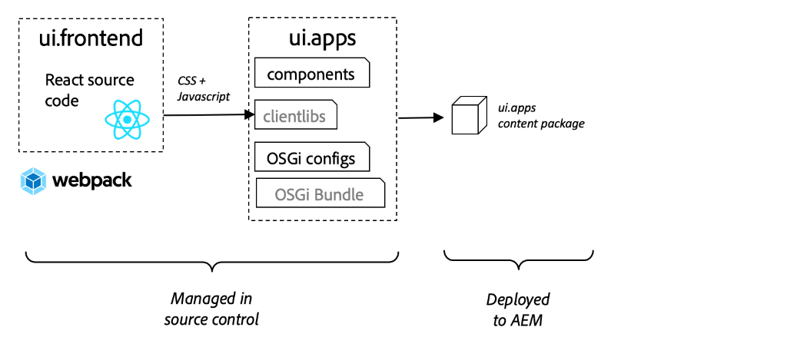
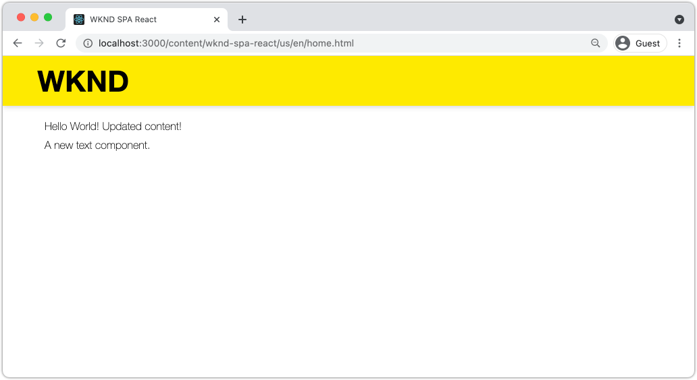

# 整合SPA {#developer-workflow}

瞭解如何將在React中撰寫的單頁應用程式(SPA)原始程式碼與Adobe Experience Manager (AEM)專案整合。 瞭解如何使用現代前端工具（如Webpack開發伺服器），以針對SPA JSON模型API快速開發AEM。

## 目標

1. 瞭解SPA專案如何與AEM和使用者端程式庫整合。
2. 瞭解如何使用Webpack開發伺服器來進行專屬的前端開發。
3. 探索如何使用 **proxy** 和靜態 **模擬** 用於針對AEM JSON模型API開發的檔案。

## 您將建置的內容

在本章中，您將會對SPA進行幾項細微的變更，以瞭解其如何與AEM整合。
本章將新增 `Header` 元件至SPA。 建置此專案的程式中 **靜態** `Header` 元件使用了數種AEM SPA開發方法。


*SPA已擴充以新增靜態 `Header` 元件*

## 先決條件

檢閱設定所需的工具和指示 [本機開發環境](overview.md#local-dev-environment). 本章是 [建立專案](create-project.md) 但您只需要關注啟用了SPA的有效AEM專案就可以了。

## 整合方法 {#integration-approach}

在AEM專案中建立了兩個模組： `ui.apps` 和 `ui.frontend`.

此 `ui.frontend` 模組是 [webpack](https://webpack.js.org/) 包含所有SPA原始程式碼的專案。 大部分的SPA開發和測試都是在webpack專案中完成的。 觸發生產組建時，會使用webpack建置及編譯SPA。 編譯的成品（CSS和JavaScript）會複製到 `ui.apps` 然後部署至AEM執行階段的模組。



*SPA整合的高層級說明。*

有關前端建置的其他資訊可以是 [可在此處找到](https://experienceleague.adobe.com/docs/experience-manager-core-components/using/developing/archetype/uifrontend-react.html).

## Inspect與SPA整合 {#inspect-spa-integration}

接下來，檢查 `ui.frontend` 此模組將說明自動產生的SPA [AEM專案原型](https://experienceleague.adobe.com/docs/experience-manager-core-components/using/developing/archetype/uifrontend-react.html).

1. 在您選擇的IDE中，開啟您的AEM專案。 本教學課程將使用 [Visual Studio Code IDE](https://experienceleague.adobe.com/docs/experience-manager-learn/cloud-service/local-development-environment-set-up/development-tools.html#microsoft-visual-studio-code).

   

1. 展開並檢查 `ui.frontend` 資料夾。 開啟檔案 `ui.frontend/package.json`

1. 在 `dependencies` 您應該會看到數個與 `react` 包含 `react-scripts`

   此 `ui.frontend` 是根據 [建立React應用程式](https://create-react-app.dev/) 或CRA的簡稱。 此 `react-scripts` 版本會指出使用的CRA版本。

1. 也有數個相依性前置詞 `@adobe`：

   ```json
   "@adobe/aem-react-editable-components": "~1.1.2",
   "@adobe/aem-spa-component-mapping": "~1.1.0",
   "@adobe/aem-spa-page-model-manager": "~1.3.3",
   "@adobe/aem-core-components-react-base": "1.1.8",
   "@adobe/aem-core-components-react-spa": "1.1.7",
   ```

   上述模組構成 [AEM SPA編輯器JS SDK](https://experienceleague.adobe.com/docs/experience-manager-65/developing/headless/spas/spa-blueprint.html) 並提供功能，以便將SPA元件對應至AEM元件。

   此外還包括 [AEM WCM元件 — React核心實施](https://github.com/adobe/aem-react-core-wcm-components-base) 和 [AEM WCM元件 — Spa編輯器 — React Core實作](https://github.com/adobe/aem-react-core-wcm-components-spa). 這是一組可重複使用的UI元件，對應至現成可用的AEM元件。 這些模組的設計用途與樣式皆符合您專案的需求。

1. 在 `package.json` 檔案有好幾個 `scripts` 已定義：

   ```json
   "scripts": {
       "start": "react-scripts start",
       "build": "react-scripts build && clientlib",
       "test": "react-scripts test",
       "eject": "react-scripts eject",
   }
   ```

   這些是已建立的標準建置指令碼 [可用](https://create-react-app.dev/docs/available-scripts) 建立React應用程式。

   唯一的區別是加入了 `&& clientlib` 至 `build` 指令碼。 這個額外的指令負責將編譯的SPA複製到 `ui.apps` 模組作為建置期間的使用者端程式庫。

   npm模組 [aem-clientlib-generator](https://github.com/wcm-io-frontend/aem-clientlib-generator) 用於促成此過程。

1. Inspect檔案 `ui.frontend/clientlib.config.js`. 此設定檔的使用者為 [aem-clientlib-generator](https://github.com/wcm-io-frontend/aem-clientlib-generator#clientlibconfigjs) 以決定如何產生使用者端資源庫。

1. Inspect檔案 `ui.frontend/pom.xml`. 此檔案會轉換 `ui.frontend` 資料夾放入 [Maven模組](https://maven.apache.org/guides/mini/guide-multiple-modules.html). 此 `pom.xml` 檔案已更新為使用 [frontend-maven-plugin](https://github.com/eirslett/frontend-maven-plugin) 至 **測試** 和 **版本編號** 在Maven建置期間的SPA。

1. Inspect檔案 `index.js` 在 `ui.frontend/src/index.js`：

   ```js
   //ui.frontend/src/index.js
   ...
   document.addEventListener('DOMContentLoaded', () => {
       ModelManager.initialize().then(pageModel => {
           const history = createBrowserHistory();
           render(
           <Router history={history}>
               <App
               history={history}
               cqChildren={pageModel[Constants.CHILDREN_PROP]}
               cqItems={pageModel[Constants.ITEMS_PROP]}
               cqItemsOrder={pageModel[Constants.ITEMS_ORDER_PROP]}
               cqPath={pageModel[Constants.PATH_PROP]}
               locationPathname={window.location.pathname}
               />
           </Router>,
           document.getElementById('spa-root')
           );
       });
   });
   ```

   `index.js` 是SPA的進入點。 `ModelManager` 是由AEM SPA編輯器JS SDK提供。 它負責呼叫並插入 `pageModel` （JSON內容）放入應用程式中。

1. Inspect檔案 `import-components.js` 在 `ui.frontend/src/components/import-components.js`. 此檔案會立即匯入 **React核心元件** 並使其可用於專案。 我們將在下一章中檢查AEM內容與SPA元件的對應。

## 新增靜態SPA元件 {#static-spa-component}

接下來，將新元件新增至SPA，並將變更部署至本機AEM執行個體。 這是一個簡單的變更，只是為了說明SPA如何更新。

1. 在 `ui.frontend` 模組，下 `ui.frontend/src/components` 建立名為的新資料夾 `Header`.
1. 建立名為的檔案 `Header.js` 在 `Header` 資料夾。

   

1. 填入 `Header.js` ，其功能如下：

   ```js
   //Header.js
   import React, {Component} from 'react';
   
   export default class Header extends Component {
   
       render() {
           return (
                   <header className="Header">
                       <div className="Header-container">
                           <h1>WKND</h1>
                       </div>
                   </header>
           );
       }
   }
   ```

   以上是將輸出靜態文字字串的標準React元件。

1. 開啟檔案 `ui.frontend/src/App.js`. 這是應用程式進入點。
1. 進行下列更新： `App.js` 以包含靜態 `Header`：

   ```diff
     import { Page, withModel } from '@adobe/aem-react-editable-components';
     import React from 'react';
   + import Header from './components/Header/Header';
   
     // This component is the application entry point
     class App extends Page {
     render() {
         return (
         <div>
   +       <Header />
            {this.childComponents}
            {this.childPages}
        </div>
   ```

1. 開啟新終端機，並導覽至 `ui.frontend` 資料夾並執行 `npm run build` 命令：

   ```shell
   $ cd aem-guides-wknd-spa
   $ cd ui.frontend
   $ npm run build
   ...
   Compiled successfully.
   
   File sizes after gzip:
   
   118.95 KB (-33 B)  build/static/js/2.489f399a.chunk.js
   1.11 KB (+48 B)    build/static/js/main.6cfa5095.chunk.js
   806 B              build/static/js/runtime-main.42b998df.js
   451 B              build/static/css/main.e57bbe8a.chunk.css
   ```

1. 導覽至 `ui.apps` 資料夾。 下 `ui.apps/src/main/content/jcr_root/apps/wknd-spa-react/clientlibs/clientlib-react` 您應該會看到編譯的SPA檔案是從`ui.frontend/build` 資料夾。

   

1. 返回終端機並導覽至 `ui.apps` 資料夾。 執行下列Maven命令：

   ```shell
   $ cd ../ui.apps
   $ mvn clean install -PautoInstallPackage
   ...
   [INFO] ------------------------------------------------------------------------
   [INFO] BUILD SUCCESS
   [INFO] ------------------------------------------------------------------------
   [INFO] Total time:  9.629 s
   [INFO] Finished at: 2020-05-04T17:48:07-07:00
   [INFO] ------------------------------------------------------------------------
   ```

   這將部署 `ui.apps` 封裝到AEM的本機執行個體。

1. 開啟瀏覽器標籤並導覽至 [http://localhost:4502/editor.html/content/wknd-spa-react/us/en/home.html](http://localhost:4502/editor.html/content/wknd-spa-react/us/en/home.html). 您現在應該會看到 `Header` 在SPA中顯示的元件。

   

   從專案的根觸發Maven組建時(即 `mvn clean install -PautoInstallSinglePackage`)。 您現在應該瞭解SPA與AEM使用者端程式庫之間整合的基本概念。 請注意，您仍然可以編輯和新增 `Text` AEM中的元件（在靜態元件下） `Header` 元件。

## Webpack Dev Server - JSON API的Proxy {#proxy-json}

如先前練習所示，執行組建並將使用者端程式庫同步至AEM的本機執行個體需要幾分鐘的時間。 這對於最終測試來說是可接受的，但對於大多數SPA開發而言並不理想。

A [webpack-dev-server](https://webpack.js.org/configuration/dev-server/) 可用來快速開發SPA。 SPA是由AEM產生的JSON模型驅動。 在本練習中，來自執行中AEM例項的JSON內容為 **已代理** 至開發伺服器。

1. 返回IDE並開啟檔案 `ui.frontend/package.json`.

   尋找類似以下的一行：

   ```json
   "proxy": "http://localhost:4502",
   ```

   此 [建立React應用程式](https://create-react-app.dev/docs/proxying-api-requests-in-development) 提供簡單的Proxy API要求機制。 所有未知的請求都透過進行代理 `localhost:4502`，本機AEM快速入門。

1. 開啟終端機視窗並導覽至 `ui.frontend` 資料夾。 執行命令 `npm start`：

   ```shell
   $ cd ui.frontend
   $ npm start
   ...
   Compiled successfully!
   
   You can now view wknd-spa-react in the browser.
   
   Local:            http://localhost:3000
   On Your Network:  http://192.168.86.136:3000
   
   Note that the development build is not optimized.
   To create a production build, use npm run build.
   ```

1. 開啟新的瀏覽器索引標籤（如果尚未開啟）並導覽至 [http://localhost:3000/content/wknd-spa-react/us/en/home.html](http://localhost:3000/content/wknd-spa-react/us/en/home.html).

   

   您應該會看到與AEM相同的內容，但未啟用任何撰寫功能。

   >[!NOTE]
   >
   > 由於AEM的安全性需求，您將需要在相同瀏覽器中但在不同索引標籤中登入本機AEM執行個體(http://localhost:4502)。

1. 返回IDE並建立名為的檔案 `Header.css` 在 `src/components/Header` 資料夾。
1. 填入 `Header.css` ，其功能如下：

   ```css
   .Header {
       background-color: #FFEA00;
       width: 100%;
       position: fixed;
       top: 0;
       left: 0;
       z-index: 99;
       box-shadow: 0px 0px 10px 0px rgba(0, 0, 0, 0.24);
   }
   
   .Header-container {
       display: flex;
       max-width: 1024px;
       margin: 0 auto;
       padding: 12px;
   }
   
   .Header-container h1 {
       letter-spacing: 0;
       font-size: 48px;
   }
   ```

   

1. 重新開啟 `Header.js` 並新增以下行以供參照 `Header.css`：

   ```diff
     //Header.js
     import React, {Component} from 'react';
   + require('./Header.css');
   ```

   儲存變更。

1. 瀏覽至 [http://localhost:3000/content/wknd-spa-react/us/en/home.html](http://localhost:3000/content/wknd-spa-react/us/en/home.html) 以自動反映樣式變更。

1. 開啟檔案 `Page.css` 在 `ui.frontend/src/components/Page`. 進行下列變更以修正邊框間距：

   ```css
   .page {
     max-width: 1024px;
     margin: 0 auto;
     padding: 12px;
     padding-top: 50px;
   }
   ```

1. 返回瀏覽器，網址為 [http://localhost:3000/content/wknd-spa-react/us/en/home.html](http://localhost:3000/content/wknd-spa-react/us/en/home.html). 您應該會立即看到應用程式的變更反映出來。

   

   您可以繼續在AEM中進行內容更新，並看到這些更新反映在 **webpack-dev-server**，因為我們正在代理內容。

1. 停止Webpack開發伺服器，使用 `ctrl+c` 在終端機中。

## 將SPA更新部署至AEM

對所做的變更 `Header` 目前僅可透過 **webpack-dev-server**. 將更新的SPA部署到AEM以檢視變更。

1. 導覽至專案的根目錄(`aem-guides-wknd-spa`)並使用Maven將專案部署到AEM：

   ```shell
   $ cd ..
   $ mvn clean install -PautoInstallSinglePackage
   ```

2. 瀏覽至 [http://localhost:4502/editor.html/content/wknd-spa-react/us/en/home.html](http://localhost:4502/editor.html/content/wknd-spa-react/us/en/home.html). 您應該會看到已更新的 `Header` 和樣式已套用。

   

   現在AEM已更新SPA，製作作業可以繼續進行。

## 恭喜！ {#congratulations}

恭喜，您已更新SPA並探索與AEM整合！ 您現在知道如何使用，針對AEM JSON模型API開發SPA **webpack-dev-server**.

### 後續步驟 {#next-steps}

[將SPA元件對應至AEM元件](map-components.md)  — 瞭解如何使用AEM SPA Editor JS SDK將React元件對應至Adobe Experience Manager (AEM)元件。 元件對應可讓使用者在SPA SPA編輯器中對AEM元件進行動態更新，類似於傳統的AEM編寫。

## （額外優惠） Webpack Dev Server - Mock JSON API {#mock-json}

快速開發的另一種方法是使用靜態JSON檔案充當JSON模型。 透過「嘲弄」 JSON，我們移除對本機AEM例項的相依性。 它也能讓前端開發人員更新JSON模型，以測試功能並推動JSON API的變更，之後再由後端開發人員實作。

模擬JSON的初始設定會 **需要本機AEM執行個體**.

1. 返回IDE並瀏覽至 `ui.frontend/public` 並新增名為的新資料夾 `mock-content`.
1. 建立名為的新檔案 `mock.model.json` 下 `ui.frontend/public/mock-content`.
1. 在瀏覽器中導覽至 [http://localhost:4502/content/wknd-spa-react/us/en.model.json](http://localhost:4502/content/wknd-spa-react/us/en.model.json).

   這是由AEM匯出並驅動應用程式的JSON。 複製JSON輸出。

1. 將上一步的JSON輸出貼到檔案中 `mock.model.json`.

   

1. 開啟檔案 `index.html` 在 `ui.frontend/public/index.html`. 更新AEM頁面模型的中繼資料屬性，以指向變數 `%REACT_APP_PAGE_MODEL_PATH%`：

   ```html
       <!-- AEM page model -->
       <meta
          property="cq:pagemodel_root_url"
          content="%REACT_APP_PAGE_MODEL_PATH%"
       />
   ```

   使用變數做為 `cq:pagemodel_root_url` 將更易於在Proxy和模擬json模型之間切換。

1. 開啟檔案 `ui.frontend/.env.development` 並進行以下更新以註釋掉之前的值 `REACT_APP_PAGE_MODEL_PATH` 和 `REACT_APP_API_HOST`：

   ```diff
   + PUBLIC_URL=/
   - PUBLIC_URL=/etc.clientlibs/wknd-spa-react/clientlibs/clientlib-react/resources
   
   - REACT_APP_PAGE_MODEL_PATH=/content/wknd-spa-react/us/en.model.json
   + REACT_APP_PAGE_MODEL_PATH=/mock-content/mock.model.json
   
   - REACT_APP_API_HOST=http://localhost:4502
   + #REACT_APP_API_HOST=http://localhost:4502
   
   REACT_APP_ROOT=/content/wknd-spa-react/us/en/home.html
   ```

1. 如果目前正在執行，請停止 **webpack-dev-server**. 開始 **webpack-dev-server** 從終端機：

   ```shell
   $ cd ui.frontend
   $ npm start
   ```

   瀏覽至 [http://localhost:3000/content/wknd-spa-react/us/en/home.html](http://localhost:3000/content/wknd-spa-react/us/en/home.html) 而且您應該會看到的SPA內容與 **proxy** json.

1. 小幅變更 `mock.model.json` 先前建立的檔案。 您應該會看到更新後的內容立即反映在 **webpack-dev-server**.

   

能夠操控JSON模型並檢視對即時SPA的影響有助於開發人員瞭解JSON模型API。 此外，前端和後端開發均可並行進行。

您現在可以透過切換以下專案來切換使用JSON內容的位置： `env.development` 檔案：

```plain
# JSON API via proxy to AEM
#REACT_APP_PAGE_MODEL_PATH=/content/wknd-spa-react/us/en.model.json
#REACT_APP_API_HOST=http://localhost:4502

# JSON API via static mock file
REACT_APP_PAGE_MODEL_PATH=/mock-content/mock.model.json
```
