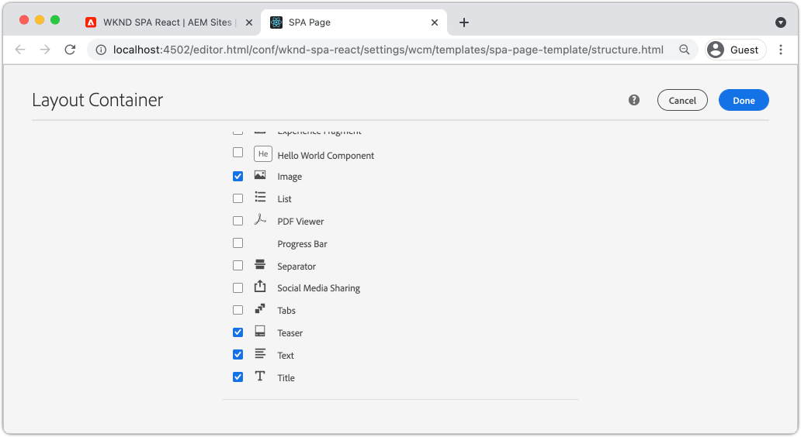

# 將組SPA件映射到組AEM件 {#map-components}

瞭解如何使用Editor JS SDK將React元件AEM映射到Adobe Experience Manager(AEM)SPA元件。 元件映射使用戶能夠對編輯器SPA中的元件進行AEM動SPA態更新，與傳AEM統創作類似。

本章將更深入地介紹AEMJSON模型API，以及如何將元件暴露的JSON內容自AEM動作為道具注入React元件。

## 目標

1. 瞭解如何將元件AEM映射到SPA元件。
1. InspectReact元件如何使用傳遞自的動態屬AEM性。
1. 瞭解如何使用現成設備 [反AEM應核心元件](https://github.com/adobe/aem-react-core-wcm-components-examples)。

## 您將構建的

本章將檢查如何提供 `Text` 組SPA件映射到AEM `Text`元件。 響應核心元件，如 `Image` 將SPA在中使SPA用和創作AEM。 開箱即用功能 **佈局容器** 和 **模板編輯器** 策略還將用於建立外觀更多樣的視圖。


## 必備條件

查看所需的工具和設定 [地方開發環境](overview.md#local-dev-environment)。 本章是 [整合SPA](integrate-spa.md) 但是，後續的所有需要都是啟SPA用的AEM項目。

## 映射方法

基本概念是將元件映SPA射到組AEM件。 組AEM件、運行伺服器端、導出作為JSON模型API一部分的內容。 JSON內容由瀏覽器中運SPA行的客戶端使用。 將建立元件和元SPA件之間AEM的1:1映射。


*將元件映射到反應組AEM件的高級概述*

## Inspect文本元件

的 [項AEM目原型](https://github.com/adobe/aem-project-archetype) 提供 `Text` 映射到的組AEM件 [文本元件](https://experienceleague.adobe.com/docs/experience-manager-core-components/using/components/text.html)。 這是 **內容** 元件，在它呈現 *內容* 的上AEM界。

讓我們看看元件是如何工作的。

### InspectJSON模型

1. 在跳入代SPA碼之前，瞭解提供的JSON模AEM型非常重要。 導航到 [核心元件庫](https://www.aemcomponents.dev/content/core-components-examples/library/core-content/text.html) 並查看文本元件的頁面。 「核心元件庫」提供了所有核心組AEM件的示例。
1. 選擇 **JSON** 頁籤

   

   您應看到以下三個屬性： `text`。 `richText`, `:type`。

   `:type` 是一個保留屬性，它列出 `sling:resourceType` (或路AEM徑)。 值 `:type` 是用於將元件映射AEM到元件SPA的。

   `text` 和 `richText` 是將暴露於元件的附SPA加屬性。

1. 查看JSON輸出位置 [http://localhost:4502/content/wknd-spa-react/us/en.model.json](http://localhost:4502/content/wknd-spa-react/us/en.model.json)。 您應該能夠找到類似以下項的條目：

   ```json
   "text": {
       "id": "text-a647cec03a",
       "text": "<p>Hello World! Updated content!</p>\r\n",
       "richText": true,
       ":type": "wknd-spa-react/components/text",
       "dataLayer": {}
      }
   ```

### Inspect文SPA本

1. 在您選擇的IDE中，開啟AEM項目SPA。 展開 `ui.frontend` 模組並開啟檔案 `Text.js` 在 `ui.frontend/src/components/Text/Text.js`。

1. 我們首先要檢查的是 `class Text` 第40行：

   ```js
   class Text extends Component {
   
       get richTextContent() {
           return (<div
                   id={extractModelId(this.props.cqPath)}
                   data-rte-editelement
                   dangerouslySetInnerHTML={{__html: DOMPurify.sanitize(this.props.text)}} />
                   );
       }
   
       get textContent() {
           return <div>{this.props.text}</div>;
       }
   
       render() {
           return this.props.richText ? this.richTextContent : this.textContent;
       }
   }
   ```

   `Text` 是標準React元件。 元件使用 `this.props.richText` 確定要呈現的內容是富格文本還是純文字檔案。 實際使用的「內容」來自 `this.props.text`。

   為避免潛在的XSS攻擊，富文本通過 `DOMPurify` 使用前 [危險的SetInnerHTML](https://reactjs.org/docs/dom-elements.html#dangerouslysetinnerhtml) 來顯示內容。 回憶 `richText` 和 `text` JSON模型中的屬性。

1. 接下來，請看 `TextEditConfig` 在~29號線：

   ```js
   const TextEditConfig = {
   emptyLabel: 'Text',
   
       isEmpty: function(props) {
           return !props || !props.text || props.text.trim().length < 1;
       }
   };
   ```

   上述代碼負責確定何時在作者環境中呈AEM現佔位符。 如果 `isEmpty` 方法返回 **真** 將呈現佔位符。

1. 最後，請看 `MapTo` 電話：

   ```js
   export default MapTo('wknd-spa-react/components/text')(Text, TextEditConfig);
   ```

   `MapTo` 由編輯AEM器SPAJS SDK提供(`@adobe/aem-react-editable-components`)。 路徑 `wknd-spa-react/components/text` 表示 `sling:resourceType` 的上AEM界。 此路徑與 `:type` 由先前觀察到的JSON模型暴露。 `MapTo` 負責分析JSON模型響應並將正確值傳遞為 `props` 的上SPA界。

   您可以AEM找到 `Text` 元件定義 `ui.apps/src/main/content/jcr_root/apps/wknd-spa-react/components/text`。

## 使用反應核心元件

[WCMAEM元件 — 反應核心實施](https://github.com/adobe/aem-react-core-wcm-components-base) 和 [WCMAEM元件 — Spa編輯器 — React Core實施](https://github.com/adobe/aem-react-core-wcm-components-spa)。 這些是一組可重用的UI元件，它們映射到出廠設AEM備。 大多數項目都可以重新使用這些元件作為自己實施的起點。

1. 在項目代碼中，開啟檔案 `import-components.js` 在 `ui.frontend/src/components`。
此檔案導入映射到SPA元件的所有AEM元件。 鑑於編輯器實SPA現的動態性，我們必SPA須明確引用與可作者組AEM件關聯的任何元件。 這允許作AEM者選擇在應用程式中想使用的任何元件。
1. 以下導入語句包括SPA在項目中編寫的元件：

   ```js
   import './Page/Page';
   import './Text/Text';
   import './Container/Container';
   import './ExperienceFragment/ExperienceFragment';
   ```

1. 還有幾個 `imports` 從 `@adobe/aem-core-components-react-spa` 和 `@adobe/aem-core-components-react-base`。 這些元件將導入React Core元件，並在當前項目中提供。 然後，使用 `MapTo`就像 `Text` 元件示例。

### 更新策AEM略

策略是模板的一AEM項功能，它讓開發人員和超級用戶能夠精確控制哪些元件可用。 React Core Components包含在代碼中，SPA但需要通過策略啟用，然後才能在應用程式中使用。

1. 從「開始AEM」螢幕導航到 **工具** > **模板** > **[WKND反SPA應](http://localhost:4502/libs/wcm/core/content/sites/templates.html/conf/wknd-spa-react)**。

1. 選擇並開啟 **頁SPA面** 的子菜單。

1. 選擇 **佈局容器** 點擊 **政策** 表徵圖：

   

1. 下 **允許的元件** > **WKND反SPA應 — 內容** >檢查 **影像**。 **預告**, **標題**。

   

   下 **預設元件** > **添加映射** 選擇 **影像 — WKNDSPA反應 — 內容** 元件：

   

   輸入 **mime類型** 共 `image/*`。

   按一下 **完成** 保存策略更新。

1. 在 **佈局容器** 按一下 **政策** 表徵圖 **文本** 元件。

   建立名為 **WKND文SPA本**。 下 **插件** > **格式** >選中所有框以啟用其他格式設定選項：

   

   下 **插件** > **段落樣式** >選中該框 **啟用段落樣式**:

   

   按一下 **完成** 的子菜單。

### 作者內容

1. 導航到 **首頁** [http://localhost:4502/editor.html/content/wknd-spa-react/us/en/home.html](http://localhost:4502/editor.html/content/wknd-spa-react/us/en/home.html)。

1. 您現在應該能夠使用其他元件 **影像**。 **預告**, **標題** 的下一頁。

   

1. 您還應能夠編輯 `Text` 元件和添加附加段落樣式 **全屏** 的子菜單。

   

1. 您還應能夠從 **資產查找器**:

   

1. 使用 **標題** 和 **預告** 元件。

1. 通過 [AEM Assets](http://localhost:4502/assets.html/content/dam) 或為標準 [WKND參考站點](https://github.com/adobe/aem-guides-wknd/releases/latest)。 的 [WKND參考站點](https://github.com/adobe/aem-guides-wknd/releases/latest) 包括許多可在WKND上重新使用的圖SPA像。 可以使用 [包管AEM理器](http://localhost:4502/crx/packmgr/index.jsp)。

   

## Inspect佈局容器

支援 **佈局容器** 由編輯器AEM SDK自SPA動提供。 的 **佈局容器**，如名稱所示，為 **容器** 元件。 容器元件是接受JSON結構的元件，表示 *其他* 並動態實例化它們。

讓我們進一步檢查佈局容器。

1. 在瀏覽器中導航到 [http://localhost:4502/content/wknd-spa-react/us/en.model.json](http://localhost:4502/content/wknd-spa-react/us/en.model.json)

   

   的 **佈局容器** 元件 `sling:resourceType` 共 `wcm/foundation/components/responsivegrid` 由編輯器SPA使用 `:type` 財產，就像 `Text` 和 `Image` 元件。

   使用 [佈局模式](https://experienceleague.adobe.com/docs/experience-manager-65/authoring/siteandpage/responsive-layout.html#defining-layouts-layout-mode) 可SPA用。

2. 返回到 [http://localhost:4502/editor.html/content/wknd-spa-react/us/en/home.html](http://localhost:4502/editor.html/content/wknd-spa-react/us/en/home.html)。 添加其他 **影像** 並嘗試使用 **佈局** 選項：

   

3. 重新開啟JSON模型 [http://localhost:4502/content/wknd-spa-react/us/en.model.json](http://localhost:4502/content/wknd-spa-react/us/en.model.json) 觀察 `columnClassNames` 作為JSON的一部分：

   

   類名 `aem-GridColumn--default--4` 指示元件應基於12列網格為4列寬。 有關 [可在此找到響應網格](https://adobe-marketing-cloud.github.io/aem-responsivegrid/)。

4. 返回到IDE和 `ui.apps` 模組在 `ui.apps/src/main/content/jcr_root/apps/wknd-spa-react/clientlibs/clientlib-grid`。 開啟檔案 `less/grid.less`。

   此檔案確定斷點(`default`。 `tablet`, `phone`) **佈局容器**。 此檔案旨在根據項目規範進行自定義。 當前斷點設定為 `1200px` 和 `768px`。

5. 您應該能夠使用 `Text` 建立視圖的元件，如下所示：

   

## 恭喜！ {#congratulations}

恭喜，您學習了如何將組SPA件映AEM射到元件，並且使用了React Core Components。 您還有機會瞭解 **佈局容器**。

### 後續步驟 {#next-steps}

[導航和路由](navigation-routing.md)  — 瞭解使用Editor SDK映射SPA到頁面可以支AEM持中的多SPA個視圖。 動態導航是使用React Router和React Core元件實現的。

## （附加）將配置保留到原始碼管理 {#bonus-configs}

在許多情況下，特別是在項AEM目開始時，將配置（如模板和相關內容策略）保留到原始碼管理非常有價值。 這可確保所有開發人員都針對同一組內容和配置工作，並可確保環境之間的更多一致性。 一旦項目達到一定的成熟度，模板管理的做法就可以轉給特定的用戶群。

接下來的幾個步驟將使用Visual Studio代碼IDE和 [VSCode同AEM步](https://marketplace.visualstudio.com/items?itemName=yamato-ltd.vscode-aem-sync) 但可能正在使用您配置為 **拉** 或 **導入** 本地實例中的內容AEM。

1. 在Visual Studio代碼IDE中，確保 **VSCode同AEM步** 通過Marketplace擴展安裝：

   

2. 展開 **ui.content** 模組，並導航到 `/conf/wknd-spa-react/settings/wcm/templates`。

3. **按一下右鍵** 這樣 `templates` 資料夾和 **從伺服器導AEM入**:

   

4. 重複導入內容的步驟，但選擇 **策略** 位於 `/conf/wknd-spa-react/settings/wcm/templates/policies`。

5. Inspect `filter.xml` 位於 `ui.content/src/main/content/META-INF/vault/filter.xml`。

   ```xml
   <!--ui.content filter.xml-->
   <?xml version="1.0" encoding="UTF-8"?>
    <workspaceFilter version="1.0">
        <filter root="/conf/wknd-spa-react" mode="merge"/>
        <filter root="/content/wknd-spa-react" mode="merge"/>
        <filter root="/content/dam/wknd-spa-react" mode="merge"/>
        <filter root="/content/experience-fragments/wknd-spa-react" mode="merge"/>
    </workspaceFilter>
   ```

   的 `filter.xml` 檔案負責標識將隨軟體包一起安裝的節點的路徑。 注意 `mode="merge"` 在每個篩選器上，指示不會修改現有內容，只添加新內容。 由於內容作者可能正在更新這些路徑，因此代碼部署必須執行 **不** 覆蓋內容。 查看 [FileVault文檔](https://jackrabbit.apache.org/filevault/filter.html) 的子菜單。

   比較 `ui.content/src/main/content/META-INF/vault/filter.xml` 和 `ui.apps/src/main/content/META-INF/vault/filter.xml` 瞭解各模組管理的不同節點。

## （附加）建立自定義映像元件 {#bonus-image}

反SPA應核心元件已提供映像元件。 但是，如果您需要額外的實踐，請建立自己的React實施，該實施與 [影像元件](https://experienceleague.adobe.com/docs/experience-manager-core-components/using/components/image.html)。 的 `Image` 元件是另一個示例 **內容** 元件。

### InspectJSON

跳入代SPA碼前，檢查由提供的JSON模AEM型。

1. 導航到 [核心元件庫中的影像示例](https://www.aemcomponents.dev/content/core-components-examples/library/core-content/image.html)。

   

   屬性 `src`。 `alt`, `title` 將用於填充 `Image` 元件。

   >[!NOTE]
   >
   > 還有其他映像屬性已公開(`lazyEnabled`。 `widths`)，允許開發人員建立自適應和延遲載入元件。 本教程中構建的元件將非常簡單，並將 **不** 使用這些高級屬性。

### 實現映像元件

1. 接下來，建立名為 `Image` 在 `ui.frontend/src/components`。
1. 在 `Image` 資料夾建立名為 `Image.js`。

   

1. 添加以下內容 `import` 聲明 `Image.js`:

   ```js
   import React, {Component} from 'react';
   import {MapTo} from '@adobe/aem-react-editable-components';
   ```

1. 然後添加 `ImageEditConfig` 確定何時在中顯示佔位符AEM:

   ```js
   export const ImageEditConfig = {
   
       emptyLabel: 'Image',
   
       isEmpty: function(props) {
           return !props || !props.src || props.src.trim().length < 1;
       }
   };
   ```

   佔位符將顯示 `src` 未設定屬性。

1. 下一步實施 `Image` 類：

   ```js
    export default class Image extends Component {
   
       get content() {
           return ;
       }
   
       render() {
           if(ImageEditConfig.isEmpty(this.props)) {
               return null;
           }
   
           return (
                   <div className="Image">
                       {this.content}
                   </div>
           );
       }
   }
   ```

   上述代碼將呈現 `` 基於道具 `src`。 `alt`, `title` 由JSON模型傳入。

1. 添加 `MapTo` 將React元件映射到元件的代AEM碼：

   ```js
   MapTo('wknd-spa-react/components/image')(Image, ImageEditConfig);
   ```

   注意字串 `wknd-spa-react/components/image` 與元件的AEM位置 `ui.apps` 地址： `ui.apps/src/main/content/jcr_root/apps/wknd-spa-react/components/image`。

1. 建立名為 `Image.css` 並添加以下內容：

   ```scss
   .Image-src {
       margin: 1rem 0;
       width: 100%;
       border: 0;
   }
   ```

1. 在 `Image.js` 將引用添加到位於 `import` 語句：

   ```js
   import React, {Component} from 'react';
   import {MapTo} from '@adobe/aem-react-editable-components';
   
   require('./Image.css');
   ```

1. 開啟檔案 `ui.frontend/src/components/import-components.js` 並添加對新 `Image` 元件：

   ```js
   import './Page/Page';
   import './Text/Text';
   import './Container/Container';
   import './ExperienceFragment/ExperienceFragment';
   import './Image/Image'; //add reference to Image component
   ```

1. 在 `import-components.js` 注釋掉React Core元件影像：

   ```js
   //MapTo('wknd-spa-react/components/image')(ImageV2, {isEmpty: ImageV2IsEmptyFn});
   ```

   這將確保改用我們的自定義映像元件。

1. 從項目的根部部署代SPA碼到使AEM用Maven:

   ```shell
   $ cd aem-guides-wknd-spa.react
   $ mvn clean install -PautoInstallSinglePackage
   ```

1. InspectSPA進AEM來。 頁面上的任何映像元件應繼續工作。 Inspect已呈現輸出，您應看到自定義映像元件的標籤，而不是反應核心元件。

   *自定義影像元件標籤*

   ```html
   <div class="Image">
       
   </div>
   ```

   *反應核心元件影像標籤*

   ```html
   <div class="cmp-image cq-dd-image">
       
   </div>
   ```

   這是擴展和實施您自己的元件的好介紹。
