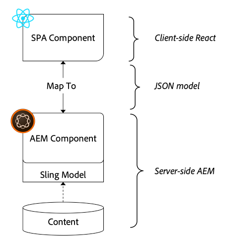
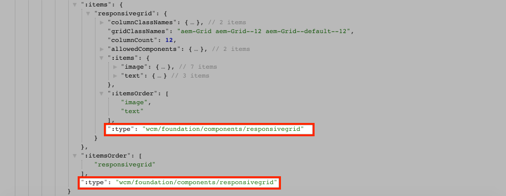

# 將SPA元件對應至AEM元件 {#map-components}

瞭解如何使用AEM SPA Editor JS SDK將React元件對應至Adobe Experience Manager (AEM)元件。 元件對應可讓使用者在SPA SPA編輯器中對AEM元件進行動態更新，類似於傳統的AEM編寫。

本章更深入地探討AEM JSON模型API，以及如何將AEM元件公開的JSON內容作為prop自動插入到React元件中。

## 目標

1. 瞭解如何將AEM元件對應至SPA元件。
1. Inspect React元件如何使用從AEM傳遞的動態屬性。
1. 瞭解如何立即使用 [React AEM Core Components](https://github.com/adobe/aem-react-core-wcm-components-examples).

## 您將建置的內容

本章會檢查提供的 `Text` SPA元件已對應至AEM `Text`元件。 React核心元件，例如 `Image` SPA元件用於SPA並在AEM中編寫。 開箱即用的 **配置容器** 和 **範本編輯器** 原則也可用來建立外觀稍有變化的檢視。


## 先決條件

檢閱設定所需的工具和指示 [本機開發環境](overview.md#local-dev-environment). 本章是 [整合SPA](integrate-spa.md) 但是，您只需要一個已啟用SPA的AEM專案就可以關注章節。

## 對應方法

基本概念是對應SPA元件至AEM元件。 AEM元件，執行伺服器端，將內容匯出為JSON模型API的一部分。 SPA會使用JSON內容，在瀏覽器中執行使用者端。 SPA元件和AEM元件之間會建立1:1對應。



*將AEM元件對應至React元件的高階概觀*

## Inspect文字元件

此 [AEM專案原型](https://github.com/adobe/aem-project-archetype) 提供 `Text` 對應至AEM的元件 [文字元件](https://experienceleague.adobe.com/docs/experience-manager-core-components/using/components/text.html). 以下範例為 **內容** 元件，在其中 *內容* 來自AEM。

讓我們瞭解元件的運作方式。

### Inspect JSON模型

1. 在跳入SPA程式碼之前，請務必瞭解AEM提供的JSON模型。 導覽至 [核心元件庫](https://www.aemcomponents.dev/content/core-components-examples/library/core-content/text.html) 並檢視文字元件的頁面。 核心元件庫提供所有AEM核心元件的範例。
1. 選取 **JSON** 標籤以取得下列其中一個範例：

   

   您應該會看到三個屬性： `text`， `richText`、和 `:type`.

   `:type` 是保留的屬性，其中列出 `sling:resourceType` AEM （或路徑）。 的值 `:type` 是用來將AEM元件對應至SPA元件的專案。

   `text` 和 `richText` 是公開給SPA元件的其他屬性。

1. 在檢視JSON輸出 [http://localhost:4502/content/wknd-spa-react/us/en.model.json](http://localhost:4502/content/wknd-spa-react/us/en.model.json). 您應該能夠找到類似以下的專案：

   ```json
   "text": {
       "id": "text-a647cec03a",
       "text": "<p>Hello World! Updated content!</p>\r\n",
       "richText": true,
       ":type": "wknd-spa-react/components/text",
       "dataLayer": {}
      }
   ```

### Inspect文字SPA元件

1. 在您選擇的IDE中，開啟SPA的AEM專案。 展開 `ui.frontend` 模組並開啟檔案 `Text.js` 在 `ui.frontend/src/components/Text/Text.js`.

1. 我們將檢查的第一個區域是 `class Text` 於第40行：

   ```js
   class Text extends Component {
   
       get richTextContent() {
           return (<div
                   id={extractModelId(this.props.cqPath)}
                   data-rte-editelement
                   dangerouslySetInnerHTML={{__html: DOMPurify.sanitize(this.props.text)}} />
                   );
       }
   
       get textContent() {
           return <div>{this.props.text}</div>;
       }
   
       render() {
           return this.props.richText ? this.richTextContent : this.textContent;
       }
   }
   ```

   `Text` 是標準React元件。 元件使用 `this.props.richText` 以判斷要呈現的內容為RTF文字還是純文字。 實際使用的「內容」來自 `this.props.text`.

   為避免潛在的XSS攻擊，RTF會透過以下方式逸出： `DOMPurify` 使用前 [dangallySetInnerHTML](https://reactjs.org/docs/dom-elements.html#dangerouslysetinnerhtml) 以呈現內容。 撤銷 `richText` 和 `text` JSON模型的屬性。

1. 下一步，開啟 `ui.frontend/src/components/import-components.js` 檢視 `TextEditConfig` 於第86行：

   ```js
   const TextEditConfig = {
   emptyLabel: 'Text',
   
       isEmpty: function(props) {
           return !props || !props.text || props.text.trim().length < 1;
       }
   };
   ```

   上述程式碼負責決定何時在AEM製作環境中呈現預留位置。 如果 `isEmpty` 方法傳回 **true** 則會轉譯預留位置。

1. 最後，檢視 `MapTo` 呼叫第94行：

   ```js
   export default MapTo('wknd-spa-react/components/text')(LazyTextComponent, TextEditConfig);
   ```

   `MapTo` 是由AEM SPA編輯器JS SDK提供(`@adobe/aem-react-editable-components`)。 路徑 `wknd-spa-react/components/text` 代表 `sling:resourceType` AEM的URL名稱。 此路徑會與 `:type` 由先前觀察到的JSON模型公開。 `MapTo` 會負責剖析JSON模型回應，並將正確值傳遞為 `props` 至SPA元件。

   您可以找到AEM `Text` 元件定義於 `ui.apps/src/main/content/jcr_root/apps/wknd-spa-react/components/text`.

## 使用React核心元件

[AEM WCM元件 — React核心實施](https://github.com/adobe/aem-react-core-wcm-components-base) 和 [AEM WCM元件 — Spa編輯器 — React Core實作](https://github.com/adobe/aem-react-core-wcm-components-spa). 這是一組可重複使用的UI元件，對應至現成可用的AEM元件。 大部分專案都可重複使用這些元件，作為自身實施的起點。

1. 在專案程式碼中開啟檔案 `import-components.js` 在 `ui.frontend/src/components`.
此檔案會匯入所有對應至SPA元件的AEM元件。 鑑於SPA Editor實作的動態性質，我們必須明確參考任何繫結至AEM可編寫元件的SPA元件。 這可讓AEM作者選擇在應用程式中隨處使用元件。
1. 下列匯入陳述式包含寫入專案中的SPA元件：

   ```js
   import './Page/Page';
   import './Text/Text';
   import './Container/Container';
   import './ExperienceFragment/ExperienceFragment';
   ```

1. 還有其他幾個 `imports` 從 `@adobe/aem-core-components-react-spa` 和 `@adobe/aem-core-components-react-base`. 這些匯入React Core元件，並用於目前專案。 然後會使用將這些元件對應至專案特定的AEM元件 `MapTo`，就像使用 `Text` 元件範例（在先前）。

### 更新AEM原則

原則是AEM範本的一項功能，可讓開發人員和進階使用者精細控制可使用哪些元件。 React核心元件包含在SPA程式碼中，但必須先透過原則啟用，才能在應用程式中使用。

1. 從AEM開始畫面導覽至 **工具** > **範本** > **[WKND SPA React](http://localhost:4502/libs/wcm/core/content/sites/templates.html/conf/wknd-spa-react)**.

1. 選取並開啟 **SPA頁面** 用於編輯的範本。

1. 選取 **配置容器** 並按一下 **原則** 圖示以編輯原則：

   

1. 在 **允許的元件** > **WKND SPA React — 內容** >勾選 **影像**， **Teaser**、和 **標題**.

   

   在 **預設元件** > **新增對應** 並選擇 **影像 — WKND SPA React — 內容** 元件：

   

   輸入 **mime型別** 之 `image/*`.

   按一下 **完成** 以儲存原則更新。

1. 在 **配置容器** 按一下 **原則** 圖示 **文字** 元件。

   建立名為的新原則 **WKND SPA文字**. 在 **外掛程式** > **格式化** >勾選所有方塊以啟用其他格式選項：

   

   在 **外掛程式** > **段落樣式** >勾選方塊以 **啟用段落樣式**：

   

   按一下 **完成** 以儲存原則更新。

### 作者內容

1. 導覽至 **首頁** [http://localhost:4502/editor.html/content/wknd-spa-react/us/en/home.html](http://localhost:4502/editor.html/content/wknd-spa-react/us/en/home.html).

1. 您現在應該可以使用其他元件 **影像**， **Teaser**、和 **標題** 在頁面上。

   

1. 您也應該能夠編輯 `Text` 元件並新增其他段落樣式 **全熒幕** 模式。

   

1. 您也應該能夠從 **資產尋找器**：

   

1. 使用實驗 **標題** 和 **Teaser** 元件。

1. 透過新增您自己的影像 [AEM Assets](http://localhost:4502/assets.html/content/dam) 或安裝完成的標準程式碼基底 [WKND參考網站](https://github.com/adobe/aem-guides-wknd/releases/latest). 此 [WKND參考網站](https://github.com/adobe/aem-guides-wknd/releases/latest) 包括可在WKND SPA上重複使用的許多影像。 套件可使用以下方式安裝： [AEM封裝管理員](http://localhost:4502/crx/packmgr/index.jsp).

   

## Inspect配置容器

支援 **配置容器** 由AEM SPA Editor SDK自動提供。 此 **配置容器**&#x200B;如名稱所示，是 **容器** 元件。 容器元件是接受JSON結構的元件，表示 *其他* 元件並以動態方式加以例項化。

讓我們進一步檢查配置容器。

1. 在瀏覽器中導覽至 [http://localhost:4502/content/wknd-spa-react/us/en.model.json](http://localhost:4502/content/wknd-spa-react/us/en.model.json)

   

   此 **配置容器** 元件具有 `sling:resourceType` 之 `wcm/foundation/components/responsivegrid` 和，可由SPA編輯器使用 `:type` 屬性，就像 `Text` 和 `Image` 元件。

   相同的功能，使用重新調整元件大小 [版面模式](https://experienceleague.adobe.com/docs/experience-manager-65/authoring/siteandpage/responsive-layout.html#defining-layouts-layout-mode) 可透過SPA編輯器使用。

2. 返回至 [http://localhost:4502/editor.html/content/wknd-spa-react/us/en/home.html](http://localhost:4502/editor.html/content/wknd-spa-react/us/en/home.html). 新增其他 **影像** 元件，然後嘗試使用 **版面** 選項：

   

3. 重新開啟JSON模型 [http://localhost:4502/content/wknd-spa-react/us/en.model.json](http://localhost:4502/content/wknd-spa-react/us/en.model.json) 並觀察 `columnClassNames` 做為JSON的一部分：

   

   類別名稱 `aem-GridColumn--default--4` 表示元件應以12欄格線為4欄寬。 關於的更多詳細資料 [您可以在這裡找到回應式格線](https://adobe-marketing-cloud.github.io/aem-responsivegrid/).

4. 返回IDE並在 `ui.apps` 模組有一個使用者端程式庫定義於 `ui.apps/src/main/content/jcr_root/apps/wknd-spa-react/clientlibs/clientlib-grid`. 開啟檔案 `less/grid.less`.

   此檔案會決定中斷點(`default`， `tablet`、和 `phone`)使用的 **配置容器**. 此檔案旨在根據專案規格自訂。 目前中斷點設定為 `1200px` 和 `768px`.

5. 您應該能夠使用的回應式功能和更新的RTF原則 `Text` 元件以編寫類似以下內容的檢視：

   

## 恭喜！ {#congratulations}

恭喜，您已瞭解如何將SPA元件對應至AEM Components，並且您已使用React Core Components。 您也有機會探索 **配置容器**.

### 後續步驟 {#next-steps}

[導覽與路由](navigation-routing.md)  — 瞭解如何使用SPA編輯器SDK將對應到AEM頁面，以支援SPA中的多個檢視。 動態導覽是使用React Router和React Core Components來實施。

## （額外優點）將組態保留至原始檔控制 {#bonus-configs}

在許多情況下，尤其是在AEM專案開始時，將設定（例如範本和相關內容原則）保留到原始檔控制中很有價值。 這可確保所有開發人員都針對相同的內容和設定集，且可確保環境之間有額外的一致性。 一旦專案達到一定的成熟度，管理範本的實務就可以交給特殊的超級使用者群組。

接下來的幾個步驟將使用Visual Studio Code IDE和 [VSCode AEM Sync](https://marketplace.visualstudio.com/items?itemName=yamato-ltd.vscode-aem-sync) 但可以使用任何工具和您已設定的IDE執行 **提取** 或 **匯入** 來自AEM本機執行個體的內容。

1. 在Visual Studio Code IDE中，確定您已 **VSCode AEM Sync** 透過Marketplace擴充功能安裝：

   

2. 展開 **ui.content** 模組，並導覽至 `/conf/wknd-spa-react/settings/wcm/templates`.

3. **按一下右鍵** 此 `templates` 資料夾並選取 **從AEM伺服器匯入**：

   

4. 重複步驟以匯入內容，但選取 **原則** 資料夾位於 `/conf/wknd-spa-react/settings/wcm/templates/policies`.

5. Inspect `filter.xml` 檔案位於 `ui.content/src/main/content/META-INF/vault/filter.xml`.

   ```xml
   <!--ui.content filter.xml-->
   <?xml version="1.0" encoding="UTF-8"?>
    <workspaceFilter version="1.0">
        <filter root="/conf/wknd-spa-react" mode="merge"/>
        <filter root="/content/wknd-spa-react" mode="merge"/>
        <filter root="/content/dam/wknd-spa-react" mode="merge"/>
        <filter root="/content/experience-fragments/wknd-spa-react" mode="merge"/>
    </workspaceFilter>
   ```

   此 `filter.xml` 檔案負責識別隨套件安裝的節點路徑。 請注意 `mode="merge"` 在表示現有內容將不會被修改的每個篩選器上，只會新增新內容。 由於內容作者可能正在更新這些路徑，因此程式碼部署必須更新 **非** 覆寫內容。 請參閱 [FileVault檔案](https://jackrabbit.apache.org/filevault/filter.html) 以取得有關使用篩選元素的詳細資訊。

   比較 `ui.content/src/main/content/META-INF/vault/filter.xml` 和 `ui.apps/src/main/content/META-INF/vault/filter.xml` 以瞭解每個模組所管理的不同節點。

## （額外練習）建立自訂影像元件 {#bonus-image}

React Core元件已提供SPA影像元件。 不過，如果您想要額外的練習，請建立您自己的React實作，該實作會對應至AEM [影像元件](https://experienceleague.adobe.com/docs/experience-manager-core-components/using/components/image.html). 此 `Image` 元件是 **內容** 元件。

### Inspect和JSON

在跳入SPA程式碼之前，請檢查AEM提供的JSON模型。

1. 導覽至 [核心元件庫中的影像範例](https://www.aemcomponents.dev/content/core-components-examples/library/core-content/image.html).

   

   屬性 `src`， `alt`、和 `title` 用於填入SPA `Image` 元件。

   >[!NOTE]
   >
   > 公開其他影像屬性(`lazyEnabled`， `widths`)可讓開發人員建立最適化和延遲載入元件。 本教學課程中建置的元件非常簡單且可以 **非** 請使用這些進階屬性。

### 實作影像元件

1. 接下來，建立名為的新資料夾 `Image` 在 `ui.frontend/src/components`.
1. 在 `Image` 資料夾建立名為的新檔案 `Image.js`.

   

1. 新增下列專案 `import` 陳述式至 `Image.js`：

   ```js
   import React, {Component} from 'react';
   import {MapTo} from '@adobe/aem-react-editable-components';
   ```

1. 然後新增 `ImageEditConfig` 若要決定何時在AEM中顯示預留位置：

   ```js
   export const ImageEditConfig = {
   
       emptyLabel: 'Image',
   
       isEmpty: function(props) {
           return !props || !props.src || props.src.trim().length < 1;
       }
   };
   ```

   預留位置會顯示 `src` 屬性未設定。

1. 下次實作 `Image` 類別：

   ```js
    export default class Image extends Component {
   
       get content() {
           return ;
       }
   
       render() {
           if(ImageEditConfig.isEmpty(this.props)) {
               return null;
           }
   
           return (
                   <div className="Image">
                       {this.content}
                   </div>
           );
       }
   }
   ```

   上述程式碼將會轉譯 `` 根據prop `src`， `alt`、和 `title` 由JSON模型傳入。

1. 新增 `MapTo` 將React元件對應至AEM元件的程式碼：

   ```js
   MapTo('wknd-spa-react/components/image')(Image, ImageEditConfig);
   ```

   記下字串 `wknd-spa-react/components/image` 對應至AEM元件在中的位置 `ui.apps` 於： `ui.apps/src/main/content/jcr_root/apps/wknd-spa-react/components/image`.

1. 建立名為的新檔案 `Image.css` 在同一目錄中並新增下列專案：

   ```scss
   .Image-src {
       margin: 1rem 0;
       width: 100%;
       border: 0;
   }
   ```

1. 在 `Image.js` 在檔案的頂端下方新增對檔案的參照 `import` 陳述式：

   ```js
   import React, {Component} from 'react';
   import {MapTo} from '@adobe/aem-react-editable-components';
   
   require('./Image.css');
   ```

1. 開啟檔案 `ui.frontend/src/components/import-components.js` 並新增參考至新的 `Image` 元件：

   ```js
   import './Page/Page';
   import './Text/Text';
   import './Container/Container';
   import './ExperienceFragment/ExperienceFragment';
   import './Image/Image'; //add reference to Image component
   ```

1. 在 `import-components.js` 註解React核心元件影像：

   ```js
   //MapTo('wknd-spa-react/components/image')(ImageV2, {isEmpty: ImageV2IsEmptyFn});
   ```

   這將確保改用我們的自訂影像元件。

1. 從專案的根使用Maven將SPA程式碼部署到AEM：

   ```shell
   $ cd aem-guides-wknd-spa.react
   $ mvn clean install -PautoInstallSinglePackage
   ```

1. 在AEM中Inspect SPA。 頁面上的任何影像元件都應繼續運作。 Inspect呈現的輸出結果，您應該會看到自訂影像元件的標籤，而不是React核心元件。

   *自訂影像元件標籤*

   ```html
   <div class="Image">
       
   </div>
   ```

   *React核心元件影像標籤*

   ```html
   <div class="cmp-image cq-dd-image">
       
   </div>
   ```

   這是擴充及實作您自己的元件的絕佳簡介。
