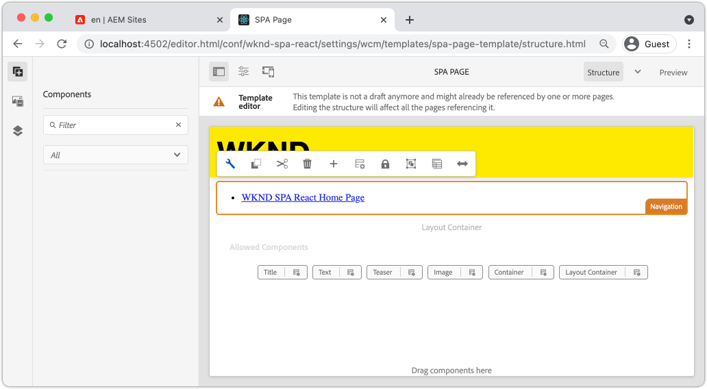

# 新增導覽和路由 {#navigation-routing}

瞭解如何使用SPA編輯器SDK將對應到AEM頁面，以支援SPA中的多個檢視。 動態導覽是使用React Router和React Core Components來實施。

## 目標

1. 瞭解使用SPA編輯器時可用的SPA模型路由選項。
1. 瞭解如何使用[React Router](https://reacttraining.com/react-router)，在SPA的不同檢視之間瀏覽。
1. 使用AEM React核心元件來實作由AEM頁面階層驅動的動態導覽。

## 您將建置的內容

本章會將導覽新增至AEM中的SPA。 導覽功能表是由AEM頁面階層所驅動，並將使用[導覽核心元件](https://experienceleague.adobe.com/docs/experience-manager-core-components/using/wcm-components/navigation.html)提供的JSON模型。


## 先決條件

檢閱設定[本機開發環境](overview.md#local-dev-environment)所需的工具和指示。 本章是[Map Components](map-components.md)章節的延續，但您只需要將已啟用SPA的AEM專案部署到本機AEM執行個體即可。

## 將導覽新增至範本 {#add-navigation-template}

1. 開啟瀏覽器並登入AEM，[http://localhost:4502/](http://localhost:4502/)。 起始程式碼基底應該已經部署。
1. 瀏覽至&#x200B;**SPA頁面範本**： [http://localhost:4502/editor.html/conf/wknd-spa-react/settings/wcm/templates/spa-page-template/structure.html](http://localhost:4502/editor.html/conf/wknd-spa-react/settings/wcm/templates/spa-page-template/structure.html)。
1. 選取最外層的&#x200B;**根配置容器**，然後按一下它的&#x200B;**原則**&#x200B;圖示。 請注意，**not**&#x200B;選取&#x200B;**配置容器**&#x200B;已解除製作鎖定。

   

1. 建立名稱為&#x200B;**SPA結構**&#x200B;的新原則：

   

   在&#x200B;**允許的元件** > **一般** >下，選取&#x200B;**配置容器**&#x200B;元件。

   在&#x200B;**允許的元件** > **WKND SPA REACT — 結構** >選取&#x200B;**導覽**&#x200B;元件下：

   

   在&#x200B;**允許的元件** > **WKND SPA REACT - Content** >選取&#x200B;**影像**&#x200B;和&#x200B;**文字**&#x200B;元件。 您總共應選取4個元件。

   按一下「**完成**」以儲存變更。

1. 重新整理頁面，並在解除鎖定的&#x200B;**配置容器**&#x200B;上方新增&#x200B;**導覽**&#x200B;元件：

   

1. 選取&#x200B;**Navigation**&#x200B;元件，然後按一下其&#x200B;**原則**&#x200B;圖示以編輯原則。
1. 使用&#x200B;**SPA導覽**&#x200B;的&#x200B;**原則標題**&#x200B;建立新原則。

   在&#x200B;**屬性**&#x200B;下：

   * 將&#x200B;**導覽根目錄**&#x200B;設定為`/content/wknd-spa-react/us/en`。
   * 將&#x200B;**排除根層級**&#x200B;設定為&#x200B;**1**。
   * 取消勾選&#x200B;**收集所有子頁面**。
   * 將&#x200B;**導覽結構深度**&#x200B;設定為&#x200B;**3**。

   

   這會收集位於`/content/wknd-spa-react/us/en`下方的導覽2層級。

1. 儲存變更後，您應該會看到填入的`Navigation`成為範本的一部分：

   

## 建立子頁面

接著，在AEM中建立其他頁面，做為SPA中的不同檢視。 我們也會檢查AEM所提供JSON模型的階層結構。

1. 導覽至&#x200B;**網站**&#x200B;主控台： [http://localhost:4502/sites.html/content/wknd-spa-react/us/en/home](http://localhost:4502/sites.html/content/wknd-spa-react/us/en/home)。 選取&#x200B;**WKND SPA React首頁**，然後按一下&#x200B;**建立** > **頁面**：

   

1. 在&#x200B;**範本**&#x200B;下，選取&#x200B;**SPA頁面**。 在「**屬性**」下，輸入&#x200B;**Title**&#x200B;的&#x200B;**Page 1**&#x200B;和&#x200B;**page-1**&#x200B;作為名稱。

   

   按一下「**建立**」，然後在對話方塊快顯視窗中，按一下「**開啟**」以在AEM SPA編輯器中開啟頁面。

1. 將新的&#x200B;**Text**&#x200B;元件新增至主要&#x200B;**配置容器**。 編輯元件並輸入文字： **第1**&#x200B;頁（使用RTE和&#x200B;**H2**&#x200B;元素）。

   

   您可以隨意新增其他內容，例如影像。

1. 返回AEM Sites主控台並重複上述步驟，建立名為&#x200B;**第2**&#x200B;頁的第二個頁面作為&#x200B;**第1**&#x200B;頁的同層級。
1. 最後建立第三頁，**第3**，但做為&#x200B;**第2**&#x200B;頁的&#x200B;**子項**。 完成後，網站階層應如下所示：

   

1. 導覽元件現在可用於導覽至SPA的不同區域。

   

1. 開啟AEM編輯器外部的頁面： [http://localhost:4502/content/wknd-spa-react/us/en/home.html](http://localhost:4502/content/wknd-spa-react/us/en/home.html)。 使用&#x200B;**Navigation**&#x200B;元件導覽至應用程式的不同檢視。

1. 瀏覽時，請使用瀏覽器的開發人員工具來檢查網路要求。 熒幕擷取畫面如下：Google Chrome瀏覽器。

   

   請注意，在初始頁面載入後，後續導覽不會造成完整頁面重新整理，而且在返回先前造訪的頁面時，網路流量會降至最低。

## 階層頁面JSON模型 {#hierarchy-page-json-model}

接下來，檢查推動SPA多檢視體驗的JSON模型。

1. 在新索引標籤中，開啟AEM提供的JSON模型API： [http://localhost:4502/content/wknd-spa-react/us/en.model.json](http://localhost:4502/content/wknd-spa-react/us/en.model.json)。 使用瀏覽器延伸模組[格式化JSON](https://chrome.google.com/webstore/detail/json-formatter/bcjindcccaagfpapjjmafapmmgkkhgoa)可能會有幫助。

   SPA首次載入時會請求此JSON內容。 外部結構如下所示：

   ```json
   {
   "language": "en",
   "title": "en",
   "templateName": "spa-app-template",
   "designPath": "/libs/settings/wcm/designs/default",
   "cssClassNames": "spa page basicpage",
   ":type": "wknd-spa-react/components/spa",
   ":items": {},
   ":itemsOrder": [],
   ":hierarchyType": "page",
   ":path": "/content/wknd-spa-react/us/en",
   ":children": {
      "/content/wknd-spa-react/us/en/home": {},
      "/content/wknd-spa-react/us/en/home/page-1": {},
      "/content/wknd-spa-react/us/en/home/page-2": {},
      "/content/wknd-spa-react/us/en/home/page-2/page-3": {}
      }
   }
   ```

   在`:children`底下，您應該會看到每個已建立頁面的專案。 所有頁面的內容都在此初始JSON請求中。 透過導覽路由，SPA的後續檢視會快速載入，因為內容在使用者端已經可用。

   在初始JSON要求中載入SPA的&#x200B;**所有**&#x200B;內容是不明智的，因為這會減慢初始頁面載入的速度。 接下來，讓我們檢視如何收集頁面的階層深度。

1. 瀏覽至&#x200B;**SPA根**&#x200B;範本，網址為： [http://localhost:4502/editor.html/conf/wknd-spa-react/settings/wcm/templates/spa-app-template/structure.html](http://localhost:4502/editor.html/conf/wknd-spa-react/settings/wcm/templates/spa-app-template/structure.html)。

   按一下&#x200B;**頁面屬性功能表** > **頁面原則**：

   

1. **SPA Root**&#x200B;範本有一個額外的&#x200B;**階層結構**&#x200B;標籤，可控制所收集的JSON內容。 **結構深度**&#x200B;決定網站階層中要多深才能收集&#x200B;**root**&#x200B;下的子頁面。 您也可以使用&#x200B;**結構模式**&#x200B;欄位，根據規則運算式篩選出其他頁面。

   將&#x200B;**結構深度**&#x200B;更新為&#x200B;**2**：

   

   按一下&#x200B;**完成**&#x200B;儲存原則的變更。

1. 重新開啟JSON模型[http://localhost:4502/content/wknd-spa-react/us/en.model.json](http://localhost:4502/content/wknd-spa-react/us/en.model.json)。

   ```json
   {
   "language": "en",
   "title": "en",
   "templateName": "spa-app-template",
   "designPath": "/libs/settings/wcm/designs/default",
   "cssClassNames": "spa page basicpage",
   ":type": "wknd-spa-react/components/spa",
   ":items": {},
   ":itemsOrder": [],
   ":hierarchyType": "page",
   ":path": "/content/wknd-spa-react/us/en",
   ":children": {
      "/content/wknd-spa-react/us/en/home": {},
      "/content/wknd-spa-react/us/en/home/page-1": {},
      "/content/wknd-spa-react/us/en/home/page-2": {}
      }
   }
   ```

   請注意，**頁面3**&#x200B;路徑已從初始JSON模型中移除： `/content/wknd-spa-react/us/en/home/page-2/page-3`。 這是因為&#x200B;**頁面3**&#x200B;在階層中的層級3，而我們更新原則以僅包含最大深度層級2的內容。

1. 重新開啟SPA首頁： [http://localhost:4502/content/wknd-spa-react/us/en/home.html](http://localhost:4502/content/wknd-spa-react/us/en/home.html)，然後開啟瀏覽器的開發人員工具。

   重新整理頁面，您應該會看到`/content/wknd-spa-react/us/en.model.json` (SPA根目錄)的XHR要求。 請注意，根據教學課程中先前進行的階層深度設定，SPA根範本僅包含三個子頁面。 這不包括&#x200B;**第3**&#x200B;頁。

   

1. 在開發人員工具開啟的狀態下，使用`Navigation`元件直接導覽至&#x200B;**第3**&#x200B;頁：

   請注意，已向`/content/wknd-spa-react/us/en/home/page-2/page-3.model.json`提出新的XHR要求

   

   AEM模型管理員瞭解&#x200B;**頁面3** JSON內容無法使用，並自動觸發其他XHR請求。

1. 透過直接導覽至[http://localhost:4502/content/wknd-spa-react/us/en/home/page-2.html](http://localhost:4502/content/wknd-spa-react/us/en/home/page-2.html)來嘗試深層連結。 另請注意，瀏覽器的返回按鈕仍會繼續運作。

## Inspect React路由  {#react-routing}

已使用[React路由器](https://reactrouter.com/en/main)實作導覽及路由。 React Router是React應用程式的導覽元件集合。 [AEM React Core Components](https://github.com/adobe/aem-react-core-wcm-components-base)使用React Router的功能來實施先前步驟中使用的&#x200B;**導覽**&#x200B;元件。

接下來，檢查React路由器如何與SPA整合，並使用React路由器的[連結](https://reactrouter.com/en/main/components/link)元件進行實驗。

1. 在IDE中，在`ui.frontend/src/index.js`開啟檔案`index.js`。

   ```js
   /* index.js */
   import { Router } from 'react-router-dom';
   ...
   ...
    ModelManager.initialize().then(pageModel => {
       const history = createBrowserHistory();
       render(
       <Router history={history}>
           <App
           history={history}
           cqChildren={pageModel[Constants.CHILDREN_PROP]}
           cqItems={pageModel[Constants.ITEMS_PROP]}
           cqItemsOrder={pageModel[Constants.ITEMS_ORDER_PROP]}
           cqPath={pageModel[Constants.PATH_PROP]}
           locationPathname={window.location.pathname}
           />
       </Router>,
       document.getElementById('spa-root')
       );
   });
   ```

   請注意，`App`已包裝在[React路由器](https://reacttraining.com/react-router)的`Router`元件中。 由AEM SPA編輯器JS SDK提供的`ModelManager`會根據JSON模型API將動態路由新增至AEM頁面。

1. 在`ui.frontend/src/components/Page/Page.js`開啟檔案`Page.js`

   ```js
   class AppPage extends Page {
     get containerProps() {
       let attrs = super.containerProps;
       attrs.className =
         (attrs.className || '') + ' page ' + (this.props.cssClassNames || '');
       return attrs;
     }
   }
   
   export default MapTo('wknd-spa-react/components/page')(
     withComponentMappingContext(withRoute(AppPage))
   );
   ```

   `Page` SPA元件使用`MapTo`函式，將AEM中的&#x200B;**頁面**&#x200B;對應到對應的SPA元件。 `withRoute`公用程式可協助您根據`cqPath`屬性，以動態方式將SPA路由到適當的AEM子頁面。

1. 在`ui.frontend/src/components/Header/Header.js`開啟`Header.js`元件。
1. 更新`Header`以將`<h1>`標籤包裝在[連結](https://reactrouter.com/en/main/components/link)的首頁中：

   ```diff
     //Header.js
     import React, {Component} from 'react';
   + import {Link} from 'react-router-dom';
     require('./Header.css');
   
   export default class Header extends Component {
   
       render() {
           return (
               <header className="Header">
               <div className="Header-container">
   +              <Link to="/content/wknd-spa-react/us/en/home.html">
                       <h1>WKND</h1>
   +              </Link>
               </div>
               </header>
           );
       }
   ```

   我們使用React Router提供的`<Link>`，而不是使用預設的`<a>`錨記標籤。 只要`to=`指向有效的路由，SPA就會切換至該路由，**不會**&#x200B;執行完整頁面重新整理。 在此處，我們只是將連結硬式編碼至首頁，以說明如何使用`Link`。

1. 在`App.test.js`的`ui.frontend/src/App.test.js`更新測試。

   ```diff
   + import { BrowserRouter as Router } from 'react-router-dom';
     import App from './App';
   
     it('renders without crashing', () => {
       const div = document.createElement('div');
   -   ReactDOM.render(<App />, div);
   +   ReactDOM.render(<Router><App /></Router>, div);
     });
   ```

   由於我們在`App.js`中參考的靜態元件中使用React路由器的功能，因此我們需要更新單元測試來說明它。

1. 開啟終端機、導覽至專案的根目錄，然後使用您的Maven技能將專案部署到AEM：

   ```shell
   $ cd aem-guides-wknd-spa.react
   $ mvn clean install -PautoInstallSinglePackage
   ```

1. 導覽至AEM中SPA的其中一個頁面： [http://localhost:4502/content/wknd-spa-react/us/en/home/page-1.html](http://localhost:4502/content/wknd-spa-react/us/en/home/page-1.html)

   請使用`Header`中的連結，而不使用`Navigation`元件來導覽。

   

   請注意，完整頁面重新整理並&#x200B;**未**&#x200B;觸發，且SPA路由運作中。

1. 可選擇使用標準`<a>`錨點標籤來實驗`Header.js`檔案：

   ```js
   <a href="/content/wknd-spa-react/us/en/home.html">
       <h1>WKND</h1>
   </a>
   ```

   這可協助說明SPA路由與一般網頁連結之間的差異。

## 恭喜！ {#congratulations}

恭喜，您已瞭解如何使用SPA編輯器SDK將對應至AEM頁面，以支援SPA中的多個檢視。 已使用React路由器實作動態導覽，並已新增至`Header`元件。
