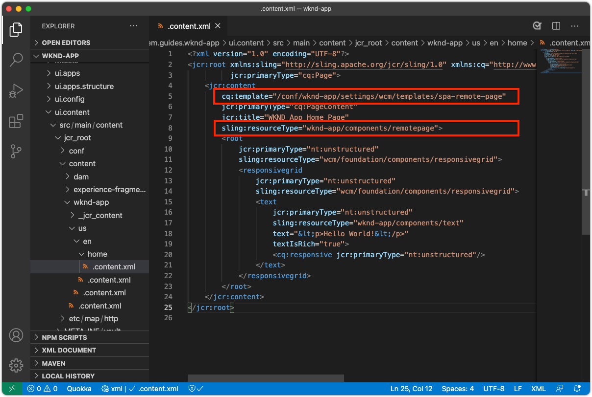

# 設定適用於SPA編輯器的AEM

{{spa-editor-deprecation}}

雖然SPA程式碼基底是在AEM之外進行管理，但需要AEM專案來設定支援的設定和內容要求。 本章會逐步說明如何建立包含必要設定的AEM專案：

* AEM WCM Core Components代理
* AEM遠端SPA頁面Proxy
* AEM遠端SPA頁面範本
* 基線遠端SPA AEM頁面
* 子專案以定義SPA至AEM URL的對應
* OSGi設定資料夾

## 從GitHub下載基礎專案

從Github.com下載`aem-guides-wknd-graphql`專案。 這將包含此專案中使用的一些基準線檔案。

```
$ mkdir -p ~/Code
$ git clone https://github.com/adobe/aem-guides-wknd-graphql.git
$ cd remote-spa-tutorial
```

## 建立AEM專案

建立可管理設定和基準內容的AEM專案。 此專案將在複製的`aem-guides-wknd-graphql`專案的`remote-spa-tutorial`資料夾中產生。

_一律使用最新版本的[AEM Archetype](https://github.com/adobe/aem-project-archetype)。_

```
$ cd ~/Code/aem-guides-wknd-graphql/remote-spa-tutorial
$ mvn -B archetype:generate \
 -D archetypeGroupId=com.adobe.aem \
 -D archetypeArtifactId=aem-project-archetype \
 -D archetypeVersion=39 \
 -D aemVersion=cloud \
 -D appTitle="WKND App" \
 -D appId="wknd-app" \
 -D groupId="com.adobe.aem.guides.wkndapp" \
 -D frontendModule="react"
$ mv ~/Code/aem-guides-wknd-graphql/remote-spa-tutorial/wknd-app ~/Code/aem-guides-wknd-graphql/remote-spa-tutorial/com.adobe.aem.guides.wknd-app
```

最後一個命令只會重新命名AEM專案資料夾(_U)，因此很清楚它是AEM專案，不要與遠端SPA混淆**

指定`frontendModule="react"`時，`ui.frontend`專案並未用於遠端SPA使用案例。 SPA是由AEM從外部開發及管理，且僅使用AEM作為內容API。 專案需要`frontendModule="react"`旗標才能包含`spa-project`個AEM Java™相依性並設定遠端SPA頁面範本。

AEM專案原型會產生下列元素，用於設定AEM以便與SPA整合。

* 在`ui.apps/src/.../apps/wknd-app/components`的&#x200B;**AEM WCM核心元件代理**
* **位於`ui.apps/src/.../apps/wknd-app/components/remotepage`的AEM SPA遠端頁面Proxy**
* 在`ui.content/src/.../conf/wknd-app/settings/wcm/templates`的&#x200B;**AEM頁面範本**
* **子專案以定義位於`ui.content/src/...`的內容對應**
* **位於`ui.content/src/.../content/wknd-app`的基準遠端SPA AEM頁面**
* 在`ui.config/src/.../apps/wknd-app/osgiconfig`的&#x200B;**OSGi設定資料夾**

產生基本AEM專案後，只需調整幾項即可確保SPA Editor與遠端SPA相容。

## 移除ui.frontend專案

由於SPA是遠端SPA，假設是在AEM專案外部開發和管理。 若要避免衝突，請從部署中移除`ui.frontend`專案。 如果未移除`ui.frontend`專案，則會同時在AEM SPA編輯器中載入兩個SPA （在`ui.frontend`專案和遠端SPA中提供的預設SPA）。

1. 在IDE中開啟AEM專案(`~/Code/aem-guides-wknd-graphql/remote-spa-tutorial/com.adobe.aem.guides.wknd-app`)
1. 開啟根`pom.xml`
1. 從`<modules>`清單註解`<module>ui.frontend</module`

   ```
   <modules>
       <module>all</module>
       <module>core</module>
   
       <!-- <module>ui.frontend</module> -->
   
       <module>ui.apps</module>
       <module>ui.apps.structure</module>
       <module>ui.config</module>
       <module>ui.content</module>
       <module>it.tests</module>
       <module>dispatcher</module>
       <module>ui.tests</module>
       <module>analyse</module>
   </modules>
   ```

   `pom.xml`檔案應該如下所示：

   

1. 開啟`ui.apps/pom.xml`
1. 註解`<artifactId>wknd-app.ui.frontend</artifactId>`上的`<dependency>`

   ```
   <dependencies>
   
       <!-- Remote SPA project will provide all frontend resources
       <dependency>
           <groupId>com.adobe.aem.guides.wkndapp</groupId>
           <artifactId>wknd-app.ui.frontend</artifactId>
           <version>${project.version}</version>
           <type>zip</type>
       </dependency>
       --> 
   </dependencies>
   ```

   `ui.apps/pom.xml`檔案應該如下所示：

   

如果AEM專案是在這些變更之前建置，請從位於`ui.apps/src/main/content/jcr_root/apps/wknd-app/clientlibs/clientlib-react`的`ui.apps`專案手動刪除`ui.frontend`產生的使用者端資料庫。

## AEM內容對應

若要讓AEM在SPA編輯器中載入遠端SPA，必須建立SPA路由與用來開啟及編寫內容的AEM頁面之間的對應。

稍後會探討此設定的重要性。

可以使用`/etc/map`中定義的[Sling對應](https://sling.apache.org/documentation/the-sling-engine/mappings-for-resource-resolution.html#root-level-mappings-1)完成對應。

1. 在IDE中，開啟`ui.content`子專案
1. 瀏覽至`src/main/content/jcr_root`
1. 建立資料夾`etc`
1. 在`etc`中建立資料夾`map`
1. 在`map`中建立資料夾`http`
1. 在`http`中，建立包含下列內容的檔案`.content.xml`：

   ```
   <?xml version="1.0" encoding="UTF-8"?>
   <jcr:root xmlns:sling="http://sling.apache.org/jcr/sling/1.0" xmlns:jcr="http://www.jcp.org/jcr/1.0"
       jcr:primaryType="sling:Mapping">
       <localhost_any/>
   </jcr:root>
   ```

1. 在`http`中建立資料夾`localhost_any`
1. 在`localhost_any`中，建立包含下列內容的檔案`.content.xml`：

   ```
   <?xml version="1.0" encoding="UTF-8"?>
   <jcr:root xmlns:sling="http://sling.apache.org/jcr/sling/1.0" xmlns:jcr="http://www.jcp.org/jcr/1.0"
       jcr:primaryType="sling:Mapping"
       sling:match="localhost\\.\\d+">
       <wknd-app-routes-adventure/>
   </jcr:root>
   ```

1. 在`localhost_any`中建立資料夾`wknd-app-routes-adventure`
1. 在`wknd-app-routes-adventure`中，建立包含下列內容的檔案`.content.xml`：

   ```
   <?xml version="1.0" encoding="UTF-8"?>
   
   <!--
   The 'wknd-app-routes-adventure' mapping, maps requests to the SPA's adventure route 
   to it's corresponding page in AEM at /content/wknd-app/us/en/home/adventure/xxx.
   
   Note the adventure AEM pages are created directly in AEM.
   -->
   
   <jcr:root xmlns:sling="http://sling.apache.org/jcr/sling/1.0" xmlns:jcr="http://www.jcp.org/jcr/1.0"
       jcr:primaryType="sling:Mapping"
       sling:match="adventure:.*/([^/]+)/?$"
       sling:internalRedirect="/content/wknd-app/us/en/home/adventure/$1"/>
   ```

1. 將對應節點新增至`ui.content/src/main/content/META-INF/vault/filter.xml`以包含在AEM套件中。

   ```
   <?xml version="1.0" encoding="UTF-8"?>
   <workspaceFilter version="1.0">
       <filter root="/conf/wknd-app" mode="merge"/>
       <filter root="/content/wknd-app" mode="merge"/>
       <filter root="/content/dam/wknd-app/asset.jpg" mode="merge"/>
       <filter root="/content/experience-fragments/wknd-app" mode="merge"/>
   
       <!-- Add the Sling Mapping rules for the WKND App -->
       <filter root="/etc/map" mode="merge"/>
   </workspaceFilter>
   ```

資料夾結構和`.context.xml`檔案應該如下所示：


`filter.xml`檔案應該如下所示：


現在，部署AEM專案時，這些設定會自動包含在內。

Sling對應會影響`http`和`localhost`上執行的AEM，因此僅支援本機開發。 部署至AEM as a Cloud Service時，必須為目標`https`和適當的AEM as a Cloud Service網域新增類似的Sling對應。如需詳細資訊，請參閱[Sling對應檔案](https://sling.apache.org/documentation/the-sling-engine/mappings-for-resource-resolution.html)。

## 跨原始資源共用安全性原則

接下來，設定AEM以保護內容，使只有此SPA可以存取AEM內容。 在AEM](https://experienceleague.adobe.com/docs/experience-manager-learn/foundation/security/develop-for-cross-origin-resource-sharing.html)中設定[跨原始資源共用。

1. 在您的IDE中，開啟`ui.config` Maven子專案
1. 導覽`src/main/content/jcr_root/apps/wknd-app/osgiconfig/config`
1. 建立名為`com.adobe.granite.cors.impl.CORSPolicyImpl~wknd-app_remote-spa.cfg.json`的檔案
1. 將下列專案新增至檔案：

   ```
   {
       "supportscredentials":true,
       "exposedheaders":[
           ""
       ],
       "supportedmethods":[
           "GET",
           "HEAD",
           "POST",
           "OPTIONS"
       ],
       "alloworigin":[
           "https://external-hosted-app", "localhost:3000"
       ],
       "maxage:Integer":1800,
       "alloworiginregexp":[
           ".*"
       ],
       "allowedpaths":[
           ".*"
       ],
       "supportedheaders":[
           "Origin",
           "Accept",
           "X-Requested-With",
           "Content-Type",
           "Access-Control-Request-Method",
           "Access-Control-Request-Headers",
           "authorization"
       ]
   }
   ```

`com.adobe.granite.cors.impl.CORSPolicyImpl~wknd-app_remote-spa.cfg.json`檔案應該如下所示：


主要組態元素為：

* `alloworigin`指定允許哪些主機從AEM擷取內容。
   * 已新增`localhost:3000`以支援本機執行的SPA
   * `https://external-hosted-app`會作為預留位置，取代為遠端SPA託管所在的網域。
* `allowedpaths`指定此CORS設定涵蓋AEM中的哪些路徑。 預設允許存取AEM中的所有內容，不過這可以限定為SPA只能存取的特定路徑，例如： `/content/wknd-app`。

## 將AEM頁面設為遠端SPA頁面範本

AEM專案原型會產生一個專案，已為AEM與遠端SPA的整合做準備，但需要對自動產生的AEM頁面結構進行小幅但重要的調整。 自動產生的AEM頁面的型別必須變更為&#x200B;**遠端SPA頁面**，而非&#x200B;**SPA頁面**。

1. 在您的IDE中，開啟`ui.content`子專案
1. 開啟至`src/main/content/jcr_root/content/wknd-app/us/en/home/.content.xml`
1. 更新此`.content.xml`檔案：

   ```xml
   <?xml version="1.0" encoding="UTF-8"?>
   <jcr:root xmlns:sling="http://sling.apache.org/jcr/sling/1.0" xmlns:cq="http://www.day.com/jcr/cq/1.0" xmlns:jcr="http://www.jcp.org/jcr/1.0" xmlns:nt="http://www.jcp.org/jcr/nt/1.0"
           jcr:primaryType="cq:Page">
       <jcr:content
           cq:template="/conf/wknd-app/settings/wcm/templates/spa-remote-page"
           jcr:primaryType="cq:PageContent"
           jcr:title="WKND App Home Page"
           sling:resourceType="wknd-app/components/remotepage">
           <root
               jcr:primaryType="nt:unstructured"
               sling:resourceType="wcm/foundation/components/responsivegrid">
               <responsivegrid
                   jcr:primaryType="nt:unstructured"
                   sling:resourceType="wcm/foundation/components/responsivegrid">
                   <text
                       jcr:primaryType="nt:unstructured"
                       sling:resourceType="wknd-app/components/text"
                       text="&lt;p>Hello World!&lt;/p>"
                       textIsRich="true">
                       <cq:responsive jcr:primaryType="nt:unstructured"/>
                   </text>
               </responsivegrid>
           </root>
       </jcr:content>
   </jcr:root>
   ```

主要變更為`jcr:content`節點的更新：

* `cq:template`至`/conf/wknd-app/settings/wcm/templates/spa-remote-page`
* `sling:resourceType`至`wknd-app/components/remotepage`

`src/main/content/jcr_root/content/wknd-app/us/en/home/.content.xml`檔案應該如下所示：



這些變更可讓此頁面(在AEM中充當SPA的根頁面)在SPA編輯器中載入遠端SPA。

>[!NOTE]
>
>如果此專案先前已部署至AEM，請確定刪除AEM頁面為「**網站> WKND應用程式>我們>英文> WKND應用程式首頁**」，因為「`ui.content`」專案設為&#x200B;**合併**&#x200B;節點，而非&#x200B;**更新**。

此頁面也可以在AEM本身中移除並重新建立為遠端SPA頁面，但由於此頁面是在`ui.content`專案中自動建立，所以最好在程式碼庫中更新它。

## 將AEM專案部署至AEM SDK

1. 請確定AEM Author服務正在連線埠4502上執行
1. 從命令列，導覽至AEM Maven專案的根目錄
1. 使用Maven將專案部署至您的本機AEM SDK作者服務

   ```
   $ mvn clean install -PautoInstallSinglePackage
   ```

   

## 設定根AEM頁面

部署AEM專案後，最後一個步驟是準備SPA編輯器以載入我們的遠端SPA。 在AEM中，標籤與AEM專案原型產生的SPA根`/content/wknd-app/us/en/home`相對應的AEM頁面。

1. 登入AEM Author
1. 導覽至&#x200B;**網站> WKND應用程式>我們> en**
1. 選取&#x200B;**WKND應用程式首頁**，然後點選&#x200B;**屬性**

   

1. 導覽至&#x200B;**SPA**&#x200B;標籤
1. 填寫&#x200B;**遠端SPA設定**
   1. **SPA主機URL**： `http://localhost:3000`
      1. 遠端SPA根目錄的URL

   

1. 點選&#x200B;**儲存並關閉**

請記住，我們將此頁面的型別變更為&#x200B;**遠端SPA頁面**&#x200B;的型別，這可以讓我們在其&#x200B;**頁面屬性**&#x200B;中看到&#x200B;**SPA**&#x200B;索引標籤。

此設定只能在對應至SPA根目錄的AEM頁面上設定。 此頁面下方的所有AEM頁面都會繼承值。

## 恭喜

您現在已準備AEM的設定，並將其部署至本機AEM作者！ 您現在知道如何：

* 在`ui.frontend`中註解相依性，移除AEM專案原型產生的SPA
* 新增Sling對應至AEM，將SPA路由對應至AEM中的資源
* 設定AEM的跨原始資源共用安全性原則，允許遠端SPA使用來自AEM的內容
* 將AEM專案部署至本機AEM SDK作者服務
* 使用SPA主機URL頁面屬性，將AEM頁面標示為遠端SPA的根

## 後續步驟

設定AEM後，我們可以專注於[使用AEM SPA Editor支援可編輯區域，進而啟動遠端SPA](./spa-bootstrap.md)！
