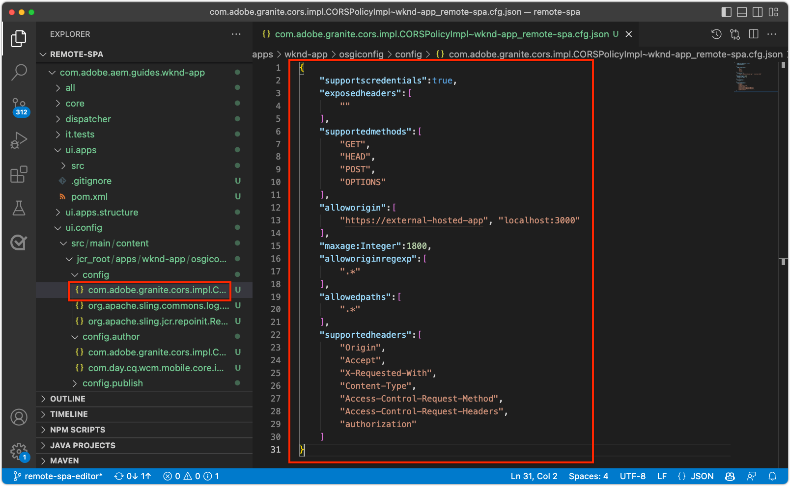

# 設定AEM for SPA Editor

雖然SPA程式碼基底是在AEM外部管理，但需要AEM專案才能設定支援的設定和內容需求。 本章逐步說明包含必要設定之AEM專案的建立：

+ AEM WCM核心元件Proxy
+ AEM遠端SPA頁面代理
+ AEM遠端SPA頁面範本
+ 基線遠端SPA AEM頁面
+ 定義SPA至AEM URL對應的子專案
+ OSGi配置資料夾

## 建立AEM專案

建立AEM專案，以管理設定和基準內容。

_請一律使用 [AEM原型](https://github.com/adobe/aem-project-archetype)._


```
$ mkdir -p ~/Code/wknd-app
$ cd ~/Code/wknd-app
$ mvn -B archetype:generate \
 -D archetypeGroupId=com.adobe.aem \
 -D archetypeArtifactId=aem-project-archetype \
 -D archetypeVersion=27 \
 -D aemVersion=cloud \
 -D appTitle="WKND App" \
 -D appId="wknd-app" \
 -D groupId="com.adobe.aem.guides.wkndapp" \
 -D frontendModule="react"
$ mv ~/Code/wknd-app/wknd-app ~/Code/wknd-app/com.adobe.aem.guides.wknd-app
```

_最後一個命令只需更名AEM專案資料夾，如此即可清楚知道是AEM專案，不要與遠端SPA混淆__

同時 `frontendModule="react"` 已指定，則 `ui.frontend` 專案不用於遠端SPA使用案例。 SPA是從外部開發及管理，僅使用AEM作為內容API。 此 `frontendModule="react"` 專案需要標幟，包括  `spa-project` AEM Java™相依性，並設定遠端SPA頁面範本。

AEM專案原型會產生下列元素，用以設定AEM以與SPA整合。

+ __AEM WCM核心元件Proxy__ at `ui.apps/src/.../apps/wknd-app/components`
+ __AEM SPA遠端頁面代理__ at `ui.apps/src/.../apps/wknd-app/components/remotepage`
+ __AEM頁面範本__ at `ui.content/src/.../conf/wknd-app/settings/wcm/templates`
+ __定義內容對應的子專案__ at `ui.content/src/...`
+ __基線遠端SPA AEM頁面__ at `ui.content/src/.../content/wknd-app`
+ __OSGi配置資料夾__ at `ui.config/src/.../apps/wknd-app/osgiconfig`

產生基本AEM專案後，進行一些調整以確保SPA Editor與Remote SPA相容。

## 移除ui.frontend專案

由於SPA是遠端SPA，因此假設它是在AEM專案外部開發及管理。 若要避免衝突，請移除 `ui.frontend` 從部署中部署專案。 若 `ui.frontend` 「 」專案中未移除兩個SPA，此為「 」中提供的預設SPA `ui.frontend` 專案和遠端SPA會同時在AEM SPA編輯器中載入。

1. 開啟AEM專案(`~/Code/wknd-app/com.adobe.aem.guides.wknd-app`)
1. 開啟根 `pom.xml`
1. 註解 `<module>ui.frontend</module` 從 `<modules>` 清單

   ```
   <modules>
       <module>all</module>
       <module>core</module>
   
       <!-- <module>ui.frontend</module> -->
   
       <module>ui.apps</module>
       <module>ui.apps.structure</module>
       <module>ui.config</module>
       <module>ui.content</module>
       <module>it.tests</module>
       <module>dispatcher</module>
       <module>ui.tests</module>
       <module>analyse</module>
   </modules>
   ```

   此 `pom.xml` 檔案看起來應該像這樣：

   

1. 開啟 `ui.apps/pom.xml`
1. 註解 `<dependency>` on `<artifactId>wknd-app.ui.frontend</artifactId>`

   ```
   <dependencies>
   
       <!-- Remote SPA project will provide all frontend resources
       <dependency>
           <groupId>com.adobe.aem.guides.wkndapp</groupId>
           <artifactId>wknd-app.ui.frontend</artifactId>
           <version>${project.version}</version>
           <type>zip</type>
       </dependency>
       --> 
   </dependencies>
   ```

   此 `ui.apps/pom.xml` 檔案看起來應該像這樣：

   

如果AEM專案是在這些變更前建置，請手動刪除 `ui.frontend` 從 `ui.apps` 專案 `ui.apps/src/main/content/jcr_root/apps/wknd-app/clientlibs/clientlib-react`.

## AEM內容對應

若要讓AEM在SPA編輯器中載入遠端SPA，必須建立SPA路由與用於開啟和製作內容的AEM頁面之間的對應。

稍後將探討此設定的重要性。

對應可透過 [Sling對應](https://sling.apache.org/documentation/the-sling-engine/mappings-for-resource-resolution.html#root-level-mappings-1) 在 `/etc/map`.

1. 在IDE中，開啟 `ui.content` 子項目
1. 導航到  `src/main/content/jcr_root`
1. 建立資料夾 `etc`
1. 在 `etc`，建立資料夾 `map`
1. 在 `map`，建立資料夾 `http`
1. 在 `http`，建立檔案 `.content.xml` 內容：

   ```
   <?xml version="1.0" encoding="UTF-8"?>
   <jcr:root xmlns:sling="http://sling.apache.org/jcr/sling/1.0" xmlns:jcr="http://www.jcp.org/jcr/1.0"
       jcr:primaryType="sling:Mapping">
       <localhost_any/>
   </jcr:root>
   ```

1. 在 `http` ，建立資料夾 `localhost_any`
1. 在 `localhost_any`，建立檔案 `.content.xml` 內容：

   ```
   <?xml version="1.0" encoding="UTF-8"?>
   <jcr:root xmlns:sling="http://sling.apache.org/jcr/sling/1.0" xmlns:jcr="http://www.jcp.org/jcr/1.0"
       jcr:primaryType="sling:Mapping"
       sling:match="localhost\\.\\d+">
       <wknd-app-routes-adventure/>
   </jcr:root>
   ```

1. 在 `localhost_any` ，建立資料夾 `wknd-app-routes-adventure`
1. 在 `wknd-app-routes-adventure`，建立檔案 `.content.xml` 內容：

   ```
   <?xml version="1.0" encoding="UTF-8"?>
   
   <!--
   The 'wknd-app-routes-adventure' mapping, maps requests to the SPA's adventure route 
   to it's corresponding page in AEM at /content/wknd-app/us/en/home/adventure/xxx.
   
   Note the adventure AEM pages are created directly in AEM.
   -->
   
   <jcr:root xmlns:sling="http://sling.apache.org/jcr/sling/1.0" xmlns:jcr="http://www.jcp.org/jcr/1.0"
       jcr:primaryType="sling:Mapping"
       sling:match="adventure:.*/([^/]+)/?$"
       sling:internalRedirect="/content/wknd-app/us/en/home/adventure/$1"/>
   ```

1. 將映射節點添加到 `ui.content/src/main/content/META-INF/vault/filter.xml` 變更為AEM套件中包含的。

   ```
   <?xml version="1.0" encoding="UTF-8"?>
   <workspaceFilter version="1.0">
       <filter root="/conf/wknd-app" mode="merge"/>
       <filter root="/content/wknd-app" mode="merge"/>
       <filter root="/content/dam/wknd-app/asset.jpg" mode="merge"/>
       <filter root="/content/experience-fragments/wknd-app" mode="merge"/>
   
       <!-- Add the Sling Mapping rules for the WKND App -->
       <filter root="/etc/map" mode="merge"/>
   </workspaceFilter>
   ```

資料夾結構和 `.context.xml` 檔案應該如下：


此 `filter.xml` 檔案看起來應該像這樣：


現在，部署AEM專案時，會自動加入這些設定。

Sling對應效果AEM執行於 `http` 和 `localhost`，因此僅支援本地開發。 部署至AEMas a Cloud Service時，必須新增類似的Sling對應至該目標 `https` 和適當的AEMas a Cloud Service網域。如需詳細資訊，請參閱 [Sling對應檔案](https://sling.apache.org/documentation/the-sling-engine/mappings-for-resource-resolution.html).

## 跨原始資源共用安全性原則

接下來，設定AEM以保護內容，讓只有此SPA可以存取AEM內容。 設定 [AEM中的跨原始資源共用](https://experienceleague.adobe.com/docs/experience-manager-learn/foundation/security/develop-for-cross-origin-resource-sharing.html).

1. 在IDE中，開啟 `ui.config` Maven子專案
1. 導覽 `src/main/content/jcr_root/apps/wknd-app/osgiconfig/config`
1. 建立名為 `com.adobe.granite.cors.impl.CORSPolicyImpl~wknd-app_remote-spa.cfg.json`
1. 將下列項目新增至檔案：

   ```
   {
       "supportscredentials":true,
       "exposedheaders":[
           ""
       ],
       "supportedmethods":[
           "GET",
           "HEAD",
           "POST",
           "OPTIONS"
       ],
       "alloworigin":[
           "https://external-hosted-app", "localhost:3000"
       ],
       "maxage:Integer":1800,
       "alloworiginregexp":[
           ".*"
       ],
       "allowedpaths":[
           ".*"
       ],
       "supportedheaders":[
           "Origin",
           "Accept",
           "X-Requested-With",
           "Content-Type",
           "Access-Control-Request-Method",
           "Access-Control-Request-Headers",
           "authorization"
       ]
   }
   ```

此 `com.adobe.granite.cors.impl.CORSPolicyImpl~wknd-app_remote-spa.cfg.json` 檔案看起來應該像這樣：



關鍵設定元素為：

+ `alloworigin` 指定允許哪些主機從AEM擷取內容。
   + `localhost:3000` 新增以支援SPA在本機執行
   + `https://external-hosted-app` 作為預留位置，以Remote SPA托管的網域取代。
+ `allowedpaths` 指定此CORS設定涵蓋的AEM路徑。 預設允許存取AEM中的所有內容，但此值只能限定為SPA可存取的特定路徑，例如： `/content/wknd-app`.

## 將AEM頁面設為遠端SPA頁面範本

AEM專案原型會產生專案，以便與遠端SPA整合，但需要對自動產生的AEM頁面結構進行小幅但重要的調整。 自動產生的AEM頁面必須將其類型變更為 __遠端SPA頁面__，而非 __SPA頁面__.

1. 在IDE中，開啟 `ui.content` 子項目
1. 開啟至 `src/main/content/jcr_root/content/wknd-app/us/en/home/.content.xml`
1. 更新此 `.content.xml` 檔案：

   ```
   <?xml version="1.0" encoding="UTF-8"?>
   <jcr:root xmlns:sling="http://sling.apache.org/jcr/sling/1.0" xmlns:cq="http://www.day.com/jcr/cq/1.0" xmlns:jcr="http://www.jcp.org/jcr/1.0" xmlns:nt="http://www.jcp.org/jcr/nt/1.0"
           jcr:primaryType="cq:Page">
       <jcr:content
           cq:template="/conf/wknd-app/settings/wcm/templates/spa-remote-page"
           jcr:primaryType="cq:PageContent"
           jcr:title="WKND App Home Page"
           sling:resourceType="wknd-app/components/remotepage">
           <root
               jcr:primaryType="nt:unstructured"
               sling:resourceType="wcm/foundation/components/responsivegrid">
               <responsivegrid
                   jcr:primaryType="nt:unstructured"
                   sling:resourceType="wcm/foundation/components/responsivegrid">
                   <text
                       jcr:primaryType="nt:unstructured"
                       sling:resourceType="wknd-app/components/text"
                       text="&lt;p>Hello World!&lt;/p>"
                       textIsRich="true">
                       <cq:responsive jcr:primaryType="nt:unstructured"/>
                   </text>
               </responsivegrid>
           </root>
       </jcr:content>
   </jcr:root>
   ```

主要變更為 `jcr:content` 節點的：

+ `cq:template` 至 `/conf/wknd-app/settings/wcm/templates/spa-remote-page`
+ `sling:resourceType` 至 `wknd-app/components/remotepage`

此 `src/main/content/jcr_root/content/wknd-app/us/en/home/.content.xml` 檔案看起來應該像這樣：


這些變更可讓此頁面(作為AEM中的SPA根)在SPA Editor中載入遠端SPA。

>[!NOTE]
>
>如果此專案先前已部署至AEM，請務必將AEM頁面刪除為 __Sites > WKND應用程式> us > en > WKND應用程式首頁__，作為 `ui.content`  專案設為 __合併__ 節點，而非 __更新__.

此頁面也可移除，並重新建立為AEM本身的遠端SPA頁面，不過，由於此頁面是在 `ui.content` 專案最好在程式碼基底中更新。

## 將AEM專案部署至AEM SDK

1. 確認AEM製作服務在連接埠4502上執行
1. 從命令列，導覽至AEM Maven專案的根目錄
1. 使用Maven將專案部署至本機AEM SDK製作服務

   ```
   $ mvn clean install -PautoInstallSinglePackage
   ```

   

## 設定根AEM頁面

部署AEM專案後，準備SPA Editor以載入遠端SPA的最後一步。 在AEM中，標示與SPA根對應的AEM頁面，`/content/wknd-app/us/en/home`，由AEM專案原型產生。

1. 登入AEM作者
1. 導覽至 __網站> WKND應用程式>我們>結束__
1. 選取 __WKND應用首頁__，然後點選 __屬性__

   

1. 導覽至 __SPA__ 標籤
1. 填寫 __遠端SPA設定__
   + __SPA主機URL__: `http://localhost:3000`
      + 遠端SPA的根目錄URL

   

1. 點選 __儲存並關閉__

請記住，我們已將此頁面的類型變更為 __遠端SPA頁面__，這就是讓我們 __SPA__ 標籤 __頁面屬性__.

只有在AEM頁面上設定此設定，且此頁面與SPA的根目錄對應。 此頁面下方的所有AEM頁面都會繼承值。

## 恭喜

您現在已準備AEM設定，並部署至本機AEM作者！ 您現在知道如何：

+ 移除AEM專案原型產生的SPA，方法是註解 `ui.frontend`
+ 將SPA路由對應至AEM中資源的Sling對應新增至AEM
+ 設定AEM跨原始資源共用安全性原則，讓遠端SPA從AEM使用內容
+ 將AEM專案部署至本機AEM SDK製作服務
+ 使用AEM主機URL頁面屬性，將SPA頁面標示為遠端SPA根

## 後續步驟

設定AEM後，我們可以 [引導遠程SPA](./spa-bootstrap.md) 支援可編輯的區域，使用AEM SPA Editor!
