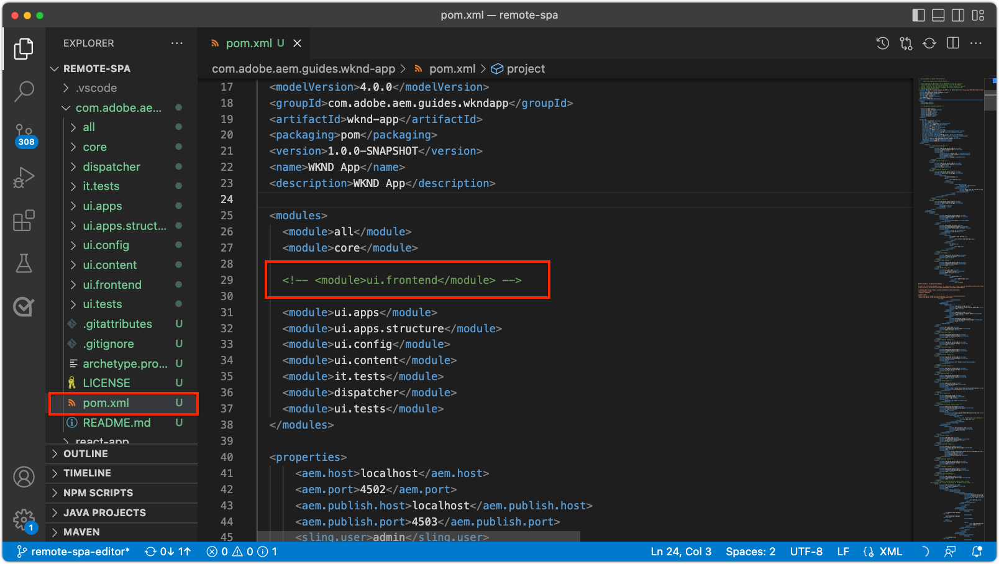

# 為編AEM輯器配SPA置

雖然代碼SPA庫在外部管理AEM，但AEM需要項目來設定支援配置和內容要求。 本章介紹包含必要配置的AEM項目的建立過程：

+ WCMAEM核心元件代理
+ 遠AEM程SPA頁代理
+ 遠AEM程SPA頁模板
+ 基線遠程SPA頁AEM面
+ 要定義到SPAURL映射AEM的子項目
+ OSGi配置資料夾

## 從GitHub下載基本項目

下載 `aem-guides-wknd-graphql` Github.com的項目。 這將包含此項目中使用的某些基線檔案。

```
$ mkdir -p ~/Code
$ git clone https://github.com/adobe/aem-guides-wknd-graphql.git
$ cd remote-spa-tutorial
```

## 建立項AEM目

建立管理AEM配置和基線內容的項目。 此項目將在克隆內生成 `aem-guides-wknd-graphql` 項目 `remote-spa-tutorial` 的子菜單。

_始終使用 [原AEM型](https://github.com/adobe/aem-project-archetype)。_

```
$ cd ~/Code/aem-guides-wknd-graphql/remote-spa-tutorial
$ mvn -B archetype:generate \
 -D archetypeGroupId=com.adobe.aem \
 -D archetypeArtifactId=aem-project-archetype \
 -D archetypeVersion=39 \
 -D aemVersion=cloud \
 -D appTitle="WKND App" \
 -D appId="wknd-app" \
 -D groupId="com.adobe.aem.guides.wkndapp" \
 -D frontendModule="react"
$ mv ~/Code/aem-guides-wknd-graphql/remote-spa-tutorial/wknd-app ~/Code/aem-guides-wknd-graphql/remote-spa-tutorial/com.adobe.aem.guides.wknd-app
```

_最後一個命令只是重AEM命名項目資料夾，這樣就可以清楚地AEM知道是項目，不要與遠程文SPA件__

同時 `frontendModule="react"` 指定， `ui.frontend` 項目不用於遠程SPA用例。 外部SPA開發和管理AEM並僅用AEM作內容API。 的 `frontendModule="react"` 項目包括  `spa-project` AEMJava™依賴項並設定遠程SPA頁模板。

「項AEM目原型」將生成下列元素，這些元素用於配AEM置以與整合SPA。

+ __WCMAEM核心元件代理__ 在 `ui.apps/src/.../apps/wknd-app/components`
+ __AEM遠SPA程頁代理__ 在 `ui.apps/src/.../apps/wknd-app/components/remotepage`
+ __頁AEM面模板__ 在 `ui.content/src/.../conf/wknd-app/settings/wcm/templates`
+ __定義內容映射的子項目__ 在 `ui.content/src/...`
+ __基線遠程SPA頁AEM面__ 在 `ui.content/src/.../content/wknd-app`
+ __OSGi配置資料夾__ 在 `ui.config/src/.../apps/wknd-app/osgiconfig`

生成基AEM本項目後，稍作調整，確保編SPA輯器與遠程SPA相容。

## 刪除ui.frontend項目

由於SPA是遠程SPA設備，假設它是在項目之外開發和管AEM理的。 要避免衝突，請刪除 `ui.frontend` 項目。 如果 `ui.frontend` 項目未刪除， 2SPA，預設SPA值在 `ui.frontend` 在編輯SPA器中同時加AEM載SPAproject和Remote

1. 開啟項AEM目(`~/Code/aem-guides-wknd-graphql/remote-spa-tutorial/com.adobe.aem.guides.wknd-app`)
1. 開啟根 `pom.xml`
1. 注釋 `<module>ui.frontend</module` 從 `<modules>` 清單

   ```
   <modules>
       <module>all</module>
       <module>core</module>
   
       <!-- <module>ui.frontend</module> -->
   
       <module>ui.apps</module>
       <module>ui.apps.structure</module>
       <module>ui.config</module>
       <module>ui.content</module>
       <module>it.tests</module>
       <module>dispatcher</module>
       <module>ui.tests</module>
       <module>analyse</module>
   </modules>
   ```

   的 `pom.xml` 檔案應如下所示：

   

1. 開啟 `ui.apps/pom.xml`
1. 注釋掉 `<dependency>` 上 `<artifactId>wknd-app.ui.frontend</artifactId>`

   ```
   <dependencies>
   
       <!-- Remote SPA project will provide all frontend resources
       <dependency>
           <groupId>com.adobe.aem.guides.wkndapp</groupId>
           <artifactId>wknd-app.ui.frontend</artifactId>
           <version>${project.version}</version>
           <type>zip</type>
       </dependency>
       --> 
   </dependencies>
   ```

   的 `ui.apps/pom.xml` 檔案應如下所示：

   

如果項AEM目是在這些更改之前生成的，請手動刪除 `ui.frontend` 從 `ui.apps` 項目 `ui.apps/src/main/content/jcr_root/apps/wknd-app/clientlibs/clientlib-react`。

## AEM內容映射

要AEM在編輯器SPA中載入遠SPA程，必須建SPA立路由和用於開啟和創AEM作內容的頁面之間的映射。

稍後將探討此配置的重要性。

映射可通過 [Sling映射](https://sling.apache.org/documentation/the-sling-engine/mappings-for-resource-resolution.html#root-level-mappings-1) 定義 `/etc/map`。

1. 在IDE中，開啟 `ui.content` 子項目
1. 瀏覽到  `src/main/content/jcr_root`
1. 建立資料夾 `etc`
1. 在 `etc`，建立資料夾 `map`
1. 在 `map`，建立資料夾 `http`
1. 在 `http`，建立檔案 `.content.xml` 內容：

   ```
   <?xml version="1.0" encoding="UTF-8"?>
   <jcr:root xmlns:sling="http://sling.apache.org/jcr/sling/1.0" xmlns:jcr="http://www.jcp.org/jcr/1.0"
       jcr:primaryType="sling:Mapping">
       <localhost_any/>
   </jcr:root>
   ```

1. 在 `http` ，建立資料夾 `localhost_any`
1. 在 `localhost_any`，建立檔案 `.content.xml` 內容：

   ```
   <?xml version="1.0" encoding="UTF-8"?>
   <jcr:root xmlns:sling="http://sling.apache.org/jcr/sling/1.0" xmlns:jcr="http://www.jcp.org/jcr/1.0"
       jcr:primaryType="sling:Mapping"
       sling:match="localhost\\.\\d+">
       <wknd-app-routes-adventure/>
   </jcr:root>
   ```

1. 在 `localhost_any` ，建立資料夾 `wknd-app-routes-adventure`
1. 在 `wknd-app-routes-adventure`，建立檔案 `.content.xml` 內容：

   ```
   <?xml version="1.0" encoding="UTF-8"?>
   
   <!--
   The 'wknd-app-routes-adventure' mapping, maps requests to the SPA's adventure route 
   to it's corresponding page in AEM at /content/wknd-app/us/en/home/adventure/xxx.
   
   Note the adventure AEM pages are created directly in AEM.
   -->
   
   <jcr:root xmlns:sling="http://sling.apache.org/jcr/sling/1.0" xmlns:jcr="http://www.jcp.org/jcr/1.0"
       jcr:primaryType="sling:Mapping"
       sling:match="adventure:.*/([^/]+)/?$"
       sling:internalRedirect="/content/wknd-app/us/en/home/adventure/$1"/>
   ```

1. 將映射節點添加到 `ui.content/src/main/content/META-INF/vault/filter.xml` 包里的AEM。

   ```
   <?xml version="1.0" encoding="UTF-8"?>
   <workspaceFilter version="1.0">
       <filter root="/conf/wknd-app" mode="merge"/>
       <filter root="/content/wknd-app" mode="merge"/>
       <filter root="/content/dam/wknd-app/asset.jpg" mode="merge"/>
       <filter root="/content/experience-fragments/wknd-app" mode="merge"/>
   
       <!-- Add the Sling Mapping rules for the WKND App -->
       <filter root="/etc/map" mode="merge"/>
   </workspaceFilter>
   ```

資料夾結構和 `.context.xml` 檔案應該如下所示：


的 `filter.xml` 檔案應如下所示：


現在，在部AEM署項目時，將自動包括這些配置。

Sling映射效AEM應運行於 `http` 和 `localhost`只支援地方發展。 部署到AEMas a Cloud Service時，必須添加類似的Sling映射 `https` 和相應的AEMas a Cloud Service域。有關詳細資訊，請參見 [Sling映射文檔](https://sling.apache.org/documentation/the-sling-engine/mappings-for-resource-resolution.html)。

## 跨源資源共用安全策略

接下來，配AEM置以保護內容，以便只SPA有此項可訪AEM問內容。 配置 [跨源資源共AEM享](https://experienceleague.adobe.com/docs/experience-manager-learn/foundation/security/develop-for-cross-origin-resource-sharing.html)。

1. 在IDE中，開啟 `ui.config` 馬文子項目
1. 導覽 `src/main/content/jcr_root/apps/wknd-app/osgiconfig/config`
1. 建立名為 `com.adobe.granite.cors.impl.CORSPolicyImpl~wknd-app_remote-spa.cfg.json`
1. 將以下內容添加到檔案：

   ```
   {
       "supportscredentials":true,
       "exposedheaders":[
           ""
       ],
       "supportedmethods":[
           "GET",
           "HEAD",
           "POST",
           "OPTIONS"
       ],
       "alloworigin":[
           "https://external-hosted-app", "localhost:3000"
       ],
       "maxage:Integer":1800,
       "alloworiginregexp":[
           ".*"
       ],
       "allowedpaths":[
           ".*"
       ],
       "supportedheaders":[
           "Origin",
           "Accept",
           "X-Requested-With",
           "Content-Type",
           "Access-Control-Request-Method",
           "Access-Control-Request-Headers",
           "authorization"
       ]
   }
   ```

的 `com.adobe.granite.cors.impl.CORSPolicyImpl~wknd-app_remote-spa.cfg.json` 檔案應如下所示：


關鍵配置元素包括：

+ `alloworigin` 指定允許從哪些主機檢索內AEM容。
   + `localhost:3000` 已添加以支援本SPA地運行
   + `https://external-hosted-app` 充當要替換為遠程承載的域SPA的佔位符。
+ `allowedpaths` 指定此CORS配AEM置所涵蓋的路徑。 預設值允許訪問中的所有內AEM容，但此範圍僅限於可訪問SPA的特定路徑，例如： `/content/wknd-app`。

## 將頁AEM設定為遠程SPA頁模板

「項AEM目原型」將生成一個為與遠程AEM整合做準備的項SPA目，但需要對自動生成的頁面結構進行小而重要AEM的調整。 自動生成的AEM頁面必須將其類型更改為 __遠程SPA頁__，而不是 __SPA頁__。

1. 在IDE中，開啟 `ui.content` 子項目
1. 開啟到 `src/main/content/jcr_root/content/wknd-app/us/en/home/.content.xml`
1. 更新此 `.content.xml` 檔案：

   ```
   <?xml version="1.0" encoding="UTF-8"?>
   <jcr:root xmlns:sling="http://sling.apache.org/jcr/sling/1.0" xmlns:cq="http://www.day.com/jcr/cq/1.0" xmlns:jcr="http://www.jcp.org/jcr/1.0" xmlns:nt="http://www.jcp.org/jcr/nt/1.0"
           jcr:primaryType="cq:Page">
       <jcr:content
           cq:template="/conf/wknd-app/settings/wcm/templates/spa-remote-page"
           jcr:primaryType="cq:PageContent"
           jcr:title="WKND App Home Page"
           sling:resourceType="wknd-app/components/remotepage">
           <root
               jcr:primaryType="nt:unstructured"
               sling:resourceType="wcm/foundation/components/responsivegrid">
               <responsivegrid
                   jcr:primaryType="nt:unstructured"
                   sling:resourceType="wcm/foundation/components/responsivegrid">
                   <text
                       jcr:primaryType="nt:unstructured"
                       sling:resourceType="wknd-app/components/text"
                       text="&lt;p>Hello World!&lt;/p>"
                       textIsRich="true">
                       <cq:responsive jcr:primaryType="nt:unstructured"/>
                   </text>
               </responsivegrid>
           </root>
       </jcr:content>
   </jcr:root>
   ```

關鍵更改是 `jcr:content` 節點：

+ `cq:template` 至 `/conf/wknd-app/settings/wcm/templates/spa-remote-page`
+ `sling:resourceType` 至 `wknd-app/components/remotepage`

的 `src/main/content/jcr_root/content/wknd-app/us/en/home/.content.xml` 檔案應如下所示：


這些更改允許此頁面(作SPA為AEM根)在編輯器中載入SPA遠程SPA。

>[!NOTE]
>
>如果此項目以前已部署到AEM，請確保將AEM頁面刪除為 __站點> WKND應用程式>我們> en > WKND應用程式首頁__，也請參見Wiki頁。 `ui.content`  項目設定為 __合併__ 節點，而不是 __更新__。

此頁也可以被刪除並重新建立為SPA遠程AEM頁，但是，由於此頁是在 `ui.content` 最好在代碼庫中更新它。

## 將項AEM目部署到AEMSDK

1. 確保AEM Author服務在埠4502上運行
1. 從命令行導航到Maven項目的AEM根
1. 使用Maven將項目部署到本地AEMSDK作者服務

   ```
   $ mvn clean install -PautoInstallSinglePackage
   ```

   

## 配置根頁AEM面

部署AEMProject後，準備編輯器以載入SPA遠程檔案的最後一SPA步。 在AEM中，標AEM記與根對SPA應的頁，`/content/wknd-app/us/en/home`，由項目原型AEM生成。

1. 登錄到AEM作者
1. 導航到 __站點> WKND應用>我們> en__
1. 選擇 __WKND應用首頁__，然後點擊 __屬性__

   

1. 導航到 __SPA__ 頁籤
1. 填寫 __遠程配SPA置__
   + __主SPA機URL__: `http://localhost:3000`
      + 指向遠程的根的URL SPA

   

1. 點擊 __保存並關閉__

請記住，我們已將此頁的類型更改為 __遠程SPA頁__，這就是讓我們看到 __SPA__ 頁籤 __頁面屬性__。

此配置只能在與AEM的根對應的頁面上設SPA置。 此頁AEM面下的所有頁面都繼承該值。

## 恭喜

您現在已準備AEM配置並將其部署到本地作AEM者！ 您現在知道如何：

+ 通過注AEM釋中的依賴項SPA，刪除生成的項目原型 `ui.frontend`
+ 將Sling映射添AEM加到將路SPA由映射到AEM的
+ 設定AEM跨源資源共用安全策略，允許遠SPA程使用AEM內容
+ 將項目AEM部署到本地AEMSDK作者服務
+ 使用「主AEM機URL」頁屬SPA性將頁標籤SPA為遠程根

## 後續步驟

配AEM置後，我們可以 [引導遠程SPA](./spa-bootstrap.md) 支援可編輯區域AEMSPA!
