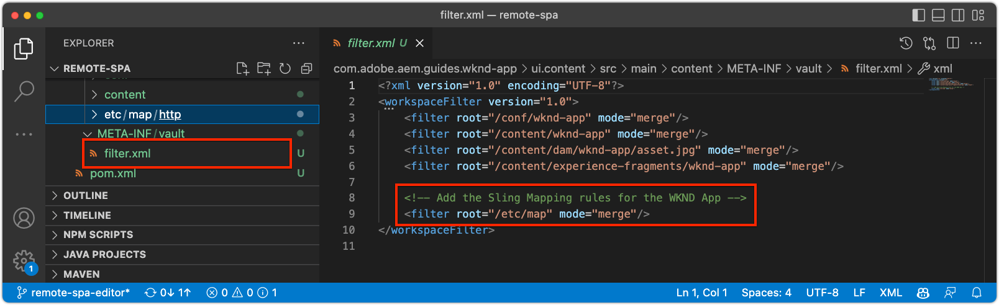

# 為編AEM輯器設SPA定

雖然程SPA式碼基底是在外部管理AEM，但需要AEM專案來設定支援組態和內容需求。 本章將逐步介紹如何建立包含必AEM要配置的項目：

+ AEMWCM核心元件代理
+ AEM遠端SPA頁面Proxy
+ AEM遠端SPA頁面範本
+ 基線遠SPA程AEM頁
+ 子專案以定義SPA至AEMURL對應
+ OSGi配置資料夾

## 建立專AEM案

建立專AEM案，以管理設定和基準內容。

_請務必使用最新版的 [AEMArchetype](https://github.com/adobe/aem-project-archetype)。_


```
$ mkdir -p ~/Code/wknd-app
$ cd ~/Code/wknd-app
$ mvn -B archetype:generate \
 -D archetypeGroupId=com.adobe.aem \
 -D archetypeArtifactId=aem-project-archetype \
 -D archetypeVersion=27 \
 -D aemVersion=cloud \
 -D appTitle="WKND App" \
 -D appId="wknd-app" \
 -D groupId="com.adobe.aem.guides.wkndapp" \
 -D frontendModule="react"
$ mv ~/Code/wknd-app/wknd-app ~/Code/wknd-app/com.adobe.aem.guides.wknd-app
```

_最後一個命令只會重新命名AEM專案資料夾，因此很明顯它是專AEM案，不要與遠端SPA__

指定`frontendModule="react"`時，`ui.frontend`項目不用於遠程使SPA用案例。 外SPA部開發和管理AEM，僅用AEM作內容API。 項目需要`frontendModule="react"`標誌，該標誌包括`spa-project` AEM Java™相關性並設定遠程SPA頁模板。

Project AEM Archetype會產生下列元素，用於設定AEM與整合SPA。

+ __AEMWCM Core Components__ Proxiesat  `ui.content/src/.../apps/wknd-app/components`
+ __AEM遠SPA程頁__ 面  `ui.content/src/.../apps/wknd-app/components/remotepage`
+ __頁AEM面范__ 本  `ui.content/src/.../conf/wknd-app/settings/wcm/templates`
+ __子專案以定義內容__ 對應  `ui.content/src/...`
+ __基線遠程SPA頁AEM__ 數  `ui.content/src/.../content/wknd-app`
+ __OSGi組態資__ 料夾  `ui.config/src/.../apps/wknd-app/osgiconfig`

產生基本專AEM案後，進行一些調整以確保編輯SPA器與遠端的相容SPA性。

## 移除ui.frontend專案

由於SPA是遠程SPA設備，所以假設它是在項目外開發和管理AEM的。 為避免衝突，請將`ui.frontend`項目從部署中刪除。 如果未刪除`ui.frontend`項目，則將SPA在SPA`ui.frontend`項目和Remote中提供的兩個缺SPA省值同時在編輯器中加AEM載SPA。

1. 在AEMIDE中開啟項目(`~/Code/wknd-app/com.adobe.aem.guides.wknd-app`)
1. 開啟根`pom.xml`
1. 從`<modules>`清單中注釋`<module>ui.frontend</module`

   ```
   <modules>
       <module>all</module>
       <module>core</module>
   
       <!-- <module>ui.frontend</module> -->
   
       <module>ui.apps</module>
       <module>ui.apps.structure</module>
       <module>ui.config</module>
       <module>ui.content</module>
       <module>it.tests</module>
       <module>dispatcher</module>
       <module>ui.tests</module>
       <module>analyse</module>
   </modules>
   ```

   `pom.xml`檔案應該如下所示：

   

1. 開啟`ui.apps/pom.xml`
1. 注釋`<artifactId>wknd-app.ui.frontend</artifactId>`上的`<dependency>`

   ```
   <dependencies>
   
       <!-- Remote SPA project will provide all frontend resources
       <dependency>
           <groupId>com.adobe.aem.guides.wkndapp</groupId>
           <artifactId>wknd-app.ui.frontend</artifactId>
           <version>${project.version}</version>
           <type>zip</type>
       </dependency>
       --> 
   </dependencies>
   ```

   `ui.apps/pom.xml`檔案應該如下所示：

   

如果項AEM目是在這些更改之前構建的，請從`ui.apps``ui.apps/src/main/content/jcr_root/apps/wknd-app/clientlibs/clientlib-react`的項目手動刪除`ui.frontend`生成的客戶端庫。

## AEM內容映射

要AEM在編輯器中SPA載入遠SPA程，必須建立路SPA由和用於開啟和編AEM寫內容的頁之間的映射。

稍後將探討此配置的重要性。

映射可以使用[Sling Mapping](https://sling.apache.org/documentation/the-sling-engine/mappings-for-resource-resolution.html#root-level-mappings-1)在`/etc/map`中定義。

1. 在IDE中，開啟`ui.content`子項目
1. 導航到  `src/main/content/jcr_root/etc`
1. 建立資料夾`map`
1. 在`map`中，建立資料夾`http`
1. 在`http`中，建立包含以下內容的檔案`.content.xml`:

   ```
   <?xml version="1.0" encoding="UTF-8"?>
   <jcr:root xmlns:sling="http://sling.apache.org/jcr/sling/1.0" xmlns:jcr="http://www.jcp.org/jcr/1.0"
       jcr:primaryType="sling:Mapping">
       <localhost_any/>
   </jcr:root>
   ```

1. 在`http`中，建立資料夾`localhost_any`
1. 在`localhost_any`中，建立包含以下內容的檔案`.content.xml`:

   ```
   <?xml version="1.0" encoding="UTF-8"?>
   <jcr:root xmlns:sling="http://sling.apache.org/jcr/sling/1.0" xmlns:jcr="http://www.jcp.org/jcr/1.0"
       jcr:primaryType="sling:Mapping"
       sling:match="localhost\\.\\d+">
       <wknd-app-routes-adventure/>
   </jcr:root>
   ```

1. 在`localhost_any`中，建立資料夾`wknd-app-routes-adventure`
1. 在`wknd-app-routes-adventure`中，建立包含以下內容的檔案`.content.xml`:

   ```
   <?xml version="1.0" encoding="UTF-8"?>
   
   <!--
   The 'wknd-app-routes-adventure' mapping, maps requests to the SPA's adventure route 
   to it's corresponding page in AEM at /content/wknd-app/us/en/home/adventure/xxx.
   
   Note the adventure AEM pages will be created directly in AEM.
   -->
   
   <jcr:root xmlns:sling="http://sling.apache.org/jcr/sling/1.0" xmlns:jcr="http://www.jcp.org/jcr/1.0"
       jcr:primaryType="sling:Mapping"
       sling:match="adventure:.*/([^/]+)/?$"
       sling:internalRedirect="/content/wknd-app/us/en/home/adventure/$1"/>
   ```

1. 將映射節點添加到包中包含的`ui.content/src/main/content/META-INF/vault/filter.xml`AEM中。

   ```
   <?xml version="1.0" encoding="UTF-8"?>
   <workspaceFilter version="1.0">
       <filter root="/conf/wknd-app" mode="merge"/>
       <filter root="/content/wknd-app" mode="merge"/>
       <filter root="/content/dam/wknd-app/asset.jpg" mode="merge"/>
       <filter root="/content/experience-fragments/wknd-app" mode="merge"/>
   
       <!-- Add the Sling Mapping rules for the WKND App -->
       <filter root="/etc/map" mode="merge"/>
   </workspaceFilter>
   ```

資料夾結構和`.context.xml`檔案應如下所示：


`filter.xml`檔案應該如下所示：



現在，在部AEM署專案時，會自動包含這些設定。

在`http`和AEM`localhost`上執行的Sling Mapping效果，因此僅支援本機開發。 當部署AEM至Cloud Service時，必須新增類似的Sling Mappings，定位`https`和適當的AEMCloud Service網域。 如需詳細資訊，請參閱[Sling Mapping檔案](https://sling.apache.org/documentation/the-sling-engine/mappings-for-resource-resolution.html)。

## 跨原始資源共用安全性原則

接著，設AEM定以保護內容，如此才SPA能存取AEM內容。 C在](https://experienceleague.adobe.com/docs/experience-manager-learn/foundation/security/develop-for-cross-origin-resource-sharing.html)中配置[跨源AEM資源共用。

1. 在IDE中，開啟`ui.config` Maven子項目
1. 導覽 `src/main/content/jcr_root/apps/wknd-app/osgiconfig/config`
1. 建立名為`com.adobe.granite.cors.impl.CORSPolicyImpl~wknd-app_remote-spa.cfg.json`的檔案
1. 將下列項目新增至檔案：

   ```
   {
       "supportscredentials":true,
       "exposedheaders":[
           ""
       ],
       "supportedmethods":[
           "GET",
           "HEAD",
           "POST",
           "OPTIONS"
       ],
       "alloworigin":[
           "https://external-hosted-app", "localhost:3000"
       ],
       "maxage:Integer":1800,
       "alloworiginregexp":[
           ".*"
       ],
       "allowedpaths":[
           ".*"
       ],
       "supportedheaders":[
           "Origin",
           "Accept",
           "X-Requested-With",
           "Content-Type",
           "Access-Control-Request-Method",
           "Access-Control-Request-Headers",
           "Authorization"
       ]
   }
   ```

`com.adobe.granite.cors.impl.CORSPolicyImpl~wknd-app_remote-spa.cfg.json`檔案應該如下所示：


關鍵配置元素包括：

+ `alloworigin` 指定允許哪些主機檢索內容AEM。
   + `localhost:3000` 已新增以支援本SPA機執行
   + `https://external-hosted-app` 當作預留位置，以取代為遠端托管SPA的網域。
+ `allowedpaths` 指定此CORS設AEM定涵蓋的路徑。預設允許訪問中的所有內容AEM，但可以僅將其範圍限定為SPA可訪問的特定路徑，例如：`/content/wknd-app`。

## 將頁AEM面設為遠端SPA頁面範本

Project AEM Archetype會產生專案，以AEM與Remote整合SPA，但需要對自動產生的頁面結構進行小幅但重要AEM的調整。 自動產生AEM的頁面類型必須變更為SPA __遠端頁面__，而非SPA __頁面__。

1. 在IDE中，開啟`ui.content`子項目
1. 開啟至`src/main/content/jcr_root/content/wknd-app/us/en/home/.content.xml`
1. 使用以下命令更新此`.content.xml`檔案：

   ```
   <?xml version="1.0" encoding="UTF-8"?>
   <jcr:root xmlns:sling="http://sling.apache.org/jcr/sling/1.0" xmlns:cq="http://www.day.com/jcr/cq/1.0" xmlns:jcr="http://www.jcp.org/jcr/1.0" xmlns:nt="http://www.jcp.org/jcr/nt/1.0"
           jcr:primaryType="cq:Page">
       <jcr:content
           cq:template="/conf/wknd-app/settings/wcm/templates/spa-remote-page"
           jcr:primaryType="cq:PageContent"
           jcr:title="WKND App Home Page"
           sling:resourceType="wknd-app/components/remotepage">
           <root
               jcr:primaryType="nt:unstructured"
               sling:resourceType="wcm/foundation/components/responsivegrid">
               <responsivegrid
                   jcr:primaryType="nt:unstructured"
                   sling:resourceType="wcm/foundation/components/responsivegrid">
                   <text
                       jcr:primaryType="nt:unstructured"
                       sling:resourceType="wknd-app/components/text"
                       text="&lt;p>Hello World!&lt;/p>"
                       textIsRich="true">
                       <cq:responsive jcr:primaryType="nt:unstructured"/>
                   </text>
               </responsivegrid>
           </root>
       </jcr:content>
   </jcr:root>
   ```

密鑰更改是對`jcr:content`節點的更新：

+ `cq:template` 至 `/conf/wknd-app/settings/wcm/templates/spa-remote-page`
+ `sling:resourceType` 至 `wknd-app/components/remotepage`

`src/main/content/jcr_root/content/wknd-app/us/en/home/.content.xml`檔案應該如下所示：


這些變更可讓此頁面(其作SPA為root AEM)在編輯器中載SPA入遠端SPA。

>[!NOTE]
>
>如果此專案先前是要刪除的AEM，請務必將頁面刪除為AEM __網站> WKND應用程式>我們> en > WKND應用程式首頁__，因為`ui.content`專案設定為&#x200B;__merge__&#x200B;節點，而非&#x200B;__update__。

此頁面本身也可以移除並重新建立為SPA「遠端頁面」AEM，但是，由於此頁面是在`ui.content`專案中自動建立的，因此最好在程式碼庫中更新它。

## 將專案部AEM署至AEMSDK

1. 確保AEM Author服務在埠4502上執行
1. 從命令行導航到Maven項目的根AEM目錄
1. 使用Maven將專案部署至您的本機AEMSDK作者服務

   ```
   $ mvn clean install -PautoInstallSinglePackage
   ```

   

## 設定根頁AEM面

在部AEM署Project後，準備Editor以載入我們的Remote的最後一SPA個步驟SPA。 在AEM中，標AEM記與SPAProject Archetype生成的根`/content/wknd-app/us/en/home`AEM頁。

1. 登入AEM作者
1. 導覽至「__網站> WKND應用程式>我們> en__」
1. 選擇&#x200B;__WKND應用程式首頁__，然後點選&#x200B;__屬性__

   

1. 導覽至&#x200B;__SPA__&#x200B;標籤
1. 填寫&#x200B;__遠程配SPA置__
   + __SPA主機URL__:  `http://localhost:3000`
      + 遠端根目錄的URL SPA

   

1. 點選&#x200B;__儲存並關閉__

請記住，我們將此頁面的類型變更為&#x200B;__遠端頁面SPA__，這可讓我們在其&#x200B;__頁面屬性__&#x200B;中查看&lt;a2/SPA>__標籤。__

此配置只能在與AEM根目錄對應的頁面上設SPA置。 此頁AEM面下的所有頁面都會繼承值。

## 恭喜

您現在已準備好AEM設定，並將它們部署至您的本機作AEM者！ 您現在知道如何：

+ 刪除AEM生成的項SPA目原型，方法是注釋`ui.frontend`中的從屬關係
+ 將Sling Mappings新增至AEM，將路SPA由對應至
+ 設定AEM跨原始資源共用安全性原則，讓遠端SPA從
+ 將專案部AEM署至您的本機AEMSDK作者服務
+ 使用「AEM主機URL」頁SPA面屬性將頁SPA面標示為遠端根

## 後續步驟

配AEM置後，我們可以專注於使用編輯器啟動SPARemote ](./spa-bootstrap.md)並支援可編輯區AEM域SPA![