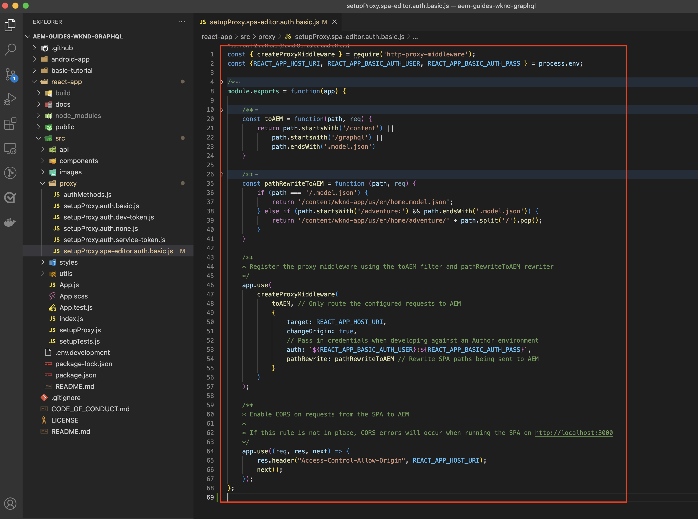

# BootstrapSPA編輯SPA器

在可編輯區域添加到遠程中之前SPA，必須使用編輯器JavaScript SDK和其AEMSPA他幾種配置來引導可編輯區域。

## 安AEM裝編SPA輯器JS SDK npm依賴項

首先，查AEM看SPAReact項目的npm依賴項並安裝它們。

+ [`@adobe/aem-spa-page-model-manager`](https://github.com/adobe/aem-spa-page-model-manager) :提供用於從中檢索內容的APIAEM。
+ [`@adobe/aem-spa-component-mapping`](https://github.com/adobe/aem-spa-component-mapping) :提供將內容映射到AEM元件的SPAAPI。
+ [`@adobe/aem-react-editable-components` v2](https://github.com/adobe/aem-react-editable-components) :提供用於構建自定義組SPA件的API，並提供常用實現，如 `AEMPage` 反應元件。

```shell
$ cd ~/Code/aem-guides-wknd-graphql/remote-spa-tutorial/react-app
$ npm install @adobe/aem-spa-page-model-manager 
$ npm install @adobe/aem-spa-component-mapping
$ npm install @adobe/aem-react-editable-components 
```

## 審SPA查環境變數

必須向遠程系統公開幾個環境變SPA量，以便它知道如何與其交AEM互。

1. 開啟遠SPA程項目 `~/Code/aem-guides-wknd-graphql/remote-spa-tutorial/react-app` 在IDE中
1. 開啟檔案 `.env.development`
1. 在檔案中，注意鍵，並根據需要更新：

   ```
   REACT_APP_HOST_URI=http://localhost:4502
   
   REACT_APP_USE_PROXY=true
   
   REACT_APP_AUTH_METHOD=basic
   
   REACT_APP_BASIC_AUTH_USER=admin
   REACT_APP_BASIC_AUTH_PASS=admin
   ```

   

   *請記住，React中的自定義環境變數必須前置詞為 `REACT_APP_`。*

   + `REACT_APP_HOST_URI`:遠程連接到的AEM服務的方案SPA和主機。
      + 此值根據環境(本AEM地、開發、階段或生產)和服務類AEM型（作者與發佈）是否更改
   + `REACT_APP_USE_PROXY`:這通過向react開發伺服器通知代理請求(例如， `/content, /graphql, .model.json` 使用 `http-proxy-middleware` 中。
   + `REACT_APP_AUTH_METHOD`:服務請AEM求的驗證方法，選項為「service-token」、「dev-token」、「basic」或留空以用於無驗證用例
      + 與AEM作者一起使用時需要
      + 可能與AEM發佈一起使用（如果內容受保護）
      + 通過基AEM本身份驗證針對SDK進行開發支援本地帳戶。 這是本教程中使用的方法。
      + 與AEMas a Cloud Service整合 [訪問令牌](https://experienceleague.adobe.com/docs/experience-manager-learn/getting-started-with-aem-headless/authentication/overview.html)
   + `REACT_APP_BASIC_AUTH_USER`:AEM __用戶名__ 來驗SPA證內AEM容。
   + `REACT_APP_BASIC_AUTH_PASS`:AEM __密碼__ 來驗SPA證內AEM容。

## 整合ModelManager API

使AEM用應SPA用可用的npm依賴項初始AEM化 `ModelManager` 在 `index.js` 先 `ReactDOM.render(...)` 調用。

的 [模型管理器](https://github.com/adobe/aem-spa-page-model-manager/blob/master/src/ModelManager.ts) 負責連接到檢AEM索可編輯內容。

1. 在IDE中打SPA開遠程項目
1. 開啟檔案 `src/index.js`
1. 添加導入 `ModelManager` 並在 `root.render(..)` 調用，

   ```javascript
   ...
   import { ModelManager } from "@adobe/aem-spa-page-model-manager";
   
   // Initialize the ModelManager before invoking root.render(..).
   ModelManager.initializeAsync();
   
   const container = document.getElementById('root');
   const root = createRoot(container);
   root.render(<App />);
   ```

的 `src/index.js` 檔案應如下所示：


## 設定內部代SPA理

建立可編SPA輯時，最好設定 [內部代理SPA](https://create-react-app.dev/docs/proxying-api-requests-in-development/#configuring-the-proxy-manually)，配置為將相應請求路由到AEM。 這是通過 [http代理中間件](https://www.npmjs.com/package/http-proxy-middleware) npm模組，基本WKNDGraphQL應用已安裝。

1. 在IDE中打SPA開遠程項目
1. 在以下位置開啟檔案 `src/proxy/setupProxy.spa-editor.auth.basic.js`
1. 使用以下代碼更新檔案：

   ```javascript
   const { createProxyMiddleware } = require('http-proxy-middleware');
   const {REACT_APP_HOST_URI, REACT_APP_BASIC_AUTH_USER, REACT_APP_BASIC_AUTH_PASS } = process.env;
   
   /*
       Set up a proxy with AEM for local development
       In a production environment this proxy should be set up at the webserver level or absolute URLs should be used.
   */
   module.exports = function(app) {
   
       /**
       * Filter to check if the request should be re-routed to AEM. The paths to be re-routed at:
       * - Starts with /content (AEM content)
       * - Starts with /graphql (AEM graphQL endpoint)
       * - Ends with .model.json (AEM Content Services)
       * 
       * @param {*} path the path being requested of the SPA
       * @param {*} req the request object
       * @returns true if the SPA request should be re-routed to AEM
       */
       const toAEM = function(path, req) {
           return path.startsWith('/content') || 
               path.startsWith('/graphql') ||
               path.endsWith('.model.json')
       }
   
       /**
       * Re-writes URLs being proxied to AEM such that they can resolve to real AEM resources
       * - The "root" case of `/.model.json` are rewritten to the SPA's home page in AEM
       * - .model.json requests for /adventure:xxx routes are rewritten to their corresponding adventure page under /content/wknd-app/us/en/home/adventure/ 
       * 
       * @param {*} path the path being requested of the SPA
       * @param {*} req the request object
       * @returns returns a re-written path, or nothing to use the @param path
       */
       const pathRewriteToAEM = function (path, req) { 
           if (path === '/.model.json') {
               return '/content/wknd-app/us/en/home.model.json';
           } else if (path.startsWith('/adventure/') && path.endsWith('.model.json')) {
               return '/content/wknd-app/us/en/home/adventure/' + path.split('/').pop();
           }    
       }
   
       /**
       * Register the proxy middleware using the toAEM filter and pathRewriteToAEM rewriter 
       */
       app.use(
           createProxyMiddleware(
               toAEM, // Only route the configured requests to AEM
               {
                   target: REACT_APP_HOST_URI,
                   changeOrigin: true,
                   // Pass in credentials when developing against an Author environment
                   auth: `${REACT_APP_BASIC_AUTH_USER}:${REACT_APP_BASIC_AUTH_PASS}`,
                   pathRewrite: pathRewriteToAEM // Rewrite SPA paths being sent to AEM
               }
           )
       );
   
       /**
       * Enable CORS on requests from the SPA to AEM
       * 
       * If this rule is not in place, CORS errors will occur when running the SPA on http://localhost:3000
       */
       app.use((req, res, next) => {
           res.header("Access-Control-Allow-Origin", REACT_APP_HOST_URI);
           next();
       });
   };
   ```

   的 `setupProxy.spa-editor.auth.basic.js` 檔案應如下所示：

   

   此代理配置可執行兩個主要操作：

   1. 代理對(`http://localhost:3000`)至 `http://localhost:4502`
      + 它僅代理其路徑與指示應由其提供服務的模式匹配的請求AEM，如中所定義 `toAEM(path, req)`。
      + 它重寫SPA到其對應頁AEM面的路徑，如中所定義 `pathRewriteToAEM(path, req)`
   1. 它將CORS頭添加到所有請求中，以允許訪問AEM內容，如定義 `res.header("Access-Control-Allow-Origin", REACT_APP_HOST_URI);`
      + 如果未添加此項，則在中載入內容時AEM會出現SPACORS錯誤。

1. 開啟檔案 `src/setupProxy.js`
1. 查看指向 `setupProxy.spa-editor.auth.basic` 代理配置檔案：

   ```
   ...
   case BASIC:
   // Use user/pass for local development with Local Author Env
   return require('./proxy/setupProxy.spa-editor.auth.basic');
   ...
   ```

注意，對 `src/setupProxy.js` 或者引用的檔案需要重新啟SPA動。

## 靜態資SPA源

靜SPA態資源（如WKND徽標和載入圖形）需要更新其源URL，以強制從遠程主機SPA載入。 如果左側相對，SPA則在編SPA輯器中載入創作時，這些URL預設使用AEM主機而不SPA是主機，結果生成404個請求，如下圖所示。


要解決此問題，請使遠程承載的靜態資源使用SPA包含遠程源的絕SPA對路徑。

1. 在IDESPA中開啟項目
1. 開啟環SPA境變數檔案 `src/.env.development` 並為公共URI添SPA加變數：

   ```
   ...
   # The base URI the SPA is accessed from
   REACT_APP_PUBLIC_URI=http://localhost:3000
   ```

   _部署到AEMas a Cloud Service時，需要對 `.env` 的子菜單。_

1. 開啟檔案 `src/App.js`
1. 從環境SPA變數導入SPA公共URI

   ```javascript
   const {  REACT_APP_PUBLIC_URI } = process.env;
   
   function App() { ... }
   ```

1. 在WKND徽標前加前置詞 `` 與 `REACT_APP_PUBLIC_URI` 以迫使對方解SPA決。

   ```html
   
   ```

1. 對中載入影像執行相同操作 `src/components/Loading.js`

   ```javascript
   const { REACT_APP_PUBLIC_URI } = process.env;
   
   class Loading extends Component {
   
       render() {
           return (<div className="loading">
               
           </div>);
       }
   }
   ```

1. 對於 __兩個實例__ 按鈕 `src/components/AdventureDetails.js`

   ```javascript
   const { REACT_APP_PUBLIC_URI } = process.env;
   
   function AdventureDetail(props) {
       ...
       render() {
           
       }
   }
   ```

的 `App.js`。 `Loading.js`, `AdventureDetails.js` 檔案應該如下所示：


## 響AEM應網格

要支SPA持編輯器的佈局模式，SPA必須將AEMResponsive Grid CSS整合到SPA中。 不要擔心 — 此網格系統僅適用於可編輯的容器，並且您可以使用您選擇的網格系統來驅動其餘部分的布SPA局。

將響應AEM網格SCSS檔案添加到SPA。

1. 在IDESPA中開啟項目
1. 下載並將以下兩個檔案複製到 `src/styles`
   + [_grid.scs](./assets/spa-bootstrap/_grid.scss)
      + 響應網AEM格SCSS發生器
   + [_grid-init.scss](./assets/spa-bootstrap/_grid-init.scss)
      + 調用 `_grid.scss` 使用SPA特定斷點（案頭和移動）和列(12)。
1. 開啟 `src/App.scss` 導入 `./styles/grid-init.scss`

   ```scss
   ...
   @import './styles/grid-init';
   ...
   ```

的 `_grid.scss` 和 `_grid-init.scss` 檔案應該如下所示：


現在SPA包括支援添加到容AEM器的元件的佈局模式所需AEM的CSS。

## 實用程式類

將以下實用程式類中的副本複製到您的React應用程式項目中。

+ [RoutedLink.js](./assets/spa-bootstrap/RoutedLink.js) 至 `~/Code/aem-guides-wknd-graphql/remote-spa-tutorial/react-app/src/components/editable/core/RoutedLink.js`
+ [EditorPlaceholder.js](./assets/spa-bootstrap/EditorPlaceholder.js) 至 `~/Code/aem-guides-wknd-graphql/remote-spa-tutorial/react-app/src/components/editable/core/util/EditorPlaceholder.js`
+ [與ConditionalPlaceholder.js](./assets/spa-bootstrap/withConditionalPlaceholder.js) 至 `~/Code/aem-guides-wknd-graphql/remote-spa-tutorial/react-app/src/components/editable/core/util/withConditionalPlaceholder.js`
+ [與StandardBaseCssClass.js](./assets/spa-bootstrap/withStandardBaseCssClass.js) 至 `~/Code/aem-guides-wknd-graphql/remote-spa-tutorial/react-app/src/components/editable/core/util/withStandardBaseCssClass.js`


## 啟動SPA

現在SPA已啟動與的集AEM成，讓我們運行SPA並查看它的外觀！

1. 在命令行上，導航到項目的根SPA部
1. 使用SPA普通命令（如果尚未執行）啟動

   ```shell
   $ cd ~/Code/aem-guides-wknd-graphql/remote-spa-tutorial/react-app
   $ npm install 
   $ npm run start
   ```

1. 瀏SPA覽 [http://localhost:3000](http://localhost:3000)。 一切都應該好看！


## 在編SPA輯器中AEM打SPA開

運行SPA時 [http://localhost:3000](http://localhost:3000)，讓我們使用編輯AEM器打SPA開它。 尚無可編輯SPA內容，這隻驗證SPA中的AEM。

1. 登錄到AEM作者
1. 導航到 __站點> WKND應用>我們> en__
1. 選擇 __WKND應用首頁__ 點擊 __編輯__，然後SPA顯示。

   

1. 切換到 __預覽__ 使用右上角的模式切換器
1. 在

   

## 恭喜！

您已引導遠程編SPA輯器AEM兼SPA容！ 您現在知道如何：

+ 將編AEM輯器SPAJS SDK npm依賴項添加到項SPA目
+ 配置環SPA境變數
+ 將ModelManager API與
+ 為設定內部代理SPA，以便將適當的內容請求路由到AEM
+ 在編輯器上SPA下文中解決靜態資源問SPA題
+ 添AEM加響應網格CSS以支援可編輯容器AEM的佈局

## 後續步驟

現在，我們已經實現了與編輯器的相容AEM性基SPA準，我們可以開始引入可編輯區域。 我們首先研究如何 [固定可編輯元件](./spa-fixed-component.md) 的上界SPA。
