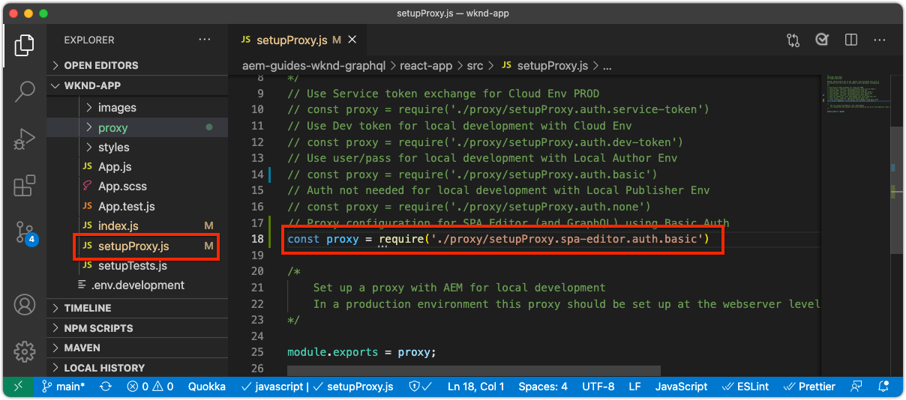

# Bootstrap遠SPA程編SPA輯器

在將可編輯區域新增至遠端之前SPA，必須使用AEMSPA Editor JavaScript SDK和其他幾種組態來啟動。

## 新增AEM編SPA輯器JS SDK npm相依性

首先，將AEMnpmSPA依賴項添加到React項目。

```
$ cd ~/Code/wknd-app/aem-guides-wknd-graphql/react-app
$ npm install --save \
    @adobe/aem-spa-page-model-manager \
    @adobe/aem-spa-component-mapping \
    @adobe/aem-react-editable-components \
    @adobe/aem-core-components-react-base \
    @adobe/aem-core-components-react-spa
```

+ `@adobe/aem-spa-page-model-manager` 提供從中擷取內容的APIAEM。
+ `@adobe/aem-spa-component-mapping` 提供將內容對應至元AEM件的SPAAPI。
+ ` @adobe/aem-react-editable-components` 提供建立自訂元SPA件的API，並提供常用實作，例如 `AEMPage` React元件。
+ `@adobe/aem-core-components-react-base` 提供一套現成可用的React元件，它們與WCM核心元件無縫整合，AEM不受編輯SPA器限制。這些主要包括內容元件，例如：
   + 標題
   + 文字
   + 階層連結
   + 等等。
+ `@adobe/aem-core-components-react-spa` 提供一套現成可用的React元件，可與AEMWCM核心元件無縫整合，但需要編SPA輯器。這些元件主要包含來自`@adobe/aem-core-components-react-base`的內容元件，例如：
   + 容器
   + 傳送
   + 等等。

## 查看環SPA境變數

數個環境變數必須暴露在遠程SPA環境中，以便它知道如何與AEM交互。

1. 在IDESPA的`~/Code/wknd-app/aem-guides-wknd-graphql/react-app`處開啟遠程項目
1. 開啟檔案`.env.development`
1. 新增檔案，並特別注意按鍵：

   ```
   REACT_APP_HOST_URI=http://localhost:4502
   REACT_APP_AUTHORIZATION=admin:admin
   ```

   

   *請記住，React中的自訂環境變數必須加上前置詞 `REACT_APP_`。*

   + `REACT_APP_AEM_URI`:遠程連接到的AEM服務的SPA方案和主機。
      + 此值會根據環境(本AEM機、開發、舞台或生產)和服務類型(作者與發AEM布)而改變
   + `REACT_APP_AEM_AUTH`:驗證用來檢SPA索內AEM容的憑證。
      + 與AEM Author搭配使用所需
      + 可能需要與AEM Publish搭配使用（如果內容受到保護）
      + 針對SDK進行AEM開發可透過基本驗證支援本機帳戶。 這是本教學課程中使用的方法。
      + 當與整AEM合為Cloud Service時，請使用[access token](https://experienceleague.adobe.com/docs/experience-manager-learn/getting-started-with-aem-headless/authentication/overview.html)

## 整合ModelManager API

在應AEM用程SPA式可用的npm相依性下，在呼叫AEM`ReactDOM.render(...)`之前，在專案的`index.js`中初始化`ModelManager`。

[ModelManager](https://www.npmjs.com/package/@adobe/aem-spa-page-model-manager)負責連接到檢索可AEM編輯的內容。

1. 在IDE中打SPA開遠程項目
1. 開啟檔案`src/index.js`
1. 在`ReactDOM.render(..)`調用前添加import `ModelManager`並對其進行初始化，

   ```
   ...
   import { ModelManager } from "@adobe/aem-spa-page-model-manager";
   
   // Initialize the ModelManager before invoking ReactDOM.render(...).
   ModelManager.initializeAsync();
   
   ReactDOM.render(...);
   ```

`src/index.js`檔案應該如下所示：


## 設定內部SPAProxy

從中獲取可編AEM輯內容SPA時，最好在](https://create-react-app.dev/docs/proxying-api-requests-in-development/#configuring-the-proxy-manually)中設定一個[內部代理，該代理被配置為將適當請求路由到AEM。 這是通過使用[http-proxy-middleware](https://www.npmjs.com/package/http-proxy-middleware) npm模組完成的，該模組已由基本WKND GraphQL應用程式安裝。

1. 在IDE中打SPA開遠程項目
1. 在`src/proxy/setupProxy.spa-editor.auth.basic.js`建立檔案
1. 將下列程式碼新增至檔案中：

   ```
   const { createProxyMiddleware } = require('http-proxy-middleware');
   const {REACT_APP_HOST_URI, REACT_APP_AUTHORIZATION } = process.env;
   
   /*
       Set up a proxy with AEM for local development
       In a production environment this proxy should be set up at the webserver level or absolute URLs should be used.
   */
   module.exports = function(app) {
   
       /**
       * Filter to check if the request should be re-routed to AEM. The paths to be re-routed at:
       * - Starts with /content (AEM content)
       * - Starts with /graphql (AEM graphQL endpoint)
       * - Ends with .model.json (AEM Content Services)
       * 
       * @param {*} path the path being requested of the SPA
       * @param {*} req the request object
       * @returns true if the SPA request should be re-routed to AEM
       */
       const toAEM = function(path, req) {
           return path.startsWith('/content') || 
               path.startsWith('/graphq') ||
               path.endsWith('.model.json')
       }
   
       /**
       * Re-writes URLs being proxied to AEM such that they can resolve to real AEM resources
       * - The "root" case of `/.model.json` are rewritten to the SPA's home page in AEM
       * - .model.json requests for /adventure:xxx routes are rewritten to their corresponding adventure page under /content/wknd-app/us/en/home/adventure/ 
       * 
       * @param {*} path the path being requested of the SPA
       * @param {*} req the request object
       * @returns returns a re-written path, or nothing to use the @param path
       */
       const pathRewriteToAEM = function (path, req) { 
           if (path === '/.model.json') {
               return '/content/wknd-app/us/en/home.model.json';
           } else if (path.startsWith('/adventure:') && path.endsWith('.model.json')) {
               return '/content/wknd-app/us/en/home/adventure/' + path.split('/').pop();
           }    
       }
   
       /**
       * Register the proxy middleware using the toAEM filter and pathRewriteToAEM rewriter 
       */
       app.use(
           createProxyMiddleware(
               toAEM, // Only route the configured requests to AEM
               {
                   target: REACT_APP_HOST_URI,
                   changeOrigin: true,
                   // Pass in credentials when developing against an Author environment
                   auth: REACT_APP_AUTHORIZATION,
                   pathRewrite: pathRewriteToAEM // Rewrite SPA paths being sent to AEM
               }
           )
       );
   
       /**
       * Enable CORS on requests from the SPA to AEM
       * 
       * If this rule is not in place, CORS errors will occur when running the SPA on http://localhost:3000
       */
       app.use((req, res, next) => {
           res.header("Access-Control-Allow-Origin", REACT_APP_HOST_URI);
           next();
       });
   };
   ```

   `setupProxy.spa-editor.auth.basic.js`檔案應該如下所示：

   

   此代理配置執行兩項主要操作：

   1. 對、 `http://localhost:3000`至SPA&lt;a1/AEM>的Proxy特定請求`http://localhost:4502`
      + 它僅代理其路徑與模式匹配的請求，這些請求指AEM出應按`toAEM(path, req)`中的定義進行服務。
      + 它會重SPA寫路徑至AEM對應頁面，如`pathRewriteToAEM(path, req)`中所定義
   1. 它會將CORS標題新增至所有請求，AEM以允許存取`res.header("Access-Control-Allow-Origin", REACT_APP_HOST_URI);`定義的內容
      + 如果未新增此功能，則在中載入內容時會AEM發生CORS錯SPA誤。

1. 開啟檔案`src/setupProxy.js`
1. 注釋掉行`const proxy = require('./proxy/setupProxy.auth.basic')`
1. 添加一行，指向新的代理配置檔案：

   ```
   // Proxy configuration for SPA Editor (and GraphQL) using Basic Auth
   const proxy = require('./proxy/setupProxy.spa-editor.auth.basic')
   ```

   `setupProxy.js`檔案應該如下所示：

   

請注意，對`src/setupProxy.js`或其引用檔案所做的任何更改都需要重新啟動SPA。

## 靜態資SPA源

靜SPA態資源（例如WKND標誌和載入圖形）需要更新其src URL，以強制從遠端主機載SPA入。 如果左側相對，則當SPA在SPA Editor中載入該URL以進行製作時，這些URL預設會使AEM用主機，而SPA非主機，因此會產生404個請求，如下圖所示。


要解決此問題，請使遠程托管的靜態資源使用SPA包含遠程源的絕SPA對路徑。

1. 在IDESPA中開啟項目
1. 開啟SPA環境變數檔案`src/.env.development`並為公共URI添加SPA變數：

   ```
   ...
   # The base URI the SPA is accessed from
   REACT_APP_PUBLIC_URI=http://localhost:3000
   ```

   _當部署AEM為Cloud Service時，對應的檔案也需要相 `.env` 同。_

1. 開啟檔案`src/App.js`
1. 從環SPA境變數匯SPA入公用URI

   ```
   const {  REACT_APP_PUBLIC_URI } = process.env;
   
   function App() { ... }
   ```

1. 在WKND標誌``前加上`REACT_APP_PUBLIC_URI`，以強制對其解析度SPA。

   ```
   
   ```

1. 在`src/components/Loading.js`中載入影像時，請執行相同動作

   ```
   const { REACT_APP_PUBLIC_URI } = process.env;
   
   class Loading extends Component {
   
       render() {
           return (<div className="loading">
               
           </div>);
       }
   }
   ```

1. ... 和`src/components/AdventureDetails.js`中返回按鈕的&#x200B;__兩個實例__

   ```
   const { REACT_APP_PUBLIC_URI } = process.env;
   
   function AdventureDetail(props) {
       ...
       render() {
           
       }
   }
   ```

`App.js`、`Loading.js`和`AdventureDetails.js`檔案看起來應該如下：


## AEM自適應格線

若要支SPA援編輯器的版面配置模式，SPA我們必須將AEMResponsive Grid CSS整合至SPA。 別擔心——此格點系統只會顯示在可編輯的容器上，而且您可以使用您選擇的格點系統來驅動其餘的版面配SPA置。

將互動式AEM格線SCSS檔案新增至SPA。

1. 在IDESPA中開啟項目
1. 下載並複製下列兩個檔案至`src/styles`
   + [_grid.scss](./assets/spa-bootstrap/_grid.scss)
      + 互動式AEM格點SCSS產生器
   + [_grid-init.scss](./assets/spa-bootstrap/_grid.scss)
      + 使用特定中斷點(案頭和SPA行動裝置)和欄(12)叫用`_grid.scss`。
1. 開啟`src/App.scss`並匯入`./styles/grid-init.scss`

   ```
   ...
   @import './styles/grid-init';
   ...
   ```

`_grid.scss`和`_grid-init.scss`檔案應如下：


現在包SPA含支援新增至容AEM器之元件的「版面模式」所需AEM的CSS。

## 開始SPA

現在，SPA它已經啟動，AEM我們來運行它SPA，看看它的外觀！

1. 在命令行中，導航到項目的根SPA目錄
1. 使用SPA一般命令啟動（如果尚未運行`npm install`）

   ```
   $ cd ~/Code/wknd-app/aem-guides-wknd-graphql/react-app
   $ npm install 
   $ npm run start
   ```

1. 瀏覽SPA[http://localhost:3000](http://localhost:3000)上的。 一切看起來都很好！


## 在編輯SPA器中AEM開SPA啟

在&lt;SPAa0/>http://localhost:3000](http://localhost:3000)上執行時，讓我們使用編輯器打AEM開它SPA。 [目前尚未編輯任SPA何內容，這只會驗證SPA中的AEM。

1. 登入AEM作者
1. 導覽至「__網站> WKND應用程式>我們> en__」
1. 選擇&#x200B;__WKND應用程式首頁__&#x200B;並點選&#x200B;__編輯__，就會出SPA現。

   

1. 使用右上角的模式切換器切換至&#x200B;__預覽__
1. 按一下SPA

   

## 恭喜！

您已啟動遠端，讓SPA其與AEM編SPA輯器相容！ 您現在知道如何：

+ 將Editor AEM JS SDK npm相依性新增至專SPA案
+ 配置SPA環境變數
+ 將ModelManager API與
+ 為設定內部代理，SPA以便將適當的內容請求路由至
+ 解決在編輯器上解SPA決靜態資源的問SPA題
+ 新增AEM互動式格線CSS，以支援可編輯容器中AEM的版面配置

## 後續步驟

現在，我們已取得與Editor相容的基AEM準SPA，可開始介紹可編輯區域。 首先，我們將討論如何將[固定的可編輯元件](./spa-fixed-component.md)放入SPA。
