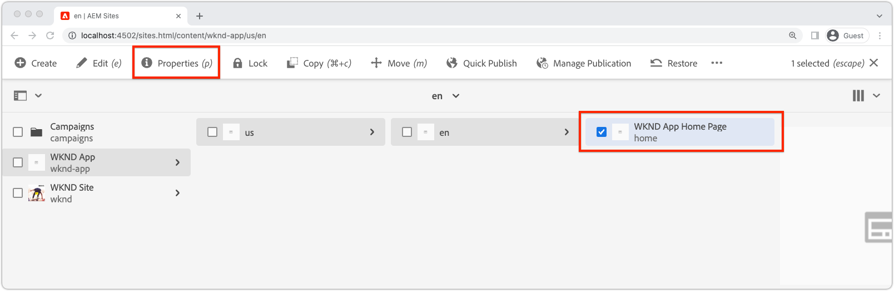

# Bootstrap遠端SPA for SPA編輯器

可編輯區域可新增至遠端SPA之前，必須先以AEM SPA編輯器JavaScript SDK及一些其他設定引導。

## 新增AEM SPA Editor JS SDK npm相依性

首先，將AEM SPA npm相依性新增至React專案。

```
$ cd ~/Code/wknd-app/aem-guides-wknd-graphql/react-app
$ npm install --save \
    @adobe/aem-spa-page-model-manager \
    @adobe/aem-spa-component-mapping \
    @adobe/aem-react-editable-components \
    @adobe/aem-core-components-react-base \
    @adobe/aem-core-components-react-spa
```

+ `@adobe/aem-spa-page-model-manager` 提供從AEM擷取內容的API。
+ `@adobe/aem-spa-component-mapping` 提供將AEM內容對應至SPA元件的API。
+ ` @adobe/aem-react-editable-components` 提供用於建置自訂SPA元件的API，並提供常用實作，例如 `AEMPage` React元件。
+ `@adobe/aem-core-components-react-base` 提供一套現成可使用的React元件，可與AEM WCM核心元件流暢整合，且不受SPA編輯器限制。這些主要包括內容元件，例如：
   + 標題
   + 文字
   + 階層連結
   + 等等。
+ `@adobe/aem-core-components-react-spa` 提供一套現成可用的React元件，可與AEM WCM核心元件流暢整合，但需要SPA Editor。這些元件主要包含來自`@adobe/aem-core-components-react-base`的內容元件，例如：
   + 容器
   + 傳送
   + 等等。

## 檢閱SPA環境變數

數個環境變數必須公開給遠端SPA，以便其了解如何與AEM互動。

1. 在IDE的`~/Code/wknd-app/aem-guides-wknd-graphql/react-app`處開啟遠程SPA項目
1. 開啟檔案`.env.development`
1. 新增檔案，並特別注意索引鍵：

   ```
   REACT_APP_HOST_URI=http://localhost:4502
   REACT_APP_AUTHORIZATION=admin:admin
   ```

   

   *請記住，React中的自訂環境變數必須加上前置 `REACT_APP_`詞。*

   + `REACT_APP_AEM_URI`:遠端SPA所連線之AEM服務的配置和主機。
      + 如果AEM環境（本機、開發、預備或生產）和AEM服務類型（製作與發佈），此值會隨之變更
   + `REACT_APP_AEM_AUTH`:SPA用來驗證AEM和擷取內容的憑證。
      + 與AEM作者搭配使用必要
      + 與AEM Publish搭配使用可能需要（如果內容受到保護）
      + 針對AEM SDK進行開發可支援透過基本驗證的本機帳戶。 這是本教學課程中使用的方法。
      + 將與AEM整合為Cloud Service時，請使用[存取權杖](https://experienceleague.adobe.com/docs/experience-manager-learn/getting-started-with-aem-headless/authentication/overview.html)

## 整合ModelManager API

透過應用程式可用的AEM SPA npm相依性，在叫用`ReactDOM.render(...)`前初始化專案`index.js`中的AEM `ModelManager`。

[ModelManager](https://www.npmjs.com/package/@adobe/aem-spa-page-model-manager)負責連接到AEM以檢索可編輯的內容。

1. 在IDE中開啟遠程SPA項目
1. 開啟檔案`src/index.js`
1. 添加導入`ModelManager`並在`ReactDOM.render(..)`調用前初始化它，

   ```
   ...
   import { ModelManager } from "@adobe/aem-spa-page-model-manager";
   
   // Initialize the ModelManager before invoking ReactDOM.render(...).
   ModelManager.initializeAsync();
   
   ReactDOM.render(...);
   ```

`src/index.js`檔案應該如下所示：


## 設定內部SPA代理

從SPA的AEM尋找可編輯內容時，最好在SPA](https://create-react-app.dev/docs/proxying-api-requests-in-development/#configuring-the-proxy-manually)中設定一個[內部代理，此代理設定為將適當的請求路由至AEM。 這是使用[http-proxy-middleware](https://www.npmjs.com/package/http-proxy-middleware) npm模組來完成的，基本WKND GraphQL應用程式已安裝此模組。

1. 在IDE中開啟遠程SPA項目
1. 在`src/proxy/setupProxy.spa-editor.auth.basic.js`建立檔案
1. 將下列程式碼新增至檔案中：

   ```
   const { createProxyMiddleware } = require('http-proxy-middleware');
   const {REACT_APP_HOST_URI, REACT_APP_AUTHORIZATION } = process.env;
   
   /*
       Set up a proxy with AEM for local development
       In a production environment this proxy should be set up at the webserver level or absolute URLs should be used.
   */
   module.exports = function(app) {
   
       /**
       * Filter to check if the request should be re-routed to AEM. The paths to be re-routed at:
       * - Starts with /content (AEM content)
       * - Starts with /graphql (AEM graphQL endpoint)
       * - Ends with .model.json (AEM Content Services)
       * 
       * @param {*} path the path being requested of the SPA
       * @param {*} req the request object
       * @returns true if the SPA request should be re-routed to AEM
       */
       const toAEM = function(path, req) {
           return path.startsWith('/content') || 
               path.startsWith('/graphq') ||
               path.endsWith('.model.json')
       }
   
       /**
       * Re-writes URLs being proxied to AEM such that they can resolve to real AEM resources
       * - The "root" case of `/.model.json` are rewritten to the SPA's home page in AEM
       * - .model.json requests for /adventure:xxx routes are rewritten to their corresponding adventure page under /content/wknd-app/us/en/home/adventure/ 
       * 
       * @param {*} path the path being requested of the SPA
       * @param {*} req the request object
       * @returns returns a re-written path, or nothing to use the @param path
       */
       const pathRewriteToAEM = function (path, req) { 
           if (path === '/.model.json') {
               return '/content/wknd-app/us/en/home.model.json';
           } else if (path.startsWith('/adventure:') && path.endsWith('.model.json')) {
               return '/content/wknd-app/us/en/home/adventure/' + path.split('/').pop();
           }    
       }
   
       /**
       * Register the proxy middleware using the toAEM filter and pathRewriteToAEM rewriter 
       */
       app.use(
           createProxyMiddleware(
               toAEM, // Only route the configured requests to AEM
               {
                   target: REACT_APP_HOST_URI,
                   changeOrigin: true,
                   // Pass in credentials when developing against an Author environment
                   auth: REACT_APP_AUTHORIZATION,
                   pathRewrite: pathRewriteToAEM // Rewrite SPA paths being sent to AEM
               }
           )
       );
   
       /**
       * Enable CORS on requests from the SPA to AEM
       * 
       * If this rule is not in place, CORS errors will occur when running the SPA on http://localhost:3000
       */
       app.use((req, res, next) => {
           res.header("Access-Control-Allow-Origin", REACT_APP_HOST_URI);
           next();
       });
   };
   ```

   `setupProxy.spa-editor.auth.basic.js`檔案應該如下所示：

   

   此代理設定執行兩項主要動作：

   1. 向SPA、`http://localhost:3000`向AEM `http://localhost:4502`提出的Proxy專屬請求
      + 它只會傳送路徑符合模式（如`toAEM(path, req)`中所定義）的Proxy請求，指出AEM應提供這些請求。
      + 如`pathRewriteToAEM(path, req)`中所定義，會將SPA路徑重新寫入對應的AEM頁面
   1. 它會將CORS標題新增至所有請求，以允許存取AEM內容，如`res.header("Access-Control-Allow-Origin", REACT_APP_HOST_URI);`所定義
      + 如果未新增，則在SPA中載入AEM內容時會發生CORS錯誤。

1. 開啟檔案`src/setupProxy.js`
1. 註解行`const proxy = require('./proxy/setupProxy.auth.basic')`
1. 添加一行，指向新的代理配置檔案：

   ```
   // Proxy configuration for SPA Editor (and GraphQL) using Basic Auth
   const proxy = require('./proxy/setupProxy.spa-editor.auth.basic')
   ```

   `setupProxy.js`檔案應該如下所示：

   

注意，對`src/setupProxy.js`或其引用的檔案所做的任何更改都需要重新啟動SPA。

## 靜態SPA資源

靜態SPA資源（例如WKND標誌和載入圖形）需要更新其src URL，以強制從遠端SPA主機載入。 若相對左，當SPA在SPA編輯器中載入以進行編寫時，這些URL預設會使用AEM主機，而非SPA，因此會產生404個要求，如下圖所示。


若要解決此問題，請讓遠端SPA托管的靜態資源使用包含遠端SPA來源的絕對路徑。

1. 在IDE中開啟SPA專案
1. 開啟SPA環境變數檔案`src/.env.development`，然後為SPA公用URI新增變數：

   ```
   ...
   # The base URI the SPA is accessed from
   REACT_APP_PUBLIC_URI=http://localhost:3000
   ```

   _部署至AEM as aCloud Service時，對應的檔案需要相同 `.env` 項目。_

1. 開啟檔案`src/App.js`
1. 從SPA環境變數匯入SPA公用URI

   ```
   const {  REACT_APP_PUBLIC_URI } = process.env;
   
   function App() { ... }
   ```

1. 為WKND標誌``加上前置詞`REACT_APP_PUBLIC_URI`以強制對SPA解析。

   ```
   
   ```

1. 在`src/components/Loading.js`中載入影像時也要執行相同操作

   ```
   const { REACT_APP_PUBLIC_URI } = process.env;
   
   class Loading extends Component {
   
       render() {
           return (<div className="loading">
               
           </div>);
       }
   }
   ```

1. ... 和`src/components/AdventureDetails.js`中的back按鈕的&#x200B;__兩個實例__

   ```
   const { REACT_APP_PUBLIC_URI } = process.env;
   
   function AdventureDetail(props) {
       ...
       render() {
           
       }
   }
   ```

`App.js`、`Loading.js`和`AdventureDetails.js`檔案看起來應該如下：


## AEM回應式格線

若要支援SPA編輯器的版面模式，以便在SPA中處理可編輯區域，我們必須將AEM Responsive Grid CSS整合至SPA。 別擔心 — 此網格系統將僅對可編輯的容器進行配置，並且您可以使用所選的網格系統來驅動其餘SPA的佈局。

將AEM回應式格線SCSS檔案新增至SPA。

1. 在IDE中開啟SPA專案
1. 下載以下兩個檔案並將其複製到`src/styles`中
   + [_grid.scss](./assets/spa-bootstrap/_grid.scss)
      + AEM回應式格線SCSS產生器
   + [_grid-init.scss](./assets/spa-bootstrap/_grid.scss)
      + 使用SPA特定斷點（案頭和行動）和列(12)調用`_grid.scss`。
1. 開啟`src/App.scss`並導入`./styles/grid-init.scss`

   ```
   ...
   @import './styles/grid-init';
   ...
   ```

`_grid.scss`和`_grid-init.scss`檔案看起來應該如下：


現在，SPA包含新增至AEM容器之元件支援AEM版面模式所需的CSS。

## 啟動SPA

現在SPA正在啟動以便與AEM整合，讓我們執行SPA並查看看看看起來是什麼樣子！

1. 在命令列中，導覽至SPA專案的根目錄
1. 使用普通命令啟動SPA（如果尚未運行`npm install`）

   ```
   $ cd ~/Code/wknd-app/aem-guides-wknd-graphql/react-app
   $ npm install 
   $ npm run start
   ```

1. 瀏覽[http://localhost:3000](http://localhost:3000)上的SPA。 一切都應該好看！


## 在AEM SPA編輯器中開啟SPA

當SPA在[http://localhost:3000](http://localhost:3000)上執行時，我們會使用AEM SPA編輯器將其開啟。 SPA中尚無可編輯的項目，這只會驗證AEM中的SPA。

1. 登入AEM作者
1. 導覽至「__Sites > WKND應用程式> us > en__」
1. 選取&#x200B;__WKND應用程式首頁__&#x200B;並點選&#x200B;__Edit__，就會出現SPA。

   

1. 使用右上角的模式切換器切換至&#x200B;__預覽__
1. 按一下週圍的SPA

   

## 恭喜！

您已引導遠端SPA以相容AEM SPA編輯器！ 您現在知道如何：

+ 將AEM SPA Editor JS SDK npm相依性新增至SPA專案
+ 設定SPA環境變數
+ 將ModelManager API與SPA整合
+ 設定SPA的內部代理，以便將適當的內容要求路由至AEM
+ 解決在SPA Editor中解決靜態SPA資源的問題
+ 新增AEM Responsive Grid CSS以支援AEM可編輯容器中的版面配置

## 後續步驟

現在，我們已取得與AEM SPA Editor相容性的基準，可以開始介紹可編輯的區域。 首先，我們將探討如何將[固定的可編輯元件](./spa-fixed-component.md)放入SPA中。
