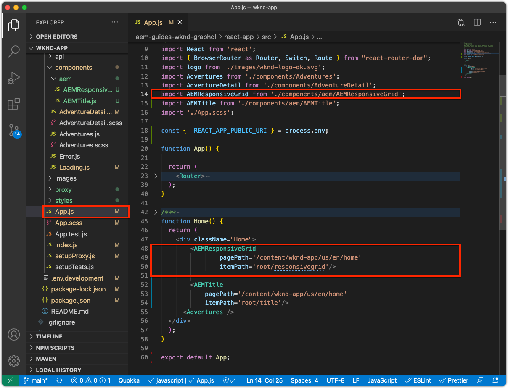

# 可編輯的容器元件

[固定](./spa-fixed-component.md) 元件為編寫SPA內容提供了一定的彈性，但此方法很僵化，需要開發人員定義可編輯內容的確切組成。為了支援作者建立優異的體驗，SPA Editor支援在SPA中使用容器元件。 容器元件可讓作者將允許的元件拖放至容器中，並像傳統AEM Sites編寫中一樣加以編寫！


在本章中，我們將在首頁檢視中新增可編輯的容器，讓作者直接在SPA中使用AEM React核心元件來撰寫和配置豐富的內容體驗。

## 更新WKND應用程式

要向「首頁」視圖添加容器元件：

+ 匯入AEM React可編輯元件的ResponsiveGrid元件
+ 匯入並註冊AEM React核心元件（文字和影像），以用於容器元件

### 在ResponsiveGrid容器元件中匯入

要將可編輯區域放置到「首頁」視圖，我們必須：

1. 從`@adobe/aem-react-editable-components`匯入ResponsiveGrid元件
1. 使用`withMappable`註冊，讓開發人員可將其放入SPA
1. 此外，請用`MapTo`註冊，以便它可在其他容器元件中重複使用，從而有效地嵌套容器。

要執行此操作：

1. 在IDE中開啟SPA專案
1. 在`src/components/aem/AEMResponsiveGrid.js`建立React元件
1. 將下列程式碼新增至`AEMResponsiveGrid.js`

   ```
   // Import the withMappable API provided bu the AEM SPA Editor JS SDK
   import { withMappable, MapTo } from '@adobe/aem-react-editable-components';
   
   // Import the base ResponsiveGrid component
   import { ResponsiveGrid } from "@adobe/aem-react-editable-components";
   
   // The sling:resourceType for which this Core Component is registered with in AEM
   const RESOURCE_TYPE = "wcm/foundation/components/responsivegrid";
   
   // Create an EditConfig to allow the AEM SPA Editor to properly render the component in the Editor's context
   const EditConfig = {
       emptyLabel: "Layout Container",  // The component placeholder in AEM SPA Editor
       isEmpty: function(props) { 
           return props.cqItemsOrder == null || props.cqItemsOrder.length === 0;
       },                              // The function to determine if this component has been authored
       resourceType: RESOURCE_TYPE     // The sling:resourceType this SPA component is mapped to
   };
   
   // MapTo allows the AEM SPA Editor JS SDK to dynamically render components added to SPA Editor Containers
   MapTo(RESOURCE_TYPE)(ResponsiveGrid, EditConfig);
   
   // withMappable allows the component to be hardcoded into the SPA; <AEMResponsiveGrid .../>
   const AEMResponsiveGrid = withMappable(ResponsiveGrid, EditConfig);
   
   export default AEMResponsiveGrid;
   ```

程式碼與[匯入AEM觸及核心元件標題元件](./spa-fixed-component.md)類似。`AEMTitle.js`


`AEMResponsiveGrid.js`檔案應該如下所示：


### 使用AEMResponsiveGrid SPA元件

現在AEM ResponsiveGrid元件已註冊於中，且可在SPA內使用，我們可以將其置於首頁檢視中。

1. 開啟並編輯`react-app/src/App.js`
1. 匯入`AEMResponsiveGrid`元件，並將其置於`<AEMTitle ...>`元件上方。
1. 在`<AEMResponsiveGrid...>`元件上設定以下屬性
   + `pagePath = '/content/wknd-app/us/en/home'`
   + `itemPath = 'root/responsivegrid'`

   這會指示此`AEMResponsiveGrid`元件從AEM資源擷取其內容：

   + `/content/wknd-app/us/en/home/jcr:content/root/responsivegrid`

   `itemPath`對應至`Remote SPA Page` AEM範本中定義的`responsivegrid`節點，並會在從`Remote SPA Page` AEM範本建立的新AEM頁面上自動建立。

   更新`App.js`以新增`<AEMResponsiveGrid...>`元件。

   ```
   ...
   import AEMResponsiveGrid from './components/aem/AEMResponsiveGrid';
   ...
   
   function Home() {
   return (
       <div className="Home">
           <AEMResponsiveGrid
               pagePath='/content/wknd-app/us/en/home' 
               itemPath='root/responsivegrid'/>
   
           <AEMTitle
               pagePath='/content/wknd-app/us/en/home' 
               itemPath='title'/>
           <Adventures />
       </div>
   );
   }
   ```

`Apps.js`檔案應該如下所示：



## 建立可編輯的元件

若要充分運用SPA編輯器中提供的彈性製作體驗容器。 我們已建立可編輯的標題元件，不過讓作者在新增的容器元件中再多使用一些內容，以便使用文字和影像AEM WCM核心元件。

### 文字元件

1. 在IDE中開啟SPA專案
1. 在`src/components/aem/AEMText.js`建立React元件
1. 將下列程式碼新增至`AEMText.js`

   ```
   import { withMappable, MapTo } from '@adobe/aem-react-editable-components';
   import { TextV2, TextV2IsEmptyFn } from "@adobe/aem-core-components-react-base";
   
   const RESOURCE_TYPE = "wknd-app/components/text";
   
   const EditConfig = {    
       emptyLabel: "Text",
       isEmpty: TextV2IsEmptyFn,
       resourceType: RESOURCE_TYPE
   };
   
   MapTo(RESOURCE_TYPE)(TextV2, EditConfig);
   
   const AEMText = withMappable(TextV2, EditConfig);
   
   export default AEMText;
   ```

`AEMText.js`檔案應該如下所示：


### 影像元件

1. 在IDE中開啟SPA專案
1. 在`src/components/aem/AEMImage.js`建立React元件
1. 將下列程式碼新增至`AEMImage.js`

   ```
   import { withMappable, MapTo } from '@adobe/aem-react-editable-components';
   import { ImageV2, ImageV2IsEmptyFn } from "@adobe/aem-core-components-react-base";
   
   const RESOURCE_TYPE = "wknd-app/components/image";
   
   const EditConfig = {    
       emptyLabel: "Image",
       isEmpty: ImageV2IsEmptyFn,
       resourceType: RESOURCE_TYPE
   };
   
   MapTo(RESOURCE_TYPE)(ImageV2, EditConfig);
   
   const AEMImage = withMappable(ImageV2, EditConfig);
   
   export default AEMImage;
   ```

1. 建立SCSS檔案`src/components/aem/AEMImage.scss`，該檔案提供`AEMImage.scss`的自定義樣式。 這些樣式以AEM React核心元件的BEM標籤法CSS類別為目標。
1. 將以下SCSS添加到`AEMImage.scss`

   ```
   .cmp-image__image {
       margin: 1rem 0;
       width: 100%;
       border: 0;
    }
   ```

1. 在`AEMImage.js`中導入`AEMImage.scss`

   ```
   ...
   import './AEMImage.scss';
   ...
   ```

`AEMImage.js`和`AEMImage.scss`看起來應該如下：


### 匯入可編輯的元件

新建立的`AEMText`和`AEMImage` SPA元件會在SPA中參照，並根據AEM傳回的JSON以動態方式具現化。 為確保SPA可使用這些元件，請在`App.js`中為它們建立匯入陳述式

1. 在IDE中開啟SPA專案
1. 開啟檔案`src/App.js`
1. 為`AEMText`和`AEMImage`添加導入語句

   ```
   ...
   import AEMText from './components/aem/AEMText';
   import AEMImage from './components/aem/AEMImage';
   ...
   ```


結果應該如下：


如果這些匯入是新增&#x200B;_not_,SPA將不會叫用`AEMText`和`AEMImage`程式碼，因此不會根據提供的資源類型註冊元件。

## 在AEM中設定容器

AEM容器元件使用原則指定其允許的元件。 使用SPA編輯器時，這是重要的設定，因為SPA只會轉譯已對應SPA元件的AEM WCM核心元件。 確保僅允許我們為SPA實作提供的元件：

+ `AEMTitle` 已對應至  `wknd-app/components/title`
+ `AEMText` 已對應至  `wknd-app/components/text`
+ `AEMImage` 已對應至  `wknd-app/components/image`

要配置遠程SPA頁面模板的Reponsivegrid容器：

1. 登入AEM作者
1. 導覽至&#x200B;__工具>一般>範本> WKND應用程式__
1. 編輯&#x200B;__報表SPA頁面__

   

1. 在右上角的模式切換器中選擇&#x200B;__結構__
1. 點選以選取「__版面容器__」
1. 點選快顯列中的&#x200B;__Policy__&#x200B;圖示

   

1. 在右側的&#x200B;__允許的元件__&#x200B;標籤下，展開&#x200B;__WKND APP - CONTENT__
1. 請確定僅選取下列項目：
   + 影像
   + 文字
   + 標題

   

1. 點選&#x200B;__完成__

## 在AEM中編寫容器

更新SPA以內嵌`<AEMResponsiveGrid...>`、三個AEM React核心元件（`AEMTitle`、`AEMText`和`AEMImage`）的包裝函式，並更新AEM的相符範本原則後，我們就可以開始在容器元件中編寫內容。

1. 登入AEM作者
1. 導覽至&#x200B;__Sites > WKND App__
1. 點選&#x200B;__Home__&#x200B;並從頂端動作列選取&#x200B;__Edit__
   + 隨即顯示「Hello World」文字元件，因為這是從AEM專案原型產生專案時自動新增的
1. 從頁面編輯器右上角的模式選取器中選取&#x200B;__Edit__
1. 找出標題下方的&#x200B;__Layout Container__&#x200B;可編輯區域
1. 開啟&#x200B;__頁面編輯器的側欄__，然後選取&#x200B;__元件檢視__
1. 將下列元件拖曳至&#x200B;__版面容器__
   + 影像
   + 標題
1. 拖曳元件以依下列順序重新排序：
   1. 標題
   1. 影像
   1. 文字
1. ____ Authorithe  ____ Titlecomponent
   1. 點選「Title」元件，然後點選&#x200B;__扳手__&#x200B;圖示以&#x200B;__edit__ Title元件
   1. 新增下列文字：
      + 標題：__夏天即將到來，讓我們充分利用它！__
      + 類型：__H1__
   1. 點選&#x200B;__完成__
1. ____ 製作 ____ Imagecomponent
   1. 從影像元件的側邊列（切換至「資產」檢視後）拖曳影像進入
   1. 點選「影像」元件，然後點選&#x200B;__扳手__&#x200B;圖示以編輯
   1. 勾選&#x200B;__Image is decortial__&#x200B;核取方塊
   1. 點選&#x200B;__完成__
1. ____ Authorith  ____ Textcomponent
   1. 點選「文字」元件，然後點選&#x200B;__扳手__&#x200B;圖示，以編輯「文字」元件
   1. 新增下列文字：
      + _現在，在所有1週的冒險中，你可以獲得15%的回報，在所有2週或更長的冒險中，你可以獲得20%的回報！結帳時，只需新增促銷活動代碼SUMMERISCOMING，即可獲得折扣！_
   1. 點選&#x200B;__完成__

1. 您的元件現已撰寫完成，但垂直堆疊。

   

   使用「AEM版面模式」可讓我們調整元件的大小和版面。

1. 使用右上角的模式選擇器切換到&#x200B;__佈局模式__
1. ____ 調整影像和文字元件的大小，使它們並排
   + ____ Imagecomponent應寬 __8列__
   + ____ Textcomponent應為 __3欄寬__

   

1. ____ 在AEM頁面編輯器中預覽您的變更
1. 重新整理在[http://localhost:3000](http://localhost:3000)本機執行的WKND應用程式，以查看所撰寫的變更！

   


## 恭喜！

您已新增容器元件，讓作者可將可編輯的元件新增至WKND應用程式！ 您現在知道如何：

+ 在SPA中使用AEM React可編輯元件的ResponsiveGrid元件
+ 註冊AEM React核心元件（文字和影像），以透過容器元件用於SPA
+ 設定遠端SPA頁面範本，以允許啟用SPA的核心元件
+ 將可編輯的元件新增至容器元件
+ 在SPA編輯器中製作和配置元件

## 後續步驟

下一步將使用此相同的技術來[將可編輯的元件新增至SPA中的「探險詳細資訊」路由](./spa-dynamic-routes.md)。
