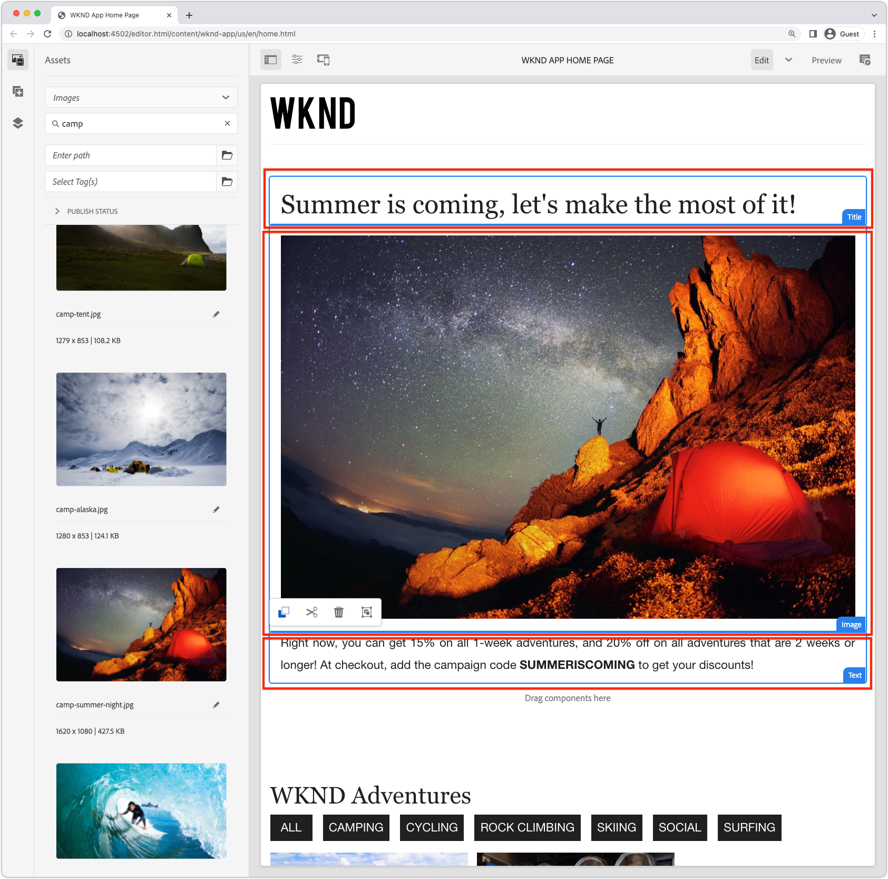

# 可編輯的容器元件

[固定元件](./spa-fixed-component.md) 為編寫SPA內容提供一些靈活性，但這種方法很嚴格，需要開發人員定義可編輯內容的確切構成。 為了支援作者建立卓越的體驗，SPA編輯器支援在SPA中使用容器元件。 容器元件可讓作者將允許的元件拖放至容器中並加以製作，就像在傳統AEM Sites製作中一樣！


在本章中，我們將可編輯的容器新增至首頁檢視，讓作者直接在SPA中使用可編輯的React元件來撰寫和配置豐富的內容體驗。

## 更新WKND應用程式

若要將容器元件新增至「首頁」檢視：

+ 匯入AEM React可編輯元件的 `ResponsiveGrid` 元件
+ 匯入並註冊自訂的可編輯React元件（文字和影像），以用於ResponsiveGrid元件

### 使用ResponsiveGrid元件

若要將可編輯區域新增至「首頁」檢視：

1. 開啟並編輯 `react-app/src/components/Home.js`
1. 匯入 `ResponsiveGrid` 元件來源 `@adobe/aem-react-editable-components` 並將其新增至 `Home` 元件。
1. 在 `<ResponsiveGrid...>` 元件
   + `pagePath = '/content/wknd-app/us/en/home'`
   + `itemPath = 'root/responsivegrid'`

   這指示 `ResponsiveGrid` 元件以從AEM資源擷取其內容：

   + `/content/wknd-app/us/en/home/jcr:content/root/responsivegrid`

   此 `itemPath` 對應至 `responsivegrid` 節點定義於 `Remote SPA Page` AEM範本，並會在從建立的新AEM頁面上自動建立 `Remote SPA Page` AEM範本。

   更新 `Home.js` 新增 `<ResponsiveGrid...>` 元件。

   ```javascript
   ...
   import { ResponsiveGrid } from '@adobe/aem-react-editable-components';
   ...
   
   function Home() {
       return (
           <div className="Home">
               <ResponsiveGrid
                   pagePath='/content/wknd-app/us/en/home' 
                   itemPath='root/responsivegrid'/>
   
               <EditableTitle
                   pagePath='/content/wknd-app/us/en/home' 
                   itemPath='title'/>
   
               <Adventures />
           </div>
       );
   }
   ```

此 `Home.js` 檔案應如下所示：


## 建立可編輯的元件

以充分發揮SPA Editor中彈性撰寫體驗容器的功效。 我們已建立可編輯的Title元件，但讓我們再做一些讓作者在新增的ResponsiveGrid元件中使用可編輯的Text和Image元件。

新的可編輯文字和影像React元件是使用中公開的可編輯元件定義模式建立的 [可編輯的固定元件](./spa-fixed-component.md).

### 可編輯文字元件

1. 在IDE中開啟SPA專案
1. 在建立React元件 `src/components/editable/core/Text.js`
1. 將下列程式碼新增至 `Text.js`

   ```javascript
   import React from 'react'
   
   const TextPlain = (props) => <div className={props.baseCssClass}><p className="cmp-text__paragraph">{props.text}</p></div>;
   const TextRich = (props) => {
   const text = props.text;
   const id = (props.id) ? props.id : (props.cqPath ? props.cqPath.substr(props.cqPath.lastIndexOf('/') + 1) : "");
       return <div className={props.baseCssClass} id={id} data-rte-editelement dangerouslySetInnerHTML={{ __html: text }} />
   };
   
   export const Text = (props) => {
       if (!props.baseCssClass) {
           props.baseCssClass = 'cmp-text'
       }
   
       const { richText = false } = props
   
       return richText ? <TextRich {...props} /> : <TextPlain {...props} />
       }
   
       export function textIsEmpty(props) {
       return props.text == null || props.text.length === 0;
   }
   ```

1. 建立可編輯的React元件，位於 `src/components/editable/EditableText.js`
1. 將下列程式碼新增至 `EditableText.js`

   ```javascript
   import React from 'react'
   import { EditableComponent, MapTo } from '@adobe/aem-react-editable-components';
   import { Text, textIsEmpty } from "./core/Text";
   import { withConditionalPlaceHolder } from "./core/util/withConditionalPlaceholder";
   import { withStandardBaseCssClass } from "./core/util/withStandardBaseCssClass";
   
   const RESOURCE_TYPE = "wknd-app/components/text";
   
   const EditConfig = {
       emptyLabel: "Text",
       isEmpty: textIsEmpty,
       resourceType: RESOURCE_TYPE
   };
   
   export const WrappedText = (props) => {
       const Wrapped = withConditionalPlaceHolder(withStandardBaseCssClass(Text, "cmp-text"), textIsEmpty, "Text V2")
       return <Wrapped {...props} />
   };
   
   const EditableText = (props) => <EditableComponent config={EditConfig} {...props}><WrappedText /></EditableComponent>
   
   MapTo(RESOURCE_TYPE)(EditableText);
   
   export default EditableText;
   ```

可編輯的文字元件實作應如下所示：


### 影像元件

1. 在IDE中開啟SPA專案
1. 在建立React元件 `src/components/editable/core/Image.js`
1. 將下列程式碼新增至 `Image.js`

   ```javascript
   import React from 'react'
   import { RoutedLink } from "./RoutedLink";
   
   export const imageIsEmpty = (props) => (!props.src) || props.src.trim().length === 0
   
   const ImageInnerContents = (props) => {
   return (<>
       
       {
           !!(props.title) && <span className={props.baseCssClass + '__title'} itemProp="caption">{props.title}</span>
       }
       {
           props.displayPopupTitle && (!!props.title) && <meta itemProp="caption" content={props.title} />
       }
       </>);
   };
   
   const ImageContents = (props) => {
       if (props.link && props.link.trim().length > 0) {
           return (
           <RoutedLink className={props.baseCssClass + '__link'} isRouted={props.routed} to={props.link}>
               <ImageInnerContents {...props} />
           </RoutedLink>
           )
       }
       return <ImageInnerContents {...props} />
   };
   
   export const Image = (props) => {
       if (!props.baseCssClass) {
           props.baseCssClass = 'cmp-image'
       }
   
       const { isInEditor = false } = props;
       const cssClassName = (isInEditor) ? props.baseCssClass + ' cq-dd-image' : props.baseCssClass;
   
       return (
           <div className={cssClassName}>
               <ImageContents {...props} />
           </div>
       )
   };
   ```

1. 建立可編輯的React元件，位於 `src/components/editable/EditableImage.js`
1. 將下列程式碼新增至 `EditableImage.js`

```javascript
import { EditableComponent, MapTo } from '@adobe/aem-react-editable-components';
import { Image, imageIsEmpty } from "./core/Image";
import React from 'react'

import { withConditionalPlaceHolder } from "./core/util/withConditionalPlaceholder";
import { withStandardBaseCssClass } from "./core/util/withStandardBaseCssClass";

const RESOURCE_TYPE = "wknd-app/components/image";

const EditConfig = {
    emptyLabel: "Image",
    isEmpty: imageIsEmpty,
    resourceType: RESOURCE_TYPE
};

const WrappedImage = (props) => {
    const Wrapped = withConditionalPlaceHolder(withStandardBaseCssClass(Image, "cmp-image"), imageIsEmpty, "Image V2");
    return <Wrapped {...props}/>
}

const EditableImage = (props) => <EditableComponent config={EditConfig} {...props}><WrappedImage /></EditableComponent>

MapTo(RESOURCE_TYPE)(EditableImage);

export default EditableImage;
```


1. 建立SCSS檔案 `src/components/editable/EditableImage.scss` 提供自訂樣式的 `EditableImage.scss`. 這些樣式以可編輯React元件的CSS類別為目標。
1. 將下列SCSS新增至 `EditableImage.scss`

   ```css
   .cmp-image__image {
       margin: 1rem 0;
       width: 100%;
       border: 0;
    }
   ```

1. 匯入 `EditableImage.scss` 在 `EditableImage.js`

   ```javascript
   ...
   import './EditableImage.scss';
   ...
   ```

可編輯的影像元件實作應如下所示：


### 匯入可編輯的元件

新建立的 `EditableText` 和 `EditableImage` React元件在SPA中參照，並根據AEM傳回的JSON動態具現化。 若要確保這些元件可供SPA使用，請在中建立這些元件的匯入陳述式 `Home.js`

1. 在IDE中開啟SPA專案
1. 開啟檔案 `src/Home.js`
1. 新增匯入陳述式 `AEMText` 和 `AEMImage`

   ```javascript
   ...
   // The following need to be imported, so that MapTo is run for the components
   import EditableText from './editable/EditableText';
   import EditableImage from './editable/EditableImage';
   ...
   ```

結果應如下所示：


如果這些匯入為 _not_ 已新增， `EditableText` 和 `EditableImage` SPA不會叫用程式碼，因此元件不會對應到提供的資源型別。

## 在AEM中設定容器

AEM容器元件會使用原則來指定其允許的元件。 使用SPA編輯器時，這是很重要的設定，因為SPA只能轉譯對應了SPA元件的AEM元件。 確保僅允許我們提供SPA實作的元件：

+ `EditableTitle` 對應至 `wknd-app/components/title`
+ `EditableText` 對應至 `wknd-app/components/text`
+ `EditableImage` 對應至 `wknd-app/components/image`

若要設定「遠端SPA頁面」範本的responsivegrid容器：

1. 登入AEM Author
1. 導覽至 __工具>一般>範本> WKND應用程式__
1. 編輯 __報表SPA頁面__

   

1. 選取 __結構__ 在右上角的模式切換器中
1. 點選以選取 __配置容器__
1. 點選 __原則__ 圖示來識別

   

1. 在右側下方的 __允許的元件__ 標籤，展開 __WKND應用程式 — 內容__
1. 請確定僅選取下列專案：
   + 影像
   + 文字
   + 標題

   

1. 點選 __完成__

## 在AEM中編寫容器

在SPA更新以內嵌 `<ResponsiveGrid...>`，三個可編輯React元件的包裝函式(`EditableTitle`， `EditableText`、和 `EditableImage`)，而AEM已更新成相符的範本原則，我們就可以開始編寫容器元件中的內容。

1. 登入AEM Author
1. 導覽至 __網站> WKND應用程式__
1. 點選 __首頁__ 並選取 __編輯__ 從頂端動作列
   + 「Hello World」文字元件隨即顯示，因為從AEM專案原型產生專案時會自動新增此元件
1. 選取 __編輯__ 從「頁面編輯器」右上角的模式選擇器
1. 找到 __配置容器__ 標題下方的可編輯區域
1. 開啟 __頁面編輯器的側欄__，然後選取 __元件檢視__
1. 將下列元件拖曳至 __配置容器__
   + 影像
   + 標題
1. 拖曳元件以將其重新排序為下列順序：
   1. 標題
   1. 影像
   1. 文字
1. __作者__ 此 __標題__ 元件
   1. 點選「標題」元件，然後點選 __扳手__ 圖示至 __編輯__ 標題元件
   1. 新增下列文字：
      + 標題： __夏天即將到來，讓我們充分利用這個機會！__
      + 型別： __H1__
   1. 點選 __完成__
1. __作者__ 此 __影像__ 元件
   1. 在「影像」元件上，從側邊欄（切換至「資產」檢視後）將影像拖曳到中
   1. 點選影像元件，然後點選 __扳手__ 圖示以編輯
   1. 檢查 __裝飾性影像__ 核取方塊
   1. 點選 __完成__
1. __作者__ 此 __文字__ 元件
   1. 點選「文字」元件，然後點選 __扳手__ 圖示
   1. 新增下列文字：
      + _現在，您可以在所有的一週冒險中獲得15%，在所有兩週或更長時間的冒險中獲得20%的折扣！ 結帳時，新增促銷活動代碼SUMMERISCOMING即可取得折扣！_
   1. 點選 __完成__

1. 您的元件現在已編寫，但垂直棧疊。

   

使用AEM配置模式可允許我們調整元件的大小和配置。

1. 切換至 __版面模式__ 使用右上方的模式選取器
1. __調整大小__ 「影像」和「文字」元件，使它們並排
   + __影像__ 元件應為 __8欄寬__
   + __文字__ 元件應為 __3欄寬__

   

1. __預覽__ 您在AEM頁面編輯器中進行的變更
1. 重新整理在本機執行的WKND應用程式 [http://localhost:3000](http://localhost:3000) 以檢視編寫的變更！

   


## 恭喜！

您已新增容器元件，作者可將此可編輯元件新增至WKND應用程式！ 您現在知道如何：

+ 使用AEM React Editable元件的 `ResponsiveGrid` SPA中的元件
+ 建立並註冊可編輯的React元件（文字和影像），以透過容器元件用於SPA
+ 設定遠端SPA頁面範本以允許啟用SPA的元件
+ 將可編輯的元件新增至容器元件
+ SPA編輯器中的作者和配置元件

## 後續步驟

下一個步驟會使用此相同技術來 [新增可編輯的元件至「冒險詳細資料」路徑](./spa-dynamic-routes.md) 在SPA中。
