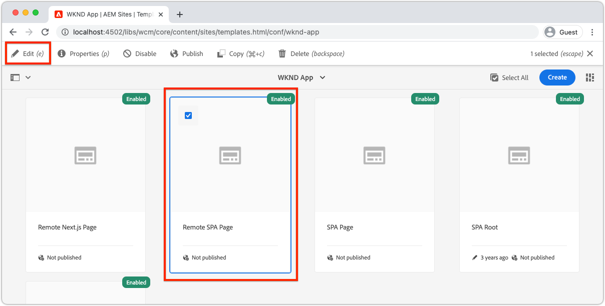

# 可編輯的容器元件

[固定元件](./spa-fixed-component.md) 為創作內容提供一SPA些靈活性，但此方法是剛性的，需要開發人員定義可編輯內容的準確組合。 為支援作者建立出眾的體驗，SPA編輯器支援在中使用容器組SPA件。 容器元件允許作者將允許的元件拖放到容器中，並創作它們，就像在傳統的AEM Sites創作中一樣！


在本章中，我們將可編輯的容器添加到主視圖中，使作者能夠直接在中使用AEMReact Core Components來撰寫和佈局豐富的內容體SPA驗。

## 更新WKND應用

要將容器元件添加到「首頁」視圖：

+ 導入React AEM Editable元件的ResponsedGrid元件
+ 導入和注AEM冊反應核心元件（文本和影像），以用於容器元件

### 在ResponsedGrid容器元件中導入

要將可編輯區域放置到「首頁」(Home)視圖，我們必須：

1. 從導入ResponsedGrid元件 `@adobe/aem-react-editable-components`
1. 使用 `withMappable` 這樣開發商就能把它放SPA在
1. 另外，註冊 `MapTo` 這樣可以在其他容器元件中重複使用，有效地嵌套容器。

要執行此操作：

1. 在IDESPA中開啟項目
1. 在以下位置建立React元件 `src/components/aem/AEMResponsiveGrid.js`
1. 將以下代碼添加到 `AEMResponsiveGrid.js`

   ```
   // Import the withMappable API provided bu the AEM SPA Editor JS SDK
   import { withMappable, MapTo } from '@adobe/aem-react-editable-components';
   
   // Import the base ResponsiveGrid component
   import { ResponsiveGrid } from "@adobe/aem-react-editable-components";
   
   // The sling:resourceType for which this Core Component is registered with in AEM
   const RESOURCE_TYPE = "wcm/foundation/components/responsivegrid";
   
   // Create an EditConfig to allow the AEM SPA Editor to properly render the component in the Editor's context
   const EditConfig = {
       emptyLabel: "Layout Container",  // The component placeholder in AEM SPA Editor
       isEmpty: function(props) { 
           return props.cqItemsOrder == null || props.cqItemsOrder.length === 0;
       },                              // The function to determine if this component has been authored
       resourceType: RESOURCE_TYPE     // The sling:resourceType this SPA component is mapped to
   };
   
   // MapTo allows the AEM SPA Editor JS SDK to dynamically render components added to SPA Editor Containers
   MapTo(RESOURCE_TYPE)(ResponsiveGrid, EditConfig);
   
   // withMappable allows the component to be hardcoded into the SPA; <AEMResponsiveGrid .../>
   const AEMResponsiveGrid = withMappable(ResponsiveGrid, EditConfig);
   
   export default AEMResponsiveGrid;
   ```

代碼類似 `AEMTitle.js` 那 [導入AEMReach核心元件的標題元件](./spa-fixed-component.md)。


的 `AEMResponsiveGrid.js` 檔案應如下所示：


### 使用AEMResponsiveGrid組SPA件

現在，AEM ResponsiveGrid元件已註冊並可在中使用，SPA我們可以將其放在「首頁」視圖中。

1. 開啟並編輯 `react-app/src/Home.js`
1. 導入 `AEMResponsiveGrid` 並將其置於 `<AEMTitle ...>` 元件。
1. 在 `<AEMResponsiveGrid...>` 元件
   + `pagePath = '/content/wknd-app/us/en/home'`
   + `itemPath = 'root/responsivegrid'`

   這指示 `AEMResponsiveGrid` 從資源中檢索其內容的組AEM件：

   + `/content/wknd-app/us/en/home/jcr:content/root/responsivegrid`

   的 `itemPath` 映射到 `responsivegrid` 在 `Remote SPA Page` 模AEM板，並在從 `Remote SPA Page` 模AEM板。

   更新 `Home.js` 的 `<AEMResponsiveGrid...>` 元件。

   ```
   ...
   import AEMResponsiveGrid from './aem/AEMResponsiveGrid';
   ...
   
   function Home() {
       return (
           <div className="Home">
               <AEMResponsiveGrid
                   pagePath='/content/wknd-app/us/en/home' 
                   itemPath='root/responsivegrid'/>
   
               <AEMTitle
                   pagePath='/content/wknd-app/us/en/home' 
                   itemPath='title'/>
               <Adventures />
           </div>
       );
   }
   ```

的 `Home.js` 檔案應如下所示：


## 建立可編輯的元件

要充分利用編輯器中提供的靈活創作體驗容SPA器。 我們已經建立了可編輯的標題元件，但讓我們再做幾個，讓作者在新添加的容器元件中使用文本和影像AEM WCM核心元件。

### 文字元件

1. 在IDESPA中開啟項目
1. 在以下位置建立React元件 `src/components/aem/AEMText.js`
1. 將以下代碼添加到 `AEMText.js`

   ```
   import { withMappable, MapTo } from '@adobe/aem-react-editable-components';
   import { TextV2, TextV2IsEmptyFn } from "@adobe/aem-core-components-react-base";
   
   const RESOURCE_TYPE = "wknd-app/components/text";
   
   const EditConfig = {    
       emptyLabel: "Text",
       isEmpty: TextV2IsEmptyFn,
       resourceType: RESOURCE_TYPE
   };
   
   MapTo(RESOURCE_TYPE)(TextV2, EditConfig);
   
   const AEMText = withMappable(TextV2, EditConfig);
   
   export default AEMText;
   ```

的 `AEMText.js` 檔案應如下所示：


### 影像元件

1. 在IDESPA中開啟項目
1. 在以下位置建立React元件 `src/components/aem/AEMImage.js`
1. 將以下代碼添加到 `AEMImage.js`

   ```
   import { withMappable, MapTo } from '@adobe/aem-react-editable-components';
   import { ImageV2, ImageV2IsEmptyFn } from "@adobe/aem-core-components-react-base";
   
   const RESOURCE_TYPE = "wknd-app/components/image";
   
   const EditConfig = {    
       emptyLabel: "Image",
       isEmpty: ImageV2IsEmptyFn,
       resourceType: RESOURCE_TYPE
   };
   
   MapTo(RESOURCE_TYPE)(ImageV2, EditConfig);
   
   const AEMImage = withMappable(ImageV2, EditConfig);
   
   export default AEMImage;
   ```

1. 建立SCSS檔案 `src/components/aem/AEMImage.scss` 提供自定義樣式 `AEMImage.scss`。 這些樣式針對AEMReact Core元件的BEM-notation CSS類。
1. 將以下SCS添加到 `AEMImage.scss`

   ```
   .cmp-image__image {
       margin: 1rem 0;
       width: 100%;
       border: 0;
    }
   ```

1. 導入 `AEMImage.scss` 在 `AEMImage.js`

   ```
   ...
   import './AEMImage.scss';
   ...
   ```

的 `AEMImage.js` 和 `AEMImage.scss` 應該是這樣的：


### 導入可編輯的元件

新建立的 `AEMText` 和 `AEMImage` 組SPA件在中引SPA用，並基於返回的JSON動態實AEM例化 要確保這些元件可供使用，請SPA在中為它們建立導入語句 `Home.js`

1. 在IDESPA中開啟項目
1. 開啟檔案 `src/Home.js`
1. 添加導入語句 `AEMText` 和 `AEMImage`

   ```
   ...
   import AEMText from './components/aem/AEMText';
   import AEMImage from './components/aem/AEMImage';
   ...
   ```


結果應該是：


如果這些進口 _不_ 添加 `AEMText` 和 `AEMImage` 代碼不由調用SPA，因此元件不根據提供的資源類型進行註冊。

## 在中配置容AEM器

容AEM器元件使用策略指定其允許的元件。 這是使用編輯器時的SPA關鍵配置，AEM因為只有映射了元件對應項的SPAWCM核心元件可以由呈現SPA。 確保僅允許我們為實施提供SPA的元件：

+ `AEMTitle` 映射到 `wknd-app/components/title`
+ `AEMText` 映射到 `wknd-app/components/text`
+ `AEMImage` 映射到 `wknd-app/components/image`

要配置遠程頁模SPA板的reponsivegrid容器，請執行以下操作：

1. 登錄到AEM作者
1. 導航到 __「工具」>「常規」>「模板」>「WKND應用」__
1. 編輯 __報告頁SPA面__

   

1. 選擇 __結構__ 在右上角的模式切換器中
1. 點擊以選擇 __佈局容器__
1. 點擊 __策略__ 表徵圖

   

1. 右下 __允許的元件__ 頁籤，展開 __WKND應用 — 內容__
1. 確保僅選擇以下內容：
   + 影像
   + 文字
   + 標題

   

1. 點擊 __完成__

## 在中創作容AEM器

更新後SPA嵌入 `<AEMResponsiveGrid...>`，三個反應核AEM心元件的包裝(`AEMTitle`。 `AEMText`, `AEMImage`)，並且AEM使用匹配的模板策略進行更新，我們可以開始在容器元件中創作內容。

1. 登錄到AEM作者
1. 導航到 __站點> WKND應用__
1. 點擊 __首頁__ 選擇 __編輯__ 從頂部操作欄
   + 將顯示「Hello World」文本元件，因為在從「項目」原型生成項目時會自動添加AEM該元件
1. 選擇 __編輯__ 從頁面編輯器右上角的模式選擇器
1. 查找 __佈局容器__ 標題下的可編輯區域
1. 開啟 __頁面編輯器側欄__，然後選擇 __元件視圖__
1. 將以下元件拖到 __佈局容器__
   + 影像
   + 標題
1. 拖動元件以按以下順序重新排序：
   1. 標題
   1. 影像
   1. 文字
1. __作者__ 這樣 __標題__ 元件
   1. 按一下「Title（標題）」元件，然後按一下 __扳__ 表徵圖 __編輯__ 標題元件
   1. 添加以下文本：
      + 標題： __夏天來了，我們好好利用！__
      + 類型： __H1__
   1. 點擊 __完成__
1. __作者__ 這樣 __影像__ 元件
   1. 將影像從「影像」元件的「側」欄（切換到「資產」視圖後）拖入
   1. 按一下「Image（影像）」元件，然後按一下 __扳__ 表徵圖
   1. 檢查 __影像是裝飾性的__ 複選框
   1. 點擊 __完成__
1. __作者__ 這樣 __文本__ 元件
   1. 按一下「文本」(Text)元件，然後按一下 __扳__ 表徵圖
   1. 添加以下文本：
      + _現在，你可以在所有一週的冒險中獲得15%的收益，在所有2週或更長的冒險中獲得20%的收益！ 結帳時，添加促銷代碼SUMMERISCOMING以獲得折扣！_
   1. 點擊 __完成__

1. 您的元件現在已創作，但垂直堆疊。

   

   使AEM用佈局模式可以調整元件的大小和佈局。

1. 切換到 __佈局模式__ 在右上角使用模式選擇器
1. __調整大小__ 影像和文本元件，使它們並排
   + __影像__ 元件應 __寬8列__
   + __文本__ 元件應 __寬__

   

1. __預覽__ 在頁面編輯器AEM中所做的更改
1. 刷新本地運行的WKND應用 [http://localhost:3000](http://localhost:3000) 查看已創作的更改！

   


## 恭喜！

您已添加容器元件，允許作者將可編輯元件添加到WKND應用！ 您現在知道如何：

+ 使用AEMReacte Editable元件的ResponsedGrid組SPA件
+ 註冊AEM反應核心元件（文本和影像），通過容器組SPA件在中使用
+ 配置遠程SPA頁模板以允許啟SPA用的核心元件
+ 將可編輯元件添加到容器元件
+ 編輯器中的作者和佈局SPA元件

## 後續步驟

下一步將使用相同的技術 [將可編輯元件添加到「冒險詳細資訊」路由](./spa-dynamic-routes.md) 的上界SPA。
