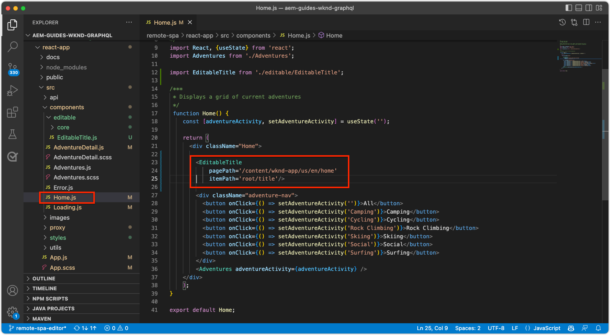

# 可編輯的固定元件

{{spa-editor-deprecation}}

可編輯的React元件可以「固定」，或硬式編碼到SPA的檢視中。 如此一來，開發人員就能將與SPA Editor相容的元件放入SPA檢視中，且使用者能在AEM SPA Editor中編寫元件的內容。


在本章中，我們會以固定但可編輯的Title元件取代Home檢視的標題「Current Adventures」（在`Home.js`中為硬式編碼文字）。 固定元件可保證標題的位置，但也允許編寫標題的文字，並在開發週期之外進行變更。

## 更新WKND應用程式

若要將&#x200B;__Fixed__&#x200B;元件新增至Home檢視：

* 建立自訂可編輯的標題元件並將其註冊到專案的標題資源型別
* 將可編輯的標題元件放在SPA的「首頁」檢視上

### 建立可編輯的React Title元件

在SPA的「首頁」檢視中，以自訂的可編輯標題元件取代硬式編碼文字`<h2>Current Adventures</h2>`。 在使用標題元件之前，我們必須：

1. 建立自訂Title React元件
1. 使用來自`@adobe/aem-react-editable-components`的方法裝飾自訂Title元件，使其可編輯。
1. 透過`MapTo`註冊可編輯的Title元件，以便稍後在[容器元件](./spa-container-component.md)中使用。

執行方法：

1. 在IDE中的`~/Code/aem-guides-wknd-graphql/remote-spa-tutorial/react-app`開啟遠端SPA專案
1. 在`react-app/src/components/editable/core/Title.js`建立React元件
1. 將下列程式碼新增至`Title.js`。

   ```javascript
   import React from 'react'
   import { RoutedLink } from "./RoutedLink";
   
   const TitleLink = (props) => {
   return (
       <RoutedLink className={props.baseCssClass + (props.nested ? '-' : '__') + 'link'} 
           isRouted={props.routed} 
           to={props.linkURL}>
       {props.text}
       </RoutedLink>
   );
   };
   
   const TitleV2Contents = (props) => {
       if (!props.linkDisabled) {
           return <TitleLink {...props} />
       }
   
       return <>{props.text}</>
   };
   
   export const Title = (props) => {
       if (!props.baseCssClass) {
           props.baseCssClass = 'cmp-title'
       }
   
       const elementType = (!!props.type) ? props.type.toString() : 'h3';
       return (<div className={props.baseCssClass}>
           {
               React.createElement(elementType, {
                       className: props.baseCssClass + (props.nested ? '-' : '__') + 'text',
                   },
                   <TitleV2Contents {...props} />
               )
           }
   
           </div>)
   }
   
   export const titleIsEmpty = (props) => props.text == null || props.text.trim().length === 0
   ```

   請注意，您尚無法使用AEM SPA Editor編輯此React元件。 此基本元件將在下一個步驟中變為可編輯。

   閱讀程式碼的註釋，以瞭解實作詳細資訊。

1. 在`react-app/src/components/editable/EditableTitle.js`建立React元件
1. 將下列程式碼新增至`EditableTitle.js`。

   ```javascript
   // Import the withMappable API provided bu the AEM SPA Editor JS SDK
   import { EditableComponent, MapTo } from '@adobe/aem-react-editable-components';
   import React from 'react'
   
   // Import the AEM the Title component implementation and it's Empty Function
   import { Title, titleIsEmpty } from "./core/Title";
   import { withConditionalPlaceHolder } from "./core/util/withConditionalPlaceholder";
   import { withStandardBaseCssClass } from "./core/util/withStandardBaseCssClass";
   
   // The sling:resourceType of the AEM component used to collected and serialize the data this React component displays
   const RESOURCE_TYPE = "wknd-app/components/title";
   
   // Create an EditConfig to allow the AEM SPA Editor to properly render the component in the Editor's context
   const EditConfig = {
       emptyLabel: "Title",        // The component placeholder in AEM SPA Editor
       isEmpty: titleIsEmpty,      // The function to determine if this component has been authored
       resourceType: RESOURCE_TYPE // The sling:resourceType this component is mapped to
   };
   
   export const WrappedTitle = (props) => {
       const Wrapped = withConditionalPlaceHolder(withStandardBaseCssClass(Title, "cmp-title"), titleIsEmpty, "TitleV2")
       return <Wrapped {...props} />
   }
   
   // EditableComponent makes the component editable by the AEM editor, either rendered statically or in a container
   const EditableTitle = (props) => <EditableComponent config={EditConfig} {...props}><WrappedTitle /></EditableComponent>
   
   // MapTo allows the AEM SPA Editor JS SDK to dynamically render components added to SPA Editor Containers
   MapTo(RESOURCE_TYPE)(EditableTitle);
   
   export default EditableTitle;
   ```

   This `EditableTitle` React component wraps the `Title` React component, wrapping and decorating it to be editable in AEM SPA Editor.

### Use the React EditableTitle component

Now that the EditableTitle React component is registered in and available for use within the React app, replace the hard-coded title text on the Home view.

1. Edit `react-app/src/components/Home.js`
1. In the `Home()` at the bottom, import `EditableTitle` and replace the hard-coded title with the new `AEMTitle` component:

   ```javascript
   ...
   import EditableTitle from './editable/EditableTitle';
   ...
   function Home() {
       return (
           <div className="Home">
   
           <EditableTitle
               pagePath='/content/wknd-app/us/en/home'
               itemPath='root/title'/>
   
               <Adventures />
           </div>
       );
   }
   ```

`Home.js`檔案應該如下所示：



## Author the Title component in AEM

1. 登入AEM Author
1. Navigate to __Sites > WKND App__
1. Tap __Home__ and select __Edit__ from the top action bar
1. Select __Edit__ from the edit mode selector in the top right of the Page Editor
1. Hover over the default title text below the WKND logo and above the adventures list, until the blue edit outline displays
1. Tap to expose the component&#39;s action bar, and then tap the __wrench__  to edit

   

1. Author the Title component:
   1. Title: __WKND Adventures__
   1. Type/Size: __H2__

      

1. Tap __Done__ to save
1. Preview your changes in AEM SPA Editor
1. Refresh the WKND App running locally on [http://localhost:3000](http://localhost:3000) and see the authored title changes immediately reflected.

   

## 恭喜！

You&#39;ve added a fixed, editable component to the WKND App! 您現在知道如何：

* 建立固定但可編輯的元件至SPA
* 在AEM中編寫固定元件
* 檢視遠端SPA中的撰寫內容

## 後續步驟

接下來的步驟是[新增AEM ResponsiveGrid容器元件](./spa-container-component.md)至SPA，讓作者將可編輯的元件新增至SPA！
