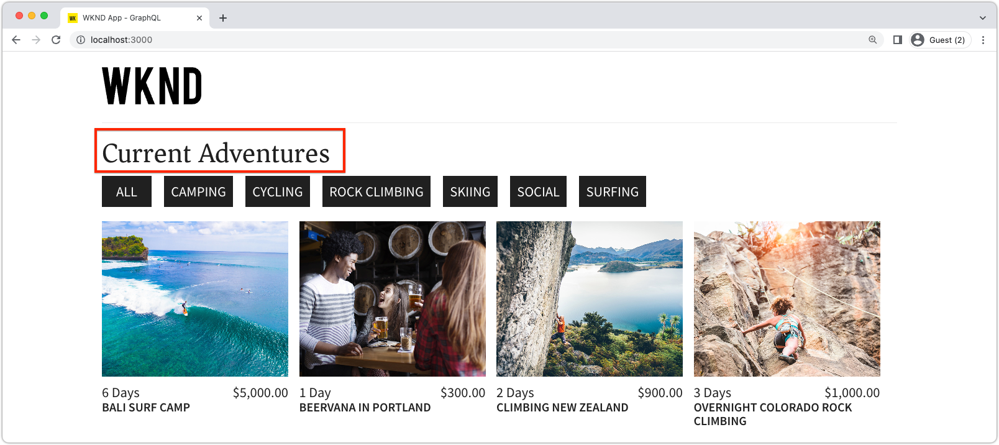

# 可編輯的固定元件

可編輯的React元件可以「固定」，或硬式編碼至SPA檢視中。 如此一來，開發人員就能將與SPA編輯器相容的元件放入SPA檢視中，且使用者能在AEM SPA編輯器中編寫元件的內容。



在本章中，我們將取代「首頁」檢視的標題「Current Adventures」，這是中的硬式編碼文字。 `Home.js` 具有固定但可編輯的標題元件。 固定元件可保證標題的放置，但也允許編寫標題的文字，以及在開發週期外進行變更。

## 更新WKND應用程式

若要新增 __固定__ 元件至「首頁」檢視：

+ 建立自訂的可編輯標題元件並將其註冊到專案的標題資源型別
+ 將可編輯的標題元件放在SPA首頁檢視上

### 建立可編輯的React Title元件

在SPA首頁檢視中，取代硬式編碼文字 `<h2>Current Adventures</h2>` 具有自訂可編輯的標題元件。 在可以使用Title元件之前，我們必須：

1. 建立自訂Title React元件
1. 使用來自的方法裝飾自訂標題元件 `@adobe/aem-react-editable-components` 使其可編輯。
1. 將可編輯的標題元件註冊到 `MapTo` 因此可用於 [容器元件（稍後）](./spa-container-component.md).

若要這麼做：

1. 開啟遠端SPA專案： `~/Code/aem-guides-wknd-graphql/remote-spa-tutorial/react-app` 在您的IDE中
1. 在建立React元件 `react-app/src/components/editable/core/Title.js`
1. 將下列程式碼新增至 `Title.js`.

   ```javascript
   import React from 'react'
   import { RoutedLink } from "./RoutedLink";
   
   const TitleLink = (props) => {
   return (
       <RoutedLink className={props.baseCssClass + (props.nested ? '-' : '__') + 'link'} 
           isRouted={props.routed} 
           to={props.linkURL}>
       {props.text}
       </RoutedLink>
   );
   };
   
   const TitleV2Contents = (props) => {
       if (!props.linkDisabled) {
           return <TitleLink {...props} />
       }
   
       return <>{props.text}</>
   };
   
   export const Title = (props) => {
       if (!props.baseCssClass) {
           props.baseCssClass = 'cmp-title'
       }
   
       const elementType = (!!props.type) ? props.type.toString() : 'h3';
       return (<div className={props.baseCssClass}>
           {
               React.createElement(elementType, {
                       className: props.baseCssClass + (props.nested ? '-' : '__') + 'text',
                   },
                   <TitleV2Contents {...props} />
               )
           }
   
           </div>)
   }
   
   export const titleIsEmpty = (props) => props.text == null || props.text.trim().length === 0
   ```

   請注意，此React元件尚不可使用AEM SPA Editor編輯。 此基本元件將在下一個步驟中變為可編輯。

   閱讀程式碼的註釋，以瞭解實作詳細資訊。

1. 在建立React元件 `react-app/src/components/editable/EditableTitle.js`
1. 將下列程式碼新增至 `EditableTitle.js`.

   ```javascript
   // Import the withMappable API provided bu the AEM SPA Editor JS SDK
   import { EditableComponent, MapTo } from '@adobe/aem-react-editable-components';
   import React from 'react'
   
   // Import the AEM the Title component implementation and it's Empty Function
   import { Title, titleIsEmpty } from "./core/Title";
   import { withConditionalPlaceHolder } from "./core/util/withConditionalPlaceholder";
   import { withStandardBaseCssClass } from "./core/util/withStandardBaseCssClass";
   
   // The sling:resourceType of the AEM component used to collected and serialize the data this React component displays
   const RESOURCE_TYPE = "wknd-app/components/title";
   
   // Create an EditConfig to allow the AEM SPA Editor to properly render the component in the Editor's context
   const EditConfig = {
       emptyLabel: "Title",        // The component placeholder in AEM SPA Editor
       isEmpty: titleIsEmpty,      // The function to determine if this component has been authored
       resourceType: RESOURCE_TYPE // The sling:resourceType this component is mapped to
   };
   
   export const WrappedTitle = (props) => {
       const Wrapped = withConditionalPlaceHolder(withStandardBaseCssClass(Title, "cmp-title"), titleIsEmpty, "TitleV2")
       return <Wrapped {...props} />
   }
   
   // EditableComponent makes the component editable by the AEM editor, either rendered statically or in a container
   const EditableTitle = (props) => <EditableComponent config={EditConfig} {...props}><WrappedTitle /></EditableComponent>
   
   // MapTo allows the AEM SPA Editor JS SDK to dynamically render components added to SPA Editor Containers
   MapTo(RESOURCE_TYPE)(EditableTitle);
   
   export default EditableTitle;
   ```

   此 `EditableTitle` React元件封裝 `Title` React元件，將其包裝和裝飾為可在AEM SPA Editor中編輯。

### 使用React EditableTitle元件

現在EditableTitle React元件已在中註冊並可在React應用程式中使用，請取代「首頁」檢視上的硬式編碼標題文字。

1. 編輯 `react-app/src/components/Home.js`
1. 在 `Home()` 在底部，匯入 `EditableTitle` 並將硬式編碼的標題取代為新的 `AEMTitle` 元件：

   ```javascript
   ...
   import EditableTitle from './editable/EditableTitle';
   ...
   function Home() {
       return (
           <div className="Home">
   
           <EditableTitle
               pagePath='/content/wknd-app/us/en/home'
               itemPath='root/title'/>
   
               <Adventures />
           </div>
       );
   }
   ```

此 `Home.js` 檔案應如下所示：


## 在AEM中編寫標題元件

1. 登入AEM Author
1. 導覽至 __網站> WKND應用程式__
1. 點選 __首頁__ 並選取 __編輯__ 從頂端動作列
1. 選取 __編輯__ 從「頁面編輯器」右上角的編輯模式選擇器中
1. 暫留在WKND標誌下方和冒險清單上方的預設標題文字上，直到顯示藍色編輯外框
1. 點選以公開元件的動作列，然後點選 __扳手__  編輯

   

1. 編寫標題元件：
   + 標題： __WKND冒險__
   + 型別/大小： __H2__

      

1. 點選 __完成__ 儲存
1. 在AEM SPA Editor中預覽變更
1. 重新整理在本機執行的WKND應用程式 [http://localhost:3000](http://localhost:3000) 和會立即反映編寫的標題變更。

   

## 恭喜！

您已將修正、可編輯的元件新增至WKND應用程式！ 您現在知道如何：

+ 已建立固定但可編輯的元件至SPA
+ 在AEM中編寫固定元件
+ 檢視遠端SPA中的編寫內容

## 後續步驟

接下來的步驟是 [新增AEM ResponsiveGrid容器元件](./spa-container-component.md) 可讓作者將可編輯的元件新增至SPA的SPA！
