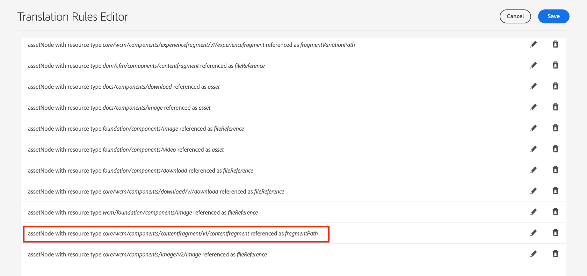

# AEM內容片段的翻譯支援 {#translation-support-content-fragments}

瞭解如何使用Adobe Experience Manager將內容片段當地語系化及翻譯。 與內容片段相關的混合媒體資產也有資格被擷取及翻譯。

>[!VIDEO](https://video.tv.adobe.com/v/18131?quality=12&learn=on)

## 內容片段翻譯使用案例 {#content-fragment-translation-use-cases}

內容片段是AEM擷取並傳送至外部翻譯服務的認可內容型別。 現成支援數個使用案例：

1. 內容片段可以是 [直接在Assets控制檯中選取以進行語言複製和翻譯](https://experienceleague.adobe.com/docs/experience-manager-cloud-service/content/assets/admin/translate-assets.html).
2. 為語言複製選取網站頁面時，在網站頁面上參考的內容片段會複製到適當的語言資料夾並擷取以供翻譯。
3. 內嵌在內容片段中的內嵌媒體資產符合擷取和翻譯的條件。
4. 與內容片段相關的資產集合符合擷取和翻譯的條件。

## 翻譯規則編輯器 {#translation-rules-editor}

Experience Manager翻譯行為可透過使用 **翻譯規則編輯器**. 若要更新翻譯，請導覽至 **工具** > **一般** > **翻譯設定** 在 [http://localhost:4502/libs/cq/translation/translationrules/contexts.html](http://localhost:4502/libs/cq/translation/translationrules/contexts.html).

開箱即用的設定參考內容片段，位於 `fragmentPath` 資源型別為 `core/wcm/components/contentfragment/v1/contentfragment`. 所有繼承自 `v1/contentfragment` 會由預設設定識別。

