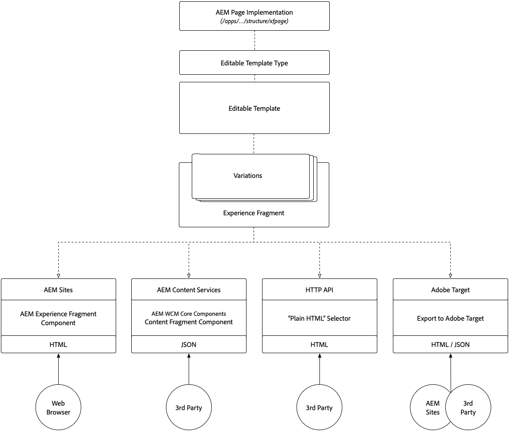

# 瞭解內容片段和體驗片段

Adobe Experience Manager的內容片段和體驗片段在表面上看似類似，但每個片段在不同使用案例中都扮演關鍵角色。 瞭解內容片段和體驗片段的相似性、不同性，以及各片段的使用時機和方式。

## 內容片段與體驗片段比較

<table>
<tbody><tr><td><strong> </strong></td>
<td><strong>內容片段(CF)</strong></td>
<td><strong>體驗片段(XF)</strong></td>
</tr><tr><td><strong>定義</strong></td>
<td><ul>
<li>可重複使用、不限呈 <strong>現的內容</strong>，由結構化資料元素（文字、日期、參考等）組成</li>
</ul>
</td>
<td><ul>
<li>可重複使用、由一或多個AEM元件組成，定義內容和簡報，以 <strong>建立</strong> 、自行有意義的體驗</li>
</ul>
</td>
</tr><tr><td><strong>核心租客</strong></td>
<td><ul>
<li>內容導向</li>
<li>由結構化、 <a href="https://helpx.adobe.com/experience-manager/6-5/assets/using/content-fragments-models.html" target="_blank">表單型的資料模型定義。</a></li>
<li>不受設計和版面限制。</li>
<li>頻道擁有內容片段內容（版面和設計）的簡報</li>
</ul>
</td>
<td><ul>
<li>以簡報為中心</li>
<li>由AEM元件的非結構化組成定義</li>
<li>定義內容的設計和版面</li>
<li>在頻道中使用「原樣」</li>
</ul>
</td>
</tr><tr><td><strong>技術詳細資訊</strong></td>
<td><ul>
<li>實作為dam: <strong>資產</strong></li>
<li>由內容片段 <a href="https://helpx.adobe.com/experience-manager/6-5/assets/using/content-fragments-models.html" target="_blank">模型定義</a></li>
</ul>
</td>
<td><ul>
<li>實作為 <strong>cq:Page</strong></li>
<li>由可編輯範本定義</li>
<li>原生HTML轉譯</li>
</ul>
</td>
</tr><tr><td><strong>變數</strong></td>
<td><ul>
<li>主變分是正則變分</li>
<li>變化是特定使用案例，可能會與通道對齊。</li>
</ul>
</td>
<td><ul>
<li>變化是頻道或內容特定</li>
<li>變數會透過AEM Live Copy保持同步</li>
<li><a href="https://helpx.adobe.com/experience-manager/6-5/sites/authoring/using/experience-fragments.html#BuildingBlocks" target="_blank">建置區塊</a> ，可讓內容在各種變化間重複使用</li>
</ul>
</td>
</tr><tr><td><strong>功能</strong></td>
<td><ul>
<li>變數</li>
<li>版本</li>
<li><a href="https://helpx.adobe.com/experience-manager/6-5/assets/using/content-fragments-variations.html#SynchronizingwithMaster" target="_blank">跨變數</a> ，同步內容</li>
<li><a href="https://helpx.adobe.com/experience-manager/6-5/assets/using/content-fragments-managing.html#ComparingFragmentVersions" target="_blank">內容片段</a> (Content Fragment)版本的視覺化差異</li>
<li><a href="https://helpx.adobe.com/experience-manager/6-5/assets/using/content-fragments-variations.html#AnnotatingaContentFragment" target="_blank">多行文字</a> 元素的註解</li>
<li>智慧 <a href="https://helpx.adobe.com/experience-manager/6-5/assets/using/content-fragments-variations.html#SummarizingText" target="_blank">型多行文字</a> 元素摘要。</li>
<li><a href="https://helpx.adobe.com/experience-manager/6-5/assets/using/creating-translation-projects-for-content-fragments.html" target="_blank">翻譯／本地化</a></li>
</ul>
</td>
<td><ul>
<li>變數</li>
<li>變化為即時副本</li>
<li>版本</li>
<li><a href="https://helpx.adobe.com/experience-manager/6-5/sites/authoring/using/experience-fragments.html#BuildingBlocks" target="_blank">建置區塊</a></li>
<li>註解</li>
<li>互動式版面配置與預覽</li>
<li>翻譯／本地化</li>
</ul>
</td>
</tr><tr><td><strong>使用</strong></td>
<td><ul>
<li><a href="https://docs.adobe.com/content/help/en/experience-manager-core-components/using/components/content-fragment-component.html" target="_blank">AEM Core Components Content Fragment元件</a> ，以用於AEM Sites、AEM Screens或Experience Fragments。</li>
<li>透過 <a href="https://helpx.adobe.com/experience-manager/kt/sites/using/content-services-tutorial-use.html" target="_blank">AEM Content Services匯出JSON</a> ，以供第三方使用</li>
<li>透過AEM HTTP Assets API的JSON，以用於第三方使用。</li>
</ul>
</td>
<td><ul>
<li>AEM Experience Fragment元件，以用於AEM Sites、AEM Screens或其他Experience Fragments。</li>
<li>匯出為 <a href="https://helpx.adobe.com/experience-manager/6-5/sites/authoring/using/experience-fragments.html#ThePlainHTMLRendition" target="_blank">純HTML</a> ，供第三方系統使用</li>
<li><a href="https://helpx.adobe.com/experience-manager/6-5/sites/administering/using/experience-fragments-target.html" target="_blank">HTML匯出至Adobe Target</a> ，以取得目標選件</li>
<li>JSON匯出至Adobe Target以取得定位選件</li>
</ul>
</td>
</tr><tr><td><strong>常見使用案例</strong></td>
<td><ul>
<li>高度結構化的資料輸入／表單內容</li>
<li>長篇編輯內容（多行元素）</li>
<li>在提供內容的通道生命週期之外管理的內容</li>
</ul>
</td>
<td><ul>
<li>使用每個通道的變化集中管理多通道宣傳資料。</li>
<li>在網站的多個頁面間重複使用內容。</li>
<li>網站色彩(例如 頁首和頁尾)</li>
<li>在通道生命週期外管理的體驗，提供</li>
</ul>
</td>
</tr><tr><td><strong>文件</strong></td>
<td><ul>
<li><a href="https://helpx.adobe.com/experience-manager/6-5/assets/user-guide.html?topic=/experience-manager/6-5/assets/morehelp/content-fragments.ug.js" target="_blank">AEM內容片段使用指南</a></li>
<li><a href="https://helpx.adobe.com/experience-manager/kt/sites/using/content-fragments-feature-video-use.html" target="_blank">在AEM中使用內容片段</a></li>
</ul>
</td>
<td><ul>
<li><a href="https://helpx.adobe.com/experience-manager/6-5/sites/authoring/using/experience-fragments.html" target="_blank">Adobe體驗片段檔案</a></li>
</ul>
</td>
</tr></tbody></table>

## 內容片段架構

下圖說明AEM內容片段的整體架構

!

+ **內容片段模型** (Content Fragment Models)定義元素（或欄位），以定義內容片段可擷取和公開的內容。
+ 內 **容片段** (Content Fragment)是代表邏輯內容實體的內容片段模型的例項。
+ 內容片 **段變** 化與內容片段模型相符，但內容有變化。
+ 內容片段可由下列人員公開／使用：
   + 透過AEM WCM核心元件的「內 **容片段」元件，在AEM Sites** （或AEM畫面）上使用內容片段。
   + 透過AEM WCM核心元件的「內容片段 **** 」元件，將內容片段內嵌在「體驗片段」中，以用於任何「體驗片段」使用案例。
   + 透過 **** AEM Content Services和API頁面將「內容片段」變體內容公開為JSON，以供唯讀使用案例。
   + 透過AEM Assets HTTP API **** for CRUD使用案例，直接將內容片段內容（所有變數）公開為JSON，直接呼叫AEM Assets。

## 體驗片段架構

!

+ **可編輯的範本**(依序由「可編輯的範本類型」和 **AEM Page元件實作定義)定義******，請定義允許的AEM元件，以用於合成體驗片段。
+ 「體 **驗片段** 」是可編輯範本的例項，代表邏輯體驗。
+ 體驗片 **段** (Experience Fragment)變數符合可編輯範本，但體驗（內容和設計）有變數。
+ 體驗片段可由下列人員公開／使用：
   + 透過AEM Experience Fragment元件在AEM Sites（或AEM畫面）上使用體驗片段。
   + 透過 **AEM Content Services和API頁面將體驗片段變化內容公開為JSON（含內嵌HTML）** 。
   + 直接將體驗片段變 **數顯示為「純HTML」**。
   + 將體驗片段匯出 **至Adobe Target** ，做為HTML或JSON選件。
   + AEM Sites原本支援HTML選件，但是JSON選件需要自訂開發。

## 內容片段的支援資料

+ [內容片段使用指南](https://helpx.adobe.com/experience-manager/6-5/assets/user-guide.html?topic=/experience-manager/6-5/assets/morehelp/content-fragments.ug.js)
+ [在AEM中使用內容片段](https://helpx.adobe.com/experience-manager/kt/sites/using/content-fragments-feature-video-use.html)
+ [AEM WCM核心元件的內容片段元件](https://docs.adobe.com/content/help/en/experience-manager-core-components/using/components/content-fragment-component.html)
+ [使用內容片段和AEM Content Services](https://helpx.adobe.com/experience-manager/kt/sites/using/structured-fragments-content-services-feature-video-use.html)
+ [AEM Content Services快速入門](https://helpx.adobe.com/experience-manager/kt/sites/using/content-services-tutorial-use.html)

## 體驗片段的支援資料

+ [Adobe體驗片段檔案](https://helpx.adobe.com/experience-manager/6-5/sites/authoring/using/experience-fragments.html)
+ [瞭解AEM體驗片段](https://helpx.adobe.com/experience-manager/kt/sites/using/experience-fragments-feature-video-understand.html)
+ [使用AEM體驗片段](https://helpx.adobe.com/experience-manager/kt/sites/using/experience-fragments-feature-video-use.html)
+ [搭配Adobe Target使用AEM體驗片段](https://medium.com/adobetech/experience-fragments-and-adobe-target-d8d74381b9b2)
