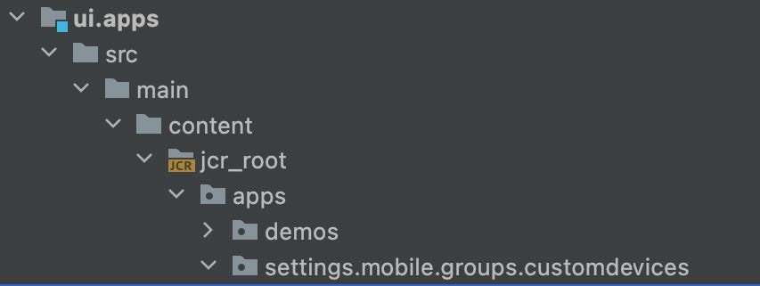

# 響應斷點

瞭解如何為響應頁面編輯器配置AEM新的響應斷點。

## 建立CSS斷點

首先，在響應網格CSSAEM中建立響應站點所AEM附加的媒體斷點。

在 `/ui.apps/src/main/content/jcr_root/apps/[app name]/clientlibs/clientlib-grid/less/grid.less` 檔案，建立要與mobile模擬器一起使用的斷點。 記錄 `max-width` 將CSS斷點映射到響應頁面編輯器AEM斷點。

## 自定義模板的斷點

開啟 `ui.content/src/main/content/jcr_root/conf/<app name>/settings/wcm/templates/page-content/structure/.content.xml` 檔案和更新 `cq:responsive/breakpoints` 定義。 每個 [CSS斷點](#create-new-css-breakpoints) 應在下面有相應的節點 `breakpoints` 和 `width` 屬性設定為CSS斷點的 `max-width`。

## 建立模擬器

必AEM須定義模擬器，使作者能夠在頁面編輯器中選擇要編輯的響應視圖。

在下面建立模擬器節點 `/ui.apps/src/main/content/jcr_root/apps/<app name>/emulators`

比如說， `/ui.apps/src/main/content/jcr_root/apps/wknd-examples/emulators/phone-landscape`。 從複製引用模擬器節點 `/libs/wcm/mobile/components/emulators` CRXDE Lite並更新副本以加快節點定義。

## 建立設備組

將模擬器分組到 [在頁面編輯器中AEM使用](#update-the-templates-device-group)。

建立 `/apps/settings/mobile/groups/<name of device group>` 節點結構 `/ui.apps/src/main/content/jcr_root`。

建立 `.content.xml` 檔案 `/apps/settings/mobile/groups/<device group name>` 並使用與以下代碼類似的代碼定義新模擬器：

## 更新模板的設備組

最後，將設備組映射回頁面模板，以便模擬器在頁面編輯器中可用於從此模板建立的頁面。

開啟 `ui.content/src/main/content/jcr_root/conf/[app name]/settings/wcm/templates/page-content/structure/.content.xml` 檔案並更新 `cq:deviceGroups` 引用新移動組的屬性(例如， `cq:deviceGroups="[mobile/groups/customdevices]"`)
