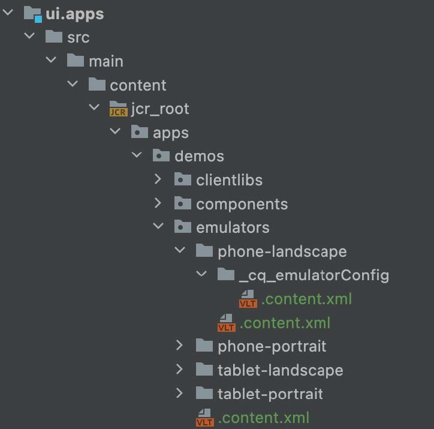

# 回應式中斷點

瞭解如何為AEM回應式頁面編輯器設定新的回應式中斷點。

## 建立CSS中斷點

首先，在AEM回應式格線CSS中建立回應AEM網站所遵循的媒體中斷點。

在 `/ui.apps/src/main/content/jcr_root/apps/[app name]/clientlibs/clientlib-grid/less/grid.less` 檔案中，建立要與行動模擬器一起使用的中斷點。 記下 `max-width` 針對每個中斷點，如此會將CSS中斷點對應至AEM回應式頁面編輯器中斷點。

## 自訂範本的中斷點

開啟 `ui.content/src/main/content/jcr_root/conf/<app name>/settings/wcm/templates/page-content/structure/.content.xml` 檔案和更新 `cq:responsive/breakpoints` 以及您的新中斷點節點定義。 每個 [CSS中斷點](#create-new-css-breakpoints) 下應該有對應的節點 `breakpoints` 及其 `width` 屬性設為CSS中斷點的 `max-width`.

## 建立模擬器

必須定義AEM模擬器，讓作者能夠選取回應式檢視，以便在「頁面編輯器」中編輯。

在下建立模擬器節點 `/ui.apps/src/main/content/jcr_root/apps/<app name>/emulators`

例如 `/ui.apps/src/main/content/jcr_root/apps/wknd-examples/emulators/phone-landscape`。複製參考模擬器節點來源 `/libs/wcm/mobile/components/emulators` 在CRXDE Lite中並更新副本，以加快節點定義。

## 建立裝置群組

將模擬器群組至 [在AEM頁面編輯器中提供](#update-the-templates-device-group).

建立 `/apps/settings/mobile/groups/<name of device group>` 下的節點結構 `/ui.apps/src/main/content/jcr_root`.

建立 `.content.xml` 中的檔案 `/apps/settings/mobile/groups/<device group name>` 並使用與以下內容類似的程式碼定義新模擬器：

## 更新範本的裝置群組

最後，將裝置群組對應回頁面範本，這樣即可在「頁面編輯器」中，使用模擬器來編輯從此範本建立的頁面。

開啟 `ui.content/src/main/content/jcr_root/conf/[app name]/settings/wcm/templates/page-content/structure/.content.xml` 檔案並更新 `cq:deviceGroups` 參照新行動群組的屬性(例如， `cq:deviceGroups="[mobile/groups/customdevices]"`)
