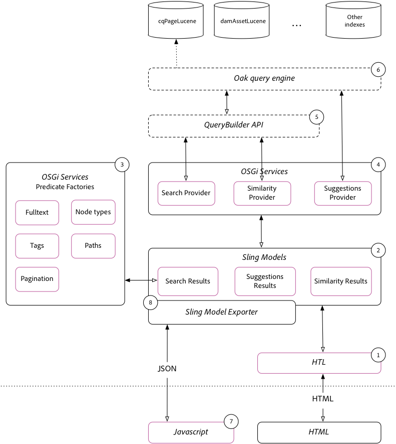

# 簡單搜索實現指南{#simple-search-implementation-guide}

「簡單搜索」實現是 **Adobe Summit實驗AEM室搜索已取消**。 本頁包含本實驗的資料。 有關本實驗的指導教程，請查看本頁「演示」部分的實驗工作簿。



## 演示材料 {#bookmarks}

* [實驗工作簿](assets/l4080/l4080-lab-workbook.pdf)
* [簡報](assets/l4080/l4080-presentation.pdf)

## 書籤 {#bookmarks-1}

### 工具 {#tools}

* [索引管理員](http://localhost:4502/libs/granite/operations/content/diagnosis/tool.html/granite_oakindexmanager)
* [說明查詢](http://localhost:4502/libs/granite/operations/content/diagnosis/tool.html/granite_queryperformance)
* [CRXDE Lite](http://localhost:4502/crx/de/index.jsp#/oak%3Aindex/cqPageLucene) > /oak:index/cqPageLucene
* [CRX包管理器](http://localhost:4502/crx/packmgr/index.jsp)
* [QueryBuilder調試器](http://localhost:4502/libs/cq/search/content/querydebug.html?)
* [Oak索引定義生成器](https://oakutils.appspot.com/generate/index)

### 章節 {#chapters}

*以下章節連結假定 [初始包](#initialpackages) 安裝在AEM Author上，位於`http://localhost:4502`*

* [第一章](http://localhost:4502/editor.html/content/summit/l4080/chapter-1.html)
* [第二章](http://localhost:4502/editor.html/content/summit/l4080/chapter-2.html)
* [第三章](http://localhost:4502/editor.html/content/summit/l4080/chapter-3.html)
* [第四章](http://localhost:4502/editor.html/content/summit/l4080/chapter-4.html)
* [第五章](http://localhost:4502/editor.html/content/summit/l4080/chapter-5.html)
* [第六章](http://localhost:4502/editor.html/content/summit/l4080/chapter-6.html)
* [第七章](http://localhost:4502/editor.html/content/summit/l4080/chapter-7.html)
* [第8章](http://localhost:4502/editor.html/content/summit/l4080/chapter-8.html)
* [第9章](http://localhost:4502/editor.html/content/summit/l4080/chapter-9.html)

## 套件 {#packages}

### 初始包 {#initial-packages}

* [標記](assets/l4080/summit-tags.zip)
* [簡單搜索應用程式套件](assets/l4080/simple.ui.apps-0.0.1-snapshot.zip)

### 章節包 {#chapter-packages}

* [第一章解決方案](assets/l4080/l4080-chapter1.zip)
* [第二章解決方案](assets/l4080/l4080-chapter2.zip)
* [第三章解決方案](assets/l4080/l4080-chapter3.zip)
* [第四章解決方案](assets/l4080/l4080-chapter4.zip)
* [第五章設定](assets/l4080/l4080-chapter5-setup.zip)
* [第五章解決方案](assets/l4080/l4080-chapter5-solution.zip)
* [第六章解決方案](assets/l4080/l4080-chapter6.zip)
* [第九章解決方案](assets/l4080/l4080-chapter9.zip)

## 參考材料 {#reference-materials}

* [Github儲存庫](https://github.com/Adobe-Marketing-Cloud/aem-guides/tree/master/simple-search-guide)
* [Sling 模型](https://sling.apache.org/documentation/bundles/models.html)
* [Sling模型導出器](https://sling.apache.org/documentation/bundles/models.html#exporter-framework-since-130)
* [QueryBuilder API](https://experienceleague.adobe.com/docs/)
* [AEMChrome插件](https://chrome.google.com/webstore/detail/aem-chrome-plug-in/ejdcnikffjleeffpigekhccpepplaode) ([文檔頁](https://adobe-consulting-services.github.io/acs-aem-tools/aem-chrome-plugin/))

## 更正和後續行動 {#corrections-and-follow-up}

實驗室討論的更正和澄清以及與會者對後續問題的回答。

1. **如何停止重新索引？**

   可通過以下方式停止重新索引： [AEMWeb控制台> JMX](http://localhost:4502/system/console/jmx)

   * [http://localhost:4502/system/console/jmx/org.apache.jackrabbit.oak%3Aname%3Dasync%2Ctype%3DIndexStats](http://localhost:4502/system/console/jmx/org.apache.jackrabbit.oak%3Aname%3Dasync%2Ctype%3DIndexStats)
      * 執行 `abortAndPause()` 中止重新索引。 這將鎖定索引以進一步重新索引，直到 `resume()` 調用。
      * 正在執行 `resume()` 將重新啟動索引過程。
   * 文檔： [https://jackrabbit.apache.org/oak/docs/query/indexing.html#async-index-mbean](https://jackrabbit.apache.org/oak/docs/query/indexing.html#async-index-mbean)

2. **橡樹索引如何支援多個租戶？**

   Oak支援將索引從內容樹到外部放置，而這些索引將僅在該子樹內進行索引。 例如 **`/content/site-a/oak:index/cqPageLucene`** 只能建立為內容索引 **`/content/site-a`。**

   等效方法是 **`includePaths`** 和 **`queryPaths`** 索引上的屬性 **`/oak:index`**。 例如：

   * `/oak:index/siteAcqPageLucene@includePaths=/content/site-a`
   * `/oak:index/siteAcqPageLucene@queryPaths=/content/site-a`

   此方法的考慮因素包括：

   * 查詢必須指定與索引的查詢路徑範圍相等的路徑限制，或者是其中的子體。
   * 範圍更廣的索引(例如 `/oak:index/cqPageLucene`)還會對資料進行索引，從而導致重複接收和磁碟使用成本。
   * 可能需要重複配置管理(例如 如果多個租戶索引必須滿足相同的查詢集，則在它們之間添加相同的indexRules)
   * 此方法在AEM發佈層中最適用於自定義站點搜索，與在AEM Author中一樣，在內容樹的上端執行查詢（例如，通過OmniSearch）是常見的做法，不同的索引定義只能根據路徑限制導致不同的行為。


3. **所有可用分析器的清單在哪裡？**

   Oak公開了一組提供Lucene的分析器配置元素，供在中使AEM用。

   * [Apache Oak Analyzers文檔](https://jackrabbit.apache.org/oak/docs/query/lucene.html#analyzers)
      * [標籤器](https://cwiki.apache.org/confluence/display/solr/Tokenizers)
      * [篩選條件](https://cwiki.apache.org/confluence/display/solr/Filter+Descriptions)
      * [字元篩選器](https://cwiki.apache.org/confluence/display/solr/CharFilterFactories)

4. **如何在同一查詢中搜索頁面和資產？**

   6.AEM3中的新增功能是能夠在同一提供的查詢中查詢多個節點類型。 以下QueryBuilder查詢。 請注意，每個「子查詢」都可以解析為自己的索引，因此在本示例中， `cq:Page` 子查詢解析為 `/oak:index/cqPageLucene` 和 `dam:Asset` 子查詢解析為 `/oak:index/damAssetLucene`。

   ```plain
   group.p.or=true
   group.1_group.type=cq:Page
   # add all page restrictions to this group
   group.2_group.type=dam:Asset
   # add all asset restrictions to this group
   ```

   在以下查詢和查詢計畫中生成結果：

   ```plain
   QUERY:(//element(*, cq:Page) | //element(*, dam:Asset))
   
   PLAN: [cq:Page] as [a] /* lucene:cqPageLucene(/oak:index/cqPageLucene) *:* */ union [dam:Asset] as [a] /* lucene:damAssetLucene(/oak:index/damAssetLucene) *:* */
   ```

   瀏覽查詢和結果 [QueryBuilder調試器](http://localhost:4502/libs/cq/search/content/querydebug.html?_charset_=UTF-8&amp;query=group.p.or%3Dtrue%0D%0Agroup.1_group.type%3Dcq%3APage%0D%0A%23+add+all+page+restrictions+to+this+group%0D%0Agroup.2_group.type%3Ddam%3AAsset%0D%0A%23+add+all+asset+restrictions+to+this+group) 和 [AEMChrome插件](https://chrome.google.com/webstore/detail/aem-chrome-plug-in/ejdcnikffjleeffpigekhccpepplaode?hl=en-US)。

5. **如何在同一查詢中搜索多個路徑？**

   6.AEM3中的新增功能是在同一提供的查詢中跨多個路徑查詢。 以下QueryBuilder查詢。 請注意，每個「子查詢」都可能解析為自己的索引。

   ```plain
   group.p.or=true
   group.1_group.type=cq:Page
   group.1_group.path=/content/docs/en/6-2
   # add all page restrictions to this group
   group.2_group.type=cq:Page
   group.2_group.path=/content/docs/en/6-3
   # add all asset restrictions to this group
   ```

   在以下查詢和查詢計畫中生成結果

   ```plain
   QUERY: (/jcr:root/content/docs/en/_x0036_-2//element(*, cq:Page) | /jcr:root/content/docs/en/_x0036_-3//element(*, cq:Page))
   
   PLAN: [cq:Page] as [a] /* traverse "/content/docs/en/6-2//*" where isdescendantnode([a], [/content/docs/en/6-2]) */ union [cq:Page] as [a] /* traverse "/content/docs/en/6-3//*" where isdescendantnode([a], [/content/docs/en/6-3]) */
   ```

   瀏覽查詢和結果 [QueryBuilder調試器](http://localhost:4502/libs/cq/search/content/querydebug.html?_charset_=UTF-8&amp;query=group.p.or%3Dtrue%0D%0Agroup.1_group.type%3Dcq%3APage%0D%0Agroup.1_group.path%3D%2Fcontent%2Fdocs%2Fen%2F6-2%0D%0A%23+add+all+page+restrictions+to+this+group%0D%0Agroup.2_group.type%3Dcq%3APage%0D%0Agroup.2_group.path%3D%2Fcontent%2Fdocs%2Fen%2F6-3%0D%0A%23+add+all+asset+restrictions+to+this+group) 和 [AEMChrome插件](https://chrome.google.com/webstore/detail/aem-chrome-plug-in/ejdcnikffjleeffpigekhccpepplaode?hl=en-US)。
