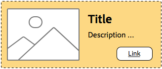

# 瞭解樣式系統最佳實務{#understanding-style-organization-with-the-aem-style-system}

>[!NOTE]
>
>請在以下位置檢閱內容： [瞭解如何為樣式系統編寫程式碼](style-system-technical-video-understand.md)，以確保瞭解AEM樣式系統所使用的類似BEM的慣例。

針對「AEM樣式系統」實作有兩種主要風格或樣式：

* **配置樣式**
* **顯示樣式**

**配置樣式** 會影響元件的許多元素，以建立元件的明確定義和可識別的轉譯（設計和配置），通常會對齊特定的可重複使用的Brand概念。 例如，Teaser元件可能能夠以傳統卡片式版面配置、水準促銷樣式或作為主圖版面配置，在影像上覆蓋文字。

**顯示樣式** 可用來影響版面樣式的細微變化，但是它們不會改變版面樣式的基本性質或意圖。 例如，Hero版面配置樣式可能具有顯示樣式，可將色彩配置從主要品牌色彩配置變更為次要品牌色彩配置。

## 樣式組織最佳實務 {#style-organization-best-practices}

定義可供AEM作者使用的樣式名稱時，最好：

* 使用作者能理解的辭彙為樣式命名
* 最小化樣式選項的數目
* 僅公開品牌標準允許的樣式選項和組合
* 僅公開具有效果的樣式組合
   * 如果暴露無效組合，請確定它們至少不會產生不良影響

隨著AEM作者可用的可能樣式組合數量增加，存在更多必須經過QA驗證且符合品牌標準的排列。 太多選項也會讓作者感到困惑，因為可能不知道需要哪個選項或組合才能產生想要的效果。

### 樣式名稱與CSS類別的比較 {#style-names-vs-css-classes}

樣式名稱，或呈現給AEM作者的選項，以及實作CSS類別名稱在AEM中是分離的。

這可讓樣式選項以清楚的辭彙標示，並供AEM作者理解，但可讓CSS開發人員以未來的校訂語意方式命名CSS類別。 例如：

元件必須具備可用品牌顏色設定的選項 **主要** 和 **次要** 不過，AEM作者知道這些顏色為 **綠色** 和 **黃色**，而非主要和次要的設計語言。

AEM樣式系統可使用作者友善的標籤來公開這些著色顯示樣式 **綠色** 和 **黃色**，同時允許CSS開發人員使用 `.cmp-component--primary-color` 和 `.cmp-component--secondary-color` 以定義CSS中的實際樣式實施。

的樣式名稱 **綠色** 已對應 `.cmp-component--primary-color`、和 **黃色** 至 `.cmp-component--secondary-color`.

如果公司的品牌色彩在未來有所變更，只需對進行單一實作即可 `.cmp-component--primary-color` 和 `.cmp-component--secondary-color`，以及樣式名稱。

## Teaser元件作為範例使用案例 {#the-teaser-component-as-an-example-use-case}

以下範例使用案例來設定Teaser元件的樣式，使其具有數種不同的「配置」和「顯示」樣式。

這將會探索樣式名稱（向作者公開）以及支援CSS類別的組織方式。

### Teaser元件樣式設定 {#component-styles-configuration}

下圖顯示 [!UICONTROL 樣式] 針對使用案例中討論的變異的Teaser元件設定。

此 [!UICONTROL 樣式群組] 名稱、版面配置及顯示（依偶然情況）與本文中用來將樣式型別概念分類的顯示樣式及版面樣式的一般概念相符。

此 [!UICONTROL 樣式群組] 名稱與數量 [!UICONTROL 樣式群組] 應針對元件使用案例和專案特定的元件樣式慣例量身打造。

例如， **顯示** 樣式群組名稱可能已被命名 **顏色**.


### 樣式選取功能表 {#style-selection-menu}

下圖顯示 [!UICONTROL 樣式] 功能表作者可與互動，為元件選取適當的樣式。 請注意 [!UICONTROL 樣式群組] 名稱以及樣式名稱都會向作者公開。


### 預設樣式 {#default-style}

預設樣式通常是元件最常用的樣式，以及新增到頁面時預設的Teaser未樣式檢視。

根據預設樣式的通用性，CSS可以直接套用在 `.cmp-teaser` （不含任何修飾元）或 `.cmp-teaser--default`.

如果預設樣式規則套用頻率高於不套用至所有變數，最好使用 `.cmp-teaser` 作為預設樣式的CSS類別，因為所有變數都應該隱含地繼承它們，假設遵循BEM之類的約定。 如果沒有，則應透過預設修飾元套用，例如 `.cmp-teaser--default`，則需要將其新增至 [元件的樣式設定的預設CSS類別](#component-styles-configuration) 欄位，否則必須在每個變數中覆寫這些樣式規則。

您甚至可以指派「已命名」的樣式作為預設樣式，例如Hero樣式 `(.cmp-teaser--hero)` 定義如下，但更清楚的是要對 `.cmp-teaser` 或 `.cmp-teaser--default` CSS類別實作。

>[!NOTE]
>
>請注意，預設配置樣式沒有「顯示」樣式名稱，但作者可以在「AEM樣式系統」選取工具中選取「顯示」選項。
>
>這違反了最佳實務：
>
>**僅公開具有效果的樣式組合**
>
>如果作者選取「顯示」樣式 **綠色** 什麼都不會發生。
>
>在此使用案例中，我們將承認此違規，因為所有其他版面樣式都必須可使用品牌顏色上色。
>
>在 **促銷（靠右對齊）** 下節將說明如何防止不想要的樣式組合。


* **配置樣式**
   * 預設
* **顯示樣式**
   * 無
* **有效的CSS類別**： `.cmp-teaser--promo` 或 `.cmp-teaser--default`

### 促銷樣式 {#promo-style}

此 **促銷配置樣式** 用於促銷網站上的高價值內容，且會水準配置以佔用網頁上的一連串空間，且必須可依品牌顏色樣式（預設的「促銷」配置樣式使用黑色文字）。

達成此目的， **配置樣式** 之 **促銷** 和 **顯示樣式** 之 **綠色** 和 **黃色** 已在AEM樣式系統中為Teaser元件設定。

#### 促銷預設


* **配置樣式**
   * 樣式名稱： **促銷**
   * CSS 類別: `cmp-teaser--promo`
* **顯示樣式**
   * 無
* **有效的CSS類別**： `.cmp-teaser--promo`

#### 主要促銷


* **配置樣式**
   * 樣式名稱： **促銷**
   * CSS 類別: `cmp-teaser--promo`
* **顯示樣式**
   * 樣式名稱： **綠色**
   * CSS 類別: `cmp-teaser--primary-color`
* **有效的CSS類別**： `cmp-teaser--promo.cmp-teaser--primary-color`

#### 次要促銷



* **配置樣式**
   * 樣式名稱： **促銷**
   * CSS 類別: `cmp-teaser--promo`
* **顯示樣式**
   * 樣式名稱： **黃色**
   * CSS 類別: `cmp-teaser--secondary-color`
* **有效的CSS類別**： `cmp-teaser--promo.cmp-teaser--secondary-color`

### 促銷右對齊樣式 {#promo-r-align}

此 **促銷活動靠右對齊** 版面配置樣式是「促銷」樣式的變數，樣式會翻轉影像和文字（影像在右，文字在左）的位置。

正確的對齊方式位於其核心，是顯示樣式，可將其作為「顯示樣式」輸入到「AEM樣式系統」中，該顯示樣式與「促銷」版面配置樣式一起選取。 這違反下列最佳實務：

**僅公開具有效果的樣式組合**

..已經違反了 [預設樣式](#default-style).

由於正確對齊方式只會影響「促銷」版面樣式，而不會影響其他2種版面樣式：預設和主圖，因此我們可以建立新的版面樣式「促銷」（靠右對齊），其中包含將「促銷」版面樣式內容靠右對齊的CSS類別： `cmp -teaser--alternate`.

將多個樣式組合成單一樣式專案，也有助於減少可用樣式和樣式排列的數目，這是最理想的作法。

注意CSS類別的名稱， `cmp-teaser--alternate`，不必符合作者易記的「right aligned」命名法。

#### 促銷右對齊預設值


* **配置樣式**
   * 樣式名稱： **促銷（靠右對齊）**
   * CSS 類別: `cmp-teaser--promo cmp-teaser--alternate`
* **顯示樣式**
   * 無
* **有效的CSS類別**： `.cmp-teaser--promo.cmp-teaser--alternate`

#### 主要促銷活動靠右對齊


* **配置樣式**
   * 樣式名稱： **促銷（靠右對齊）**
   * CSS 類別: `cmp-teaser--promo cmp-teaser--alternate`
* **顯示樣式**
   * 樣式名稱： **綠色**
   * CSS 類別: `cmp-teaser--primary-color`
* **有效的CSS類別**： `.cmp-teaser--promo.cmp-teaser--alternate.cmp-teaser--primary-color`

#### 促銷右對齊次要


* **配置樣式**
   * 樣式名稱： **促銷（靠右對齊）**
   * CSS 類別: `cmp-teaser--promo cmp-teaser--alternate`
* **顯示樣式**
   * 樣式名稱： **黃色**
   * CSS 類別: `cmp-teaser--secondary-color`
* **有效的CSS類別**： `.cmp-teaser--promo.cmp-teaser--alternate.cmp-teaser--secondary-color`

### 英雄樣式 {#hero-style}

主圖版面配置樣式會將元件的影像顯示為背景，並覆蓋標題和連結。 主圖版面配置樣式（如促銷版面配置樣式）必須可搭配品牌色彩上色。

若要使用品牌色彩為主圖版面樣式著色，可運用與促銷版面樣式相同的顯示樣式。

每個元件，樣式名稱會對應至單一CSS類別集，這表示使Promo配置樣式背景著色的CSS類別名稱，必須使Hero配置樣式的文字和連結著色。

只要設定CSS規則的範圍，就基本上可以實現這一點，不過，這確實需要CSS開發人員瞭解這些排列如何在AEM上實作。

用於為背景著色的CSS **提升** 主要（綠色）色彩的版面配置樣式：

```css
.cmp-teaser--promo.cmp-teaser--primary--color {
   ...
   background-color: green;
   ...
}
```

用於為文字著色的CSS **Hero** 主要（綠色）色彩的版面配置樣式：

```css
.cmp-teaser--hero.cmp-teaser--primary--color {
   ...
   color: green;
   ...
}
```

#### Hero預設


* **配置樣式**
   * 樣式名稱： **Hero**
   * CSS 類別: `cmp-teaser--hero`
* **顯示樣式**
   * 無
* **有效的CSS類別**： `.cmp-teaser--hero`

#### 主要英雄


* **配置樣式**
   * 樣式名稱： **促銷**
   * CSS 類別: `cmp-teaser--hero`
* **顯示樣式**
   * 樣式名稱： **綠色**
   * CSS 類別: `cmp-teaser--primary-color`
* **有效的CSS類別**： `cmp-teaser--hero.cmp-teaser--primary-color`

#### Hero次要


* **配置樣式**
   * 樣式名稱： **促銷**
   * CSS 類別: `cmp-teaser--hero`
* **顯示樣式**
   * 樣式名稱： **黃色**
   * CSS 類別: `cmp-teaser--secondary-color`
* **有效的CSS類別**： `cmp-teaser--hero.cmp-teaser--secondary-color`

## 其他資源 {#additional-resources}

* [樣式系統檔案](https://helpx.adobe.com/experience-manager/6-5/sites/authoring/using/style-system.html)
* [建立AEM使用者端資料庫](https://helpx.adobe.com/experience-manager/6-5/sites/developing/using/clientlibs.html)
* [BEM （區塊元素修飾元）檔案網站](https://getbem.com/)
* [較少說明檔案網站](https://lesscss.org/)
* [jQuery網站](https://jquery.com/)
