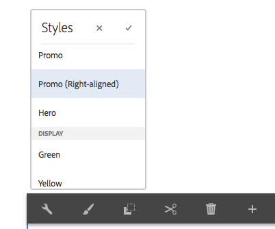

# 瞭解樣式系統最佳做法{#understanding-style-organization-with-the-aem-style-system}

>[!NOTE]
>
>請查看以下內容： [瞭解如何為樣式系統編碼](style-system-technical-video-understand.md)，以確保瞭解樣式系統使用的BEMAEM類約定。

為Style System實施了兩種主要風格AEM或樣式：

* **佈局樣式**
* **顯示樣式**

**佈局樣式** 影響「元件」的許多元素，以建立元件的明確定義和可識別的格式副本（設計和佈局），通常與特定的可重用品牌概念相協調。 例如，預告元件可以以傳統的基於卡的佈局、水準提升樣式或以Hero佈局的形式呈現在影像上。

**顯示樣式** 但是，它們不會更改佈局樣式的基本性質或意圖。 例如，Hero佈局樣式可能具有將顏色方案從主品牌顏色方案更改為輔助品牌顏色方案的顯示樣式。

## 風格組織最佳實踐 {#style-organization-best-practices}

定義可供作者使用的樣AEM式名稱時，最好：

* 使用作者理解的辭彙的名稱樣式
* 最小化樣式選項的數量
* 僅公開品牌標準允許的樣式選項和組合
* 僅顯示有效的樣式組合
   * 如果暴露無效組合，請確保它們至少不會產生不良影響

隨著作者可用的樣式組合數量AEM的增加，必須按品牌標準進行QA和驗證的組合數量會越多。 太多的選項也可能讓作者感到困惑，因為不清楚需要哪種選項或組合才能產生期望的效果。

### 樣式名稱與CSS類 {#style-names-vs-css-classes}

樣式名稱，或向作者提AEM供的選項，以及實現CSS類名在中AEM解耦。

這樣，Style選項就可以用辭彙來標籤，並且作者AEM可以清楚地理解，但CSS開發人員可以以將來證明的語義方式命名CSS類。 例如：

元件必須具有選項，以便與品牌 **主** 和 **次** 但是，作AEM者知道顏色 **綠** 和 **黃**，而不是主、輔的設計語言。

樣式系AEM統可以使用對作者友好的標籤來公開這些著色顯示樣式 **綠色** 和 **黃色**，同時允許CSS開發人員使用 `.cmp-component--primary-color` 和 `.cmp-component--secondary-color` 定義CSS中的實際樣式實現。

樣式名稱 **綠色** 映射到 `.cmp-component--primary-color`, **黃色** 至 `.cmp-component--secondary-color`。

如果公司的品牌顏色在未來發生變化，那麼需要改變的就是 `.cmp-component--primary-color` 和 `.cmp-component--secondary-color`和樣式名稱。

## Teaser元件作為示例用例 {#the-teaser-component-as-an-example-use-case}

下面是一個示例用例，用於定義Teaser元件，使其具有多種不同的「佈局」和「顯示」樣式。

這將探討Style名稱（向作者公開）以及備用CSS類的組織方式。

### 預告元件樣式配置 {#component-styles-configuration}

下圖顯示 [!UICONTROL 樣式] 用於Teaser元件的配置，用於使用案例中討論的變體。

的 [!UICONTROL 樣式組] 名稱、佈局和顯示（按偶發方式）與「顯示樣式」和「佈局樣式」的一般概念相匹配。

的 [!UICONTROL 樣式組] 名稱和 [!UICONTROL 樣式組] 應根據元件使用案例和特定於項目的元件樣式約定進行定制。

例如， **顯示** 樣式組名稱可以命名 **顏色**。


### 樣式選擇菜單 {#style-selection-menu}

下圖顯示 [!UICONTROL 樣式] 菜單作者與交互，以為元件選擇適當的樣式。 注意 [!UICONTROL 樣式Grpi] 名稱以及「樣式」名稱都向作者公開。



### 預設樣式 {#default-style}

預設樣式通常是元件最常用的樣式，添加到頁面時是預告的預設未樣式視圖。

根據預設樣式的通用性，CSS可以直接應用於 `.cmp-teaser` （沒有修改量）或 `.cmp-teaser--default`。

如果預設樣式規則應用於所有變體的頻率比不適用於所有變體的頻率更高，則最好使用 `.cmp-teaser` 作為預設樣式的CSS類，因為所有變體都應隱式繼承它們，假設遵循BEM類約定。 否則，應通過預設修改量應用，如 `.cmp-teaser--default`而這又需要添加到 [元件的樣式配置的預設CSS類](#component-styles-configuration) 欄位，否則，必須在每個變體中覆蓋這些樣式規則。

甚至可以將「命名」樣式指定為預設樣式，例如，Hero樣式 `(.cmp-teaser--hero)` 定義，但更清楚的是 `.cmp-teaser` 或 `.cmp-teaser--default` CSS類實現。

>[!NOTE]
>
>請注意，「預設佈局」樣式沒有「顯示」樣式名稱，但作者可以在「樣式系統」(Style System)選取工具中選AEM擇「顯示」(Display)選項。
>
>這違反了最佳做法：
>
>**僅顯示有效的樣式組合**
>
>如果作者選擇的「顯示」樣式 **綠色** 什麼也不會發生。
>
>在此使用情形中，我們將承認此違規，因為所有其他佈局樣式必須使用品牌顏色才能著色。
>
>在 **促銷（右對齊）** 下面的部分將介紹如何防止不需要的樣式組合。


* **佈局樣式**
   * 預設
* **顯示樣式**
   * 無
* **有效的CSS類**: `.cmp-teaser--promo` 或 `.cmp-teaser--default`

### 促銷樣式 {#promo-style}

的 **促銷版式樣式** 用於在站點上提升高價值內容，並水準放置以佔用網頁上的一段空間，且必須按品牌顏色顯示樣式，預設的Promo佈局樣式使用黑色文本。

實現這個， **佈局樣式** 共 **促銷** 和 **顯示樣式** 共 **綠色** 和 **黃色** 在Style System中AEM為預激元件配置。

#### 促銷預設值


* **佈局樣式**
   * 樣式名稱： **促銷**
   * CSS 類別: `cmp-teaser--promo`
* **顯示樣式**
   * 無
* **有效的CSS類**: `.cmp-teaser--promo`

#### 促銷主要


* **佈局樣式**
   * 樣式名稱： **促銷**
   * CSS 類別: `cmp-teaser--promo`
* **顯示樣式**
   * 樣式名稱： **綠色**
   * CSS 類別: `cmp-teaser--primary-color`
* **有效的CSS類**: `cmp-teaser--promo.cmp-teaser--primary-color`

#### 促銷輔助


* **佈局樣式**
   * 樣式名稱： **促銷**
   * CSS 類別: `cmp-teaser--promo`
* **顯示樣式**
   * 樣式名稱： **黃色**
   * CSS 類別: `cmp-teaser--secondary-color`
* **有效的CSS類**: `cmp-teaser--promo.cmp-teaser--secondary-color`

### 促銷右對齊樣式 {#promo-r-align}

的 **促銷右對齊** 佈局樣式是Promo樣式的變體，該樣式會反轉影像和文本（影像在右側，文本在左側）的位置。

右對齊的核心是顯示樣式，它可以作為與促銷佈局樣式一起選擇的顯示樣式AEM輸入到「樣式系統」中。 這違反了以下最佳做法：

**僅顯示有效的樣式組合**

..已經在 [預設樣式](#default-style)。

因為右對齊只影響促銷版式樣式，而不影響其它2種佈局樣式：預設和英雄，我們可以建立新的佈局樣式Promo（右對齊），該樣式包括CSS類，該類將Promo佈局樣式內容右對齊： `cmp -teaser--alternate`。

將多種樣式組合到單個「樣式」條目中還有助於減少可用樣式和樣式排列的數量，這最好能將其降至最低。

注意CSS類的名稱， `cmp-teaser--alternate`，不必與「右對齊」的對作者友好的術語匹配。

#### 促銷右對齊預設


* **佈局樣式**
   * 樣式名稱： **促銷（右對齊）**
   * CSS 類別: `cmp-teaser--promo cmp-teaser--alternate`
* **顯示樣式**
   * 無
* **有效的CSS類**: `.cmp-teaser--promo.cmp-teaser--alternate`

#### 促銷右對齊主


* **佈局樣式**
   * 樣式名稱： **促銷（右對齊）**
   * CSS 類別: `cmp-teaser--promo cmp-teaser--alternate`
* **顯示樣式**
   * 樣式名稱： **綠色**
   * CSS 類別: `cmp-teaser--primary-color`
* **有效的CSS類**: `.cmp-teaser--promo.cmp-teaser--alternate.cmp-teaser--primary-color`

#### 促銷右對齊輔助


* **佈局樣式**
   * 樣式名稱： **促銷（右對齊）**
   * CSS 類別: `cmp-teaser--promo cmp-teaser--alternate`
* **顯示樣式**
   * 樣式名稱： **黃色**
   * CSS 類別: `cmp-teaser--secondary-color`
* **有效的CSS類**: `.cmp-teaser--promo.cmp-teaser--alternate.cmp-teaser--secondary-color`

### 英雄風格 {#hero-style}

「英雄」佈局樣式將元件的影像顯示為背景，標題和連結已疊加。 Hero版式樣式與Promo版式樣式一樣，必須具有品牌顏色。

要用品牌顏色對Hero佈局樣式進行顏色調整，可以利用與促銷佈局樣式相同的顯示樣式。

每個元件，樣式名稱都映射到單個CSS類集，這意味著為促銷佈局樣式的背景添加顏色的CSS類名稱必須為Hero佈局樣式的文本和連結添加顏色。

這可以通過對CSS規則進行範圍界定來實現，但這確實需要CSS開發人員瞭解這些排列在上是如何實施AEM的。

著色背景的CSS **提升** 主（綠色）顏色的佈局樣式：

```css
.cmp-teaser--promo.cmp-teaser--primary--color {
   ...
   background-color: green;
   ...
}
```

用於為 **英雄** 主（綠色）顏色的佈局樣式：

```css
.cmp-teaser--hero.cmp-teaser--primary--color {
   ...
   color: green;
   ...
}
```

#### 英雄預設


* **佈局樣式**
   * 樣式名稱： **英雄**
   * CSS 類別: `cmp-teaser--hero`
* **顯示樣式**
   * 無
* **有效的CSS類**: `.cmp-teaser--hero`

#### 英雄初級


* **佈局樣式**
   * 樣式名稱： **促銷**
   * CSS 類別: `cmp-teaser--hero`
* **顯示樣式**
   * 樣式名稱： **綠色**
   * CSS 類別: `cmp-teaser--primary-color`
* **有效的CSS類**: `cmp-teaser--hero.cmp-teaser--primary-color`

#### 英雄二級


* **佈局樣式**
   * 樣式名稱： **促銷**
   * CSS 類別: `cmp-teaser--hero`
* **顯示樣式**
   * 樣式名稱： **黃色**
   * CSS 類別: `cmp-teaser--secondary-color`
* **有效的CSS類**: `cmp-teaser--hero.cmp-teaser--secondary-color`

## 其他資源 {#additional-resources}

* [樣式系統文檔](https://helpx.adobe.com/experience-manager/6-5/sites/authoring/using/style-system.html)
* [建立客AEM戶端庫](https://helpx.adobe.com/experience-manager/6-5/sites/developing/using/clientlibs.html)
* [BEM（塊元素修改量）文檔網站](https://getbem.com/)
* [LESS文檔網站](https://lesscss.org/)
* [jQuery網站](https://jquery.com/)
