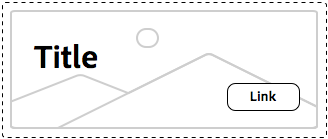

# 瞭解樣式系統最佳實踐{#understanding-style-organization-with-the-aem-style-system}

>[!NOTE]
>
>請在[瞭解如何編寫樣式系統的代碼中查看內容，以確保瞭解樣式系統使用的類似BEM的AEM慣例。](style-system-technical-video-understand.md)

Style System主要實作兩種風格或AEM樣式：

* **版面樣式**
* **顯示樣式**

**版面** 樣式會影響元件的許多元素，以建立元件的良好定義和可識別的轉譯（設計和版面），通常會與特定可重複使用的品牌概念一致。例如，Teaser元件可能以傳統的卡片式版面、水準的促銷樣式或影像上的Hero版面覆蓋文字呈現。

**顯示** 樣式用於影響佈局樣式的細微變化，但不會更改佈局樣式的基本性質或意圖。例如，Hero版面樣式可能具有顯示樣式，可將顏色配置從主要品牌顏色配置變更為次要品牌顏色配置。

## 設定組織最佳範例樣式{#style-organization-best-practices}

定義作者可用的樣式AEM名稱時，最好：

* 使用作者所瞭解的辭彙來命名樣式
* 將樣式選項的數量減到最少
* 僅公開品牌標準允許的樣式選項和組合
* 僅公開具有特效的樣式組合
   * 如果暴露了無效的組合，請確保它們至少不會產生不良效果

隨著作者可使用的樣式組合數AEM目增加，必鬚根據品牌標準進行QA和驗證的組合數量也會增加。 太多的選項也會混淆作者，因為可能不清楚需要哪種選項或組合才能產生所需的效果。

### 樣式名稱與CSS類{#style-names-vs-css-classes}

樣式名稱或提供給作者的選AEM項，以及實作的CSS類別名稱會在中解耦AEM。

這可讓「樣式」選項在辭彙中加上標籤，讓作者清楚瞭解，AEM但讓CSS開發人員以適用於未來的語義方式命名CSS類別。 例如：

元件必須具有以品牌的&#x200B;**primary**&#x200B;和&#x200B;**secondary**&#x200B;顏色著色的選項，但作者知道顏色為AEM **green**&#x200B;和&#x200B;**yellow**，而不是主要和次要的設計語言。

樣式系AEM統可使用適合作者的&#x200B;**Green**&#x200B;和&#x200B;**Yellow**&#x200B;標籤來公開這些色彩顯示樣式，同時允許CSS開發人員使用`.cmp-component--primary-color`和`.cmp-component--secondary-color`的語義命名來定義CSS中的實際樣式實作。

將&#x200B;**Green**&#x200B;的樣式名稱映射到`.cmp-component--primary-color`，將&#x200B;**Yellow**&#x200B;映射到`.cmp-component--secondary-color`。

如果公司的品牌顏色未來會有所改變，則需要改變的只有`.cmp-component--primary-color`和`.cmp-component--secondary-color`的單一實作，以及樣式名稱。

## Teaser元件為範例使用案例{#the-teaser-component-as-an-example-use-case}

以下是設定Teaser元件樣式以具有數個不同版面和顯示樣式的範例使用案例。

這將探索Style名稱（對作者公開）的方式，以及後備CSS類的組織方式。

### 摘要元件樣式設定{#component-styles-configuration}

下圖顯示了Teaser元件的[!UICONTROL Styles]配置，以瞭解使用案例中討論的變化。

[!UICONTROL 樣式群組]名稱、版面和顯示，偶然符合本文中用來概念性分類樣式的「顯示樣式」和「版面樣式」的一般概念。

[!UICONTROL 樣式群組]名稱和[!UICONTROL 樣式群組]的數目應根據元件使用案例和專案特定的元件樣式慣例加以調整。

例如，**Display**&#x200B;樣式群組名稱可能已命名為&#x200B;**Colors**。


### 樣式選擇菜單{#style-selection-menu}

下圖顯示[!UICONTROL Style]功能表作者與之互動，以選取元件的適當樣式。 請注意，[!UICONTROL 樣式圖形]名稱以及樣式名稱都對作者公開。


### 預設樣式{#default-style}

預設樣式通常是元件最常使用的樣式，當新增至頁面時，預設的摘要未樣式檢視。

CSS可以直接套用至`.cmp-teaser`（不含任何修飾元）或`.cmp-teaser--default`，視預設樣式的通用性而定。

如果預設樣式規則比不適用於所有變化更頻繁，則最好使用`.cmp-teaser`作為預設樣式的CSS類，因為所有變化都應隱式繼承它們，前提是遵循BEM類似慣例。 否則，應透過預設修飾元套用，例如`.cmp-teaser--default`，而此修飾元又需要新增至[元件的樣式設定「預設CSS類別」欄位，否則，這些樣式規則必須在每個變數中覆寫。](#component-styles-configuration)

您甚至可以指派&quot;named&quot;樣式作為預設樣式，例如，下面定義的Hero樣式`(.cmp-teaser--hero)`，但是更清楚的是，要針對`.cmp-teaser`或`.cmp-teaser--default` CSS類別實作預設樣式。

>[!NOTE]
>
>請注意，「預設版面樣式」沒有「顯示樣式」名稱，但是，作者可以在「樣式系統」選取工具中選取「顯AEM示」選項。
>
>這違反了最佳做法：
>
>**僅公開具有特效的樣式組合**
>
>如果作者選擇&#x200B;**Green**&#x200B;的顯示樣式，則不會發生任何情況。
>
>在此使用案例中，我們將承認此違規，因為所有其他版面樣式都必須使用品牌顏色可上色。
>
>在下面的&#x200B;**促銷（右對齊）**&#x200B;區段中，我們將瞭解如何防止不想要的樣式組合。


* **版面樣式**
   * 預設
* **顯示樣式**
   * 無
* **有效的CSS類別**: `.cmp-teaser--promo` 或  `.cmp-teaser--default`

### 促銷樣式{#promo-style}

**促銷版面樣式**&#x200B;用於促銷網站上的高價值內容，並水準排版以佔用網頁上的一段空間，且必須以品牌顏色為樣式，預設的促銷版面樣式是使用黑色文字。

為此，在摘要元件的樣式系統中配置了&#x200B;**促銷**&#x200B;的&#x200B;**佈局樣式**&#x200B;和&#x200B;**綠色**&#x200B;和&#x200B;**黃色**&#x200B;的&#x200B;**顯示樣式**。

#### 促銷預設值


* **版面樣式**
   * 樣式名稱：**促銷**
   * CSS 類別: `cmp-teaser--promo`
* **顯示樣式**
   * 無
* **有效的CSS類別**:  `.cmp-teaser--promo`

#### 促銷主要


* **版面樣式**
   * 樣式名稱：**促銷**
   * CSS 類別: `cmp-teaser--promo`
* **顯示樣式**
   * 樣式名稱：**綠色**
   * CSS 類別: `cmp-teaser--primary-color`
* **有效的CSS類別**:  `cmp-teaser--promo.cmp-teaser--primary-color`

#### 促銷次要


* **版面樣式**
   * 樣式名稱：**促銷**
   * CSS 類別: `cmp-teaser--promo`
* **顯示樣式**
   * 樣式名稱：**黃色**
   * CSS 類別: `cmp-teaser--secondary-color`
* **有效的CSS類別**:  `cmp-teaser--promo.cmp-teaser--secondary-color`

### 促銷右對齊樣式{#promo-r-align}

**促銷右對齊**&#x200B;版面樣式是促銷樣式的變化，該樣式會反向影像和文字的位置（影像位於右側，文字位於左側）。

其核心是顯示樣式的正確對齊方式，可將它作為顯示樣式輸入「樣式系統」中，並與AEM促銷版面配置樣式一起選取。 這違反了以下最佳做法：

**僅公開具有特效的樣式組合**

...已在[Default style](#default-style)中違反。

由於正確的對齊方式只會影響促銷版面樣式，而不會影響其他2種版面樣式：預設和英雄，我們可以建立新的版面樣式Promo（對齊右側），其中包含CSS類別，以對齊Promo版面樣式內容：`cmp -teaser--alternate`。

將多種樣式結合為單一樣式項目，也有助於減少可用樣式和樣式排列的數目，最好將其降到最低。

請注意，CSS類別`cmp-teaser--alternate`的名稱不必符合對作者友好的「對齊右」命名法。

#### 促銷活動右對齊預設值


* **版面樣式**
   * 樣式名稱：**促銷（右對齊）**
   * CSS 類別: `cmp-teaser--promo cmp-teaser--alternate`
* **顯示樣式**
   * 無
* **有效的CSS類別**:  `.cmp-teaser--promo.cmp-teaser--alternate`

#### 促銷右對齊主


* **版面樣式**
   * 樣式名稱：**促銷（右對齊）**
   * CSS 類別: `cmp-teaser--promo cmp-teaser--alternate`
* **顯示樣式**
   * 樣式名稱：**綠色**
   * CSS 類別: `cmp-teaser--primary-color`
* **有效的CSS類別**:  `.cmp-teaser--promo.cmp-teaser--alternate.cmp-teaser--primary-color`

#### 促銷右對齊次級


* **版面樣式**
   * 樣式名稱：**促銷（右對齊）**
   * CSS 類別: `cmp-teaser--promo cmp-teaser--alternate`
* **顯示樣式**
   * 樣式名稱：**黃色**
   * CSS 類別: `cmp-teaser--secondary-color`
* **有效的CSS類別**:  `.cmp-teaser--promo.cmp-teaser--alternate.cmp-teaser--secondary-color`

### 英雄樣式{#hero-style}

「英雄」版面樣式會以背景顯示元件的影像，並顯示標題和連結。 Hero版面樣式（如促銷版面樣式）必須以品牌顏色著色。

若要使用品牌顏色來為Hero版面樣式加色，您可運用與促銷版面樣式相同的顯示樣式。

根據元件，樣式名稱會對應至一組CSS類別，這表示為促銷版面樣式背景配色的CSS類別名稱，必須為Hero版面樣式的文字和連結加上顏色。

但是，這可透過調整CSS規則來輕鬆達成，但這需要CSS開發人員瞭解這些組合的制定方AEM式。

CSS，用於以主（綠色）顏色為&#x200B;**Promote**&#x200B;版面樣式的背景著色：

```css
.cmp-teaser--promo.cmp-teaser--primary--color {
   ...
   background-color: green;
   ...
}
```

CSS，用於以主（綠色）顏色為&#x200B;**Hero**&#x200B;版面樣式的文本著色：

```css
.cmp-teaser--hero.cmp-teaser--primary--color {
   ...
   color: green;
   ...
}
```

#### Hero Default



* **版面樣式**
   * 樣式名稱：**Hero**
   * CSS 類別: `cmp-teaser--hero`
* **顯示樣式**
   * 無
* **有效的CSS類別**:  `.cmp-teaser--hero`

#### Hero Primary


* **版面樣式**
   * 樣式名稱：**促銷**
   * CSS 類別: `cmp-teaser--hero`
* **顯示樣式**
   * 樣式名稱：**綠色**
   * CSS 類別: `cmp-teaser--primary-color`
* **有效的CSS類別**:  `cmp-teaser--hero.cmp-teaser--primary-color`

#### Hero Secondary


* **版面樣式**
   * 樣式名稱：**促銷**
   * CSS 類別: `cmp-teaser--hero`
* **顯示樣式**
   * 樣式名稱：**黃色**
   * CSS 類別: `cmp-teaser--secondary-color`
* **有效的CSS類別**:  `cmp-teaser--hero.cmp-teaser--secondary-color`

## 其他資源 {#additional-resources}

* [樣式系統檔案](https://helpx.adobe.com/experience-manager/6-5/sites/authoring/using/style-system.html)
* [建立客AEM戶端庫](https://helpx.adobe.com/experience-manager/6-5/sites/developing/using/clientlibs.html)
* [BEM（塊元素修飾詞）文檔網站](https://getbem.com/)
* [LESS檔案網站](https://lesscss.org/)
* [jQuery網站](https://jquery.com/)
