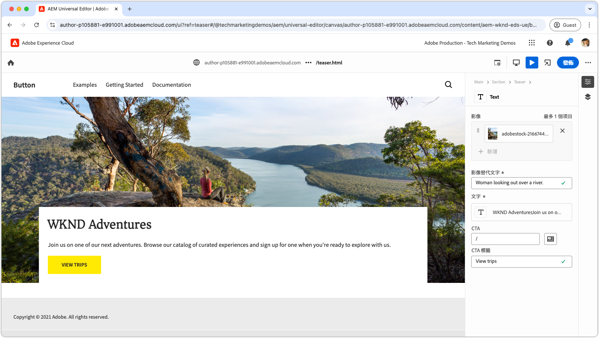

# Edge Delivery Services和Universal Editor開發人員教學課程

在本教學課程中，您將瞭解建置AEM網站的基礎知識，該網站結合強大的撰寫功能與通用編輯器，以及使用Edge Delivery Services的超快傳送速度。 到最後，您將基本瞭解如何建立新專案、設定本機開發環境和建立新區塊。

## 專案設定

瞭解如何在AEM as a Cloud Service中建立程式碼專案及設定新網站。 此設定可讓您透過Universal Editor進行無縫開發，以透過Edge Delivery Services建立內容及快速傳送內容。

<!-- CARDS 

* ./1-new-code-project.md
* ./2-new-aem-site.md

-->
<!-- START CARDS HTML - DO NOT MODIFY BY HAND -->

    

        

            

                <figure class="image x-is-16by9">
                    
                </figure>
            

            

                

                    

                        <a href="./1-new-code-project.md" target="_blank" rel="referrer" title="建立程式碼專案">建立程式碼專案</a>
                    

                    
建立Edge Delivery Services的程式碼專案，可使用通用編輯器進行編輯。

                

                <a href="./1-new-code-project.md" target="_blank" rel="referrer" class="spectrum-Button spectrum-Button--outline spectrum-Button--primary spectrum-Button--sizeM" style="align-self: flex-start; margin-top: 1rem;">
                    進一步瞭解
                </a>
            

        

    

    

        

            

                <figure class="image x-is-16by9">
                    
                </figure>
            

            

                

                    

                        <a href="./2-new-aem-site.md" target="_blank" rel="referrer" title="建立AEM網站">建立AEM網站</a>
                    

                    
在Edge Delivery Services的AEM Sites中建立網站，您可以使用通用編輯器進行編輯。

                

                <a href="./2-new-aem-site.md" target="_blank" rel="referrer" class="spectrum-Button spectrum-Button--outline spectrum-Button--primary spectrum-Button--sizeM" style="align-self: flex-start; margin-top: 1rem;">
                    進一步瞭解
                </a>
            

        

    

<!-- END CARDS HTML - DO NOT MODIFY BY HAND -->

## 開發設定

瞭解如何設定您的本機開發環境，以啟用快速的網站開發。 此設定可讓您使用通用編輯器無縫建立網站，並透過Edge Delivery Services有效傳送內容，確保順暢且最佳化的開發工作流程。
<!-- CARDS 

* ./3-local-development-environment.md
* ./4-website-branding.md

-->
<!-- START CARDS HTML - DO NOT MODIFY BY HAND -->

    

        

            

                <figure class="image x-is-16by9">
                    
                </figure>
            

            

                

                    

                        <a href="./3-local-development-environment.md" target="_blank" rel="referrer" title="設定本機開發環境">設定本機開發環境</a>
                    

                    
為使用Edge Delivery Services提供並可使用通用編輯器編輯的網站設定本機開發環境。

                

                <a href="./3-local-development-environment.md" target="_blank" rel="referrer" class="spectrum-Button spectrum-Button--outline spectrum-Button--primary spectrum-Button--sizeM" style="align-self: flex-start; margin-top: 1rem;">
                    進一步瞭解
                </a>
            

        

    

    

        

            

                <figure class="image x-is-16by9">
                    
                </figure>
            

            

                

                    

                        <a href="./4-website-branding.md" target="_blank" rel="referrer" title="新增網站品牌">新增網站品牌</a>
                    

                    
為Edge Delivery Services網站定義全域CSS、CSS變數和網頁字型。

                

                <a href="./4-website-branding.md" target="_blank" rel="referrer" class="spectrum-Button spectrum-Button--outline spectrum-Button--primary spectrum-Button--sizeM" style="align-self: flex-start; margin-top: 1rem;">
                    進一步瞭解
                </a>
            

        

    

<!-- END CARDS HTML - DO NOT MODIFY BY HAND -->

## 區塊開發

瞭解如何透過定義內容模型並設定用於測試和開發的範例內容來建立新區塊。 探索呈現區塊的兩種方法，並瞭解如何在AEM和Edge Delivery Services中建構區塊以取得最佳效能和彈性。

<!-- CARDS 

* ./5-new-block.md {image = ./assets/5-new-block/card.png}
* ./6-author-block.md {image = ./assets/6-author-block/card.png}
* ./7a-block-css.md {image = ./assets/7a-block-css/card.png}
* ./7b-block-js-css.md {image = ./assets/7b-block-js-css/card.png}

-->
<!-- START CARDS HTML - DO NOT MODIFY BY HAND -->

    

        

            

                <figure class="image x-is-16by9">
                    
                </figure>
            

            

                

                    

                        <a href="./5-new-block.md" target="_blank" rel="referrer" title="建立區塊">建立區塊</a>
                    

                    
為可使用通用編輯器編輯的Edge Delivery Services網站建置區塊。

                

                <a href="./5-new-block.md" target="_blank" rel="referrer" class="spectrum-Button spectrum-Button--outline spectrum-Button--primary spectrum-Button--sizeM" style="align-self: flex-start; margin-top: 1rem;">
                    進一步瞭解
                </a>
            

        

    

    

        

            

                <figure class="image x-is-16by9">
                    
                </figure>
            

            

                

                    

                        <a href="./6-author-block.md" target="_blank" rel="referrer" title="編寫區塊">編寫區塊</a>
                    

                    
使用通用編輯器編寫Edge Delivery Services區塊。

                

                <a href="./6-author-block.md" target="_blank" rel="referrer" class="spectrum-Button spectrum-Button--outline spectrum-Button--primary spectrum-Button--sizeM" style="align-self: flex-start; margin-top: 1rem;">
                    進一步瞭解
                </a>
            

        

    

    

        

            

                <figure class="image x-is-16by9">
                    
                </figure>
            

            

                

                    

                        <a href="./7a-block-css.md" target="_blank" rel="referrer" title="使用CSS開發區塊">使用CSS開發區塊</a>
                    

                    
使用Edge Delivery Services的CSS開發區塊，並可使用通用編輯器編輯。

                

                <a href="./7a-block-css.md" target="_blank" rel="referrer" class="spectrum-Button spectrum-Button--outline spectrum-Button--primary spectrum-Button--sizeM" style="align-self: flex-start; margin-top: 1rem;">
                    進一步瞭解
                </a>
            

        

    

    

        

            

                <figure class="image x-is-16by9">
                    
                </figure>
            

            

                

                    

                        <a href="./7b-block-js-css.md" target="_blank" rel="referrer" title="使用CSS和JS開發區塊">使用CSS和JS開發區塊</a>
                    

                    
使用Edge Delivery Services的CSS和JavaScript開發區塊，並可使用通用編輯器進行編輯。

                

                <a href="./7b-block-js-css.md" target="_blank" rel="referrer" class="spectrum-Button spectrum-Button--outline spectrum-Button--primary spectrum-Button--sizeM" style="align-self: flex-start; margin-top: 1rem;">
                    進一步瞭解
                </a>
            

        

    

<!-- END CARDS HTML - DO NOT MODIFY BY HAND -->

## 後續步驟

現在您已完成本教學課程，請在這些重點操作說明所學知識的基礎上再接再厲。 這些指南會詳細介紹此處涵蓋的程式碼和概念，探索角色特定使用案例、進階技術以及增強Edge Delivery Services和Universal Editor開發技能的其他提示。

<!-- CARDS 

* ./how-to/block-options.md
* ./how-to/header-and-footer.md

-->
<!-- START CARDS HTML - DO NOT MODIFY BY HAND -->

    

        

            

                <figure class="image x-is-16by9">
                    
                </figure>
            

            

                

                    

                        <a href="./how-to/block-options.md" target="_blank" rel="referrer" title="區塊選項">封鎖選項</a>
                    

                    
瞭解如何使用多個顯示選項建置區塊。

                

                <a href="./how-to/block-options.md" target="_blank" rel="referrer" class="spectrum-Button spectrum-Button--outline spectrum-Button--primary spectrum-Button--sizeM" style="align-self: flex-start; margin-top: 1rem;">
                    進一步瞭解
                </a>
            

        

    

    

        

            

                <figure class="image x-is-16by9">
                    
                </figure>
            

            

                

                    

                        <a href="./how-to/header-and-footer.md" target="_blank" rel="referrer" title="頁首與頁尾">頁首與頁尾</a>
                    

                    
瞭解如何在Edge Delivery Services和Universal Editor中使用頁首和頁尾。

                

                <a href="./how-to/header-and-footer.md" target="_blank" rel="referrer" class="spectrum-Button spectrum-Button--outline spectrum-Button--primary spectrum-Button--sizeM" style="align-self: flex-start; margin-top: 1rem;">
                    進一步瞭解
                </a>
            

        

    

<!-- END CARDS HTML - DO NOT MODIFY BY HAND -->
