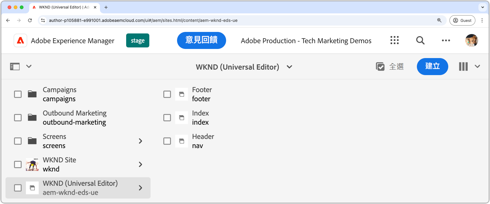

# Edge Delivery Services 和通用編輯器開發人員教學課程

在本教學課程中，您會學習到建置 AEM 網站的基礎知識，結合通用編輯器強大的製作功能以及 Edge Delivery Services 的高速傳遞。課程結束後，您會對於如何建立新專案、設定本機開發環境，以及建置新區塊有基本的認識。

## 專案設定

了解如何在 AEM as a Cloud Service 中建立程式碼專案及設定新網站。這項設定使用編輯器進行內容創作以及透過 Edge Delivery Services 快速傳遞內容，因此可以流暢地進行開發。

<!-- CARDS 

* ./1-new-code-project.md
* ./2-new-aem-site.md

-->
<!-- START CARDS HTML - DO NOT MODIFY BY HAND -->

    

        

            

                <figure class="image x-is-16by9">
                    
                </figure>
            

            

                

                    

                        <a href="./1-new-code-project.md" target="_blank" rel="referrer" title="建立程式碼專案">建立程式碼專案</a>
                    

                    
建立 Edge Delivery Services 的程式碼專案，並可以使用通用編輯器進行編輯。

                

                <a href="./1-new-code-project.md" target="_blank" rel="referrer" class="spectrum-Button spectrum-Button--outline spectrum-Button--primary spectrum-Button--sizeM" style="align-self: flex-start; margin-top: 1rem;">
                    了解更多
                </a>
            

        

    

    

        

            

                <figure class="image x-is-16by9">
                    
                </figure>
            

            

                

                    

                        <a href="./2-new-aem-site.md" target="_blank" rel="referrer" title="建立 AEM 網站">建立 AEM 網站</a>
                    

                    
在 AEM Sites 中建立一個 Edge Delivery Services 網站，並可以使用通用編輯器進行編輯。

                

                <a href="./2-new-aem-site.md" target="_blank" rel="referrer" class="spectrum-Button spectrum-Button--outline spectrum-Button--primary spectrum-Button--sizeM" style="align-self: flex-start; margin-top: 1rem;">
                    了解更多
                </a>
            

        

    

<!-- END CARDS HTML - DO NOT MODIFY BY HAND -->

## 開發設定

了解如何設定您的本機開發環境以快速完成網站開發。此設定支援使用通用編輯器迅速建立網站，並透過 Edge Delivery Services 有效地傳遞內容，確保順暢且最佳化的開發工作流程。
<!-- CARDS 

* ./3-local-development-environment.md
* ./4-website-branding.md

-->
<!-- START CARDS HTML - DO NOT MODIFY BY HAND -->

    

        

            

                <figure class="image x-is-16by9">
                    
                </figure>
            

            

                

                    

                        <a href="./3-local-development-environment.md" target="_blank" rel="referrer" title="設定本機開發環境">設定本機開發環境</a>
                    

                    
針對透過 Edge Delivery Services 傳遞，且可使用通用編輯器進行編輯的網站，設定本機開發環境。

                

                <a href="./3-local-development-environment.md" target="_blank" rel="referrer" class="spectrum-Button spectrum-Button--outline spectrum-Button--primary spectrum-Button--sizeM" style="align-self: flex-start; margin-top: 1rem;">
                    了解更多
                </a>
            

        

    

    

        

            

                <figure class="image x-is-16by9">
                    
                </figure>
            

            

                

                    

                        <a href="./4-website-branding.md" target="_blank" rel="referrer" title="新增網站品牌化">新增網站品牌化</a>
                    

                    
定義 Edge Delivery Services 網站的全域 CSS、CSS 變數和網頁字型。

                

                <a href="./4-website-branding.md" target="_blank" rel="referrer" class="spectrum-Button spectrum-Button--outline spectrum-Button--primary spectrum-Button--sizeM" style="align-self: flex-start; margin-top: 1rem;">
                    了解更多
                </a>
            

        

    

<!-- END CARDS HTML - DO NOT MODIFY BY HAND -->

## 區塊開發

了解如何透過定義內容模型和設定用於測試與開發的範例內容建立新區塊。探索兩種轉譯區塊的方法，並了解如何進行建構，方能在 AEM 和 Edge Delivery Services 中達到最佳的效能和彈性。

<!-- CARDS 

* ./5-new-block.md {image = ./assets/5-new-block/card.png}
* ./6-author-block.md {image = ./assets/6-author-block/card.png}
* ./7a-block-css.md {image = ./assets/7a-block-css/card.png}
* ./7b-block-js-css.md {image = ./assets/7b-block-js-css/card.png}

-->
<!-- START CARDS HTML - DO NOT MODIFY BY HAND -->

    

        

            

                <figure class="image x-is-16by9">
                    
                </figure>
            

            

                

                    

                        <a href="./5-new-block.md" target="_blank" rel="referrer" title="建立區塊">建立區塊</a>
                    

                    
在 Edge Delivery Services 網站建置一個可使用通用編輯器進行編輯的區塊。

                

                <a href="./5-new-block.md" target="_blank" rel="referrer" class="spectrum-Button spectrum-Button--outline spectrum-Button--primary spectrum-Button--sizeM" style="align-self: flex-start; margin-top: 1rem;">
                    了解更多
                </a>
            

        

    

    

        

            

                <figure class="image x-is-16by9">
                    
                </figure>
            

            

                

                    

                        <a href="./6-author-block.md" target="_blank" rel="referrer" title="製作區塊">製作區塊</a>
                    

                    
使用通用編輯器製作 Edge Delivery Services 區塊。

                

                <a href="./6-author-block.md" target="_blank" rel="referrer" class="spectrum-Button spectrum-Button--outline spectrum-Button--primary spectrum-Button--sizeM" style="align-self: flex-start; margin-top: 1rem;">
                    了解更多
                </a>
            

        

    

    

        

            

                <figure class="image x-is-16by9">
                    
                </figure>
            

            

                

                    

                        <a href="./7a-block-css.md" target="_blank" rel="referrer" title="使用 CSS 開發區塊">使用 CSS 開發區塊</a>
                    

                    
使用 CSS 開發 Edge Delivery Services 區塊，並可以使用通用編輯器進行編輯。

                

                <a href="./7a-block-css.md" target="_blank" rel="referrer" class="spectrum-Button spectrum-Button--outline spectrum-Button--primary spectrum-Button--sizeM" style="align-self: flex-start; margin-top: 1rem;">
                    了解更多
                </a>
            

        

    

    

        

            

                <figure class="image x-is-16by9">
                    
                </figure>
            

            

                

                    

                        <a href="./7b-block-js-css.md" target="_blank" rel="referrer" title="使用 CSS 和 JS 開發區塊">使用 CSS 和 JS 開發區塊</a>
                    

                    
使用 CSS 和 JavaScript 開發 Edge Delivery Services 區塊，並可以使用通用編輯器進行編輯。

                

                <a href="./7b-block-js-css.md" target="_blank" rel="referrer" class="spectrum-Button spectrum-Button--outline spectrum-Button--primary spectrum-Button--sizeM" style="align-self: flex-start; margin-top: 1rem;">
                    了解更多
                </a>
            

        

    

<!-- END CARDS HTML - DO NOT MODIFY BY HAND -->

## 後續步驟

現在您已完成本教學課程，請以這些重點的操作說明為基礎，建置更深厚的知識。這些指南擴大說明此處所討論的程式碼和概念，探索特定角色的使用案例、進階技術以及其他技巧，以利增強 Edge Delivery Services 和通用編輯器的開發技能。

<!-- CARDS 

* ./how-to/block-options.md
* ./how-to/header-and-footer.md
* ./how-to/local-extension-preview.md {image = ./how-to/assets/local-extension-preview/extension-loaded.png}

-->
<!-- START CARDS HTML - DO NOT MODIFY BY HAND -->

    

        

            

                <figure class="image x-is-16by9">
                    
                </figure>
            

            

                

                    

                        <a href="./how-to/block-options.md" target="_blank" rel="referrer" title="區塊選項">區塊選項</a>
                    

                    
了解如何建置具有多個顯示選項的區塊。

                

                <a href="./how-to/block-options.md" target="_blank" rel="referrer" class="spectrum-Button spectrum-Button--outline spectrum-Button--primary spectrum-Button--sizeM" style="align-self: flex-start; margin-top: 1rem;">
                    了解更多
                </a>
            

        

    

    

        

            

                <figure class="image x-is-16by9">
                    
                </figure>
            

            

                

                    

                        <a href="./how-to/header-and-footer.md" target="_blank" rel="referrer" title="頁首及頁尾">頁首及頁尾</a>
                    

                    
了解如何在 Edge Delivery Services 和通用編輯器中開發頁首及頁尾。

                

                <a href="./how-to/header-and-footer.md" target="_blank" rel="referrer" class="spectrum-Button spectrum-Button--outline spectrum-Button--primary spectrum-Button--sizeM" style="align-self: flex-start; margin-top: 1rem;">
                    了解更多
                </a>
            

        

    

    

        

            

                <figure class="image x-is-16by9">
                    
                </figure>
            

            

                

                    

                        <a href="./how-to/local-extension-preview.md" target="_blank" rel="referrer" title="預覽Universal Editor擴充功能">預覽Universal Editor擴充功能</a>
                    

                    
瞭解如何在開發期間預覽本機執行的通用編輯器擴充功能。

                

                <a href="./how-to/local-extension-preview.md" target="_blank" rel="referrer" class="spectrum-Button spectrum-Button--outline spectrum-Button--primary spectrum-Button--sizeM" style="align-self: flex-start; margin-top: 1rem;">
                    了解更多
                </a>
            

        

    

<!-- END CARDS HTML - DO NOT MODIFY BY HAND -->
