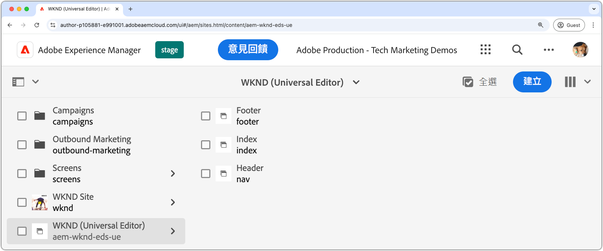

# 建立AEM網站

AEM網站是編輯、管理和發佈網站內容的來源。 若要建立透過Edge Delivery Services傳遞並使用Universal Editor撰寫的AEM網站，請使用[Edge Delivery Services搭配AEM撰寫網站範本](https://github.com/adobe-rnd/aem-boilerplate-xwalk/releases)在AEM Author上建立新網站。

AEM網站是儲存及編寫網站內容的地方。 最終體驗是AEM網站內容與[網站程式碼](./1-new-code-project.md)的組合。

依照檔案](https://experienceleague.adobe.com/en/docs/experience-manager-cloud-service/content/edge-delivery/wysiwyg-authoring/edge-dev-getting-started#create-aem-site)中概述的[詳細步驟建立新的AEM網站。  以下是步驟的摘要清單，包括本教學課程中使用的值。
1. **在AEM作者中建立新網站**。 本教學課程使用下列網站命名：
   * 網站標題： `WKND (Universal Editor)`
   * 網站名稱： `aem-wknd-eds-ue`

      * 網站名稱值必須符合新增到`paths.json`](https://experienceleague.adobe.com/en/docs/experience-manager-cloud-service/content/edge-delivery/wysiwyg-authoring/path-mapping)的網站路徑名稱[。

2. **使用AEM編寫網站範本](https://github.com/adobe-rnd/aem-boilerplate-xwalk/releases)從[Edge Delivery Services匯入最新的範本**。
3. **為網站命名**&#x200B;以符合GitHub存放庫名稱，並將GitHub URL設為存放庫的URL。

## 發佈新網站以供預覽

在AEM Author中建立網站後，將其發佈到Edge Delivery Services預覽，以便內容可供[本機開發環境](./3-local-development-environment.md)使用。

1. 登入&#x200B;**AEM作者**&#x200B;並導覽至&#x200B;**網站**。
2. 選取&#x200B;**新網站** (`WKND (Universal Editor)`)並按一下&#x200B;**管理出版物**。
3. 在&#x200B;**目的地**&#x200B;下選擇&#x200B;**預覽**，然後按一下&#x200B;**下一步**。
4. 在&#x200B;**包含子系設定**&#x200B;下，選取&#x200B;**包含子系**，取消選取其他選項，然後按一下&#x200B;**確定**。
5. 按一下&#x200B;**發佈**，發佈網站內容以預覽。
6. 發佈到預覽環境後，這些頁面就可在Edge Delivery Services預覽環境中使用(這些頁面不會出現在AEM預覽服務上)。
