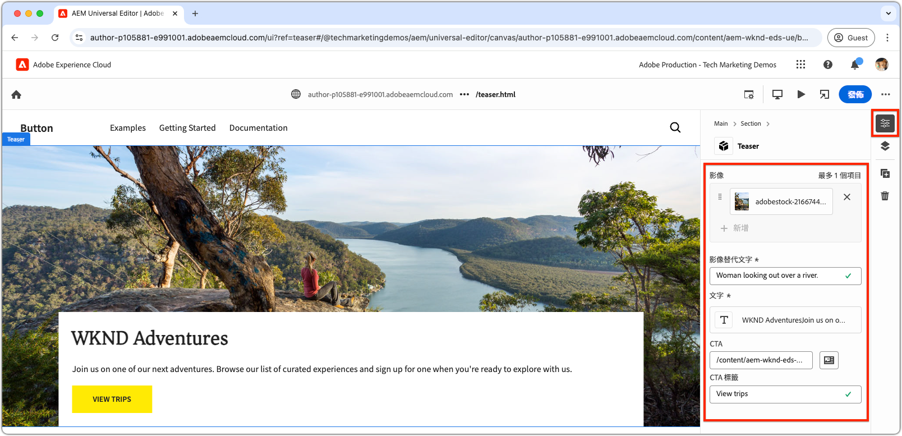
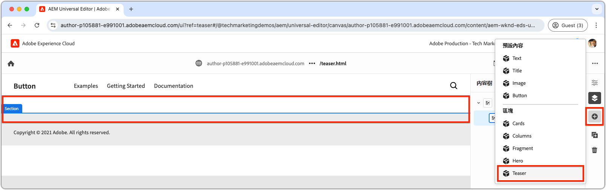

# 建立新區塊

本章說明使用通用編輯器為Edge Delivery Services網站建立新可編輯的Teaser區塊的程式。


名為`teaser`的區塊會顯示下列元素：

- **影像**：視覺上吸引人的影像。
- **文字內容**：
   - **標題**：吸引人的標題。
   - **內文**：提供內容或詳細資訊的描述性內容，包括選擇性條款及條件。
   - **行動號召(CTA)按鈕**：設計用來提示使用者互動並引導他們進一步參與的連結。

`teaser`區塊的內容可在通用編輯器中編輯，確保整個網站的易用性和可重複使用性。

請注意，`teaser`區塊類似於樣板的`hero`區塊；因此，`teaser`區塊僅用作說明開發概念的簡單範例。

## 建立新的Git分支

若要維持簡潔且有條理的工作流程，請為每個特定的開發任務建立新的分支。 這有助於避免將不完整或未測試的程式碼部署到生產環境時發生問題。

1. **從主要分支開始**：使用最新的生產程式碼可確保堅實的基礎。
2. **擷取遠端變更**：從GitHub擷取最新更新時，可確保在開始開發前有最新的程式碼可用。
   - 範例：將來自`wknd-styles`分支的變更合併到`main`後，擷取最新的更新。
3. **建立新分支**：

```bash
# ~/Code/aem-wknd-eds-ue

$ git fetch origin  
$ git checkout -b teaser origin/main  
```

建立`teaser`分支後，您就可以開始開發Teaser區塊了。

## 封鎖資料夾

在專案的`blocks`目錄中建立名為`teaser`的新資料夾。 此資料夾包含區塊的JSON、CSS和JavaScript檔案，在一個位置整理區塊的檔案：

```
# ~/Code/aem-wknd-eds-ue

/blocks/teaser
```

區塊資料夾名稱會做為區塊的ID，並用於在整個區塊開發期間參考區塊。

## 封鎖JSON

區塊JSON定義了區塊的三個主要方面：

- **定義**：在通用編輯器中將區塊註冊為可編輯的元件，將其連結至區塊模型，並選擇性地連結至篩選器。
- **模型**：指定區塊的編寫欄位，以及這些欄位如何呈現為語意Edge Delivery Services HTML。
- **篩選器**：設定篩選規則，以限制可透過通用編輯器將區塊新增到哪些容器。 大部分割槽塊不是容器，而是將其ID新增至其他容器區塊的篩選器。

在`/blocks/teaser/_teaser.json`處建立新檔案，其初始結構如下，順序完全一樣。 如果索引鍵順序有誤，表示可能無法正確建置。

[!BADGE /blocks/teaser/_teaser.json]{type=Neutral tooltip="以下程式碼範例的檔案名稱。"}

```json
{
    "definitions": [],
    "models": [],
    "filters": []
}
```

### 區塊模型

區塊模型是區塊組態的重要部分，因為它會定義：

1. 藉由定義可編輯的欄位，提供撰寫體驗。

   

2. 如何將欄位值轉譯為Edge Delivery Services HTML。

已指派對應至[區塊定義](#block-definition)且包含`fields`陣列的`id`模型，以指定可編輯的欄位。

`fields`陣列中的每個欄位都有JSON物件，其中包含下列必要屬性：

| JSON屬性 | 描述 |
|---------------|-----------------------------------------------------------------------------------------------------------------------|
| `component` | [欄位型別](https://experienceleague.adobe.com/en/docs/experience-manager-cloud-service/content/implementing/developing/universal-editor/field-types#component-types)，例如`text`、`reference`或`aem-content`。 |
| `name` | 欄位名稱，對應至儲存值於AEM中的JCR屬性。 |
| `label` | 在通用編輯器中向作者顯示的標籤。 |

如需完整的屬性清單（包括選擇性），請檢閱[通用編輯器欄位檔案](https://experienceleague.adobe.com/en/docs/experience-manager-cloud-service/content/implementing/developing/universal-editor/field-types#fields)。

#### 區塊設計


Teaser區塊包含下列可編輯元素：

1. **影像**：代表Teaser的視覺內容。
2. **文字內容**：包含標題、內文和行動號召按鈕，並位於白色矩形中。
   - **標題**&#x200B;和&#x200B;**內文**&#x200B;可透過相同的RTF編輯器撰寫。
   - 可以透過&#x200B;**標籤**&#x200B;的`text`欄位和&#x200B;**連結**&#x200B;的`aem-content`欄位來編寫&#x200B;**CTA**。

Teaser區塊的設計會分為這兩個邏輯元件（影像和文字內容），確保使用者獲得結構化和直覺式的撰寫體驗。

### 封鎖欄位

定義區塊所需的欄位：影像、影像替代文字、文字、CTA標籤和CTA連結。

>[!BEGINTABS]

>[!TAB 正確方式]

**此標籤說明建立Teaser區塊模型的正確方式。**

Teaser包含兩個邏輯區域：影像和文字。 若要簡化將Edge Delivery Services HTML顯示為所需Web體驗所需的程式碼，區塊模型應反映此結構。

- 使用[欄位摺疊](https://experienceleague.adobe.com/en/docs/experience-manager-cloud-service/content/edge-delivery/wysiwyg-authoring/content-modeling#field-collapse)將&#x200B;**影像**&#x200B;和&#x200B;**影像替代文字**&#x200B;群組在一起。
- 使用[元素群組](https://experienceleague.adobe.com/en/docs/experience-manager-cloud-service/content/edge-delivery/wysiwyg-authoring/content-modeling#element-grouping)和CTA[&#128279;](https://experienceleague.adobe.com/en/docs/experience-manager-cloud-service/content/edge-delivery/wysiwyg-authoring/content-modeling#field-collapse)的欄位摺疊將文字內容欄位群組在一起。

如果您不熟悉[欄位摺疊](https://experienceleague.adobe.com/en/docs/experience-manager-cloud-service/content/edge-delivery/wysiwyg-authoring/content-modeling#field-collapse)、[元素群組](https://experienceleague.adobe.com/en/docs/experience-manager-cloud-service/content/edge-delivery/wysiwyg-authoring/content-modeling#element-grouping)或[型別推斷](https://experienceleague.adobe.com/en/docs/experience-manager-cloud-service/content/edge-delivery/wysiwyg-authoring/content-modeling#type-inference)，請先檢閱連結的檔案，再繼續進行，因為這些檔案對於建立結構良好的區塊模型是必要的。

在以下範例中：

- [型別推斷](https://experienceleague.adobe.com/en/docs/experience-manager-cloud-service/content/edge-delivery/wysiwyg-authoring/content-modeling#type-inference)是用來從`image`欄位自動建立`` HTML專案。 欄位收合與`image`和`imageAlt`欄位搭配使用，以建立``個HTML專案。 `src`屬性設定為`image`欄位的值，而`alt`屬性設定為`imageAlt`欄位的值。
- `textContent`是用來分類欄位的群組名稱。 它應該是語意上的，但可以為此區塊的任何特有內容。 這會通知通用編輯器轉譯最終HTML輸出中相同`<div>`元素內具有此首碼的所有欄位。
- 欄位收合也會套用至行動號召(CTA)的`textContent`群組中。 CTA是透過[型別推斷](https://experienceleague.adobe.com/en/docs/experience-manager-cloud-service/content/edge-delivery/wysiwyg-authoring/content-modeling#type-inference)建立為`<a>`。 `cta`欄位是用來設定`<a>`專案的`href`屬性，`ctaText`欄位會提供`<a ...>`標籤內連結的文字內容。

[!BADGE /blocks/teaser/_teaser.json]{type=Neutral tooltip="以下程式碼範例的檔案名稱。"}

```json
{
    "definitions": [],
    "models": [
        {
            "id": "teaser", 
            "fields": [
                {
                    "component": "reference",
                    "valueType": "string",
                    "name": "image",
                    "label": "Image",
                    "multi": false
                },
                {
                    "component": "text",
                    "valueType": "string",
                    "name": "imageAlt",
                    "label": "Image alt text",
                    "required": true
                },
                {
                    "component": "richtext",
                    "name": "textContent_text",
                    "label": "Text",
                    "valueType": "string",
                    "required": true
                },
                {
                    "component": "aem-content",
                    "name": "textContent_cta",
                    "label": "CTA",
                    "valueType": "string"
                },
                {
                    "component": "text",
                    "name": "textContent_ctaText",
                    "label": "CTA label",
                    "valueType": "string"
                }
            ]
        }
    ],
    "filters": []
}
```

此模型會為區塊定義在Universal Editor中的編寫輸入。

此區塊產生的Edge Delivery Services HTML會將影像放在第一個div，並將元素群組`textContent`欄位放在第二個div。

```html
<div>
    <div>
        <!-- This div contains the field-collapsed image fields  -->
        <picture>
            ...
            <source .../>            
            
        </picture>
    </div>
    <div>
        <!-- This div, via element grouping contains the textContent fields -->
        <h2>The authored title</h2>
        <p>The authored body text</p>
        <a href="/authored/cta/link">The authored CTA label</a>
    </div>
</div>        
```

如下一章[&#128279;](./7a-block-css.md)所示範的，此HTML結構將區塊樣式簡化為內聚單位。

若要瞭解不使用欄位摺疊和元素分組的後果，請參閱上面的&#x200B;**錯誤方式**&#x200B;標籤。

>[!TAB 錯誤的方式]

**此索引標籤說明建立Teaser區塊模型的次佳方式，並且只與正確方式並置。**

在不使用[欄位摺疊](https://experienceleague.adobe.com/en/docs/experience-manager-cloud-service/content/edge-delivery/wysiwyg-authoring/content-modeling#field-collapse)和[元素群組](https://experienceleague.adobe.com/en/docs/experience-manager-cloud-service/content/edge-delivery/wysiwyg-authoring/content-modeling#element-grouping)的情況下，將每個欄位定義為區塊模型中的獨立欄位，似乎很誘人。 然而，此監督使區塊樣式化為有凝聚力的單位變得複雜。

例如，Teaser模型可以定義為&#x200B;**，而不需要**&#x200B;欄位摺疊或元素群組，如下所示：

[!BADGE /blocks/teaser/_teaser.json]{type=Neutral tooltip="以下程式碼範例的檔案名稱。"}

```json
{
    "definitions": [],
    "models": [
        {
            "id": "teaser", 
            "fields": [
                {
                    "component": "reference",
                    "valueType": "string",
                    "name": "image",
                    "label": "Image",
                    "multi": false
                },
                {
                    "component": "text",
                    "valueType": "string",
                    "name": "alt",
                    "label": "Image alt text",
                    "required": true
                },
                {
                    "component": "richtext",
                    "name": "text",
                    "label": "Text",
                    "valueType": "string",
                    "required": true
                },
                {
                    "component": "aem-content",
                    "name": "link",
                    "label": "CTA",
                    "valueType": "string"
                },
                {
                    "component": "text",
                    "name": "label",
                    "label": "CTA label",
                    "valueType": "string"
                }
            ]
        }
    ],
    "filters": []
}
```

區塊的Edge Delivery Services HTML會以個別的`div`呈現每個欄位的值，使內容理解、樣式應用程式和HTML結構調整複雜化，以達到所需的設計。

```html
<div>
    <div>
        <!-- This div contains the field-collapsed image  -->
        <picture>
            ...
            <source .../>            
            
        </picture>
    </div>
    <div>
        <p>The authored alt text</p>
    </div>
    <div>
        <h2>The authored title</h2>
        <p>The authored body text</p>
    </div>
    <div>
        <a href="/authored/cta/link">/authored/cta/link</a>
    </div>
    <div>
        The authored CTA label
    </div>
</div>        
```

每個欄位都隔離在自己的`div`中，因此很難將影像和文字內容設為內聚單位。 您可以用心和創意達成想要的設計，但使用[元素群組](https://experienceleague.adobe.com/en/docs/experience-manager-cloud-service/content/edge-delivery/wysiwyg-authoring/content-modeling#element-grouping)將文字內容欄位分組，並使用[欄位摺疊](https://experienceleague.adobe.com/en/docs/experience-manager-cloud-service/content/edge-delivery/wysiwyg-authoring/content-modeling#field-collapse)來新增編寫的值，因為元素屬性更簡單、更容易，而且語義上也正確。

請參閱上面的&#x200B;**寫入方式**&#x200B;索引標籤，瞭解如何更妥善地建立Teaser區塊的模型。

>[!ENDTABS]


### 區塊定義

區塊定義會在通用編輯器中註冊區塊。 以下是區塊定義中使用的JSON屬性劃分：

| JSON屬性 | 描述 |
|---------------|-------------|
| `definition.title` | 區塊標題顯示在通用編輯器的&#x200B;**新增**&#x200B;區塊中。 |
| `definition.id` | 區塊的唯一ID，用來控制它在`filters`中的使用。 |
| `definition.plugins.xwalk.page.resourceType` | 定義用於在通用編輯器中呈現元件的Sling資源型別。 一律使用`core/franklin/components/block/v#/block`資源型別。 |
| `definition.plugins.xwalk.page.template.name` | 區塊的名稱。 它應該使用小寫和連字型大小，以符合區塊的資料夾名稱。 此值也可用來在通用編輯器中標示區塊的例項。 |
| `definition.plugins.xwalk.page.template.model` | 將此定義連結至其`model`定義，該定義會控制為通用編輯器中區塊顯示的編寫欄位。 這裡的值必須符合`model.id`值。 |
| `definition.plugins.xwalk.page.template.classes` | 選擇性屬性，其值已新增至區塊HTML元素的`class`屬性。 這允許相同區塊的變體。 [將類別欄位](https://experienceleague.adobe.com/en/docs/experience-manager-cloud-service/content/edge-delivery/wysiwyg-authoring/create-block#block-options)新增至區塊的[模型](#block-model)，可使`classes`值變成可編輯。 |


以下是區塊定義的JSON範例：

[!BADGE /blocks/teaser/_teaser.json]{type=Neutral tooltip="以下程式碼範例的檔案名稱。"}

```json
{
    "definitions": [{
      "title": "Teaser",
      "id": "teaser",
      "plugins": {
        "xwalk": {
          "page": {
            "resourceType": "core/franklin/components/block/v1/block",
            "template": {
              "name": "Teaser",
              "model": "teaser",
              "textContent_text": "<h2>Enter a title</h2><p>...and body text here!</p>",
              "textContent_cta": "/",
              "textContent_ctaText": "Click me!"
            }
          }
        }
      }
    }],
    "models": [... from previous section ...],
    "filters": []
}
```

在此範例中：

- 區塊名稱為「Teaser」，並使用`teaser`模型來決定哪些欄位可在通用編輯器中編輯。
- 區塊包含`textContent_text`欄位的預設內容，這是標題和內文的RTF文字區域，以及CTA （行動號召）連結和標籤的`textContent_cta`和`textContent_ctaText`。 範本的欄位名稱包含初始內容，符合在[內容模型的欄位陣列](#block-model)中定義的欄位名稱；

此結構會確保在通用編輯器中設定區塊，並包含轉譯所需的適當欄位、內容模型和資源型別。

### 封鎖篩選器

區塊的`filters`陣列為[容器區塊](https://experienceleague.adobe.com/en/docs/experience-manager-cloud-service/content/edge-delivery/wysiwyg-authoring/content-modeling#container)定義其他區塊可以新增至容器。 篩選器定義可新增至容器的區塊ID (`model.id`)清單。

[!BADGE /blocks/teaser/_teaser.json]{type=Neutral tooltip="以下程式碼範例的檔案名稱。"}

```json
{
  "definitions": [... populated from previous section ...],
  "models": [... populated from previous section ...],
  "filters": []
}
```

Teaser元件不是[容器區塊](https://experienceleague.adobe.com/en/docs/experience-manager-cloud-service/content/edge-delivery/wysiwyg-authoring/content-modeling#container)，這表示您無法新增其他區塊至其中。 因此，其`filters`陣列會留空。 請改為將Teaser的ID新增至區段的篩選清單，以便將Teaser新增至區段。



Adobe提供的區塊（例如區段區塊）會將篩選器儲存在專案的`models`資料夾中。 若要調整，請找到Adobe所提供區塊的JSON檔案（例如`/models/_section.json`），並將Teaser的ID (`teaser`)新增至篩選器清單。 此設定會向通用編輯器發出訊號，告知可以將Teaser元件新增到區段容器區塊中。

[!BADGE /models/_section.json]{type=Neutral tooltip="以下程式碼範例的檔案名稱。"}

```json
{
  "definitions": [],
  "models": [],
  "filters": [
    {
      "id": "section",
      "components": [
        "text",
        "image",
        "button",
        "title",
        "hero",
        "cards",
        "columns",
        "fragment",
        "teaser"
      ]
    }
  ]
}
```

`teaser`的Teaser區塊定義ID已新增至`components`陣列。

## 連結您的JSON檔案

請確定您[經常lint](./3-local-development-environment.md#linting)您的變更，以確保其整潔一致。 經常使用浮水印有助於及早發現問題，並縮短整體開發時間。 `npm run lint:js`命令也會套用JSON檔案，並擷取任何語法錯誤。

```bash
# ~/Code/aem-wknd-eds-ue

$ npm run lint:js
```

## 建立專案JSON

在設定區塊JSON檔案（例如`blocks/teaser/_teaser.json`、`models/_section.json`）後，會自動編譯至專案的`component-models.json`、`component-definitions.json`和`component-filters.json`檔案。 此編譯由[AEM Boilerplate XWalk專案範本](https://github.com/adobe-rnd/aem-boilerplate-xwalk)中包含的[Husky](https://typicode.github.io/husky/)預先認可勾點自動處理。

也可以使用專案的[組建JSON](./3-local-development-environment.md#build-json-fragments) NPM指令碼，以手動或程式設計方式觸發組建。

## 部署區塊JSON

若要讓區塊可在通用編輯器中使用，專案必須認可並推送至GitHub存放庫的分支，在此例中為`teaser`分支。

Universal Editor使用的確切分支名稱可透過通用編輯器的URL根據使用者進行調整。

```bash
# ~/Code/aem-wknd-eds-ue

$ git add .
$ git commit -m "Add teaser block JSON files so it is available in Universal Editor"
# JSON files are compiled automatically and added to the commit via a husky precommit hook
$ git push origin teaser
```

使用查詢引數`?ref=teaser`開啟Universal Editor時，新的`teaser`區塊會出現在區塊浮動視窗中。 請注意，區塊沒有樣式；它會將區塊的欄位呈現為語意HTML，僅透過[全域CSS](./4-website-branding.md#global-css)設定樣式。
