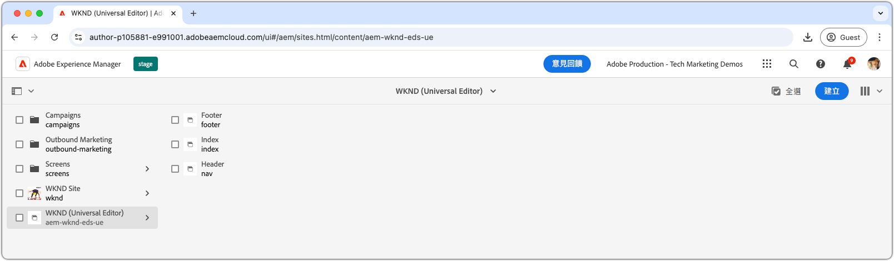
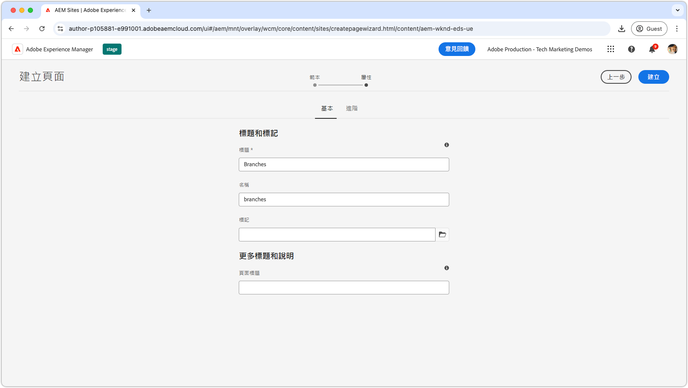
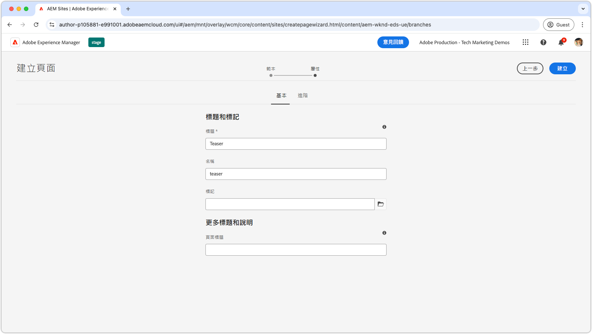
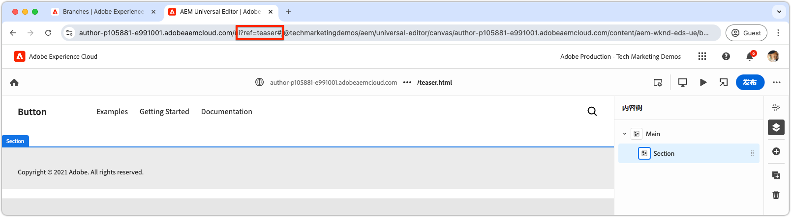
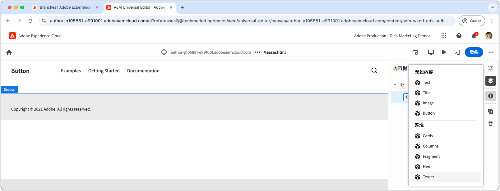
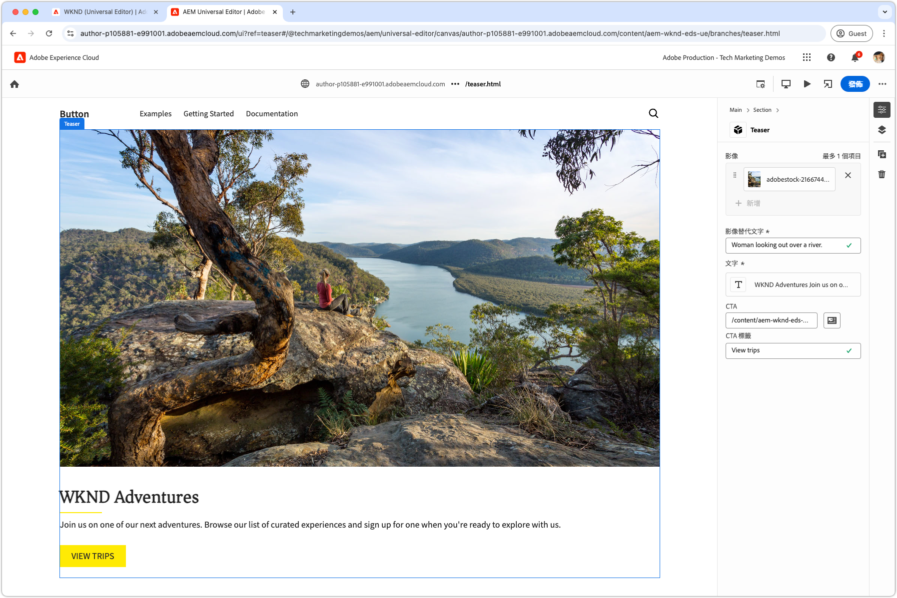
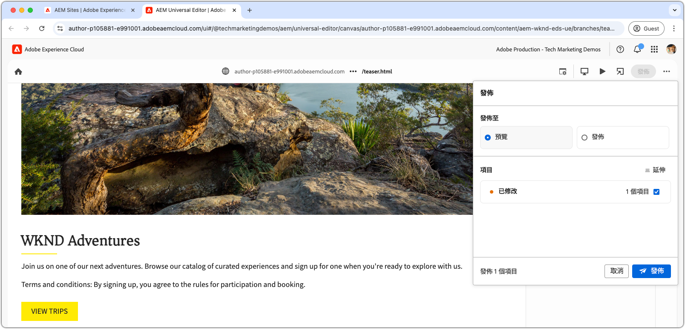

# 編寫區塊

將[Teaser區塊的JSON](./5-new-block.md)推送到`teaser`分支後，該區塊在AEM通用編輯器中變成可編輯。

在開發環境中編寫區塊很重要，原因如下：

1. 它可驗證區塊的定義和模型是否正確。
1. 可讓開發人員檢閱區塊的語意HTML，這是開發的基礎。
1. 如此可讓內容和語意HTML部署至預覽環境，支援更快速的區塊開發。

## 使用`teaser`分支的程式碼開啟通用編輯器

1. 登入AEM Author。
2. 導覽至&#x200B;**網站**，並選取在[上一章](./2-new-aem-site.md)中建立的網站(WKND （通用編輯器）)。

   

3. 建立或編輯頁面以新增區塊，確保上下文可用於支援本機開發。 雖然您可以在網站內的任何位置建立頁面，但通常最好為每個新的工作內容建立個別頁面。 建立名稱為&#x200B;**分支**&#x200B;的新「資料夾」頁面。 每個子頁面會用於支援開發相同名稱的Git分支。

   

4. 在&#x200B;**分支**&#x200B;頁面下方，建立標題為&#x200B;**Teaser**&#x200B;的新頁面（符合開發分支名稱），然後按一下&#x200B;**開啟**&#x200B;以編輯頁面。

   

5. 將`?ref=teaser`新增至URL，更新通用編輯器以從`teaser`分支載入程式碼。 確定在&#x200B;**之前`#`新增查詢引數** BEFORE。

   

6. 選取&#x200B;**主要**&#x200B;下的第一個區段，按一下&#x200B;**新增**&#x200B;按鈕，然後選擇&#x200B;**Teaser**&#x200B;區塊。

   

7. 在畫布上，選取新新增的Teaser並編寫右側的欄位，或透過內嵌編輯功能進行。

   

8. 完成編寫之後，請切換到前一個瀏覽器索引標籤(AEM Sites管理員)，選取Teaser頁面，按一下&#x200B;**管理出版物**，選擇&#x200B;**預覽**，然後將變更發佈到預覽環境。 然後會將變更發佈至網站的`aem.page`網域。
   

9. 等候變更發佈以預覽，然後透過[http://localhost:3000/branches/teaser](http://localhost:3000/branches/teaser)的[AEM CLI](./3-local-development-environment.md#install-the-aem-cli)開啟網頁。

   

現在，已編寫的Teaser區塊的內容和語意HTML可在預覽網站上取得，並可在本機開發環境中使用AEM CLI進行開發。
