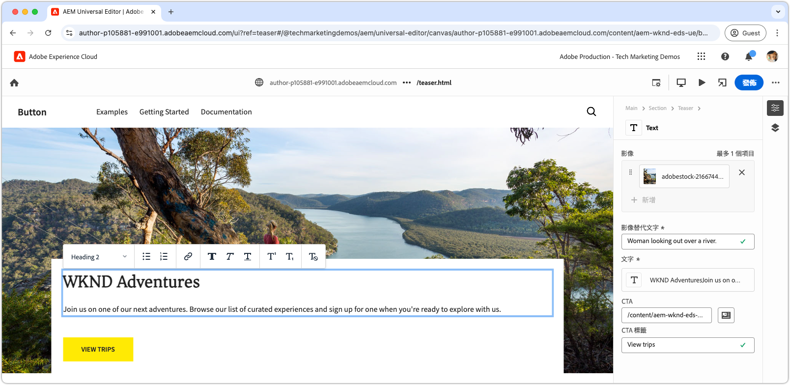

# 使用 CSS 開發區塊

Edge Delivery Services 中的區塊使用 CSS 進行樣式設定。區塊的 CSS 檔案會儲存在區塊的目錄中，並與區塊同名。例如，名為 `teaser` 之區塊的 CSS 檔案位於 `blocks/teaser/teaser.css`。

理想情況下，進行區塊的樣式設置只需要 CSS，而無需依賴 JavaScript 來修改 DOM 或新增 CSS 類別。JavaScript 的必要性取決於區塊的[內容建模](./5-new-block.md#block-model)及其複雜度。如果需要的話，可以加入[封鎖 JavaScript](./7b-block-js-css.md)。

使用僅限 CSS 的方法，可以針對區塊的 (大多數) 裸語義 HTML 元素進行定位和樣式設定。

## 區塊 HTML

若要了解如何設定區塊的樣式，請先檢閱 Edge Delivery Services 所公開的 DOM，因為那是可供樣式設定使用的。可以透過檢查 AEM CLI 之本機開發環境所提供的區塊找到 DOM。請勿使用通用編輯器的 DOM，因為略有不同。

>[!BEGINTABS]

>[!TAB 要進行樣式設定的 DOM]

以下是要進行樣式設定的 Teaser 區塊 DOM。

請注意 `<p class="button-container">...` 會自動被 Edge Delivery Services JavaScript 以推論元素的形式[自動增強](./4-website-branding.md#inferred-elements)。

```html
...
<body>
    <header/>
    <main>
        <div>
            <!-- Start block HTML -->
            <div class="teaser block" data-block-name="teaser" data-block-status="loaded">
                <div>
                    <div>
                        <picture>
                            <source type="image/webp" srcset="./media_15ba2b455e29aca38c1ca653d24c40acaec8a008f.jpeg?width=2000&amp;format=webply&amp;optimize=medium" media="(min-width: 600px)">
                            <source type="image/webp" srcset="./media_15ba2b455e29aca38c1ca653d24c40acaec8a008f.jpeg?width=750&amp;format=webply&amp;optimize=medium">
                            <source type="image/jpeg" srcset="./media_15ba2b455e29aca38c1ca653d24c40acaec8a008f.jpeg?width=2000&amp;format=jpeg&amp;optimize=medium" media="(min-width: 600px)">
                            
                        </picture>
                    </div>
                </div>
                <div>
                    <div>
                        <h2 id="wknd-adventures">WKND Adventures</h2>
                        <p>Join us on one of our next adventures. Browse our list of curated experiences and sign up for one when you're ready to explore with us.</p>
                        <p class="button-container"><a href="/" title="View trips" class="button">View trips</a></p>
                    </div>
                </div>
            </div>     
            <!-- End block HTML -->
        </div>
    </main>
    <footer/>
</body>
...
```

>[!TAB 如何找到 DOM]

若要找到要設定樣式的 DOM，請在本機開發環境中開啟未設定樣式區塊的頁面，選取該區塊，然後檢查 DOM。


>[!ENDTABS]

## 區塊 CSS

在區塊資料夾中建立一個新的 CSS 檔案，使用區塊的名稱作為檔案名稱。例如，**Teaser** 區塊，其檔案位於 `/blocks/teaser/teaser.css`。

當 Edge Delivery Services 的 JavaScript 偵測到頁面上有代表 Teaser 區塊的 DOM 元素時，便會自動載入此 CSS 檔案。

[!BADGE /blocks/teaser/teaser.css]{type=Neutral tooltip="下方程式碼範例的檔案名稱。"}

```css
/* /blocks/teaser/teaser.css */

/* Scope each selector in the block with `.block.teaser` using CSS nesting (https://developer.mozilla.org/en-US/docs/Web/CSS/CSS_nesting) to avoid accidental conflicts outside the block */
.block.teaser {
    animation: teaser-fade-in .6s;
    position: relative;
    width: 1600px;
    max-width: 100vw;
    left: 50%; 
    transform: translateX(-50%);
    height: 500px;
    overflow: hidden; 

    /* The image is rendered to the first div in the block */
    picture {
        position: absolute;
        z-index: -1;
        inset: 0;
        box-sizing: border-box;

        img {
            object-fit: cover;
            object-position: center;
            width: 100%;
            height: 100%;
        }
    }

    /** 
    The teaser's text is rendered to the second (also the last) div in the block.

    These styles are scoped to the second (also the last) div in the block (.block.teaser > div:last-child).

    This div order can be used to target different styles to the same semantic elements in the block. 
    For example, if the block has two images, we could target the first image with `.block.teaser > div:first-child img`, 
    and the second image with `.block.teaser > div:nth-child(2) img`.
    **/
    & > div:last-child {
        position: absolute;
        bottom: 0;
        left: 50%;
        transform: translateX(-50%);
        background: var(--background-color);
        padding: 1.5rem 1.5rem 1rem;
        width: 80vw;
        max-width: 1200px;

        /** 
        The following elements reside within `.block.teaser > div:last-child` and could be scoped as such, for example:

        .block.teaser > div:last-child p { .. }

        However since these element can only appear in the second/last div per our block's model, it's unnecessary to add this additional scope.
        **/

        /* Regardless of the authored heading level, we only want one style the heading */
        h1,
        h2,
        h3,
        h4,
        h5,
        h6 {
            font-size: var(--heading-font-size-xl);
            margin: 0;
        }

        h1::after,
        h2::after,
        h3::after,
        h4::after,
        h5::after,
        h6::after {
            border-bottom: 0;
        }

        p {
            font-size: var(--body-font-size-s);
            margin-bottom: 1rem;
        }

        /* Add underlines to links in the text */
        a:hover {
            text-decoration: underline;
        }

        /* Add specific spacing to buttons. These button CSS classes are automatically added by Edge Delivery Services. */
        .button-container {
            margin: 0;
            padding: 0;

            .button {
                background-color: var(--primary-color);
                border-radius: 0;
                color: var(--dark-color);
                font-size: var(--body-font-size-xs);
                font-weight: bold;
                padding: 1em 2.5em;
                margin: 0;
                text-transform: uppercase;
            }
        }
    }
}

/** Animations 
    Scope the @keyframes to the block (teaser) to avoid accidental conflicts outside the block

    Global @keyframes can defines in styles/styles.css and used in this file.
**/

@keyframes teaser-fade-in {
    from {
        opacity: 0;
    }

    to {
        opacity: 1;
    }
}
```

## 開發預覽

由於是在程式碼專案中編寫 CSS，AEM CLI 會即時重新載入相關變更，因而可以快速輕鬆地了解 CSS 會如何影響區塊。


## 對程式碼進行 lint 檢查

務必針對您的程式碼變更[經常進行 lint 檢查](./3-local-development-environment.md#linting)，保持程式碼整潔且一致。Linting 有助於及早發現問題，進而減少整體開發時間。請記住，在解決所有 linting 問題以前，您不能將您的開發工作合併到 `main` 中。

```bash
# ~/Code/aem-wknd-eds-ue

$ npm run lint:css
```

## 在通用編輯器中預覽

若要在 AEM 通用編輯器中檢視變更，請將其新增、提交並推送至通用編輯器所使用的 Git 存放庫分支。此步驟有助於確保區塊實施不會破壞製作體驗。

```bash
# ~/Code/aem-wknd-eds-ue

$ git add .
$ git commit -m "Add CSS-only implementation for teaser block"
$ git push origin teaser
```

現在，當您新增 `?ref=teaser` 查詢參數時，您可以在通用編輯器中預覽變更。


