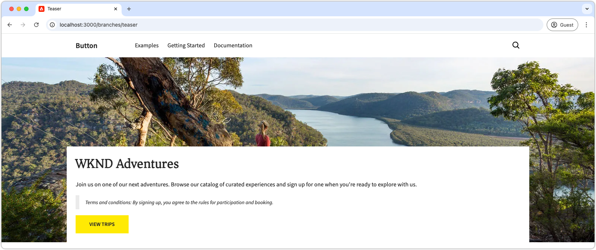
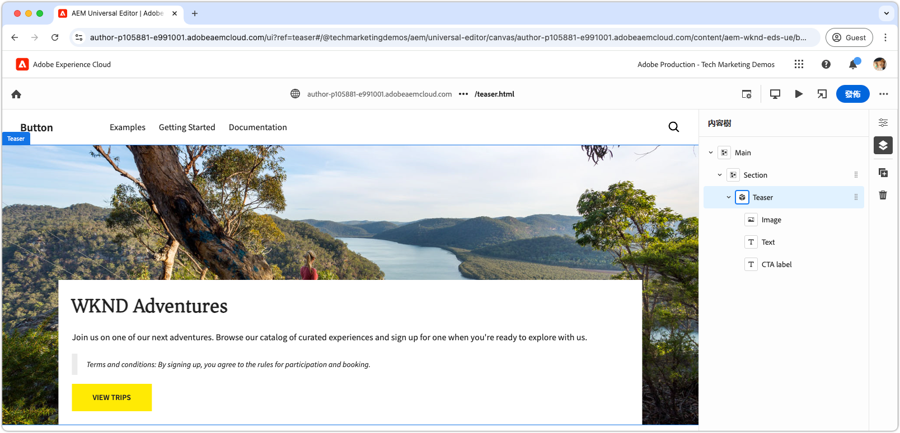

# 使用CSS和JavaScript開發區塊

在[上一章](./7b-block-js-css.md)中，涵蓋了僅使用CSS來設定區塊的樣式。 現在，焦點轉移到了同時使用JavaScript和CSS來開發區塊。

此範例說明如何以三種方式增強區塊：

1. 新增自訂CSS類別。
1. 使用事件接聽程式來新增移動。
1. 處理可選擇包含在Teaser文字中的條款與條件。

## 常見使用案例

此方法在下列情況中特別有用：

- **外部CSS管理：**&#x200B;當區塊的CSS在Edge Delivery Services外部受到管理，且未對齊其HTML結構時。
- **其他屬性：**&#x200B;需要額外的屬性（例如[ARIA](https://developer.mozilla.org/en-US/docs/Web/Accessibility/ARIA)協助工具或[微資料](https://developer.mozilla.org/en-US/docs/Web/HTML/Microdata)）時。
- **JavaScript增強功能：**&#x200B;需要互動功能（例如事件接聽程式）時。

此方法需仰賴瀏覽器原生JavaScript DOM操控，但在修改DOM時需格外小心，尤其是在移動元素時。 這類變更可能會中斷Universal Editor的編寫體驗。 理想情況下，區塊的[內容模型](./5-new-block.md#block-model)應經過周密設計，以將對大量DOM變更的需求降至最低。

## 封鎖HTML

若要進行區塊開發，請先檢閱Edge Delivery Services公開的DOM。 結構已透過JavaScript增強，並以CSS設定樣式。

>[!BEGINTABS]

>要裝飾的[!TAB DOM]

以下是Teaser區塊的DOM，這是使用JavaScript和CSS裝飾的目標。

```html
...
<body>
    <header/>
    <main>
        <div>
            <!-- Start block HTML -->
            <div class="teaser block" data-block-name="teaser" data-block-status="loaded">
                <div>
                    <div>
                    <picture>
                        <source type="image/webp" srcset="./media_15ba2b455e29aca38c1ca653d24c40acaec8a008f.jpeg?width=2000&amp;format=webply&amp;optimize=medium" media="(min-width: 600px)">
                        <source type="image/webp" srcset="./media_15ba2b455e29aca38c1ca653d24c40acaec8a008f.jpeg?width=750&amp;format=webply&amp;optimize=medium">
                        <source type="image/jpeg" srcset="./media_15ba2b455e29aca38c1ca653d24c40acaec8a008f.jpeg?width=2000&amp;format=jpeg&amp;optimize=medium" media="(min-width: 600px)">
                        
                    </picture>
                    </div>
                </div>
                <div>
                    <div>
                    <h2 id="wknd-adventures">WKND Adventures</h2>
                    <p>Join us on one of our next adventures. Browse our list of curated experiences and sign up for one when you're ready to explore with us.</p>
                    <p class="button-container"><a href="/" title="View trips" class="button">View trips</a></p>
                    </div>
                </div>
            </div>     
            <!-- End block HTML -->
        </div>
    </main>
    <footer/>
</body>
...
```

>[!TAB 如何尋找DOM]

若要尋找要裝飾的DOM，請在您的本機開發環境中開啟包含未裝飾區塊的頁面，選取區塊並檢查DOM。


>[!ENDTABS]


## 封鎖JavaScript

若要將JavaScript功能新增至區塊，請在區塊的目錄中建立與區塊同名的JavaScript檔案，例如`/blocks/teaser/teaser.js`。

JavaScript檔案應匯出預設函式：

```javascript
export default function decorate(block) { ... }
```

預設函式採用代表Edge Delivery Services HTML中區塊的DOM元素/樹狀結構，並包含呈現區塊時執行的自訂JavaScript。

此範例JavaScript會執行三個主要動作：

1. 將事件接聽程式新增至CTA按鈕，在游標停留時縮放影像。
1. 將語義CSS類別新增至區塊的元素，可在整合現有CSS設計系統時派上用場。
1. 將特殊的CSS類別新增至以`Terms and conditions:`開頭的段落。

[!BADGE /blocks/teaser/teaser.js]{type=Neutral tooltip="以下程式碼範例的檔案名稱。"}

```javascript
/* /blocks/teaser/teaser.js */

/**
 * Adds a zoom effect to image using event listeners.
 *
 * When the CTA button is hovered over, the image zooms in.
 *
 * @param {HTMLElement} block represents the block's' DOM tree
 */
function addEventListeners(block) {
  block.querySelector('.button').addEventListener('mouseover', () => {
    block.querySelector('.image').classList.add('zoom');
  });

  block.querySelector('.button').addEventListener('mouseout', () => {
    block.querySelector('.image').classList.remove('zoom');
  });
}

/**
   * Entry point to block's JavaScript.
   * Must be exported as default and accept a block's DOM element.
   * This function is called by the project's style.js, and passed the block's element.
   *
   * @param {HTMLElement} block represents the block's' DOM element/tree
   */
export default function decorate(block) {
  /* This JavaScript makes minor adjustments to the block's DOM */

  // Dress the DOM elements with semantic CSS classes so it's obvious what they are.
  // If needed we could also add ARIA roles and attributes, or add/remove/move DOM elements.

  // Add a class to the first picture element to target it with CSS
  block.querySelector('picture').classList.add('image-wrapper');

  // Use previously applied classes to target new elements
  block.querySelector('.image-wrapper img').classList.add('image');

  // Mark the second/last div as the content area (white, bottom aligned box w/ text and cta)
  block.querySelector(':scope > div:last-child').classList.add('content');

  // Mark the first H1-H6 as a title
  block.querySelector('h1,h2,h3,h4,h5,h6').classList.add('title');

  // Process each paragraph and mark it as text or terms-and-conditions
  block.querySelectorAll('p').forEach((p) => {
    const innerHTML = p.innerHTML?.trim();

    // If the paragraph starts with Terms and conditions: then style it as such
    if (innerHTML?.startsWith("Terms and conditions:")) {
      /* If a paragraph starts with '*', add a special CSS class. */
      p.classList.add('terms-and-conditions');
    }
  });

  // Add event listeners to the block
  addEventListeners(block);
}
```

## 封鎖CSS

如果您在[上一章](./7a-block-css.md)中建立`teaser.css`，請刪除它，或將它重新命名為`teaser.css.bak`，因為本章實作不同的CSS給Teaser區塊。

在區塊的資料夾中建立`teaser.css`檔案。 此檔案包含設定區塊樣式的CSS程式碼。 此CSS程式碼會鎖定區塊的元素以及JavaScript在`teaser.js`中新增的特定語意CSS類別。

裸元素仍可直接設定樣式，或使用自訂套用的CSS類別進行設定。 對於更複雜的區塊，套用語義CSS類別有助於讓CSS更容易理解和可維護，尤其是在與較大型團隊合作進行較長一段時間時。

[如同](./7a-block-css.md#develop-a-block-with-css)之前，使用[CSS巢狀結構](https://developer.mozilla.org/en-US/docs/Web/CSS/CSS_nesting)將CSS範圍設定為`.block.teaser`以避免與其他區塊衝突。

[!BADGE /blocks/teaser/teaser.css]{type=Neutral tooltip="以下程式碼範例的檔案名稱。"}

```css
/* /blocks/teaser/teaser.css */

/* Scope each selector in the block with `.block.teaser` to avoid accidental conflicts outside the block */
.block.teaser {
    animation: teaser-fade-in 1s;
    position: relative;
    width: 1600px;
    max-width: 100vw;
    left: 50%; 
    transform: translateX(-50%);
    height: 500px;
    overflow: hidden; 

    /* The teaser image */
    .image-wrapper {
        position: absolute;
        z-index: -1;
        inset: 0;
        box-sizing: border-box;
        overflow: hidden; 

        .image {
            object-fit: cover;
            object-position: center;
            width: 100%;
            height: 100%;
            transform: scale(1); 
            transition: transform 0.6s ease-in-out;

            .zoom {
                transform: scale(1.1);
            }            
        }
    }

    /* The teaser text content */
    .content {
        position: absolute;
        bottom: 0;
        left: 50%;
        transform: translateX(-50%);
        background: var(--background-color);
        padding: 1.5rem 1.5rem 1rem;
        width: 80vw;
        max-width: 1200px;
  
        .title {
            font-size: var(--heading-font-size-xl);
            margin: 0;
        }

        .title::after {
            border-bottom: 0;
        }

        p {
            font-size: var(--body-font-size-s);
            margin-bottom: 1rem;
            animation: teaser-fade-in .6s;
        
            &.terms-and-conditions {
                font-size: var(--body-font-size-xs);
                color: var(--secondary-color);
                padding: .5rem 1rem;
                font-style: italic;
                border: solid var(--light-color);
                border-width: 0 0 0 10px;
            }
        }

        /* Add underlines to links in the text */
        a:hover {
            text-decoration: underline;
        }

        /* Add specific spacing to buttons. These button CSS classes are automatically added by Edge Delivery Services. */
        .button-container {
            margin: 0;
            padding: 0;
        
            .button {   
                background-color: var(--primary-color);
                border-radius: 0;
                color: var(--dark-color);
                font-size: var(--body-font-size-xs);
                font-weight: bold;
                padding: 1em 2.5em;
                margin: 0;
                text-transform: uppercase;
            }
        }
    }
}

/** Animations 
    Scope the @keyframes to the block (teaser) to avoid accidental conflicts outside the block

    Global @keyframes can defines in styles/styles.css and used in this file.
**/
@keyframes teaser-fade-in {
    from {
        opacity: 0;
    }

    to {
        opacity: 1;
    }
}
```

## 新增條款與條件

上述實作新增對以文字`Terms and conditions:`開頭的特殊樣式段落的支援。 若要驗證此功能，請在通用編輯器中更新Teaser區塊的文字內容，以包含條款及條件。

請依照[編寫區塊](./6-author-block.md)中的步驟操作，並編輯文字以包含&#x200B;**條款與條件**&#x200B;結尾的段落：

```
WKND Adventures

Join us on one of our next adventures. Browse our list of curated experiences and sign up for one when you're ready to explore with us.

Terms and conditions: By signing up, you agree to the rules for participation and booking.
```

確認段落在本機開發環境中已使用條款與條件樣式呈現。 請記住，這些程式碼變更要等到[推送到Universal Editor已設定為使用的GitHub](#preview-in-universal-editor)分支後，才會反映在Universal Editor中。

## 開發預覽

新增CSS和JavaScript後，AEM CLI的本機開發環境會重新載入變更，讓您快速輕鬆地視覺化程式碼如何影響區塊。 將游標暫留在CTA上，並驗證Teaser的影像是否會放大和縮小。



## 將程式碼插入

請務必[經常lint](./3-local-development-environment.md#linting)您的程式碼變更，以保持其整齊一致。 定期篩選有助於及早發現問題，減少整體開發時間。 請記住，您必須先解決所有Linting問題，才能將您的開發工作合併至`main`分支！

```bash
# ~/Code/aem-wknd-eds-ue

$ npm run lint
```

## 在通用編輯器中預覽

若要在AEM的通用編輯器中檢視變更，請新增、提交變更，並將其推送到通用編輯器使用的Git存放庫分支。 這麼做可確保區塊實作不會中斷編寫體驗。

```bash
# ~/Code/aem-wknd-eds-ue

$ git add .
$ git commit -m "CSS and JavaScript implementation for teaser block"
$ git push origin teaser
```

現在，當您新增`?ref=teaser`查詢引數時，可以在通用編輯器中預覽變更。

通用編輯器中的
