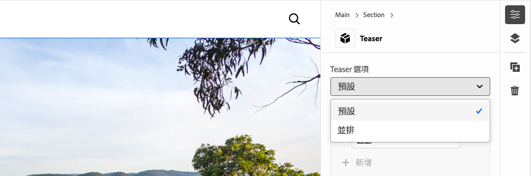
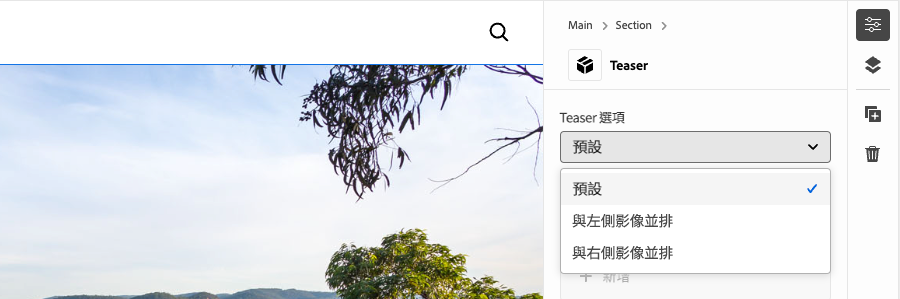
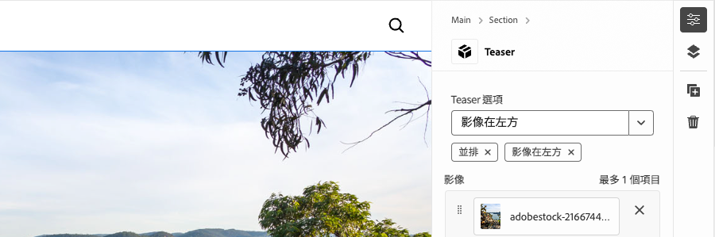
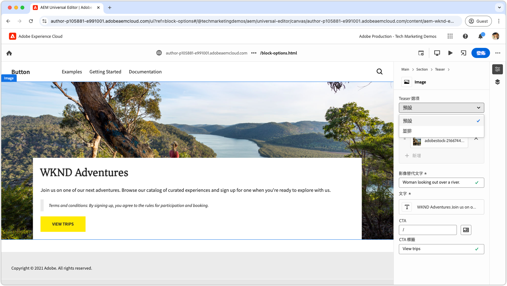

# 使用選項開發區塊

本教學課程以Edge Delivery Services和Universal Editor教學課程為基礎，引導您完成新增區塊選項至區塊的程式。 藉由定義區塊選項，您可以自訂區塊的外觀和功能，讓不同的變化符合各種內容需求。 這可讓您在網站的設計系統中擁有更大的彈性和可重複使用性。

{align="center"}

在本教學課程中，您會將區塊選項新增至Teaser區塊，讓作者可在兩個顯示選項之間進行選擇： **預設**&#x200B;和&#x200B;**並排**。 **預設**&#x200B;選項會顯示文字上方與後方的影像，而&#x200B;**並排**&#x200B;選項則會並排顯示影像與文字。

## 常見使用案例

在&#x200B;**Edge Delivery Services**&#x200B;和&#x200B;**Universal Editor**&#x200B;開發中使用&#x200B;**區塊選項**&#x200B;的常見使用案例包含但不限於：

1. **版面配置變化：**&#x200B;可輕鬆地在版面配置之間切換。 例如，水平與垂直，或格線與清單。
2. **樣式變化：**&#x200B;在主題或視覺處理之間輕鬆切換。 例如，淺色與深色模式，或大文字與小文字。
3. **內容顯示控制項：**&#x200B;切換元素的可見度或在內容樣式之間切換（精簡與詳細）。

這些選項可讓您在建立動態和可調整區塊時擁有彈性和效率。

此教學課程示範版面配置變化使用案例，其中Teaser區塊可以兩種不同的版面配置顯示： **預設**&#x200B;和&#x200B;**並排**。

## 區塊模型

若要將區塊選項新增至Teaser區塊，請在`/block/teaser/_teaser.json`開啟其JSON片段，並將新欄位新增至模型定義。 此欄位將其`name`屬性設為`classes`，這是AEM用來儲存區塊選項(套用至區塊的Edge Delivery Services HTML)的保護欄位。

### 欄位設定

以下標籤說明在區塊模型中設定區塊選項的各種方式，包括使用單一CSS類別進行單選、使用多個CSS類別進行單選，以及使用多個CSS類別進行多選。 此教學課程[實作在&#x200B;**選取使用單一CSS類別**&#x200B;的較簡單方法](#field-configuration-for-this-tutorial)。

>[!BEGINTABS]

>[!TAB 使用單一CSS類別選取]

此教學課程示範如何使用`select` （下拉式）輸入型別，讓作者選擇單一區塊選項，然後套用為單一對應的CSS類別。

{align="center"}

#### 區塊模型

**預設**&#x200B;選項以空字串(`""`)表示，而&#x200B;**並排**&#x200B;選項則使用`"side-by-side"`。 選項的&#x200B;**名稱**&#x200B;和&#x200B;**值**&#x200B;不必相同，但&#x200B;**值**&#x200B;會決定套用至區塊HTML的CSS類別。 例如，**並排**&#x200B;選項的值可以是`layout-10`而非`side-by-side`。 不過，最好對CSS類別使用語義上有意義的名稱，以確保選項值的清晰度和一致性。

[!BADGE /blocks/teaser/_teaser.json]{type=Neutral tooltip="以下程式碼範例的檔案名稱。"}

```json{highlight="4,8,9-18"}
...
"fields": [
    {
        "component": "select",
        "name": "classes",
        "value": "",
        "label": "Teaser options",
        "valueType": "string",
        "options": [
            {
                "name": "Default",
                "value": ""
            },
            {
                "name": "Side-by-side",
                "value": "side-by-side"
            }
        ]
    }
]
...
```

#### 封鎖HTML

作者選取選項時，對應的值會新增為區塊的HTML的CSS類別：

- 如果選取&#x200B;**預設**：

  ```html
  <div class="block teaser">
      <!-- Block content here -->
  </div>
  ```

- 如果選取&#x200B;**並排**：

  ```html
  <div class="block teaser side-by-side">
      <!-- Block content here -->
  </div>
  ```

這可讓您根據所選的開啟專案，套用不同的樣式和條件式JavaScript。


>[!TAB 選取包含多個CSS類別]

**此教學課程未使用這個方法，但說明了替代方法和進階區塊選項。**

`select`輸入型別可讓作者選擇單一區塊選項，該選項可選擇對應至多個CSS類別。 若要完成此操作，請以空格分隔的值形式列出CSS類別。

{align="center"}

#### 區塊模型

例如，**並排**&#x200B;選項可支援影像在左側(`side-by-side left`)或右側(`side-by-side right`)出現的變化。

[!BADGE /blocks/teaser/_teaser.json]{type=Neutral tooltip="以下程式碼範例的檔案名稱。"}

```json{highlight="4,8,9-21"}
...
"fields": [
    {
        "component": "select",
        "name": "classes",
        "value": "",
        "label": "Teaser options",
        "valueType": "string",
        "options": [
            {
                "name": "Default",
                "value": ""
            },
            {
                "name": "Side-by-side with Image on left",
                "value": "side-by-side left"
            },
            {
                "name": "Side-by-side with Image on right",
                "value": "side-by-side right"
            }
        ]
    }
]
...
```

#### 封鎖HTML

作者選取選項時，對應的值會在區塊的HTML中，套用為一組以空格分隔的CSS類別：

- 如果選取&#x200B;**預設**：

  ```html
  <div class="block teaser">
      <!-- Block content here -->
  </div>
  ```

- 如果選取&#x200B;**與影像並排於左側**：

  ```html
  <div class="block teaser side-by-side left">
      <!-- Block content here -->
  </div>
  ```

- 如果選取&#x200B;**並排影像（位於右側**）：

  ```html
  <div class="block teaser side-by-side right">
      <!-- Block content here -->
  </div>
  ```

這可讓您根據所選的選項，套用不同的樣式和條件式JavaScript。


>[!TAB 使用多個CSS類別進行多重選取]

**此教學課程未使用這個方法，但說明了替代方法和進階區塊選項。**

`"component": "multiselect"`的輸入型別允許作者同時選取多個選項。 如此可結合多種設計選擇，讓區塊的外觀發生複雜的排列。

{align="center"}

### 區塊模型

例如，**並排**、左側&#x200B;**的**&#x200B;影像和右側&#x200B;**的**&#x200B;影像可支援影像位於左側(`side-by-side left`)或右側(`side-by-side right`)的變異。

[!BADGE /blocks/teaser/_teaser.json]{type=Neutral tooltip="以下程式碼範例的檔案名稱。"}

```json{highlight="4,6,8,10-21"}
...
"fields": [
    {
        "component": "multiselect",
        "name": "classes",
        "value": [],
        "label": "Teaser options",
        "valueType": "array",
        "options": [
            {
                "name": "Side-by-side",
                "value": "side-by-side"
            },
            {
                "name": "Image on left",
                "value": "left"
            },
            {
                "name": "Image on right",
                "value": "right"
            }
        ]
    }
]
...
```

#### 封鎖HTML

當作者選取多個選項時，對應的值會在區塊的HTML中套用為以空格分隔的CSS類別：

- 如果選取&#x200B;**並排**&#x200B;和左側&#x200B;**影像**：

  ```html{highlight="1"}
  <div class="block teaser side-by-side left">
      <!-- Block content here -->
  </div>
  ```

- 如果選取&#x200B;**並排**&#x200B;和右側&#x200B;**的**&#x200B;影像：

  ```html{highlight="1"}
  <div class="block teaser side-by-side right">
      <!-- Block content here -->
  </div>
  ```

雖然多選提供彈性，但設計排列的管理卻相當複雜。 若沒有限制，衝突的選取專案可能會導致體驗中斷或品牌外。

例如：

- **影像在左側**&#x200B;或&#x200B;**影像在右側**&#x200B;而未選取&#x200B;**並排**&#x200B;會隱含地套用至&#x200B;**預設**，此預設會一律將影像設定為背景，因此左右對齊是不相關的。
- 同時選取左邊的&#x200B;**影像**&#x200B;和右邊的&#x200B;**影像是矛盾的**。
- 選取&#x200B;**並排的**，但不包含&#x200B;**影像在左側**&#x200B;或影像在右側&#x200B;**可能會被視為模稜兩可，因為影像的位置未指定。**

若要避免發生問題並在使用多選時避免作者混淆，請確保選項已妥善規劃且所有排列均已測試。 多重選取最適合用於簡單、非衝突的增強功能，例如「大型」或「反白」，而非版面變更選擇。


>[!TAB 預設選項]

**此教學課程未使用這個方法，但說明了替代方法和進階區塊選項。**

在Universal Editor中將新區塊執行個體新增至頁面時，區塊選項可設為預設值。 若要這麼做，請在[區塊的定義](../5-new-block.md#block-definition)中設定`classes`屬性的預設值。

#### 區塊定義

在下列範例中，將`classes`欄位的`value`屬性指派給`side-by-side`，預設選項設定為&#x200B;**並排**。 區塊模型中對應的區塊選項輸入是選用的。

您也可以為相同區塊定義多個專案，每個專案都有不同的名稱和類別。 這可讓Universal Editor顯示不同的區塊專案，每個區塊專案都已預先設定特定的區塊選項。 雖然這些區段在編輯器中會顯示為個別區塊，但程式碼基底會包含根據所選選項動態呈現的單一區塊。

[!BADGE /blocks/teaser/_teaser.json]{type=Neutral tooltip="以下程式碼範例的檔案名稱。"}

```json{highlight="12"}
{
    "definitions": [{
      "title": "Teaser",
      "id": "teaser",
      "plugins": {
        "xwalk": {
          "page": {
            "resourceType": "core/franklin/components/block/v1/block",
            "template": {
              "name": "Teaser",
              "model": "teaser",
              "classes": "side-by-side",
              "textContent_text": "<h2>Enter a title</h2><p>...and body text here!</p>",
              "textContent_cta": "/",
              "textContent_ctaText": "Click me!"
            }
          }
        }
      }
    }],
    "models": [... from previous section ...],
    "filters": []
}
```

>[!ENDTABS]


### 本教學課程的欄位設定


在本教學課程中，我們將使用上述第一個標籤中說明的搭配單一CSS類別選取方法，該方法允許兩個獨立區塊選項： **預設**&#x200B;和&#x200B;**並排**。

在區塊JSON片段的模型定義中，為區塊選項新增單一選取欄位。 此欄位可讓作者在預設版面配置與並排版面配置之間進行選擇。

[!BADGE /blocks/teaser/_teaser.json]{type=Neutral tooltip="以下程式碼範例的檔案名稱。"}

```json{highlight="7-24"}
{
    "definitions": [...],
    "models": [
        {
            "id": "teaser", 
            "fields": [
                {
                    "component": "select",
                    "name": "classes",
                    "value": "",
                    "label": "Teaser options",
                    "description": "",
                    "valueType": "string",
                    "options": [
                        {
                            "name": "Default",
                            "value": ""
                        },
                        {
                            "name": "Side-by-side",
                            "value": "side-by-side"
                        }
                    ]
                },
                {
                    "component": "reference",
                    "valueType": "string",
                    "name": "image",
                    "label": "Image",
                    "multi": false
                },
                {
                    "component": "text",
                    "valueType": "string",
                    "name": "imageAlt",
                    "label": "Image alt text",
                    "required": true
                },
                {
                    "component": "richtext",
                    "name": "textContent_text",
                    "label": "Text",
                    "valueType": "string",
                    "required": true
                },
                {
                    "component": "aem-content",
                    "name": "textContent_cta",
                    "label": "CTA",
                    "valueType": "string"
                },
                {
                    "component": "text",
                    "name": "textContent_ctaText",
                    "label": "CTA label",
                    "valueType": "string"
                }
            ]
        }
    ],
    "filters": []
}
```

## 在通用編輯器中更新區塊

若要讓更新的區塊選項輸入可在通用編輯器中使用，請將JSON程式碼變更部署至GitHub、建立新頁面、使用&#x200B;**並排**&#x200B;選項新增及編寫Teaser區塊，然後發佈頁面以預覽。 發佈後，在本機開發環境中載入頁面以進行編碼。

### 將變更推送至GitHub

若要讓更新的區塊選項輸入可在通用編輯器中用於設定區塊選項並針對產生的HTML進行開發，專案必須經過篩選，且變更會推送至GitHub分支，在此例中為`block-options`分支。

```bash
# ~/Code/aem-wknd-eds-ue

# Lint the changes to catch any syntax errors
$ npm run lint 

$ git add .
$ git commit -m "Add Teaser block option to JSON file so it is available in Universal Editor"
$ git push origin teaser
```

### 建立測試頁面

在AEM Author服務中，建立新頁面以新增用於開發的Teaser區塊。 依照[Edge Delivery Services和Universal Editor Developer教學課程](../0-overview.md)的[編寫區塊](../6-author-block.md)章節中的慣例，在`branches`頁面下建立測試頁面，以您正在處理的Git分支命名（在此例中為`block-options`）。

### 編寫區塊

在通用編輯器中編輯新的&#x200B;**區塊選項**&#x200B;頁面，並新增&#x200B;**Teaser**&#x200B;區塊。 請確定將查詢引數`?ref=block-options`新增至URL，以使用`block-options` GitHub分支的程式碼載入頁面，

區塊對話方塊現在包含&#x200B;**Teaser選項**&#x200B;下拉式清單，其中包含&#x200B;**預設**&#x200B;和&#x200B;**並排**&#x200B;選項。 選擇&#x200B;**並排式**&#x200B;並排完成其餘的內容製作。

{align="center"}

選擇性地新增兩個&#x200B;**Teaser**&#x200B;區塊 — 一個設定為&#x200B;**預設**，另一個設定為&#x200B;**並排**。 這可讓您在開發期間並排預覽這兩個選項，並確保並排實作&#x200B;**不會影響**&#x200B;預設&#x200B;**選項。**

### 發佈以預覽

將Teaser區塊新增到頁面後，[使用&#x200B;**發佈**&#x200B;按鈕並將頁面發佈到預覽](../6-author-block.md)，並選擇在通用編輯器中發佈到&#x200B;**預覽**。

## 封鎖HTML

若要開始區塊開發，請先檢閱Edge Delivery Services預覽所公開的DOM結構。 DOM已透過JavaScript增強，並採用CSS樣式，為建置和自訂區塊提供基礎。

>[!BEGINTABS]

>要裝飾的[!TAB DOM]

以下是Teaser區塊的DOM，已選取&#x200B;**並排**&#x200B;區塊選項，這是使用JavaScript和CSS裝飾的目標。

```html{highlight="7"}
...
<body>
    <header/>
    <main>
        <div>
            <!-- Start block HTML -->
            <div class="teaser block side-by-side" data-block-name="teaser" data-block-status="loaded">
                <div>
                    <div>
                    <picture>
                        <source type="image/webp" srcset="./media_15ba2b455e29aca38c1ca653d24c40acaec8a008f.jpeg?width=2000&amp;format=webply&amp;optimize=medium" media="(min-width: 600px)">
                        <source type="image/webp" srcset="./media_15ba2b455e29aca38c1ca653d24c40acaec8a008f.jpeg?width=750&amp;format=webply&amp;optimize=medium">
                        <source type="image/jpeg" srcset="./media_15ba2b455e29aca38c1ca653d24c40acaec8a008f.jpeg?width=2000&amp;format=jpeg&amp;optimize=medium" media="(min-width: 600px)">
                        
                    </picture>
                    </div>
                </div>
                <div>
                    <div>
                    <h2 id="wknd-adventures">WKND Adventures</h2>
                    <p>Join us on one of our next adventures. Browse our list of curated experiences and sign up for one when you're ready to explore with us.</p>
                    <p>Terms and conditions: By signing up, you agree to the rules for participation and booking.</p>
                    <p class="button-container"><a href="/" title="View trips" class="button">View trips</a></p>
                    </div>
                </div>
            </div>     
            <!-- End block HTML -->
        </div>
    </main>
    <footer/>
</body>
...
```

>[!TAB 如何尋找DOM]

若要尋找要裝飾的DOM，請在您的本機開發環境中開啟包含區塊的頁面，使用網頁瀏覽器的開發人員工具選取區塊，然後檢查DOM。 這可讓您識別要裝飾的相關元素。

{align="center"}

>[!ENDTABS]

## 封鎖CSS

編輯`blocks/teaser/teaser.css`為&#x200B;**並排式**&#x200B;選項新增特定的CSS樣式。 此檔案包含區塊的預設CSS。

若要修改&#x200B;**並排式**&#x200B;選項的樣式，請在`teaser.css`檔案中新增範圍CSS規則，該規則會鎖定以`side-by-side`類別設定的Teaser區塊。

```css
.block.teaser.side-by-side { ... }
```

或者，您可以使用CSS Nesting取得更精簡的版本：

```css
.block.teaser {
    ... Default teaser block styles ...

    &.side-by-side {
        ... Side-by-side teaser block styles ...
    }
}
```

在`&.side-by-side`規則內，當套用`side-by-side`類別時，新增必要的CSS屬性以設定區塊樣式。

常見的方法是將`all: initial`套用至共用選取器，然後為`side-by-side`變體新增必要的樣式，以重設預設樣式。 如果大部分的樣式都是跨選項共用的，覆寫特定屬性可能會較為容易。 不過，如果多個選取器需要變更，重設所有樣式並僅重新套用必要的樣式可讓程式碼更清楚、更容易維護。
[!BADGE /blocks/teaser/teaser.css]{type=Neutral tooltip="以下程式碼範例的檔案名稱。"}

```css
/* /blocks/teaser/teaser.css */

/* Scope each selector in the block with `.block.teaser` to avoid accidental conflicts outside the block */
.block.teaser {
    animation: teaser-fade-in 1s;
    position: relative;
    width: 1600px;
    max-width: 100vw;
    left: 50%; 
    transform: translateX(-50%);
    height: 500px;
    overflow: hidden; 


    /* The teaser image */
    .image-wrapper {
        position: absolute;
        z-index: -1;
        inset: 0;
        box-sizing: border-box;
        overflow: hidden; 

        .image {
            object-fit: cover;
            object-position: center;
            width: 100%;
            height: 100%;
            transform: scale(1); 
            transition: transform 0.6s ease-in-out;

            .zoom {
                transform: scale(1.1);
            }            
        }
    }

    /* The teaser text content */
    .content {
        position: absolute;
        bottom: 0;
        left: 50%;
        transform: translateX(-50%);
        background: var(--background-color);
        padding: 1.5rem 1.5rem 1rem;
        width: 80vw;
        max-width: 1200px;
  
        .title {
            font-size: var(--heading-font-size-xl);
            margin: 0;
        }

        .title::after {
            border-bottom: 0;
        }

        p {
            font-size: var(--body-font-size-s);
            margin-bottom: 1rem;
            animation: teaser-fade-in .6s;
        }

        p.terms-and-conditions {
            font-size: var(--body-font-size-xs);
            color: var(--secondary-color);
            padding: .5rem 1rem;
            font-style: italic;
            border: solid var(--light-color);
            border-width: 0 0 0 10px;
        }

        /* Add underlines to links in the text */
        a:hover {
            text-decoration: underline;
        }

        /* Add specific spacing to buttons. These button CSS classes are automatically added by Edge Delivery Services. */
        .button-container {
            margin: 0;
            padding: 0;        

            .button {   
                background-color: var(--primary-color);
                border-radius: 0;
                color: var(--dark-color);
                font-size: var(--body-font-size-xs);
                font-weight: bold;
                padding: 1em 2.5em;
                margin: 0;
                text-transform: uppercase;
            }
        }
    }

    /**
    *  Add styling for the side-by-side variant 
    **/

    /* This evaluates to .block.teaser.side-by-side */
    &.side-by-side {    
        /* Since this default teaser option doesn't have a style (such as `.default`), we use `all: initial` to reset styles rather than overriding individual styles. */
        all: initial;
        display: flex;
        margin: auto;
        max-width: 900px;

        .image-wrapper {
            all: initial;
            flex: 2;
            overflow: hidden;                 
            
            * {
                height: 100%;
            }        

            .image {
                object-fit: cover;
                object-position: center;
                width: 100%;
                height: 100%;
                transform: scale(1); 
                transition: transform 0.6s ease-in-out;                

                &.zoom {
                    /* This option has a different zoom level than the default */
                    transform: scale(1.5);
                }
            }
        }

        .content {
            all: initial;
            flex: 1;
            background-color: var(--light-color);
            padding: 3.5em 2em 2em;
            font-size: var(--body-font-size-s);
            font-family: var(--body-font-family);
            text-align: justify;
            text-justify: newspaper;
            hyphens: auto;

            p.terms-and-conditions {
                border: solid var(--text-color);
                border-width: 0;
                padding-left: 0;
                text-align: left;
            }
        }

        /* Media query for mobile devices */
        @media (width <= 900px) {
            flex-direction: column; /* Stack elements vertically on mobile */
        }
    }
}

/** Animations 
    Scope the @keyframes to the block (teaser) to avoid accidental conflicts outside the block

    Global @keyframes can defines in styles/styles.css and used in this file.
**/
@keyframes teaser-fade-in {
    from {
        opacity: 0;
    }

    to {
        opacity: 1;
    }
}
```


## 封鎖JavaScript

藉由檢查套用至區塊元素的類別，即可直接識別區塊的作用中選項。 在此範例中，我們需要根據作用中選項調整`.image-wrapper`樣式的套用位置。

`getOptions`函式傳回套用至區塊的類別陣列，不包括`block`和`teaser` （因為所有區塊都有`block`類別，而所有Teaser區塊都有`teaser`類別）。 陣列中任何剩餘的類別都會指出作用中的選項。 如果陣列是空的，則會套用預設選項。

```javascript
function getOptions(block) {
  // Get the block's classes, excluding 'block' and 'teaser'; anything remaining is a block option.
  return [...block.classList].filter((c) => !['block', 'teaser'].includes(c));
}
```

此選項清單可用於在區塊的JavaScript中有條件地執行自訂邏輯：

```javascript
if (getOptions(block).includes('side-by-side')) {
  /* For side-by-side teaser, add the image-wrapper to a higher-level div to support CSS */
  block.querySelector(':scope > div:first-child').classList.add('image-wrapper');
} else if (!getOptions(block)) {
  /* For the default option, add the image-wrapper to the picture element to support CSS */
  block.querySelector('picture').classList.add('image-wrapper');
}
```

具有預設和並排選項的Teaser區塊完整更新JavaScript檔案如下：

[!BADGE /blocks/teaser/teaser.js]{type=Neutral tooltip="以下程式碼範例的檔案名稱。"}

```javascript
/* /blocks/teaser/teaser.js */

/**
 * Block options are applied as classes to the block's DOM element
 * alongside the `block` and `<block-name>` classes.
 *
 * @param {HTMLElement} block represents the block's DOM element/tree
 */
function getOptions(block) {
  // Get the block's classes, excluding 'block' and 'teaser'.
  return [...block.classList].filter((c) => !['block', 'teaser'].includes(c));
}

/**
 * Adds a zoom effect to the image using event listeners.
 *
 * When the CTA button is hovered over, the image zooms in.
 *
 * @param {HTMLElement} block represents the block's DOM tree
 */
function addEventListeners(block) {
  block.querySelector('.button').addEventListener('mouseover', () => {
    block.querySelector('.image').classList.add('zoom');
  });

  block.querySelector('.button').addEventListener('mouseout', () => {
    block.querySelector('.image').classList.remove('zoom');
  });
}

/**
 * Entry point to the block's JavaScript.
 * Must be exported as default and accept a block's DOM element.
 * This function is called by the project's style.js, passing the block's element.
 *
 * @param {HTMLElement} block represents the block's DOM element/tree
 */
export default function decorate(block) {
  /* Common treatments for all options */
  block.querySelector(':scope > div:last-child').classList.add('content');
  block.querySelector('h1,h2,h3,h4,h5,h6').classList.add('title');
  block.querySelector('img').classList.add('image');

  // Process each paragraph and mark it as text or terms-and-conditions
  block.querySelectorAll('p').forEach((p) => {
    const innerHTML = p.innerHTML?.trim();
    if (innerHTML?.startsWith('Terms and conditions:')) {
      p.classList.add('terms-and-conditions');
    }
  });

  /* Conditional treatments for specific options */
  if (getOptions(block).includes('side-by-side')) {
    /* For side-by-side teaser, add the image-wrapper to a higher-level div to support CSS */
    block.querySelector(':scope > div:first-child').classList.add('image-wrapper');
  } else if (!getOptions(block)) {
    /* For the default option, add the image-wrapper to the picture element to support CSS */
    block.querySelector('picture').classList.add('image-wrapper');
  }

  addEventListeners(block);
}
```

## 開發預覽

新增CSS和JavaScript後，AEM CLI的本機開發環境會重新載入變更，讓您快速輕鬆地視覺化程式碼如何影響區塊。 將游標暫留在CTA上，並驗證Teaser的影像是否會放大和縮小。


## 將程式碼插入

請務必[經常lint](../3-local-development-environment.md#linting)您的程式碼變更，以保持其整齊一致。 定期篩選有助於及早發現問題，減少整體開發時間。 請記住，您必須先解決所有Linting問題，才能將您的開發工作合併至`main`分支！

```bash
# ~/Code/aem-wknd-eds-ue

$ npm run lint
```

## 在通用編輯器中預覽

若要在AEM的通用編輯器中檢視變更，請新增、提交變更，並將其推送到通用編輯器使用的Git存放庫分支。 這麼做可確保區塊實作不會中斷編寫體驗。

```bash
# ~/Code/aem-wknd-eds-ue

$ git add .
$ git commit -m "CSS and JavaScript implementation for Teaser block option Side-by-side"
# JSON files are compiled automatically and added to the commit via a Husky pre-commit hook
$ git push origin block-options
```

現在，使用`?ref=block-options`查詢引數時，可以在通用編輯器中看到變更。

通用編輯器中的{align="center"}


## 恭喜！

您現在已探索Edge Delivery Services和Universal Editor中的區塊選項，為您提供工具，以更大的彈性自訂和簡化內容編輯。 開始在您的專案中套用這些選項，以提高效率並維持一致性。

如需更多最佳實務和進階技術，請參閱[通用編輯器檔案](https://experienceleague.adobe.com/en/docs/experience-manager-cloud-service/content/edge-delivery/wysiwyg-authoring/create-block#block-options)。
