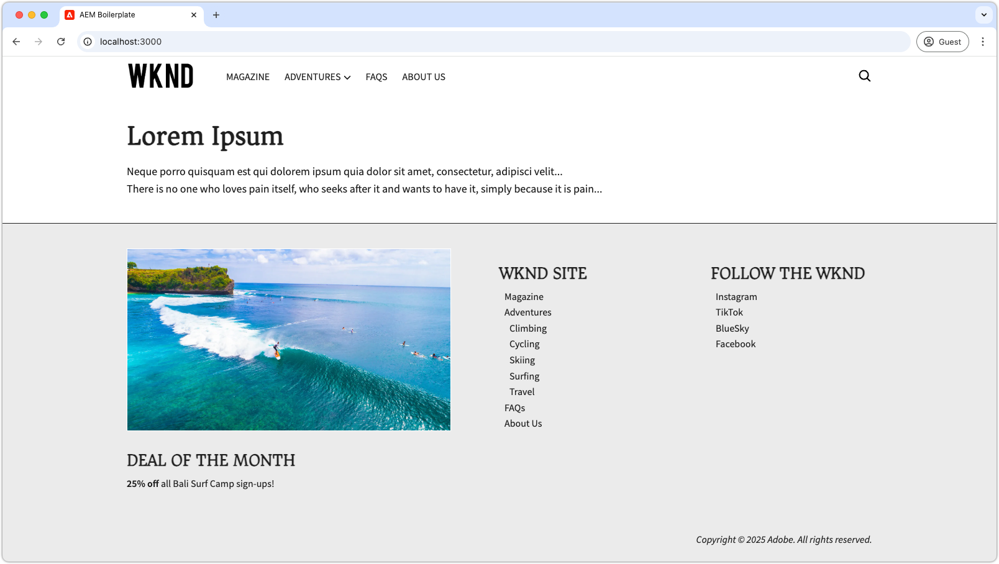
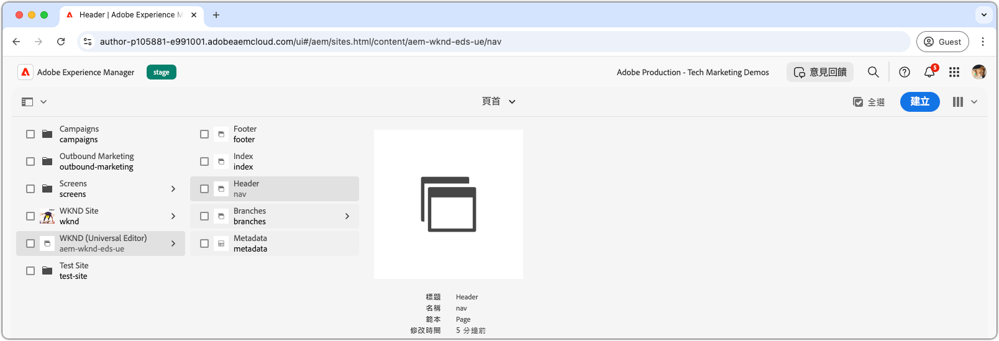
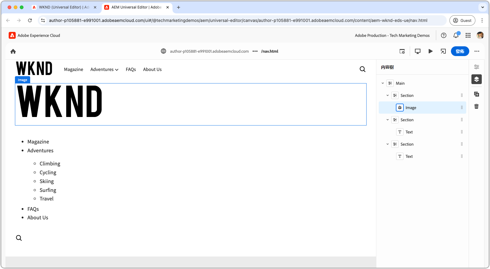
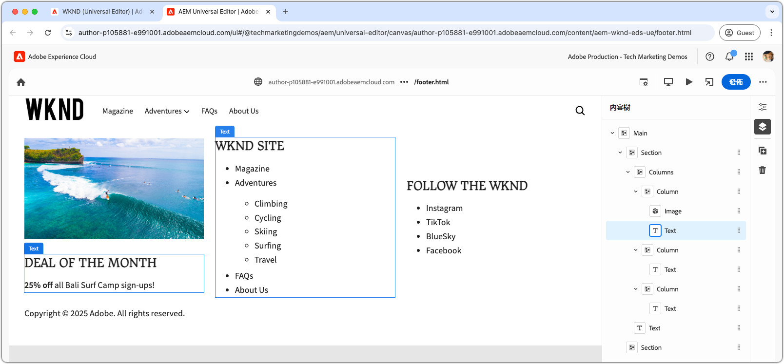

# 開發頁首及頁尾

{align="center"}

頁首及頁尾在 Edge Delivery Services (EDS) 中扮演獨特的角色，因為其與 HTML `<header>` 和 `<footer>` 元素綁定在一起。與一般頁面內容不同，頁首和頁尾皆單獨管理並且可以個別更新，而無需清除整個頁面快取。雖然其在程式碼專案的 `blocks/header` 和 `blocks/footer` 之下以區塊的形式實施，但作者可以透過包含任意區塊組合的專用 AEM 頁面編輯其內容。

## 頁首區塊

{align="center"}

頁首是與 Edge Delivery Services HTML `<header>` 元素綁定的特殊區塊。
`<header>` 元素傳遞時為空，並透過 XHR (AJAX) 填入到單獨的 AEM 頁面。
這樣便能在頁面內容之外單獨管理頁首，並且無需清除所有頁面的快取即可進行更新。

頁首區塊負責要求包含頁首內容的 AEM 頁面片段，並在 `<header>` 元素中進行轉譯。

[!BADGE /blocks/header/header.js]{type=Neutral tooltip="下方程式碼範例的檔案名稱。"}

```javascript
import { getMetadata } from '../../scripts/aem.js';
import { loadFragment } from '../fragment/fragment.js';

...

export default async function decorate(block) {
  // load nav as fragment

  // Get the path to the AEM page fragment that defines the header content from the <meta name="nav"> tag. This is set via the site's Metadata file.
  const navMeta = getMetadata('nav');

  // If the navMeta is not defined, use the default path `/nav`.
  const navPath = navMeta ? new URL(navMeta, window.location).pathname : '/nav';

  // Make an XHR (AJAX) call to request the AEM page fragment and serialize it to a HTML DOM tree.
  const fragment = await loadFragment(navPath);
  
  // Add the content from the fragment HTML to the block and decorate it as needed
  ...
}
```

`loadFragment()` 函數發出 XHR (AJAX) 要求至 `${navPath}.plain.html`，傳回 AEM 頁面 HTML 的 EDS HTML 轉譯，該轉譯存在於頁面的 `<main>` 標記中，處理其內容及其可能包含的任何區塊，並傳回更新的 DOM 樹。

## 製作頁首頁面

在開發頁首區塊之前，首先在通用編輯器中製作其內容，作為開發的依據。

頁首內容位於名為 `nav` 的專屬 AEM 頁面中。

{align="center"}

若要製作頁首：

1. 開啟通用編輯器中的 `nav` 頁面
1. 用包含 WKND 標誌的&#x200B;**影像區塊**&#x200B;取代預設按鈕
1. 更新&#x200B;**文字區塊**&#x200B;內的導覽功能表，方法如下：
   - 新增您想要的導覽連結
   - 在需要的地方建立子導覽項目
   - 設定所有連結現在指向首頁 (`/`)

{align="center"}

### 發佈至預覽

由於頁首頁面更新，[將頁面發佈至預覽](../6-author-block.md)。

由於頁首內容位於其自己的頁面上 (`nav` 頁面)，您必須專門發佈該頁面，方能讓頁首變更生效。發佈其他使用該頁首的頁面，不會更新 Edge Delivery Services 上的頁首內容。

## 區塊 HTML

若要開始進行區塊開發，首先請檢閱 Edge Delivery Services 預覽版所公開的 DOM 結構。DOM 透過 JavaScript 增強，並使用 CSS 設定樣式，為建置和自訂區塊打下基礎。

由於頁首以片段形式載入，因此我們需要檢查 XHR 要求在注入 DOM 之後所傳回的 HTML，並透過 `loadFragment()` 進行修飾。這項程序可以透過檢查瀏覽器開發工具中的 DOM 來完成。


>[!BEGINTABS]

>[!TAB 要進行修飾的 DOM]

以下為使用所提供之 `header.js` 載入並注入 DOM 之後的頁首頁面 HTML：

```html
<header class="header-wrapper">
  <div class="header block" data-block-name="header" data-block-status="loaded">
    <div class="nav-wrapper">
      <nav id="nav" aria-expanded="true">
        <div class="nav-hamburger">
          <button type="button" aria-controls="nav" aria-label="Close navigation">
            <span class="nav-hamburger-icon"></span>
          </button>
        </div>
        <div class="section nav-brand" data-section-status="loaded" style="">
          <div class="default-content-wrapper">
            <p class="">
              <a href="#" title="Button" class="">Button</a>
            </p>
          </div>
        </div>
        <div class="section nav-sections" data-section-status="loaded" style="">
          <div class="default-content-wrapper">
            <ul>
              <li aria-expanded="false">Examples</li>
              <li aria-expanded="false">Getting Started</li>
              <li aria-expanded="false">Documentation</li>
            </ul>
          </div>
        </div>
        <div class="section nav-tools" data-section-status="loaded" style="">
          <div class="default-content-wrapper">
            <p>
              <span class="icon icon-search">
                
              </span>
            </p>
          </div>
        </div>
      </nav>
    </div>
  </div>
</header>
```

>[!TAB 如何找到 DOM]

尋找並檢查網頁瀏覽器開發人員工具中的頁面 `<header>` 元素。

{align="center"}

>[!ENDTABS]


## 區塊 JavaScript

來自 [AEM 樣板專案 XWalk 專案範本](https://github.com/adobe-rnd/aem-boilerplate-xwalk)的 `/blocks/header/header.js` 檔案，提供用於導覽的 JavaScript，包括下拉式選單和回應式行動視圖。

雖然 `header.js` 指令碼通常會經過大量自訂以符合網站的設計，但保留 `decorate()` 中最初的文字行相當重要，可用於擷取和處理頁首頁面片段。

[!BADGE /blocks/header/header.js]{type=Neutral tooltip="下方程式碼範例的檔案名稱。"}

```javascript
export default async function decorate(block) {
  // load nav as fragment
  const navMeta = getMetadata('nav');
  const navPath = navMeta ? new URL(navMeta, window.location).pathname : '/nav';
  const fragment = await loadFragment(navPath);
  ...
```

其餘程式碼可以進行修改，以符合您專案的需求。

根據頁首要求，可以調整或移除樣板專案程式碼。在本教學課程中，我們會使用所提供的程式碼，並在第一張製作好的影像周圍加入超連結，將其連結至網站首頁，以增強其功能。

範本的程式碼會處理頁首頁面片段，假設其由三個區段組成且順序如下：

1. **品牌區段** - 包含標誌並使用 `.nav-brand` 類別進行樣式設定。
2. **區段區段** - 定義網站的主選單，並使用 `.nav-sections` 進行樣式設定。
3. **工具區段** - 包括搜尋、登入/登出和設定檔等元素，使用 `.nav-tools` 進行樣式設定。

為了對標誌影像加入連至首頁的超連結，我們按以下方式更新區塊 JavaScript：

>[!BEGINTABS]

>[!TAB 更新後的 JavaScript]

更新後的程式碼將標誌影像與連接至網站首頁的連結 (`/`) 包裝在一起，如下所示：

[!BADGE /blocks/header/header.js]{type=Neutral tooltip="下方程式碼範例的檔案名稱。"}

```javascript
export default async function decorate(block) {

  ...
  const navBrand = nav.querySelector('.nav-brand');
  
  // WKND: Turn the picture (image) into a linked site logo
  const logo = navBrand.querySelector('picture');
  
  if (logo) {
    // Replace the first section's contents with the authored image wrapped with a link to '/' 
    navBrand.innerHTML = `<a href="/" aria-label="Home" title="Home" class="home">${logo.outerHTML}</a>`;
    // Make sure the logo is not lazy loaded as it's above the fold and can affect page load speed
    navBrand.querySelector('img').settAttribute('loading', 'eager');
  }

  const navSections = nav.querySelector('.nav-sections');
  if (navSections) {
    // WKND: Remove Edge Delivery Services button containers and buttons from the nav sections links
    navSections.querySelectorAll('.button-container, .button').forEach((button) => {
      button.classList = '';
    });

    ...
  }
  ...
}
```

>[!TAB 原始 JavaScript]

以下是從範本產生的原始 `header.js`：

[!BADGE /blocks/header/header.js]{type=Neutral tooltip="下方程式碼範例的檔案名稱。"}

```javascript
export default async function decorate(block) {
  ...
  const navBrand = nav.querySelector('.nav-brand');
  const brandLink = navBrand.querySelector('.button');
  if (brandLink) {
    brandLink.className = '';
    brandLink.closest('.button-container').className = '';
  }

  const navSections = nav.querySelector('.nav-sections');
  if (navSections) {
    navSections.querySelectorAll(':scope .default-content-wrapper > ul > li').forEach((navSection) => {
      if (navSection.querySelector('ul')) navSection.classList.add('nav-drop');
      navSection.addEventListener('click', () => {
        if (isDesktop.matches) {
          const expanded = navSection.getAttribute('aria-expanded') === 'true';
          toggleAllNavSections(navSections);
          navSection.setAttribute('aria-expanded', expanded ? 'false' : 'true');
        }
      });
    });
  }
  ...
}
```

>[!ENDTABS]


## 區塊 CSS

更新 `/blocks/header/header.css`，根據 WKND 的品牌設定其樣式。

我們會在 `header.css` 的底部新增自訂 CSS，讓教學課程變更較容易查看和理解。雖然這些樣式可以直接整合至範本的 CSS 規則中，但將這些樣式分開有助於說明所修改的內容。

由於我們是在原始規則集之後新增新規則，因此我們會使用 `header .header.block nav` CSS 選取器將其包裝，以確保其優先性高於範本規則。

[!BADGE /blocks/header/header.css]{type=Neutral tooltip="下方程式碼範例的檔案名稱。"}

```css
/* /blocks/header/header.css */

... Existing CSS generated by the template ...

/* Add the following CSS to the end of the header.css */

/** 
* WKND customizations to the header 
* 
* These overrides can be incorporated into the provided CSS,
* however they are included discretely in thus tutorial for clarity and ease of addition.
* 
* Because these are added discretely
* - They are added to the bottom to override previous styles.
* - They are wrapped in a header .header.block nav selector to ensure they have more specificity than the provided CSS.
* 
**/

header .header.block nav {
  /* Set the height of the logo image.
     Chrome natively sets the width based on the images aspect ratio */
  .nav-brand img {
    height: calc(var(--nav-height) * .75);
    width: auto;
    margin-top: 5px;
  }
  
  .nav-sections {
    /* Update menu items display properties */
    a {
      text-transform: uppercase;
      background-color: transparent;
      color: var(--text-color);
      font-weight: 500;
      font-size: var(--body-font-size-s);
    
      &:hover {
        background-color: auto;
      }
    }

    /* Adjust some spacing and positioning of the dropdown nav */
    .nav-drop {
      &::after {
        transform: translateY(-50%) rotate(135deg);
      }
      
      &[aria-expanded='true']::after {
        transform: translateY(50%) rotate(-45deg);
      }

      & > ul {
        top: 2rem;
        left: -1rem;      
       }
    }
  }
```

## 開發預覽

隨著 CSS 和 JavaScript 的開發，AEM CLI 的本機開發環境會即時重新載入變更，因而可以快速輕鬆地將程式碼對區塊的影響以視覺化圖形呈現。將游標停留在 CTA 上，檢查並確認 Teaser 的影像會放大和縮小顯示。

{align="center"}

## 對程式碼進行 lint 檢查

務必針對您的程式碼變更[經常進行 lint 檢查](../3-local-development-environment.md#linting)，保持程式碼整潔且一致。定期進行 lint 檢查有助於及早發現問題，進而減少整體開發時間。請記住，在解決所有 linting 問題以前，您不能將開發工作合併到 `main` 分支內！

```bash
# ~/Code/aem-wknd-eds-ue

$ npm run lint
```

## 在通用編輯器中預覽

若要在 AEM 通用編輯器中檢視變更，請將其新增、提交並推送至通用編輯器所使用的 Git 存放庫分支。這樣做可以確保區塊實施不會破壞製作體驗。

```bash
# ~/Code/aem-wknd-eds-ue

$ git add .
$ git commit -m "CSS and JavaScript implementation for Header block"
# JSON files are compiled automatically and added to the commit via a Husky pre-commit hook
$ git push origin header-and-footer
```

現在，使用 `?ref=header-and-footer` 查詢參數時可以在通用編輯器中看到變更。

{align="center"}

## 頁尾

與頁首一樣，頁尾內容也是在專用的 AEM 頁面上製作，在本案例中是頁尾頁面 (`footer`)。頁尾遵循相同的模式，以片段的形式載入，並使用 CSS 和 JavaScript 進行修飾。

>[!BEGINTABS]

>[!TAB 頁尾]

頁尾應採用三欄式版面，包含：

- 左側欄顯示促銷活動資訊 (影像和文字)
- 中間欄含有導覽連結
- 右側欄內含社交媒體連結
- 底部有一列橫跨所有三欄，內含版權資訊

{align="center"}

>[!TAB 頁尾內容]

使用頁尾頁面中的欄區塊來建立三欄式的效果。

| 欄目 1 | 欄目 2 | 欄目 3 |
| ---------|----------------|---------------|
| 影像 | 標題 3 | 標題 3 |
| 文字 | 連結清單 | 連結清單 |

{align="center"}

>[!TAB 頁尾程式碼]

下方的 CSS 採用三欄式版面、一致的間距，以及印刷樣式來設定頁尾區塊的樣式。頁尾實施僅使用範本所提供的 JavaScript。

[!BADGE /blocks/footer/footer.css]{type=Neutral tooltip="下方程式碼範例的檔案名稱。"}

```css
/* /blocks/footer/footer.css */

footer {
  background-color: var(--light-color);

  .block.footer {
    border-top: solid 1px var(--dark-color);
    font-size: var(--body-font-size-s);

    a { 
      all: unset;
      
      &:hover {
        text-decoration: underline;
        cursor: pointer;
      }
    }

    img {
      width: 100%;
      height: 100%;
      object-fit: cover;
      border: solid 1px white;
    }

    p {
      margin: 0;
    }

    ul {
      list-style: none;
      padding: 0;
      margin: 0;

      li {
        padding-left: .5rem;
      }
    }

    & > div {
      margin: auto;
      max-width: 1200px;
    }

    .columns > div {
      gap: 5rem;
      align-items: flex-start;

      & > div:first-child {
        flex: 2;
      }
    }

    .default-content-wrapper {
      padding-top: 2rem;
      margin-top: 2rem;
      font-style: italic;
      text-align: right;
    }
  }
}

@media (width >= 900px) {
  footer .block.footer > div {
    padding: 40px 32px 24px;
  }
}
```


>[!ENDTABS]

## 恭喜！

現在您已經了解如何在 Edge Delivery Services 和通用編輯器中管理與開發頁首及頁尾。您已經了解關於頁首和頁尾的以下內容：

- 與主要內容分開並在專屬的 AEM 頁面上製作
- 以片段形式非同步載入，可以獨立更新
- 使用 JavaScript 和 CSS 進行修飾，建立回應式導覽體驗
- 與通用編輯器緊密整合，輕鬆管理內容

此模式提供了一項彈性且可維護的方法，用於實施全站導覽元件。

若要了解更多最佳實務和進階技術，請查看[通用編輯器文件](https://experienceleague.adobe.com/zh-hant/docs/experience-manager-cloud-service/content/edge-delivery/wysiwyg-authoring/create-block#block-options)。
