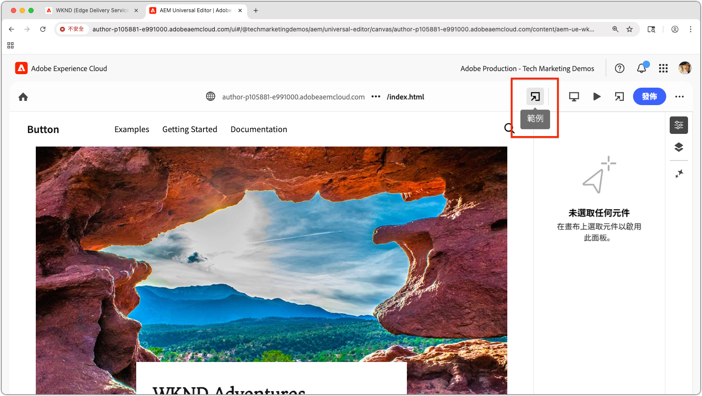

# 預覽本機Universal Editor擴充功能

>[!TIP]
> 瞭解如何[建立Universal Editor擴充功能](https://developer.adobe.com/uix/docs/services/aem-universal-editor/)。

若要在開發期間預覽Universal Editor擴充功能，您需要：

1. 在本機執行擴充功能。
2. 接受自我簽署憑證。
3. 在Universal Editor中開啟頁面。
4. 更新位置URL以載入本機擴充功能。

## 在本機執行擴充功能

此假設您已建立[Universal Editor擴充功能](https://developer.adobe.com/uix/docs/services/aem-universal-editor/)，而且想要在本機測試與開發時預覽該擴充功能。

使用以下專案啟動Universal Editor擴充功能：

```bash
$ aio app run
```

您會看到如下的輸出：

```
To view your local application:
  -> https://localhost:9080
To view your deployed application in the Experience Cloud shell:
  -> https://experience.adobe.com/?devMode=true#/custom-apps/?localDevUrl=https://localhost:9080
```

依預設，這會在`https://localhost:9080`執行您的擴充功能。


## 接受自我簽署憑證

Universal Editor需要HTTPS才能載入擴充功能。 由於本機開發使用自我簽署憑證，因此您的瀏覽器必須明確信任該憑證。

開啟新的瀏覽器索引標籤，並透過`aio app run`命令導覽至本機擴充功能URL輸出：

```
https://localhost:9080
```

您的瀏覽器將顯示憑證警告。 接受憑證以繼續。


接受後，您會看到本機擴充功能的預留位置頁面：


## 在通用編輯器中開啟頁面

透過[通用編輯器主控台](https://experience.adobe.com/#/@myOrg/aem/editor/canvas/)開啟Universal Editor，或是在AEM Sites中編輯使用Universal Editor的頁面：


## 載入擴充功能

在Universal Editor中，找出介面中央的&#x200B;**位置**&#x200B;欄位。 展開並更新位置欄位&#x200B;**中的** URL，**不是瀏覽器位址列**。

附加下列查詢引數：

* `devMode=true` — 啟用Universal Editor的開發模式。
* `ext=https://localhost:9080` — 載入您本機執行的擴充功能。

範例：

```
https://author-pXXX-eXXX.adobeaemcloud.com/content/aem-ue-wknd/index.html?devMode=true&ext=https://localhost:9080
```


## 預覽擴充功能

執行瀏覽器的&#x200B;**硬式重新載入**，以確保使用更新的URL。

Universal Editor現在會載入您的本機擴充功能 — 僅在您的瀏覽器工作階段中。

您在本機進行的任何程式碼變更將立即反映出來。



