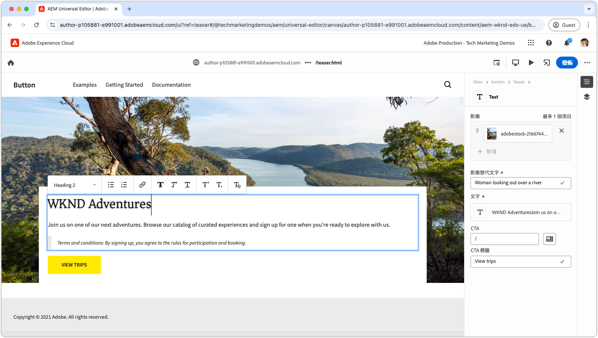

# Edge Delivery Services 影片

了解如何使用 Edge Delivery Services 快速建立網站。

>[!VIDEO](https://video.tv.adobe.com/v/3453466/?learn=on&captions=chi_hant)

請參閱此[文件](https://experienceleague.adobe.com/zh-hant/docs/experience-manager-cloud-service/content/edge-delivery/overview)，了解關於 Edge Delivery Services 及其功能的完整詳細資訊。

## Edge Delivery Services 開發人員教學課程

<!-- CARDS 

* https://experienceleague.adobe.com/zh-hant/docs/experience-manager-cloud-service/content/edge-delivery/build/tutorial
  {title = Document-based authoring and Edge Delivery Services tutorial}
  {description = Learn how to create Edge Delivery Services web sites authored using Document-based authoring.}
  {cta = Start the tutorial}

* ./developing/universal-editor/0-overview.md
  {title = Universal Editor and Edge Delivery Services tutorial}
  {description = Learn the basics of creating an Edge Delivery Services web sites authored with Universal Editor.}
  {cta = Start the tutorial}

-->
<!-- START CARDS HTML - DO NOT MODIFY BY HAND -->

    

        

            

                <figure class="image x-is-16by9">
                    
                </figure>
            

            

                

                    

                        <a href="https://experienceleague.adobe.com/zh-hant/docs/experience-manager-cloud-service/content/edge-delivery/build/tutorial" target="_blank" rel="referrer" title="文件型製作和 Edge Delivery Services 教學課程">文件型製作和 Edge Delivery Services 教學課程</a>
                    

                    
了解如何建立使用文件型製作所製作的 Edge Delivery Services 網站。

                

                <a href="https://experienceleague.adobe.com/zh-hant/docs/experience-manager-cloud-service/content/edge-delivery/build/tutorial" target="_blank" rel="referrer" class="spectrum-Button spectrum-Button--outline spectrum-Button--primary spectrum-Button--sizeM" style="align-self: flex-start; margin-top: 1rem;">
                    開始進行教學課程
                </a>
            

        

    

    

        

            

                <figure class="image x-is-16by9">
                    
                </figure>
            

            

                

                    

                        <a href="./developing/universal-editor/0-overview.md" target="_blank" rel="referrer" title="通用編輯器和 Edge Delivery Services 教學課程">通用編輯器和 Edge Delivery Services 教學課程</a>
                    

                    
了解使用通用編輯器製作 Edge Delivery Services 網站的基礎知識。

                

                <a href="./developing/universal-editor/0-overview.md" target="_blank" rel="referrer" class="spectrum-Button spectrum-Button--outline spectrum-Button--primary spectrum-Button--sizeM" style="align-self: flex-start; margin-top: 1rem;">
                    開始進行教學課程
                </a>
            

        

    

<!-- END CARDS HTML - DO NOT MODIFY BY HAND -->

## Edge Delivery Services 快速入門

    <!-- Prerequisites -->
    

      

        

          <figure class="image is-16by9">
            
          </figure>
        

        

          

            
5 分鐘

            

              <a href="./developing/prerequisites.md" title="先決條件">開發人員先決條件</a>
            

            
開始使用 Edge Delivery Services 進行開發所需準備的事項。

            <a href="./developing/prerequisites.md" class="spectrum-Button
              spectrum-Button--outline spectrum-Button--primary
              spectrum-Button--sizeM">
              觀看影片
            </a>
          

        

      

    
 
    <!-- Setting up your Repository-->
    

      

        

          <figure class="image is-16by9">
            
          </figure>
        

        

          

            
1 分鐘

            

              <a href="./developing/aem-boilerplate.md" title="使用樣板專案範本">AEM 樣板專案</a>
            

            
使用 AEM 樣板專案範本設定程式碼存放庫。

            <a href="./developing/aem-boilerplate.md" class="spectrum-Button
              spectrum-Button--outline spectrum-Button--primary
              spectrum-Button--sizeM">
              觀看影片
            </a>
          

        

      

    

    <!-- Linking Google Drive -->
    

      

        

          <figure class="image is-16by9">
            
          </figure>
        

        

          

            
1 分鐘

            

              <a href="./developing/content-repository.md" title="連結 Google Drive">連結 Google Drive</a>
            

            
使用 Google Drive 作為所有內容的存放庫。

            <a href="./developing/content-repository.md" class="spectrum-Button
              spectrum-Button--outline spectrum-Button--primary
              spectrum-Button--sizeM">
              觀看影片
            </a>
          

        

      

    

    <!-- Link Sharepoint --->
    

      

        

          <figure class="image is-16by9">
            
          </figure>
        

        

          

            
1 分鐘

            

              <a href="./developing/content-repository.md" title="連結 Sharepoint">連結 SharePoint</a>
            

            
使用 SharePoint 作為所有內容的存放庫。

            <a href="./developing/content-repository.md"
              class="spectrum-Button spectrum-Button--outline
              spectrum-Button--primary spectrum-Button--sizeM">
              觀看影片
            </a>
          

        

      

    

    <!-- Previewing and Publishing Content -->
    

      

        

          <figure class="image is-16by9">
            
          </figure>
        

        

          

            
1 分鐘

            

              <a href="./developing/preview-and-publish.md" title="預覽和發佈內容">預覽和發佈內容</a>
            

            
使用 AEM Sidekick 來預覽和發佈內容。

            <a href="./developing/preview-and-publish.md" class="spectrum-Button
              spectrum-Button--outline spectrum-Button--primary
              spectrum-Button--sizeM">
              觀看影片
            </a>
          

        

      

    

    <!-- Using the Sidekick -->
    

      

        

          <figure class="image is-16by9">
            
          </figure>
        

        

          

            
1 分鐘

            

              <a href="./developing/sidekick.md" title="使用 Sidekick">使用 AEM Sidekick</a>
            

            
了解如何使用 AEM Sidekick。

            <a href="./developing/sidekick.md" class="spectrum-Button
              spectrum-Button--outline spectrum-Button--primary
              spectrum-Button--sizeM">
              觀看影片
            </a>
          

        

      

    

 <!-- Document Structure -->
    

      

        

          <figure class="image is-16by9">
            
          </figure>
        

        

          

            
1 分鐘

            

              <a href="./developing/document-structure.md" title="文件結構">文件結構</a>
            

            
探索文件結構，包括預設內容、區段和區塊 

            <a href="./developing/document-structure.md" class="spectrum-Button
              spectrum-Button--outline spectrum-Button--primary
              spectrum-Button--sizeM">
              觀看影片
            </a>
          

        

      

    
  
     <!--Local Development -->
    

      

        

          <figure class="image is-16by9">
            
          </figure>
        

        

          

            
2 分鐘

            

              <a href="./developing/local-development.md" title="本機開發">本機開發</a>
            

            
設定您的本機開發環境。

            <a href="./developing/local-development.md" class="spectrum-Button
              spectrum-Button--outline spectrum-Button--primary
              spectrum-Button--sizeM">
              觀看影片
            </a>
          

        

      

    

    <!--Integrate with Git -->
    

      

        

          <figure class="image is-16by9">
            
          </figure>
        

        

          

            
2 分鐘

            

              <a href="./developing/git.md" title="與 Git 整合">與 Git 整合</a>
            

            
設定 Git 和 Edge Delivery Services。

            <a href="./developing/git.md" class="spectrum-Button
              spectrum-Button--outline spectrum-Button--primary
              spectrum-Button--sizeM">
              觀看影片
            </a>
          

        

      

    

## 操作說明影片

    <!--Create RSS Feeds -->
    

      

        

          <figure class="image is-16by9">
            
          </figure>
        

        

          

            
2 分鐘

            

              <a href="./how-to/rss.md" title="建立 RSS 摘要">建立 RSS 摘要</a>
            

            
了解如何建立 RSS 摘要。

            <a href="./how-to/rss.md" class="spectrum-Button
              spectrum-Button--outline spectrum-Button--primary
              spectrum-Button--sizeM">
              觀看影片
            </a>
          

        

      

    

    <!--Social Media Sharing -->
    

      

        

          <figure class="image is-16by9">
            
          </figure>
        

        

          

            
2 分鐘

            

              <a href="./how-to/social-media-sharing.md" title="社交媒體分享">社交媒體分享</a>
            

            
了解如何將您要在社交媒體分享的內容最佳化。

            <a href="./how-to/social-media-sharing.md" class="spectrum-Button
              spectrum-Button--outline spectrum-Button--primary
              spectrum-Button--sizeM">
              觀看影片
            </a>
          

        

      

    

    <!--Delete a Page -->
    

      

        

          <figure class="image is-16by9">
            
          </figure>
        

        

          

            
2 分鐘

            

              <a href="./how-to/delete-page.md" title="刪除頁面">刪除頁面</a>
            

            
了解如何刪除頁面。

            <a href="./how-to/delete-page.md" class="spectrum-Button
              spectrum-Button--outline spectrum-Button--primary
              spectrum-Button--sizeM">
              觀看影片
            </a>
          

        

      

    
    
  

