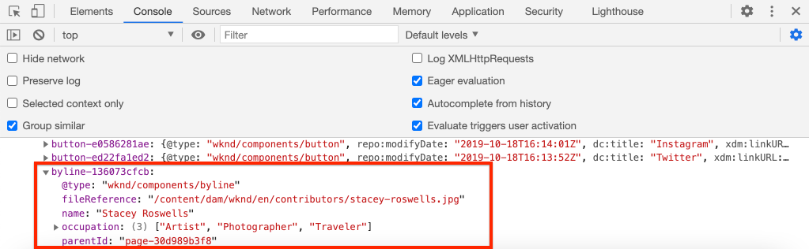

# 使用AEM元件自訂Adobe使用者端資料層 {#customize-data-layer}

瞭解如何使用自訂AEM元件的內容來自訂Adobe使用者端資料層。 瞭解如何使用提供的API [要擴充的AEM核心元件](https://experienceleague.adobe.com/docs/experience-manager-core-components/using/developing/data-layer/extending.html) 以及自訂資料層。

## 您即將建置的內容


在本教學課程中，讓我們探索透過更新WKND來擴充Adobe使用者端資料層的各種選項 [署名元件](https://experienceleague.adobe.com/docs/experience-manager-learn/getting-started-wknd-tutorial-develop/project-archetype/custom-component.html). 此 _署名_ 元件是 **自訂元件** 和在本教學課程中學到的課程可套用至其他自訂元件。

### 目標 {#objective}

1. 透過延伸Sling模型和元件HTL，將元件資料插入資料層
1. 使用核心元件資料層公用程式來減少工作量
1. 使用核心元件資料屬性來連結至現有的資料層事件

## 必備條件 {#prerequisites}

A **本機開發環境** 完成本教學課程所必需。 熒幕截圖和影片都是使用在macOS上執行的AEMas a Cloud ServiceSDK擷取。 除非另有說明，否則指令和程式碼與本機作業系統無關。

**AEM as a Cloud Service 的新手嗎？** 請參閱[以下指南以使用 AEM as a Cloud Service SDK 設定本機開發環境](https://experienceleague.adobe.com/docs/experience-manager-learn/cloud-service/local-development-environment-set-up/overview.html?lang=zh-Hant)。

**AEM 6.5 的新手嗎？** 請參閱[以下指南以設定本機開發環境](https://experienceleague.adobe.com/docs/experience-manager-learn/foundation/development/set-up-a-local-aem-development-environment.html)。

## 下載和部署WKND參考網站 {#set-up-wknd-site}

本教學課程會擴充WKND參考網站中的Byline元件。 複製並安裝WKND程式碼基底至您的本機環境。

1. 啟動本機Quickstart **作者** AEM執行個體執行於 [http://localhost:4502](http://localhost:4502).
1. 開啟終端機視窗，並使用Git複製WKND程式碼庫：

   ```shell
   $ git clone git@github.com:adobe/aem-guides-wknd.git
   ```

1. 將WKND程式碼基底部署到AEM的本機執行個體：

   ```shell
   $ cd aem-guides-wknd
   $ mvn clean install -PautoInstallSinglePackage
   ```

   >[!NOTE]
   >
   > 若為AEM 6.5和最新的Service Pack，請新增 `classic` Maven命令的設定檔：
   >
   > `mvn clean install -PautoInstallSinglePackage -Pclassic`

1. 開啟新的瀏覽器視窗並登入AEM。 開啟 **雜誌** 頁面例如： [http://localhost:4502/content/wknd/us/en/magazine/guide-la-skateparks.html](http://localhost:4502/content/wknd/us/en/magazine/guide-la-skateparks.html).

   

   您應該會看到作為體驗片段的一部分新增至頁面的署名元件範例。 您可以在下列位置檢視體驗片段： [http://localhost:4502/editor.html/content/experience-fragments/wknd/language-masters/en/contributors/stacey-roswells/byline.html](http://localhost:4502/editor.html/content/experience-fragments/wknd/language-masters/en/contributors/stacey-roswells/byline.html)
1. 開啟您的開發人員工具，然後在 **主控台**：

   ```js
   window.adobeDataLayer.getState();
   ```

   若要檢視AEM網站上資料層的目前狀態，請檢查回應。 您應該會看到頁面和個別元件的相關資訊。

   

   請注意，署名元件並未列在資料層中。

## 更新署名Sling模型 {#sling-model}

若要在資料層中插入關於元件的資料，請先更新元件的Sling模型。 接下來，更新Byline的Java™介面和Sling模型實作以使用新方法 `getData()`. 此方法包含要插入資料層的屬性。

1. 開啟 `aem-guides-wknd` 在您選擇的IDE中專案。 導覽至 `core` 模組。
1. 開啟檔案 `Byline.java` 於 `core/src/main/java/com/adobe/aem/guides/wknd/core/models/Byline.java`.

   

1. 將下列方法新增至介面：

   ```java
   public interface Byline {
       ...
       /***
        * Return data about the Byline Component to populate the data layer
        * @return String
        */
       String getData();
   }
   ```

1. 開啟檔案 `BylineImpl.java` 於 `core/src/main/java/com/adobe/aem/guides/wknd/core/models/impl/BylineImpl.java`. 此為的實作 `Byline` 介面，並實作為Sling模型。

1. 將下列匯入陳述式新增至檔案的開頭：

   ```java
   import java.util.HashMap;
   import java.util.Map;
   import org.apache.sling.api.resource.Resource;
   import com.fasterxml.jackson.core.JsonProcessingException;
   import com.fasterxml.jackson.databind.ObjectMapper;
   import com.adobe.cq.wcm.core.components.util.ComponentUtils;
   ```

   此 `fasterxml.jackson` API可用來序列化要公開為JSON的資料。 此 `ComponentUtils` AEM核心元件用於檢查資料層是否已啟用。

1. 新增未實作的方法 `getData()` 至 `BylineImple.java`：

   ```java
   public class BylineImpl implements Byline {
       ...
       @Override
       public String getData() {
           Resource bylineResource = this.request.getResource();
           // Use ComponentUtils to verify if the DataLayer is enabled
           if (ComponentUtils.isDataLayerEnabled(bylineResource)) {
   
               //Create a map of properties we want to expose
               Map<String, Object> bylineProperties = new HashMap<String,Object>();
               bylineProperties.put("@type", bylineResource.getResourceType());
               bylineProperties.put("name", this.getName());
               bylineProperties.put("occupation", this.getOccupations());
               bylineProperties.put("fileReference", image.getFileReference());
   
               //Use AEM Core Component utils to get a unique identifier for the Byline component (in case multiple are on the page)
               String bylineComponentID = ComponentUtils.getId(bylineResource, this.currentPage, this.componentContext);
   
               // Return the bylineProperties as a JSON String with a key of the bylineResource's ID
               try {
                   return String.format("{\"%s\":%s}",
                       bylineComponentID,
                       // Use the ObjectMapper to serialize the bylineProperties to a JSON string
                       new ObjectMapper().writeValueAsString(bylineProperties));
               } catch (JsonProcessingException e) {
   
                   LOGGER.error("Unable to generate dataLayer JSON string", e);
               }
   
           }
           // return null if the Data Layer is not enabled
           return null;
       }
   }
   ```

   在上述方法中，新增 `HashMap` 用於擷取要公開為JSON的屬性。 請注意，現有方法如 `getName()` 和 `getOccupations()` 已使用。 此 `@type` 代表元件的唯一資源型別，可讓使用者端根據元件的型別輕鬆識別事件和/或觸發器。

   此 `ObjectMapper` 用於序列化屬性並傳回JSON字串。 然後可以將此JSON字串插入資料層中。

1. 開啟終端機視窗。 只建置和部署 `core` 使用Maven技能的模組：

   ```shell
   $ cd aem-guides-wknd/core
   $ mvn clean install -PautoInstallBundle
   ```

## 更新署名HTL {#htl}

接下來，更新 `Byline` [HTL](https://experienceleague.adobe.com/docs/experience-manager-htl/content/specification.html?lang=en). HTL (HTML範本語言)是用於呈現元件HTML的範本。

特殊資料屬性 `data-cmp-data-layer` 會使用每個AEM元件上的來公開其資料層。 AEM核心元件提供的JavaScript會尋找此資料屬性。 此資料屬性的值會填入署名Sling模型所傳回的JSON字串 `getData()` 方法，並插入Adobe使用者端資料層。

1. 開啟 `aem-guides-wknd` 投影到IDE中。 導覽至 `ui.apps` 模組。
1. 開啟檔案 `byline.html` 於 `ui.apps/src/main/content/jcr_root/apps/wknd/components/byline/byline.html`.

   

1. 更新 `byline.html` 以包含 `data-cmp-data-layer` 屬性：

   ```diff
     <div data-sly-use.byline="com.adobe.aem.guides.wknd.core.models.Byline"
       data-sly-use.placeholderTemplate="core/wcm/components/commons/v1/templates.html"
       data-sly-test.hasContent="${!byline.empty}"
   +   data-cmp-data-layer="${byline.data}"
       class="cmp-byline">
       ...
   ```

   的值 `data-cmp-data-layer` 已設為 `"${byline.data}"` 位置 `byline` Sling模型是否已更新。 `.data` 是在HTL中呼叫Java™ Getter方法的標準表示法， `getData()` 已在先前的練習中實作。

1. 開啟終端機視窗。 只建置和部署 `ui.apps` 使用Maven技能的模組：

   ```shell
   $ cd aem-guides-wknd/ui.apps
   $ mvn clean install -PautoInstallPackage
   ```

1. 返回瀏覽器，然後使用「署名」元件重新開啟頁面： [http://localhost:4502/content/wknd/us/en/magazine/guide-la-skateparks.html](http://localhost:4502/content/wknd/us/en/magazine/guide-la-skateparks.html).

1. 開啟開發人員工具，並檢查Byline元件的頁面HTML來源：

   

   您應該會看到 `data-cmp-data-layer` 已填入Sling模型的JSON字串。

1. 開啟瀏覽器的開發人員工具，然後在 **主控台**：

   ```js
   window.adobeDataLayer.getState();
   ```

1. 導覽至回應下方 `component` 以尋找的例項 `byline` 元件已新增至資料層：

   

   您應該會看到類似下列的專案：

   ```json
   byline-136073cfcb:
       @type: "wknd/components/byline"
       fileReference: "/content/dam/wknd/en/contributors/stacey-roswells.jpg"
       name: "Stacey Roswells"
       occupation: (3) ["Artist", "Photographer", "Traveler"]
       parentId: "page-30d989b3f8"
   ```

   請注意，顯示的屬性與在中新增的屬性相同， `HashMap` 在Sling模型中。

## 新增點選事件 {#click-event}

Adobe使用者端資料層是事件導向的，觸發動作的最常見事件之一是 `cmp:click` 事件。 AEM核心元件可透過資料元素輕鬆註冊您的元件： `data-cmp-clickable`.

可點按的元素通常是CTA按鈕或導覽連結。 很遺憾，署名元件沒有這些專案，但我們仍會註冊它，因為這可能適用於其他自訂元件。

1. 開啟 `ui.apps` ide中的模組
1. 開啟檔案 `byline.html` 於 `ui.apps/src/main/content/jcr_root/apps/wknd/components/byline/byline.html`.

1. 更新 `byline.html` 以包含 `data-cmp-clickable` 署名欄位上的屬性 **名稱** 元素：

   ```diff
     <h2 class="cmp-byline__name" 
   +    data-cmp-clickable="${byline.data ? true : false}">
        ${byline.name}
     </h2>
   ```

1. 開啟新的終端機。 只建置和部署 `ui.apps` 使用Maven技能的模組：

   ```shell
   $ cd aem-guides-wknd/ui.apps
   $ mvn clean install -PautoInstallPackage
   ```

1. 返回瀏覽器，然後使用新增的署名元件重新開啟頁面： [http://localhost:4502/content/wknd/us/en/magazine/guide-la-skateparks.html](http://localhost:4502/content/wknd/us/en/magazine/guide-la-skateparks.html).

   為了測試事件，我們將使用開發人員控制檯手動新增一些JavaScript。 另請參閱 [搭配AEM核心元件使用Adobe Client Data Layer](data-layer-overview.md) ，觀看如何執行此動作的影片。

1. 開啟瀏覽器的開發人員工具，然後在 **主控台**：

   ```javascript
   function bylineClickHandler(event) {
       var dataObject = window.adobeDataLayer.getState(event.eventInfo.path);
       if (dataObject != null && dataObject['@type'] === 'wknd/components/byline') {
           console.log("Byline Clicked!");
           console.log("Byline name: " + dataObject['name']);
       }
   }
   ```

   這個簡單方法應該會處理Byline元件名稱的點按。

1. 在「 」中輸入下列方法 **主控台**：

   ```javascript
   window.adobeDataLayer.push(function (dl) {
        dl.addEventListener("cmp:click", bylineClickHandler);
   });
   ```

   上述方法會將事件接聽程式推送到資料層，以接聽 `cmp:click` 事件並呼叫 `bylineClickHandler`.

   >[!CAUTION]
   >
   > 這很重要 **not** 以在本練習中重新整理瀏覽器，否則主控台JavaScript會遺失。

1. 在瀏覽器中，使用 **主控台** 開啟，按一下署名元件中的作者名稱：

   

   您應該會看到主控台訊息 `Byline Clicked!` 和署名名稱。

   此 `cmp:click` 事件是最容易連結進去的。 如需更複雜的元件及追蹤其他行為，可以新增自訂JavaScript以新增和註冊新事件。 轉盤元件就是一個絕佳範例，它會觸發 `cmp:show` 切換投影片時發生的事件。 請參閱 [原始程式碼以取得更多詳細資料](https://github.com/adobe/aem-core-wcm-components/blob/main/content/src/content/jcr_root/apps/core/wcm/components/carousel/v1/carousel/clientlibs/site/js/carousel.js).

## 使用DataLayerBuilder公用程式 {#data-layer-builder}

當Sling模型是 [已更新](#sling-model) 在本章早些時候，我們選擇使用建立JSON字串 `HashMap` 和手動設定每個屬性。 此方法適用於小型一次性元件，但若是擴充AEM核心元件的元件，則可能會導致大量額外程式碼。

公用程式類別， `DataLayerBuilder`，可執行大部分的繁重工作。 這可讓實作僅擴充其所需的屬性。 讓我們更新Sling模型以使用 `DataLayerBuilder`.

1. 返回IDE並瀏覽至 `core` 模組。
1. 開啟檔案 `Byline.java` 於 `core/src/main/java/com/adobe/aem/guides/wknd/core/models/Byline.java`.
1. 修改 `getData()` 傳回型別的方法 `ComponentData`

   ```java
   import com.adobe.cq.wcm.core.components.models.datalayer.ComponentData;
   ...
   public interface Byline {
       ...
       /***
        * Return data about the Byline Component to populate the data layer
        * @return ComponentData
        */
       ComponentData getData();
   }
   ```

   `ComponentData` 是AEM核心元件提供的物件。 它會產生JSON字串（如同上一個範例），但也會執行許多其他工作。

1. 開啟檔案 `BylineImpl.java` 於 `core/src/main/java/com/adobe/aem/guides/wknd/core/models/impl/BylineImpl.java`.

1. 新增下列匯入陳述式：

   ```java
   import com.adobe.cq.wcm.core.components.models.datalayer.ComponentData;
   import com.adobe.cq.wcm.core.components.models.datalayer.builder.DataLayerBuilder;
   ```

1. 取代 `getData()` 方法如下：

   ```java
   @Override
   public ComponentData getData() {
       Resource bylineResource = this.request.getResource();
       // Use ComponentUtils to verify if the DataLayer is enabled
       if (ComponentUtils.isDataLayerEnabled(bylineResource)) {
   
           return DataLayerBuilder.extending(getImage().getData()).asImageComponent()
               .withTitle(this::getName)
               .build();
   
       }
       // return null if the Data Layer is not enabled
       return null;
   }
   ```

   署名元件會重複使用影像核心元件的部分，以顯示代表作者的影像。 在上述程式碼片段中， [DataLayerBuilder](https://javadoc.io/doc/com.adobe.cq/core.wcm.components.core/latest/com/adobe/cq/wcm/core/components/models/datalayer/builder/ComponentDataBuilder.html) 用於擴充的資料層 `Image` 元件。 如此會使用所用影像的所有資料預先填入JSON物件。 它也會執行一些例行功能，例如設定 `@type` 和元件的唯一識別碼。 請注意，方法很小！

   唯一擴充的屬性 `withTitle` ，此值會取代為 `getName()`.

1. 開啟終端機視窗。 只建置和部署 `core` 使用Maven技能的模組：

   ```shell
   $ cd aem-guides-wknd/core
   $ mvn clean install -PautoInstallBundle
   ```

1. 返回IDE並開啟 `byline.html` 下的檔案 `ui.apps`
1. 更新要使用的HTL `byline.data.json` 填入 `data-cmp-data-layer` 屬性：

   ```diff
     <div data-sly-use.byline="com.adobe.aem.guides.wknd.core.models.Byline"
       data-sly-use.placeholderTemplate="core/wcm/components/commons/v1/templates.html"
       data-sly-test.hasContent="${!byline.empty}"
   -   data-cmp-data-layer="${byline.data}"
   +   data-cmp-data-layer="${byline.data.json}"
   ```

   請記住，我們現在傳回的物件型別為 `ComponentData`. 此物件包含getter方法 `getJson()` 而且這可用來填入 `data-cmp-data-layer` 屬性。

1. 開啟終端機視窗。 只建置和部署 `ui.apps` 使用Maven技能的模組：

   ```shell
   $ cd aem-guides-wknd/ui.apps
   $ mvn clean install -PautoInstallPackage
   ```

1. 返回瀏覽器，然後使用新增的署名元件重新開啟頁面： [http://localhost:4502/content/wknd/us/en/magazine/guide-la-skateparks.html](http://localhost:4502/content/wknd/us/en/magazine/guide-la-skateparks.html).
1. 開啟瀏覽器的開發人員工具，然後在 **主控台**：

   ```js
   window.adobeDataLayer.getState();
   ```

1. 導覽至回應下方 `component` 以尋找的例項 `byline` 元件：

   

   您應該會看到類似下列的專案：

   ```json
   byline-136073cfcb:
       @type: "wknd/components/byline"
       dc:title: "Stacey Roswells"
       image:
           @type: "image/jpeg"
           repo:id: "142658f8-4029-4299-9cd6-51afd52345c0"
           repo:modifyDate: "2019-10-25T23:49:51Z"
           repo:path: "/content/dam/wknd/en/contributors/stacey-roswells.jpg"
           xdm:tags: []
       parentId: "page-30d989b3f8"
       repo:modifyDate: "2019-10-18T20:17:24Z"
   ```

   請注意，現在有一個 `image` 內的物件 `byline` 元件專案。 這裡有更多關於DAM中資產的資訊。 另請注意 `@type` 和唯一ID (在此案例中為 `byline-136073cfcb`)已自動填入，且 `repo:modifyDate` 表示何時修改元件。

## 其他範例 {#additional-examples}

1. 如需擴充資料層的另一個範例，請檢視 `ImageList` WKND程式碼庫中的元件：
   * `ImageList.java`  — 中的Java介面 `core` 模組。
   * `ImageListImpl.java`  — 中的Sling模型 `core` 模組。
   * `image-list.html` - HTL範本(在 `ui.apps` 模組。

   >[!NOTE]
   >
   > 納入自訂屬性會比較困難，例如 `occupation` 使用 [DataLayerBuilder](https://javadoc.io/doc/com.adobe.cq/core.wcm.components.core/latest/com/adobe/cq/wcm/core/components/models/datalayer/builder/ComponentDataBuilder.html). 不過，如果擴充包含影像或頁面的核心元件，公用程式會節省大量時間。

   >[!NOTE]
   >
   > 如果為整個實作中重複使用的物件建立進階資料層，建議將資料層元素擷取到它們自己的資料層特定Java™物件中。 例如，Commerce核心元件已新增介面 `ProductData` 和 `CategoryData` 因為這些專案可用於Commerce實作內的許多元件。 檢閱 [aem-cif-core-components存放庫中的程式碼](https://github.com/adobe/aem-core-cif-components/tree/master/bundles/core/src/main/java/com/adobe/cq/commerce/core/components/datalayer) 以取得更多詳細資料。

## 恭喜！ {#congratulations}

您剛剛探索了幾種使用AEM元件擴充和自訂Adobe使用者端資料層的方法！

## 其他資源 {#additional-resources}

* [Adobe使用者端資料層檔案](https://github.com/adobe/adobe-client-data-layer/wiki)
* [資料層與核心元件的整合](https://github.com/adobe/aem-core-wcm-components/blob/main/DATA_LAYER_INTEGRATION.md)
* [使用Adobe使用者端資料層和核心元件檔案](https://experienceleague.adobe.com/docs/experience-manager-core-components/using/developing/data-layer/overview.html)
