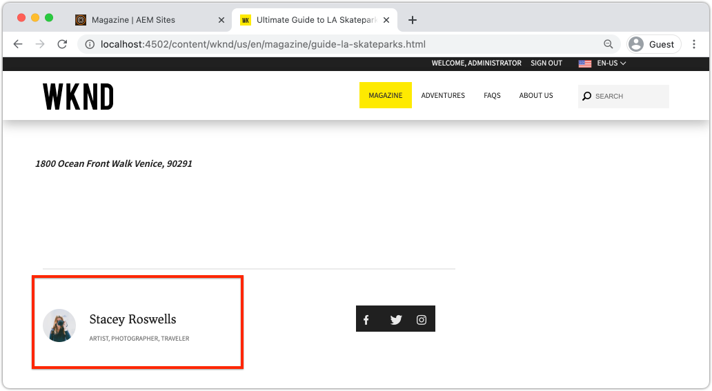

# 使用元件自定義Adobe客戶端數AEM據層 {#customize-data-layer}

瞭解如何使用自定義元件中的內容自定義Adobe客戶端數AEM據層。 瞭解如何使用由 [要AEM擴展的核心元件](https://experienceleague.adobe.com/docs/experience-manager-core-components/using/developing/data-layer/extending.html) 並定制資料層。

## 您要構建的


在本教程中，讓我們通過更新WKND來探討擴展Adobe客戶端資料層的各種選項 [Byline元件](https://experienceleague.adobe.com/docs/experience-manager-learn/getting-started-wknd-tutorial-develop/project-archetype/custom-component.html)。 的 _副線_ 元件是 **自定義元件** 本教程中學到的經驗教訓可應用於其他自定義元件。

### 目標 {#objective}

1. 通過擴展Sling模型和元件HTL將元件資料注入資料層
1. 使用核心元件資料層實用程式減少工作量
1. 使用核心元件資料屬性掛接到現有資料層事件

## 必備條件 {#prerequisites}

A **地方開發環境** 是完成本教程所必需的。 螢幕截圖和視頻是使用運行在AEMmacOS上的as a Cloud ServiceSDK捕獲的。 除非另有說明，否則命令和代碼獨立於本地作業系統。

**AEM as a Cloud Service 的新手嗎？** 請參閱[以下指南以使用 AEM as a Cloud Service SDK 設定本機開發環境](https://experienceleague.adobe.com/docs/experience-manager-learn/cloud-service/local-development-environment-set-up/overview.html?lang=zh-Hant)。

**AEM 6.5 的新手嗎？** 請參閱[以下指南以設定本機開發環境](https://experienceleague.adobe.com/docs/experience-manager-learn/foundation/development/set-up-a-local-aem-development-environment.html)。

## 下載並部署WKND參考站點 {#set-up-wknd-site}

本教程擴展了WKND參考站點中的Byline元件。 將WKND代碼庫克隆並安裝到本地環境。

1. 啟動本地快速啟動 **作者** 運行AEM於的實例 [http://localhost:4502](http://localhost:4502)。
1. 使用Git開啟終端窗口並克隆WKND代碼庫：

   ```shell
   $ git clone git@github.com:adobe/aem-guides-wknd.git
   ```

1. 將WKND代碼庫部署到以下的本地實AEM例：

   ```shell
   $ cd aem-guides-wknd
   $ mvn clean install -PautoInstallSinglePackage
   ```

   >[!NOTE]
   >
   > 對於AEM6.5和最新的Service Pack，請 `classic` 「Maven」命令的「profile」：
   >
   > `mvn clean install -PautoInstallSinglePackage -Pclassic`

1. 開啟新瀏覽器窗口並登錄AEM到。 開啟 **雜誌** 頁面： [http://localhost:4502/content/wknd/us/en/magazine/guide-la-skateparks.html](http://localhost:4502/content/wknd/us/en/magazine/guide-la-skateparks.html)。

   

   您應看到已作為體驗片段的一部分添加到頁面的Byline元件的示例。 您可以在以下位置查看體驗片段： [http://localhost:4502/editor.html/content/experience-fragments/wknd/language-masters/en/contributors/stacey-roswells/byline.html](http://localhost:4502/editor.html/content/experience-fragments/wknd/language-masters/en/contributors/stacey-roswells/byline.html)
1. 開啟開發人員工具，在 **控制台**:

   ```js
   window.adobeDataLayer.getState();
   ```

   要查看站點上資料層的當前狀態，請AEM檢查響應。 您應看到有關頁面和各個元件的資訊。

   

   注意Byline元件未列在資料層中。

## 更新Byline Sling模型 {#sling-model}

要在資料層中插入有關元件的資料，我們首先更新元件的Sling模型。 接下來，更新Byline的Java™介面和Sling Model實現，以使用新方法 `getData()`。 此方法包含要注入資料層的屬性。

1. 開啟 `aem-guides-wknd` 在您選擇的IDE中執行項目。 導航到 `core` 中。
1. 開啟檔案 `Byline.java` 在 `core/src/main/java/com/adobe/aem/guides/wknd/core/models/Byline.java`。

   

1. 將以下方法添加到介面：

   ```java
   public interface Byline {
       ...
       /***
        * Return data about the Byline Component to populate the data layer
        * @return String
        */
       String getData();
   }
   ```

1. 開啟檔案 `BylineImpl.java` 在 `core/src/main/java/com/adobe/aem/guides/wknd/core/models/impl/BylineImpl.java`。 是執行 `Byline` 並作為Sling模型實現。

1. 將以下導入語句添加到檔案開頭：

   ```java
   import java.util.HashMap;
   import java.util.Map;
   import org.apache.sling.api.resource.Resource;
   import com.fasterxml.jackson.core.JsonProcessingException;
   import com.fasterxml.jackson.databind.ObjectMapper;
   import com.adobe.cq.wcm.core.components.util.ComponentUtils;
   ```

   的 `fasterxml.jackson` API用於序列化要作為JSON公開的資料。 的 `ComponentUtils` 核心AEM元件」用於檢查資料層是否已啟用。

1. 添加未實現的方法 `getData()` 至 `BylineImple.java`:

   ```java
   public class BylineImpl implements Byline {
       ...
       @Override
       public String getData() {
           Resource bylineResource = this.request.getResource();
           // Use ComponentUtils to verify if the DataLayer is enabled
           if (ComponentUtils.isDataLayerEnabled(bylineResource)) {
   
               //Create a map of properties we want to expose
               Map<String, Object> bylineProperties = new HashMap<String,Object>();
               bylineProperties.put("@type", bylineResource.getResourceType());
               bylineProperties.put("name", this.getName());
               bylineProperties.put("occupation", this.getOccupations());
               bylineProperties.put("fileReference", image.getFileReference());
   
               //Use AEM Core Component utils to get a unique identifier for the Byline component (in case multiple are on the page)
               String bylineComponentID = ComponentUtils.getId(bylineResource, this.currentPage, this.componentContext);
   
               // Return the bylineProperties as a JSON String with a key of the bylineResource's ID
               try {
                   return String.format("{\"%s\":%s}",
                       bylineComponentID,
                       // Use the ObjectMapper to serialize the bylineProperties to a JSON string
                       new ObjectMapper().writeValueAsString(bylineProperties));
               } catch (JsonProcessingException e) {
   
                   LOGGER.error("Unable to generate dataLayer JSON string", e);
               }
   
           }
           // return null if the Data Layer is not enabled
           return null;
       }
   }
   ```

   在以上方法中， `HashMap` 用於捕獲要作為JSON公開的屬性。 注意現有方法 `getName()` 和 `getOccupations()` 的子菜單。 的 `@type` 表示元件的唯一資源類型，它允許客戶端根據元件類型容易地識別事件和/或觸發器。

   的 `ObjectMapper` 用於序列化屬性並返回JSON字串。 然後，可以將此JSON字串注入資料層。

1. 開啟終端窗口。 只構建和部署 `core` 模組，使用Maven技能：

   ```shell
   $ cd aem-guides-wknd/core
   $ mvn clean install -PautoInstallBundle
   ```

## 更新Byline HTL {#htl}

接下來，更新 `Byline` [HTL](https://experienceleague.adobe.com/docs/experience-manager-htl/content/specification.html?lang=en)。 HTL(HTML模板語言)是用於呈現元件HTML的模板。

特殊資料屬性 `data-cmp-data-layer` 每個組AEM件上都用於公開其資料層。 核心元件提AEM供的JavaScript會查找此資料屬性。 此資料屬性的值由Byline Sling Model的返回的JSON字串填充 `getData()` 方法，並注入到Adobe客戶端資料層。

1. 開啟 `aem-guides-wknd` 投影到IDE中。 導航到 `ui.apps` 中。
1. 開啟檔案 `byline.html` 在 `ui.apps/src/main/content/jcr_root/apps/wknd/components/byline/byline.html`。

   

1. 更新 `byline.html` 包含 `data-cmp-data-layer` 屬性：

   ```diff
     <div data-sly-use.byline="com.adobe.aem.guides.wknd.core.models.Byline"
       data-sly-use.placeholderTemplate="core/wcm/components/commons/v1/templates.html"
       data-sly-test.hasContent="${!byline.empty}"
   +   data-cmp-data-layer="${byline.data}"
       class="cmp-byline">
       ...
   ```

   值 `data-cmp-data-layer` 已設定為 `"${byline.data}"` 何處 `byline` 是Sling Model早些更新。 `.data` 是在HTL中調用Java™ Getter方法的標準符號 `getData()` 執行。

1. 開啟終端窗口。 只構建和部署 `ui.apps` 模組，使用Maven技能：

   ```shell
   $ cd aem-guides-wknd/ui.apps
   $ mvn clean install -PautoInstallPackage
   ```

1. 返回到瀏覽器並使用Byline元件重新開啟頁面： [http://localhost:4502/content/wknd/us/en/magazine/guide-la-skateparks.html](http://localhost:4502/content/wknd/us/en/magazine/guide-la-skateparks.html)。

1. 開啟開發人員工具並檢查Byline元件的頁面HTML源：

   

   你應該看到 `data-cmp-data-layer` 已使用Sling模型中的JSON字串進行填充。

1. 開啟瀏覽器的開發人員工具，在 **控制台**:

   ```js
   window.adobeDataLayer.getState();
   ```

1. 在響應下方導航 `component` 查找 `byline` 元件已添加到資料層：

   

   您應看到如下條目：

   ```json
   byline-136073cfcb:
       @type: "wknd/components/byline"
       fileReference: "/content/dam/wknd/en/contributors/stacey-roswells.jpg"
       name: "Stacey Roswells"
       occupation: (3) ["Artist", "Photographer", "Traveler"]
       parentId: "page-30d989b3f8"
   ```

   觀察暴露的屬性與在 `HashMap` 吊具模型。

## 添加按一下事件 {#click-event}

Adobe客戶端資料層是事件驅動的，觸發操作的最常見事件之一是 `cmp:click` 的子菜單。 Core組AEM件使您能夠借助資料元素輕鬆註冊元件： `data-cmp-clickable`。

可按一下元素通常是CTA按鈕或導航連結。 很遺憾，Byline元件沒有這些元件，但我們仍要註冊它，因為這可能是其它自定義元件的常見情況。

1. 開啟 `ui.apps` IDE中的模組
1. 開啟檔案 `byline.html` 在 `ui.apps/src/main/content/jcr_root/apps/wknd/components/byline/byline.html`。

1. 更新 `byline.html` 包含 `data-cmp-clickable` Byline的 **名稱** 元素：

   ```diff
     <h2 class="cmp-byline__name" 
   +    data-cmp-clickable="${byline.data ? true : false}">
        ${byline.name}
     </h2>
   ```

1. 開啟新終端。 只構建和部署 `ui.apps` 模組，使用Maven技能：

   ```shell
   $ cd aem-guides-wknd/ui.apps
   $ mvn clean install -PautoInstallPackage
   ```

1. 返回到瀏覽器並重新開啟添加了Byline元件的頁面： [http://localhost:4502/content/wknd/us/en/magazine/guide-la-skateparks.html](http://localhost:4502/content/wknd/us/en/magazine/guide-la-skateparks.html)。

   要test我們的事件，我們將使用開發人員控制台手動添加一些JavaScript。 請參閱 [將Adobe客戶端資料層與核AEM心元件一起使用](data-layer-overview.md) 看一段關於如何做的視頻。

1. 開啟瀏覽器的開發人員工具，並在 **控制台**:

   ```javascript
   function bylineClickHandler(event) {
       var dataObject = window.adobeDataLayer.getState(event.eventInfo.path);
       if (dataObject != null && dataObject['@type'] === 'wknd/components/byline') {
           console.log("Byline Clicked!");
           console.log("Byline name: " + dataObject['name']);
       }
   }
   ```

   此簡單方法應處理Byline元件名稱的按一下。

1. 在 **控制台**:

   ```javascript
   window.adobeDataLayer.push(function (dl) {
        dl.addEventListener("cmp:click", bylineClickHandler);
   });
   ```

   上述方法將事件偵聽器推送到資料層以偵聽 `cmp:click` 事件和調用 `bylineClickHandler`。

   >[!CAUTION]
   >
   > 很重要 **不** 在本練習中刷新瀏覽器，否則控制台JavaScript將丟失。

1. 在瀏覽器中， **控制台** 開啟，按一下Byline元件中的作者名稱：

   

   您應看到控制台消息 `Byline Clicked!` 和署名。

   的 `cmp:click` 事件最容易被掛接。 對於更複雜的元件和跟蹤其他行為，可以添加自定義JavaScript以添加和註冊新事件。 一個很好的示例是旋轉木馬元件，它觸發 `cmp:show` 切換幻燈片時發生的事件。 查看 [詳細資訊的原始碼](https://github.com/adobe/aem-core-wcm-components/blob/main/content/src/content/jcr_root/apps/core/wcm/components/carousel/v1/carousel/clientlibs/site/js/carousel.js)。

## 使用DataLayerBuilder實用程式 {#data-layer-builder}

斯林模型 [更新](#sling-model) 在本章的前面，我們選擇使用 `HashMap` 並手動設定每個屬性。 此方法適用於小型一次性元件，但對於擴展核心元件AEM的元件，則可能會產生大量額外代碼。

一個實用程式類， `DataLayerBuilder`，存在於執行大部分重力提升。 這允許實現僅擴展其所需的屬性。 讓我們更新Sling模型以使用 `DataLayerBuilder`。

1. 返回到IDE並導航到 `core` 中。
1. 開啟檔案 `Byline.java` 在 `core/src/main/java/com/adobe/aem/guides/wknd/core/models/Byline.java`。
1. 修改 `getData()` 返回類型的方法 `ComponentData`

   ```java
   import com.adobe.cq.wcm.core.components.models.datalayer.ComponentData;
   ...
   public interface Byline {
       ...
       /***
        * Return data about the Byline Component to populate the data layer
        * @return ComponentData
        */
       ComponentData getData();
   }
   ```

   `ComponentData` 是核心元件提AEM供的對象。 它會生成JSON字串，與上例中的操作相同，但也會執行大量附加工作。

1. 開啟檔案 `BylineImpl.java` 在 `core/src/main/java/com/adobe/aem/guides/wknd/core/models/impl/BylineImpl.java`。

1. 添加以下導入語句：

   ```java
   import com.adobe.cq.wcm.core.components.models.datalayer.ComponentData;
   import com.adobe.cq.wcm.core.components.models.datalayer.builder.DataLayerBuilder;
   ```

1. 替換 `getData()` 方法：

   ```java
   @Override
   public ComponentData getData() {
       Resource bylineResource = this.request.getResource();
       // Use ComponentUtils to verify if the DataLayer is enabled
       if (ComponentUtils.isDataLayerEnabled(bylineResource)) {
   
           return DataLayerBuilder.extending(getImage().getData()).asImageComponent()
               .withTitle(this::getName)
               .build();
   
       }
       // return null if the Data Layer is not enabled
       return null;
   }
   ```

   Byline元件重新使用影像核心元件的部分來顯示代表作者的影像。 在上面的代碼段中， [資料層生成器](https://javadoc.io/doc/com.adobe.cq/core.wcm.components.core/latest/com/adobe/cq/wcm/core/components/models/datalayer/builder/ComponentDataBuilder.html) 用於擴展 `Image` 元件。 此操作將使用所使用映像的所有資料預填充JSON對象。 它還執行一些常式功能，如設定 `@type` 以及元件的唯一標識符。 注意，方法很小！

   唯一屬性擴展了 `withTitle` 替換為 `getName()`。

1. 開啟終端窗口。 只構建和部署 `core` 模組，使用Maven技能：

   ```shell
   $ cd aem-guides-wknd/core
   $ mvn clean install -PautoInstallBundle
   ```

1. 返回到IDE並開啟 `byline.html` 檔案 `ui.apps`
1. 更新HTL以使用 `byline.data.json` 填充 `data-cmp-data-layer` 屬性：

   ```diff
     <div data-sly-use.byline="com.adobe.aem.guides.wknd.core.models.Byline"
       data-sly-use.placeholderTemplate="core/wcm/components/commons/v1/templates.html"
       data-sly-test.hasContent="${!byline.empty}"
   -   data-cmp-data-layer="${byline.data}"
   +   data-cmp-data-layer="${byline.data.json}"
   ```

   請記住，我們現在正在返回一個類型的對象 `ComponentData`。 此對象包括getter方法 `getJson()` 這用於填充 `data-cmp-data-layer` 屬性。

1. 開啟終端窗口。 只構建和部署 `ui.apps` 模組，使用Maven技能：

   ```shell
   $ cd aem-guides-wknd/ui.apps
   $ mvn clean install -PautoInstallPackage
   ```

1. 返回到瀏覽器並重新開啟添加了Byline元件的頁面： [http://localhost:4502/content/wknd/us/en/magazine/guide-la-skateparks.html](http://localhost:4502/content/wknd/us/en/magazine/guide-la-skateparks.html)。
1. 開啟瀏覽器的開發人員工具，在 **控制台**:

   ```js
   window.adobeDataLayer.getState();
   ```

1. 在響應下方導航 `component` 查找 `byline` 元件：

   

   您應看到如下條目：

   ```json
   byline-136073cfcb:
       @type: "wknd/components/byline"
       dc:title: "Stacey Roswells"
       image:
           @type: "image/jpeg"
           repo:id: "142658f8-4029-4299-9cd6-51afd52345c0"
           repo:modifyDate: "2019-10-25T23:49:51Z"
           repo:path: "/content/dam/wknd/en/contributors/stacey-roswells.jpg"
           xdm:tags: []
       parentId: "page-30d989b3f8"
       repo:modifyDate: "2019-10-18T20:17:24Z"
   ```

   注意現在有 `image` 對象 `byline` 元件。 這有更多關於DAM中資產的資訊。 另請注意 `@type` 和唯一id（在本例中） `byline-136073cfcb`)已自動填充， `repo:modifyDate` 指示何時修改元件。

## 其他示例 {#additional-examples}

1. 通過檢查資料層，可以查看擴展資料層的另一個示例 `ImageList` 元件：
   * `ImageList.java`  — 中的Java介面 `core` 中。
   * `ImageListImpl.java`  — 中的Sling模型 `core` 中。
   * `image-list.html`  — 中的HTL模板 `ui.apps` 中。

   >[!NOTE]
   >
   > 要包含自定義屬性，例如 `occupation` 使用 [資料層生成器](https://javadoc.io/doc/com.adobe.cq/core.wcm.components.core/latest/com/adobe/cq/wcm/core/components/models/datalayer/builder/ComponentDataBuilder.html)。 但是，如果擴展包含影像或頁面的核心元件，該實用程式將節省大量時間。

   >[!NOTE]
   >
   > 如果為在整個實現中重複使用的對象構建高級資料層，建議將資料層元素提取到其自己的資料層特定的Java™對象中。 例如，Commerce核心元件為 `ProductData` 和 `CategoryData` 因為這些功能可用於Commerce實施中的許多元件。 審閱 [aem-cif-core-components回購協定中的代碼](https://github.com/adobe/aem-core-cif-components/tree/master/bundles/core/src/main/java/com/adobe/cq/commerce/core/components/datalayer) 的子菜單。

## 恭喜！ {#congratulations}

您剛剛探索了幾種方法來擴展和自定義Adobe客戶端資料層，包括AEM元件！

## 其他資源 {#additional-resources}

* [Adobe客戶端資料層文檔](https://github.com/adobe/adobe-client-data-layer/wiki)
* [資料層與核心元件整合](https://github.com/adobe/aem-core-wcm-components/blob/main/DATA_LAYER_INTEGRATION.md)
* [使用Adobe客戶端資料層和核心元件文檔](https://experienceleague.adobe.com/docs/experience-manager-core-components/using/developing/data-layer/overview.html)
